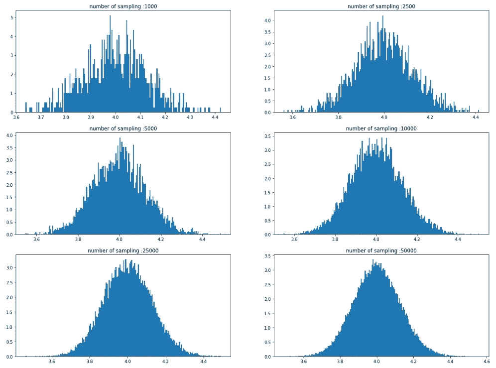
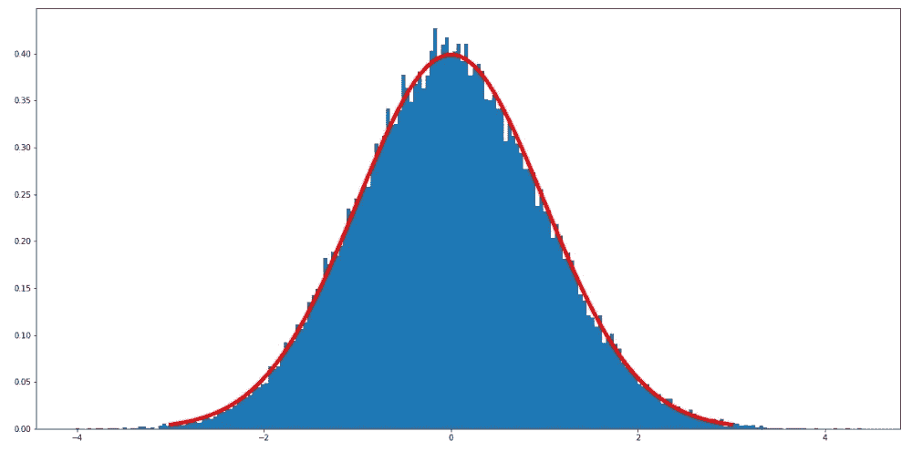
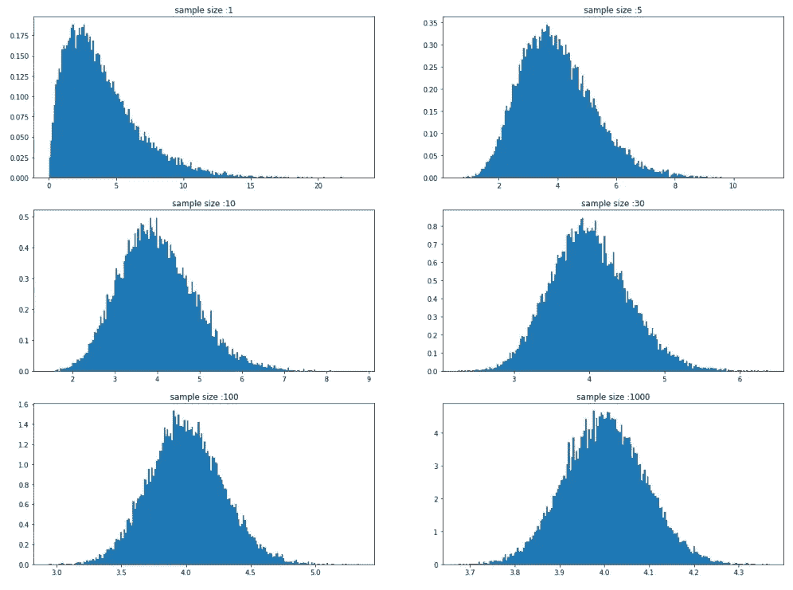
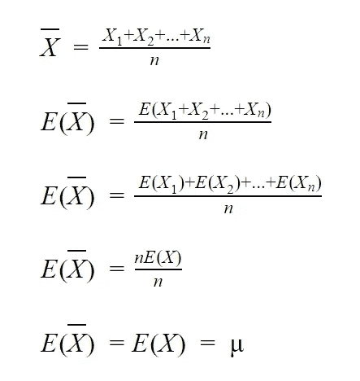
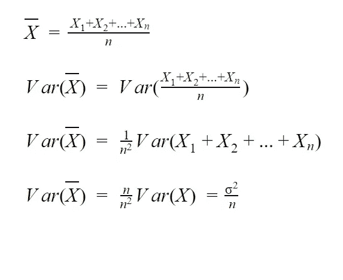
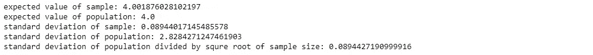
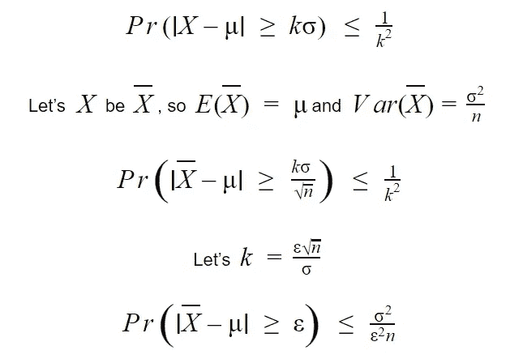
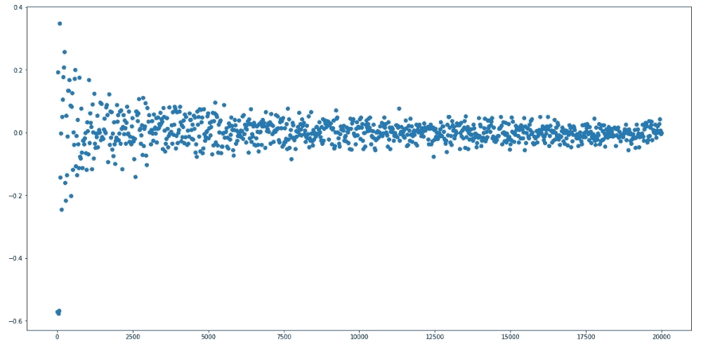
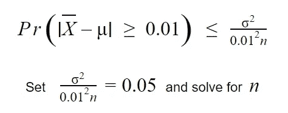
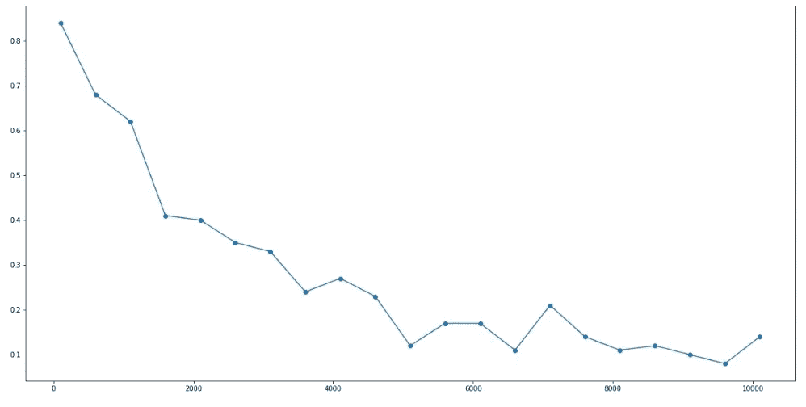

# Python 插图:中心极限定理

> 原文：<https://medium.com/analytics-vidhya/illustration-with-python-central-limit-theorem-aa4d81f7b570?source=collection_archive---------3----------------------->

这个博客使用了[切比雪夫不等式](/@c.chaipitakporn/illustration-with-python-chebyshevs-inequality-b34be151c547)和[弱大数定律](/@c.chaipitakporn/illustration-with-python-weak-law-of-large-numbers-2a644b862985)的知识，你可以通过访问链接来回顾这些主题。

该定理指出，独立样本均值的分布是近似正态分布，即使总体不是正态分布。换句话说，如果我们多次独立地从总体中取样，并绘制每次取样的平均值，则无论总体分布如何，该图都将是正态分布。

我将使用 python 通过以下步骤来演示这个定理

步骤:

1.)创建 1，000，000 个值总体，我使用形状= 2、比例= 2 的伽马分布来展示适用于非正态分布的定理

```
# build gamma distribution as population
shape, scale = 2., 2\.  # mean=4, std=2*sqrt(2)
s = np.random.gamma(shape, scale, 1000000)
```

2.2)从 500 个样本大小的伽马分布中取样，计算平均值并重复步骤 1000 次(这是取样的数量)。我重复这个步骤，但是增加采样次数，直到次数达到 50，000 次。

```
## sample from population with different number of sampling
# a list of sample mean
meansample = []
# number of sample
numofsample = [1000,2500,5000,10000,25000,50000]
# sample size
samplesize = 500
# for each number of sampling (1000 to 50000)
for i in numofsample:
    # collect mean of each sample
    eachmeansample = []
    # for each sampling
    for j in range(0,i):
        # sampling 500 sample from population
        rc = random.choices(s, k=samplesize)
        # collect mean of each sample
        eachmeansample.append(sum(rc)/len(rc))
    # add mean of each sampling to the list
    meansample.append(eachmeansample)
```

3.)绘制每个样本平均值。

```
# plot
cols = 2
rows = 3
fig, ax = plt.subplots(rows, cols, figsize=(20,15))
n = 0
for i in range(0, rows):
    for j in range(0, cols):
        ax[i, j].hist(meansample[n], 200, density=True)
        ax[i, j].set_title(label="number of sampling :" + str(numofsample[n]))
        n += 1
```



从图中我们可以看到，随着采样次数的增加，分布变得更加平滑。这个定理非常强大，因为我们可以应用于任何人群，所以如果我们有工具来处理正态分布，我们可以使用任何分布的样本均值的工具，例如使用正态曲线下的面积来计算概率。

## 标准化样本均值

我们可以将样本均值分布变为标准正态分布，方法是用期望值减去每个样本均值，然后除以标准偏差。

步骤:

1.)使用上一次采样的分布

```
# use last sampling
sm = meansample[len(meansample)-1]
```

2.)计算样本均值的均值和标准差。

```
# calculate start deviation
std = np.std(sm)
# set population mean
mean = np.mean(sm)
```

3.)用均值减去每个值，再除以标准差，那么样本均值的均值和标准差分别为 0，1。

```
# list of standarded sample
zn = []
# for each sample subtract with mean and devided by standard deviation
for i in sm:
    zn.append((i-mean)/std)
```

4.)标绘结果。

```
# plot hist
plt.figure(figsize=(20,10))
plt.hist(zn, 200, density=True)
# compare with standard normal disrtibution line
mu = 0
sigma = 1
x = np.linspace(mu - 3*sigma, mu + 3*sigma, 100)
# draw standard normal disrtibution line
plt.plot(x, stats.norm.pdf(x, mu, sigma),linewidth = 5, color='red')
plt.show()
```



红线是标准正态分布线，蓝色分布的平均值是 0，有一个单位标准差

我们标准化样本均值的原因之一是正态分布函数的复杂性。我们必须对复杂的函数进行积分，这可能需要几个小时的时间，因此，我们将分布标准化，并使用 Z 表来查找函数下的面积。

## 样本量

样本量的经验法则是，样本量应大于 30，以使样本均值呈正态分布。然而，如果样本量小于 30，但总体呈正态分布，该定理仍然有效。我会举例说明如果样本量小于 30，30 和大于 30 会发生什么。

步骤:

1.1)从相同的伽马分布中以 1 个样本量取样，计算平均值，并重复步骤 25，000 次。我重复这个步骤，但是增加样本量，直到达到 1000 个样本。

```
## sample with different sample size
# list of sample mean
meansample = []
# number of sampling
numofsample = 25000
# sample size
samplesize = [1,5,10,30,100,1000]
# for each sample size (1 to 1000)
for i in samplesize:
    # collect mean of each sample
    eachmeansample = []
    # for each sampling
    for j in range(0,numofsample):
        # sampling i sample from population
        rc = random.choices(s, k=i)
        # collect mean of each sample
        eachmeansample.append(sum(rc)/len(rc))
    # add mean of each sampling to the list
    meansample.append(eachmeansample)
```

2.)绘制每个样本平均值。

```
# plot
cols = 2
rows = 3
fig, ax = plt.subplots(rows, cols, figsize=(20,15))
n = 0
for i in range(0, rows):
    for j in range(0, cols):
        ax[i, j].hist(meansample[n], 200, density=True)
        ax[i, j].set_title(label="sample size :" + str(samplesize[n]))
        n += 1
```



从图中可以看出，小于 30 的样本量分布不是正态分布。

我会把这个定理和切比雪夫不等式，弱大数定律结合起来，但是在我们去之前，我们先来看看样本均值的期望值和标准差。

## 样本均值的期望值和标准差

假设 X 是一个独立同分布的随机变量，其期望值为μ，标准差为σ。如果我们抽样 X n 个样本，X 的期望和方差将如下。



其中 n 是样本大小，n = 10 表示我们使用 10 个数据，样本平均值是 10 个数据的平均值，期望值和方差可以如上计算。

```
## expect value of sample
# use last sampling
sample = meansample[5]
# expected value of sample equal to expect value of population
print("expected value of sample:", np.mean(sample))
print("expected value of population:", shape*scale)
# standard deviation of sample equl to standard deviation of population divided by squre root of n
print("standard deviation of sample:", np.std(sample))
print("standard deviation of population:", scale*np.sqrt(shape))
print("standard deviation of population divided by squre root of sample size:", scale*np.sqrt(shape)/np.sqrt(1000))
```



这是上面代码的结果。如果我们将总体标准差除以 n 的平方根，结果将接近样本均值的标准差。

然而，这感觉有点违反直觉，因为一个样本怎么会有期望和方差，它只是一个数字。好吧，想想看，假设我让你在一所学校抽样调查学生的身高，你必须敲开每间教室，在房间里挑选一个学生。在你走进房间之前，你对你将要挑选的学生的身高有什么期望？你不知道，对吗？那么，如果我告诉你这所学校学生的平均身高是 5 英尺，方差是 4 英寸呢？现在，在你选择一个学生之前，你对他身高的期望应该是 5 英尺，偏差 4 英寸。如果你选择 10 个学生，这些学生的身高期望值将是每个学生的期望值之和，与值 5 英尺相同，除以学生人数。因此，试着把一个样本看作一个随机变量，而不是一个数字。

我想提的另一件事是，根据公式，当样本容量增加时，样本均值的方差会变小，所以样本均值的方差取决于样本容量。如果我们的样本足够大，样本均值将接近它的期望值。

## 样本均值的收敛

切比雪夫不等式适用于各种概率分布，也适用于正态分布。我们可以如下改变处理样本均值的不等式。



其中 X 条是样本平均值，μ是样本平均值的期望值，ε是大于 0 的误差范围，σ是总体的标准偏差，n 是样本大小。

使用弱大数定律和此公式，如果样本大小趋于无穷大，则样本均值和期望值之间的差大于误差容限的概率收敛为零。

我将使用 python 来展示这样一个事实:随着样本大小的增加，样本均值变得越来越接近期望值，如下步骤所示。

步骤:

1.)使用与总体相同的伽马分布

```
# build gamma distribution as population
shape, scale = 2., 2\.  # mean=4, std=2*sqrt(2)
s = np.random.gamma(shape, scale, 1000000)
```

2.)使用样本大小从 10 到 20，000 乘 20 从总体中取样，然后计算样本平均值和总体平均值之间的差值。

```
## show that as the sample size increases the mean of sample is close to population mean
# set expected values of population
mu = shape*scale # mean
# sample size
samplesize = []
# collect difference between sample mean and mu
diflist = []
# for each sample size
for n in range(10,20000,20): 
    # sample n sample
    rs = random.choices(s, k=n)
    # start count
    c = 0
    # calculate mean
    mean = sum(rs)/len(rs)
    # collect difference between sample mean and mu
    diflist.append(mean-mu)
    samplesize.append(n)
```

3.)画出不同之处。

```
# set figure size.
plt.figure(figsize=(20,10))
# plot each diference.
plt.scatter(samplesize,diflist, marker='o')
# show plot.
plt.show()
```



我们可以看到，随着样本量的增加，差异在减小。

我们还可以使用该公式找到一个样本大小，使样本平均值的误差保持在一定范围内。例如，如果我们希望我们的样本有 95%的概率是 1%的误差，我们可以设置一个不等式如下。



我将绘制另一个图表，以显示样本均值和期望值之间的差异越大，误差越小的概率随着样本量的增加而减小。

步骤:

1.)使用相同的伽玛分布作为总体，并将误差设置为 0.05。

```
# build gamma distribution as population
shape, scale = 2., 2\.  # mean=4, std=2*sqrt(2)  
mu = shape*scale # mean
s = np.random.gamma(shape, scale, 1000000)
# margin of error
epsilon = 0.05
```

2.)使用样本大小从 100 到 10，100 乘以 500 从总体中取样 100 次，然后对平均值与期望值之差大于误差的样本进行计数。

3.)计算每个样本大小的概率，并添加概率图

```
# list of probability of each sample size
proberror = []
# sample size for plotting
samplesize = []# for each sample size
for n in range(100,10101,500): 
    # start count
    c = 0
    for i in range(0,100):
        # sample n sample
        rs = random.choices(s, k=n)
        # calculate mean
        mean = sum(rs)/len(rs)
        # check if the difference is larger than error
        if abs(mean - mu) > epsilon:
            # if larger count the sampling
            c += 1
    # calculate the probability
    proberror.append(c/100)
    # save sample size for plotting
    samplesize.append(n)
```

4.)画出概率。

```
# set figure size.
plt.figure(figsize=(20,10))
# plot each probability.
plt.plot(samplesize,proberror, marker='o')
# show plot.
plt.show()
```



你应该从这篇博客中学到的是:

1.  不管总体均值如何，样本均值都将是正态分布。
2.  随着样本量的增加，样本均值的方差变小。
3.  因此，随着样本量的增加，样本均值远离期望值的概率也在降低。

代码可以在这个链接找到: [Jupyter 笔记本](https://github.com/chaipi-chaya/Illustration-with-Python)， [Python 文件](https://gist.github.com/chaipi-chaya)