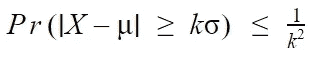
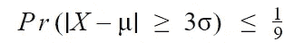
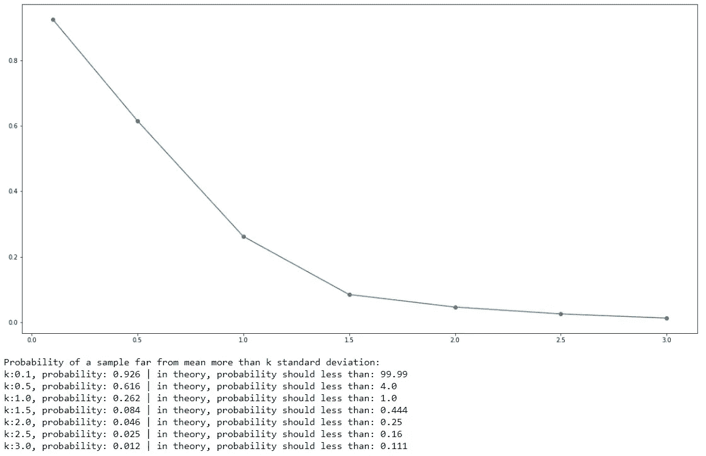

# Python 插图:切比雪夫不等式

> 原文：<https://medium.com/analytics-vidhya/illustration-with-python-chebyshevs-inequality-b34be151c547?source=collection_archive---------4----------------------->

Chebyshev 不等式在与其他定理结合时是一个非常有用的定理，它是置信区间的基础。在这篇博客中，我将使用 python 来说明这个定理以及它是如何工作的。

在我们开始编码之前，让我们看看这个定理。切比雪夫不等式指出，对于广泛的概率分布类别，不超过一定数量的值可以超过平均值的一定距离，公式如下。



切比雪夫不等式

其中 X 是随机变量，μ是 X 的期望值，σ是 X 的标准差，k > 0。

例如，与期望值的距离远远大于 3 标准差的概率小于或等于九分之一。



k = 3 的切比雪夫不等式

根据公式，如果 k 增加，概率会降低。我将使用 python 来说明这个定理，但我不会使用 to 公式，相反，我将使用 python 来创建一个群体并展示这个定理是如何工作的。

步骤:

1.)创建 1，000，000 个值的总体，我使用形状= 2 和比例= 2 的伽马分布，但是该定理也适用于其他分布，例如均匀分布。

```
shape, scale = 2., 2\.  # mean=4, std=2*sqrt(2)
mu = shape*scale
sigma = scale*np.sqrt(shape)
s = np.random.gamma(shape, scale, 1000000)
```

2.)从总体中抽取 10，000 个值

```
# sample 10000 sample
rs = random.choices(s, k=10000)
```

3.)对与期望值的距离大于 k 标准偏差的样本进行计数，并使用该计数来计算概率。我想描述当 k 增加时概率的趋势，所以我用 k 的范围从 0.1 到 3。

```
# set k
ks = [0.1,0.5,1.0,1.5,2.0,2.5,3.0]
# prob list
probs = []# for each k
for k in ks: 
    # start count
    c = 0
    # for each data sample
    for i in rs:
        # count if far from mean in k standard deviation
        if abs(i - mu) > k * sigma :
            c += 1
    # count divided by number of sample
    probs.append(c/10000)
```

4.)绘制并打印结果。

```
# set figure size
plt.figure(figsize=(20,10))
# plot each probability
plt.plot(ks,probs, marker='o')
# show plot
plt.show()# print each probability
print("Probability of a sample far from mean more than k standard deviation:")
for i, prob in enumerate(probs):
    print("k:" + str(ks[i]) + ", probability: " \
          + str(prob)[0:5] + \
          " | in theory, probability should less than: " \
          + str(1/ks[i]**2)[0:5])
```



从图和结果可以看出，随着 k 的增加，概率是递减的，每个 k 的概率都遵循不等式。而且，只有 k 大于 1 的情况才有用。如果 k 小于 1，不等式的右边大于 1，这是没有用的，因为概率不能大于 1。

我们可以在许多应用中使用切比雪夫不等式，我们可以估计数据落在 k 个标准偏差范围内的概率。例如，下一个样本有 90%的可能性在 3 个标准偏差的范围内。

代码可以在这个链接找到: [Jupyter 笔记本](https://github.com/chaipi-chaya/Illustration-with-Python)， [Python 文件](https://gist.github.com/chaipi-chaya)