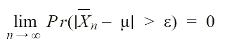
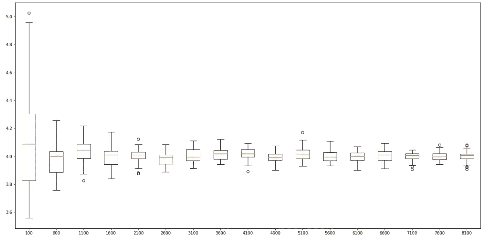
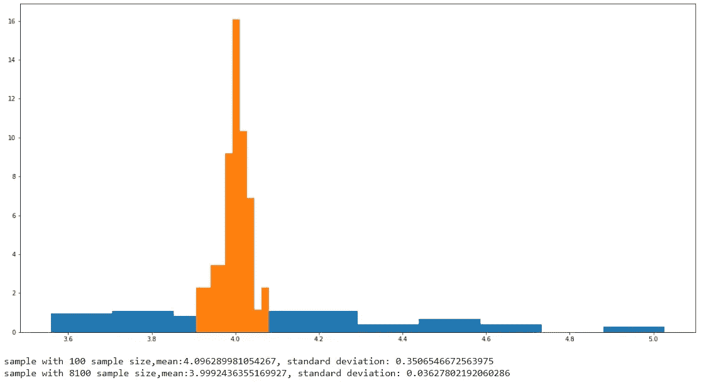

# Python 插图:弱大数定律

> 原文：<https://medium.com/analytics-vidhya/illustration-with-python-weak-law-of-large-numbers-2a644b862985?source=collection_archive---------2----------------------->

弱大数定律表明，如果试验次数足够多，观察值的平均值很有可能接近期望值。换句话说，当试验次数趋于无穷大时，观察值的平均值以很高的概率收敛到期望值。



其中，Xn 是 n 次试验的平均值，μ是期望值，ε是大于 0 的误差容限。定理的全部细节可以在这个[链接](https://en.wikipedia.org/wiki/Law_of_large_numbers)中找到。

在我展示代码之前，有一件事我想指出，即使这个定理说的是大量的试验，如果每个样本是独立同分布的，我们也可以将这个定理用于样本大小。例如，假设我们对一些惯用右手的人感兴趣，并且我们想要研究 100 个样本。如果我们去一个商场，一次选一个人，问并重复 100 次(100 次尝试)，期望会和选 100 个人，一次问一样。因为每个样本都有相同的期望值，所以我们将期望值相加并除以样本数，我们将得到相同的期望值。我将使用 python 代码按照以下步骤展示这个定理

步骤:

1.)创建一个形状= 2、比例= 2 的伽玛分布作为总体。

```
shape, scale = 2., 2\.  # mean=4, std=2*sqrt(2)
s = np.random.gamma(shape, scale, 1000000)
```

2.)首先将样本量设置为 100，采样 50 次并收集每次的平均值，然后将样本量增加 500，重复该步骤直到样本量达到 8100。

```
samplemeanlist = [] # list of sample mean
l = [] # list of smaple size, for x-axis of box plots
numberofsample = 50 # number of sample in each sample size

# set sample size (i) between 100 to 8100, step by 500
for i in range(100,8101,500):
    # set x-axis
    l.append(i)
    # list of mean of each sample
    ml = []
    # sample 50 time.
    for n in range(0,numberofsample):
        # random pick from population with sample size = i
        rs = random.choices(s, k=i)
        # calculate the mean of each sample and save it in list of mean.
        ml.append(sum(rs)/i)  

    # save the 50 sample mean in samplemeanlist for box plots.
    samplemeanlist.append(ml)
```

3.)绘制每个样本大小的箱线图

```
# set figure size
plt.figure(figsize=(20,10))
# plot box plots of each sample mean
plt.boxplot(samplemeanlist,labels = l)
# show plot
plt.show()
```



每个样本量的箱线图，y 轴是样本的平均值，x 轴是样本量。

在图中，我们可以看到，随着样本量的增加，样本均值的分布减少，并以期望值为中心。



橙色直方图是样本大小为 8100 的样本均值分布。蓝色直方图是样本大小为 100 的样本均值分布。

我绘制了两个直方图来比较两个样本均值的分布，蓝色的是样本大小为 100 的样本均值，橙色的是样本大小为 8100 的样本均值。

最后一件事，你应该从这篇博客中得到的是这样一个事实，样本大小对样本均值到期望值的准确性有着巨大的影响。如果你的研究样本量很大，样本的平均值将接近总体平均值。

代码可以在这个链接找到: [Jupyter 笔记本](https://github.com/chaipi-chaya/Illustration-with-Python)， [Python 文件](https://gist.github.com/chaipi-chaya)