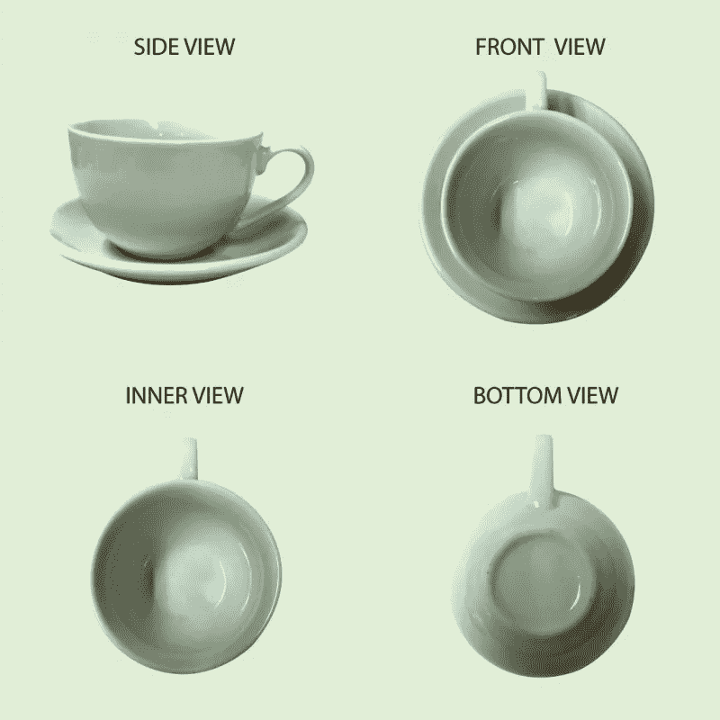
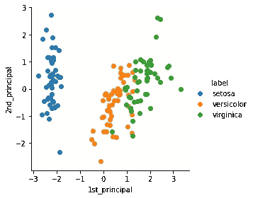
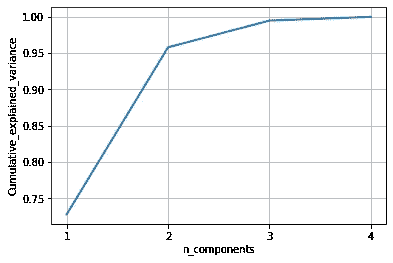
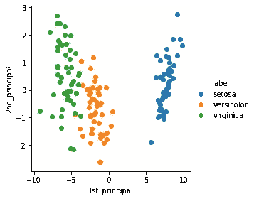
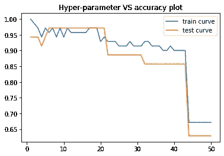
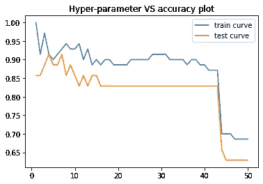
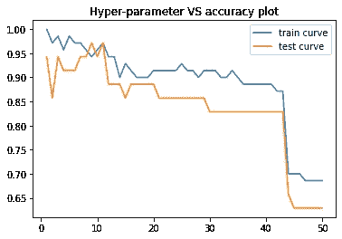

# 主成分分析(PCA)与线性判别分析(LDA)的说明性例子:PCA 是好人还是坏人？

> 原文：<https://medium.com/analytics-vidhya/illustrative-example-of-principal-component-analysis-pca-vs-linear-discriminant-analysis-lda-is-105c431e8907?source=collection_archive---------7----------------------->


来源:[塞巴斯蒂安](https://sebastianraschka.com/Articles/2014_python_lda.html)

嗨，在这篇文章中，我将解释降维技术是如何影响预测模型的。这里我们使用虹膜数据集和 K-NN 分类器。我们将在 Iris 数据集上比较 PCA 和 LDA。

在开始实验之前，最好先复习一下 PCA 和 LDA 的概念。所以我会试着用简短的笔记来解释它们。让我们从 PCA 开始。

# **主成分分析**

PCA 是一种常用于降维的统计工具。它有助于在应用任何 ML 模型之前将高维数据转换为低维数据。这是一种无监督的学习算法。让我先用一个 PCA 的例子来解释一下。在下图中，我们从俯视图、仰视图和侧视图中看到一个物体。请注意，一个对象可以有 360 个视图。如果这个杯子(物体)是数据，那么 PCA 帮助我们找到杯子的最大部分被看到的视图(方向)。例如，如果只有侧视图和底视图，PCA 会给我们一个侧视图，因为可以看到大面积的茶叶。这里，侧视图被认为是第一主成分。得到第一个主分量后，我们在垂直于第一个主分量的方向**旋转杯子。覆盖最大部分并垂直于第一主分量的方向称为第二主分量。这样我们可以找到第三个，第四个等等。**



图 1:一个物体的不同视图(来源:谷歌搜索)

## 执行 PCA 的步骤:

将数据标准化，并找到协方差矩阵。然后求特征向量和各自的特征值。第一主成分无非是具有最大特征值的特征向量，以此类推。

# 线性判别分析(LDA):

LDA 是一种监督降维技术。它根据数据做出假设。它是费歇尔线性判别式的推广。LDA 找不到主成分。相反，它增加了类间距离，减少了类内距离。关于 LDA 的详细解释可以在[这里](http://www.sci.utah.edu/~shireen/pdfs/tutorials/Elhabian_LDA09.pdf)找到。

## 加载必要的库

```
from sklearn.model_selection import train_test_split
from sklearn.preprocessing import StandardScaler
from tqdm import tqdm
import numpy as np
import pandas as pd
import matplotlib.pyplot as plt
%matplotlib inline
import seaborn as sn
from sklearn.metrics.pairwise import euclidean_distances
import warnings
warnings.filterwarnings("ignore")
```

## **加载虹膜数据并执行标准化**

```
dataset = pd.read_csv('iris.csv') #read the data into dataframe
X = dataset.iloc[:, :-1].values   #store the dependent features in X
y = dataset.iloc[:, 4].values   #store the independent variable in y
X = StandardScaler().fit_transform(X)
```

## **执行 PCA 并可视化数据**

```
# initializing the pca
from sklearn import decomposition
pca = decomposition.PCA()# configuring the parameteres
# the number of components = 2
# we have taken only 2 components as it is easy to visualize
pca.n_components = 2
# pca_reduced will contain the 2-d projects of simple data
pca_data = pca.fit_transform(X)
print("shape of pca_reduced.shape = ", pca_data.shape)#>>>   shape of pca_reduced.shape =  (150, 2)# attaching the label for each 2-d data point
pca_data = np.vstack((pca_data.T, y)).T# creating a new data from which help us in ploting the result data
pca_df = pd.DataFrame(data=pca_data, columns=("1st_principal", "2nd_principal", "label"))sn.FacetGrid(pca_df, hue="label", size=4).map(plt.scatter, '1st_principal', '2nd_principal').add_legend()plt.show()
```



使用两个主成分可视化虹膜数据的 PCA

## **绘制主成分数与解释的累积最大方差的关系**

```
# PCA for dimensionality redcution (not-visualization)
pca.n_components = 4
pca_data = pca.fit_transform(X)percentage_var_explained = pca.explained_variance_ / np.sum(pca.explained_variance_)cum_var_explained = np.cumsum(percentage_var_explained)# Plot the PCA spectrum
plt.figure(1, figsize=(6, 4))
plt.xticks(np.arange(0, 4, step=1),(1,2,3,4))
plt.plot(cum_var_explained, linewidth=2)
plt.axis('tight')
plt.grid()
plt.xlabel('n_components')
plt.ylabel('Cumulative_explained_variance')
plt.show()
```

如果我们取一维，大约。解释了 72%的方差，如果我们取二维，大约。解释了 95%的差异。



描绘由特征解释的差异的图

## 执行 LDA 并可视化数据

```
from sklearn.discriminant_analysis import LinearDiscriminantAnalysis
lda = LinearDiscriminantAnalysis(n_components=2)
lda_data = lda.fit(X, y).transform(X)# attaching the label for each 2-d data point
lda_data = np.vstack((lda_data.T, y)).T# creating a new data fram which help us in ploting the result data
lda_df = pd.DataFrame(data=lda_data, columns=("1st_principal", "2nd_principal", "label"))sn.FacetGrid(lda_df, hue="label", size=4).map(plt.scatter, '1st_principal', '2nd_principal').add_legend()plt.show()
```



使用线性判别式的用于可视化虹膜数据的 LDA

## **对原始虹膜数据应用 K-NN**

```
def divide_training_dataset_to_k_folds(x_train,y_train,folds):
 temp = len(x_train)/folds
 x_train = x_train.tolist()
 y_train = y_train.tolist()
 group = []
 label = []
 end = 0.0
 while end < len(x_train):
  group.append(x_train[int(end):int(end + temp)])
  label.append(y_train[int(end):int(end + temp)])
  end += temp
 return group,label
```

定义随机交叉验证技术:

```
from sklearn.metrics import accuracy_score
def RandomSearchCV(x_train,y_train,classifier, param_range, folds):
 # x_train: its numpy array of shape, (n,d)
 # y_train: its numpy array of shape, (n,) or (n,1)
 # classifier: its typically KNeighborsClassifier()
 # param_range: its a tuple like (a,b) a < b
 # folds: an integer, represents number of folds we need to devide the data and test our model
 params = list(range(1,51))
 #1.divide numbers ranging from  0 to len(X_train) into groups= folds
 # ex: folds=3, and len(x_train)=100, we can devide numbers from 0 to 100 into 3 groups i.e: group 1: 0-33, group 2:34-66, group 3: 67-100
 temp = len(x_train)/folds
 temp = int(temp)
groups,labels = divide_training_dataset_to_k_folds(x_train,y_train, folds) #2.for each hyperparameter that we generated in step 1 and using the above groups we have created in step 2 you will do cross-validation as follows:
 # first we will keep group 1+group 2 i.e. 0-66 as train data and group 3: 67-100 as test data, and find train and test accuracies
 # second we will keep group 1+group 3 i.e. 0-33, 67-100 as train data and group 2: 34-66 as test data, and find train and test accuracies
 # third we will keep group 2+group 3 i.e. 34-100 as train data and group 1: 0-33 as test data, and find train and test accuracies
 # based on the 'folds' value we will do the same procedure
 # find the mean of train accuracies of above 3 steps and store in a list "train_scores"
 # find the mean of test accuracies of above 3 steps and store in a list "test_scores" train_scores = []
 test_scores  = []
 for k in tqdm(params):
  trainscores_folds = []
  testscores_folds = []  
  for i in range(folds):
   X_train = [groups[iter] for iter in range(folds) if iter != i]
   X_train = [j for sublist in X_train for j in sublist]
   Y_train = [labels[iter] for iter in range(folds) if iter != i]
   Y_train = [j for sublist in Y_train for j in sublist]
   X_test  = groups[i]
   Y_test  = labels[i]
   classifier.n_neighbors = k
   classifier.fit(X_train,Y_train)
   Y_predicted = classifier.predict(X_test)
   testscores_folds.append(accuracy_score(Y_test, Y_predicted))
   Y_predicted = classifier.predict(X_train)
   trainscores_folds.append(accuracy_score(Y_train, Y_predicted))
  train_scores.append(np.mean(np.array(trainscores_folds)))
  test_scores.append(np.mean(np.array(testscores_folds)))
#3\. return both "train_scores" and "test_scores"
 return train_scores, test_scores,params
```

k-NN 分类器

```
from sklearn.metrics import accuracy_score
from sklearn.neighbors import KNeighborsClassifier
import matplotlib.pyplot as pltclassifier = KNeighborsClassifier()
param_range = (1,50)
folds = 3X = dataset.iloc[:, :-1].values#store the dependent features in X
y = dataset.iloc[:, 4].values  #store the independent variable in y
X_train, X_test, y_train, y_test = train_test_split(X, y,stratify=y, random_state=42,test_size=0.30)
trainscores,testscores,params=RandomSearchCV(X_train,y_train,classifier, param_range, folds)#  plot hyper-parameter vs accuracy plot as shown in reference notebook and choose the best hyperparameterplt.plot(params,trainscores, label='train curve')
plt.plot(params,testscores, label='test curve')
plt.title('Hyper-parameter VS accuracy plot')
plt.legend()
plt.show()
```



最大测试精度约为。97%

## 基于 PCA 的 K-NN 在改进虹膜数据中的应用

```
X = pca_df.iloc[:, :-1].values#store all the dependent features in X
y = pca_df.iloc[:, -1].values   #store the independent variable in yX_train, X_test, y_train, y_test = train_test_split(X, y,stratify=y, random_state=42,test_size=0.30) #training data = 70% and test data = 30%trainscores,testscores,params=RandomSearchCV(X_train,y_train,classifier, param_range, folds)#  plot hyper-parameter vs accuracy plot as shown in reference notebook and choose the best hyperparameterplt.plot(params,trainscores, label='train curve')
plt.plot(params,testscores, label='test curve')
plt.title('Hyper-parameter VS accuracy plot')
plt.legend()
plt.show()
```



最大测试精度约为。91%

## 基于 LDA 的 K-NN 在改进虹膜数据上的应用

```
X_train, X_test, y_train, y_test = train_test_split(X,y,stratify=y, random_state=42,test_size=0.30)trainscores,testscores,params=RandomSearchCV(X_train,y_train,classifier, param_range, folds)#  plot hyper-parameter vs accuracy plot as shown in reference notebook and choose the best hyperparameterplt.plot(params,trainscores, label='train curve')
plt.plot(params,testscores, label='test curve')
plt.title('Hyper-parameter VS accuracy plot')
plt.legend()
plt.show()
```



最大测试精度约为。97%

# **结论:**

综上所述，我们可以从上面的结果中观察到，PCA 在标记数据上表现不佳。另一方面，LDA 并没有降低 K-NN 模型的性能，而且降低了数据集的复杂度。由于 PCA 是无监督的技术，它不考虑类别标签。因此，我们可以得出结论，对于有标记的数据，LDA 是比 PCA 更好的降维技术。

代码链接: [github](https://github.com/GopiSumanth/MachineLearning/blob/master/PCA_%2B_K_NN_on_IRIS.ipynb)

注:使用 LDA 的缩减数据集给出了与原始数据集相同的准确度，即:97%。然而，使用 PCA 的简化数据集给出了非常低的 91%的准确度！！！