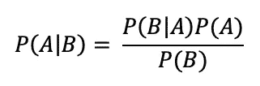
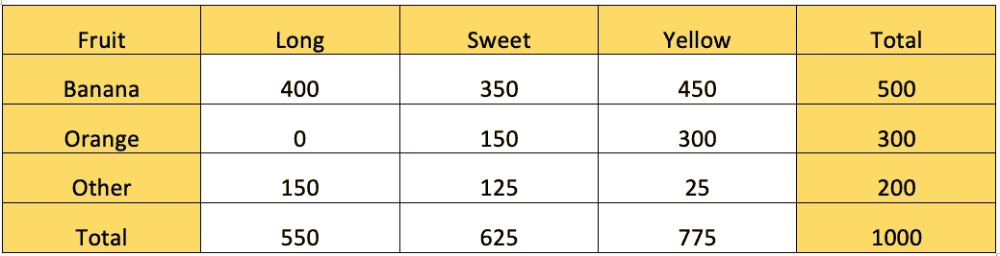
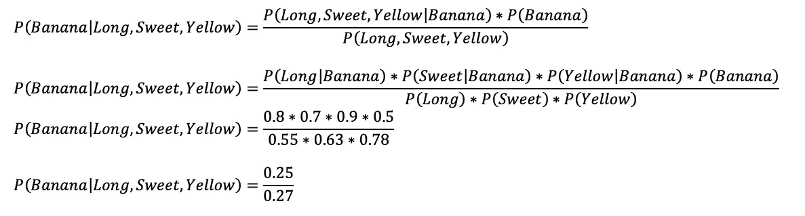
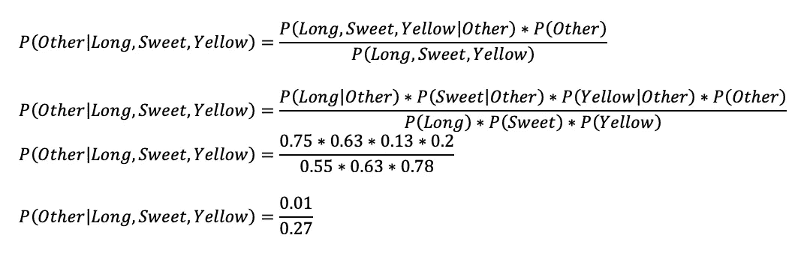

# 我在努力理解朴素贝叶斯定理

> 原文：<https://medium.com/analytics-vidhya/im-trying-so-hard-to-understand-naive-bayes-theorem-8d1e87168c5d?source=collection_archive---------4----------------------->


在 [Unsplash](https://unsplash.com?utm_source=medium&utm_medium=referral) 上由 [Ansgar Scheffold](https://unsplash.com/@ansgarscheffold?utm_source=medium&utm_medium=referral) 拍摄的照片

在4-5 年里，我在 NSO(国家统计局)做软件开发。即使我在一个使用许多统计方法产生许多数据和信息的办公室工作，我也不太了解统计。我知道如何建立一个系统来帮助业务流程，但我不太懂统计学。

最近，机器学习在世界上变得非常流行；人们正在争相生产一种可以基于数据进行学习的机器。作为一个习惯了数据和一些编程语言的软件开发人员，当然对机器学习很感兴趣。我想知道怎么做；我脑子里有很多想法。我想玩它。

当我在 youtube 上看一些教程时，它看起来非常简单，因为 Python 中有许多工具，可以帮助我们做机器学习的事情。我对此越来越好奇，因为我在生产某样东西时会感到内疚，但我不知道它背后是什么。当我的 Python 语法利用机器学习快速产生一些分类的时候，我不明白一些算法是如何工作的。为了更深入地了解它，我从朴素贝叶斯定理开始，因为这个算法是最简单的算法，它假设预测器是独立的。

> 该死的…

我在研究朴素贝叶斯的时候发现了统计数据。只是简单的概率和方程的东西，但它让我头疼，因为我有一个薄弱的统计基础。

抱歉，介绍太长了。在一周的时间里，我在努力理解朴素贝叶斯定理，但现在我知道了它的基本知识，我想与大家分享。

贝叶斯定理可以用这个方程来表述。



P(A|B)表示概率 A 发生在给定 B 的情况下其中 P(B|A)是概率 B 发生在给定 B 和 P(A)的情况下，P(B)分别是 A 发生的概率，B 发生的概率—感觉很困惑？我们用一个实数来举几个例子。



我从许多贝叶斯教程中已经常见的数据中选取了例子。我们对 1000 个不同水果的样本进行了一些关于水果特性的研究，结果在上面的表格中。从表中，我们可以看出。

1.  50%的水果是香蕉(500/1000)。这意味着 P(香蕉)= 0.5
2.  30%的水果是橙色的。(300/1000).这意味着 P(橙色)= 0.3
3.  20%是其他水果。(200/1000).这意味着 P(其他)= 0.2
4.  p(长)= 550/1000 = 0.55
5.  p(甜)= 625/1000 = 0.63
6.  p(黄色)= 775/1000 = 0.78

从 500 个香蕉，300 个橙子，还有 200 个其他的。

1.  400 根香蕉长。p(长|香蕉)= 400/500 = 0.8
2.  350 香蕉是甜的。p(甜|香蕉)= 350/500 = 0.7
3.  450 根香蕉是黄色的。p(黄色|香蕉)=450/500 = 0.9
4.  0 橘子长。P(Long|Orange) = 0
5.  150 个橘子是甜的。p(甜|橙)= 150/300 = 0.5
6.  300 个橘子是黄色的。p(黄色|橙色)= 300/300 = 1
7.  其他的 150 是长的。p(长|其他)= 150/200 = 0.75
8.  其他 125 个是甜的。p(甜|其他)= 125/200 = 0.63
9.  其他 25 个是黄色的。p(黄色|其他)= 25/200 = 0.13

```
If we have a fruit that has a Long, Sweet, and Yellow characteristic. What fruit is it?
```

要知道是什么水果，就要计算这个概率的值。

1.  **那个水果是不是香蕉 P(香蕉|长，甜，黄)**
2.  **那个水果是不是橙 P(橙|长，甜，黄)**
3.  **那个水果是否是另一个水果 P(Other|Long，Sweet，Yellow)**

从最高概率得分就知道是什么水果了。

**P(香蕉|长、甜、黄)**



**P(橙|长、甜、黄)= 0**

给定的水果是橙色的概率为零，因为当给定的水果是长的时，橙色的概率为零。

**P(其他|长、甜、黄)**



我们可以这样看

```
**P(Banana|Long, Sweet, Yellow) > P(Other|Long, Sweet, Yellow)** 
```

这样给定的水果将被分类为 ***香蕉*** 。

这是一个非常简单的测试用例，在现实世界中，预测器、特征或变量会非常复杂，尤其是在自然语言处理中。我们可以将一封邮件归类为垃圾邮件，或者使用贝叶斯将一条推文归类为某种情感。稍后我会解释贝叶斯定理在自然语言处理中是如何工作的。

起初，我觉得很难理解所有这些统计数据，但慢慢地，我确信我知道它是如何工作的。本教程到此为止。谢谢你。