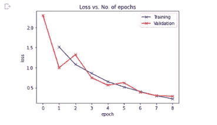
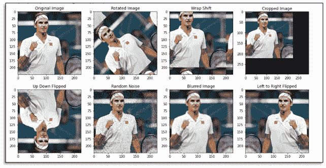
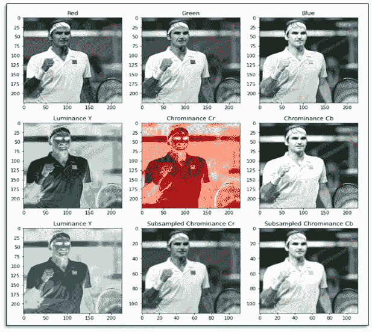

# 图像增强

> 原文：<https://medium.com/analytics-vidhya/image-augmentation-fc0cbe19b80?source=collection_archive---------33----------------------->

数据科学的成功在于我们使用了大量的数据。当我们拥有更少的数据时会发生什么？

该模型没有被最好地训练，并且训练预测练习的整个目的可能没有被最好地实现。

我们该怎么办？—获取更多数据！！！

但是怎么做呢？创造更多的数据！！

好吧！！明白了。

现在我设法获得了越来越多的数据。但是当我们把它放在现实世界中时，这个模型似乎并不是最好的。我测试的时候它表现很好。

欢迎来到*过拟合*现象。

当一次又一次地对同一组数据进行训练时，模型开始变得*偏向*训练和验证集中存在的特征。哎呀！！！

那么现在呢？—让您的模型看到/体验更新的数据。

我们该怎么办？—获取更多数据！！！

但是怎么做呢？创造更多的数据！！

说起来容易做起来难。想象我们正在处理大脑核磁共振成像数据。我们能够创建自己的数据吗！！不敢！！

然而，我们可以通过一些经过验证和推荐的方法来创建自己的数据。这叫做数据增强。

## 选择增强技术的一些基本准则

当我们研究这种方法是如何工作的时候，有几点需要记住

*   确保所有的图像大小应该是相同的大小，并符合模型的要求。如果需要，调整大小。
*   注意图片的位置是否重要。如果图像的位置是相关的，这种技术不是最好的方法。
*   归一化图像像素值有利于模型更好更快的收敛。如果需要，对图像进行预处理。

## 图像数据增强技术

**几何变换**

下面是我们可以使用的一些流行的转换。

*   轻弹
*   彩色空间
*   种植
*   旋转
*   翻译
*   噪声注入
*   色彩空间转换

**内核过滤器**

内核过滤器是一种非常流行的技术，用于锐化/模糊图像。它的工作原理是在图像上滑动一个 *n* × *n* 矩阵，使用高斯模糊滤镜产生更模糊的图像，或者使用高对比度垂直或水平边缘滤镜产生更清晰的图像。锐化图像提供了关于感兴趣对象的更多细节，而模糊将是运动模糊图像的良好测试数据。锐化和模糊是将核过滤器应用于图像的一些经典方法。(参考:PatchShuffle 正则化)。然而，这非常类似于 CNN 的填充。

**混合图像**

通过平均像素值将图像混合在一起是一种非常违反直觉的数据扩充方法。这样做产生的图像对于人类观察者来说看起来不像是有用的变换。然而，有许多实验证明了这种方法的有效性。实验显示错误率降低。

**随机擦除**

随机擦除是另一种有趣的技术。

它迫使模型学习关于图像的更多描述性特征，从而避免过度适应图像的特定视觉特征。它确保整个图像被用于从图像的整个特征中学习。

随机擦除的工作原理是随机选择图像的一个 n × m 小块，并用 0 秒、255 秒、平均像素值或随机值进行遮罩

它通过改变输入空间直接防止过度拟合。通过移除图像的某些部分，它迫使模型寻找更多的特征。有趣的是，随机擦除可以与其他数据扩充技术结合起来创建新的数据空间。

然而，另一方面，随机擦除有时可能会使事情变得困难。想象一下，随机擦掉手写数字 8 的顶部，在 6 或 8 之间很难辨认。这种情况可能需要一些人工干预。

这一切都是美好的吗！！

不要。不可能——生活从来没有那么简单。应用所有这些几何变换、色彩空间变换、核过滤器、混合图像、随机擦除以及组合增强可能导致巨大的膨胀数据集。这可能再次导致过度拟合。忠告的话；实施前要好好思考。

**说了这么多，想想这个……。**

出于可以理解的原因，我们现在增加了数据量，但是计算成本和它对模型速度的影响呢？最终，你所做的所有努力都可能成为实时预测的瓶颈。然而，有许多研究工作表明测试时间增加实际上已经改善了预测/分类。

还要注意如何使用我们开发的新的扩充数据集。没有规定的策略，但是实验表明，最好先用原始数据训练模型，然后再用原始数据和增强数据进行进一步训练。推荐的方法是绘制不同初始训练子集的训练精度随时间的变化图。这可能有助于找出数据中的模式。数据扩充创建了大量的数据集，并且已经看到在这样的数据集上训练你的模型使得模型更快更准确。

现在考虑一下，我确信这会很有趣。你有没有考虑过所有这些增强对你的图像分辨率的影响？一个 HD (1920 × 1080 × 3)或 4 K (3840 × 2160 × 3)需要多得多的处理和内存来训练深度 CNN。我们通常处理的模型从原始分辨率对图像进行降采样。然而，下采样导致图像中的信息丢失，使得图像识别更加困难，我们仍然可以识别罗杰·费德勒。

对于 GANs，分辨率也是一个非常重要的问题，但是由于训练稳定性和模式崩溃，从 GANs 产生高分辨率输出并不是一件容易的事情。

**最终数据集大小**

数据扩充过程中需要考虑的一个重要方面是最终数据集的大小。当所有图像被水平翻转并添加到数据集时，结果数据集大小从 N 变为 2N。从而减少了与扩充数据相关联的额外的存储器和计算限制。因此，需要考虑的是，我们是在训练过程中即时转换数据，还是预先转换数据并将其存储在内存中！虽然第一种方法可以节省内存，但它会大大降低训练速度。将数据集存储在内存中也不容易，这取决于数据集膨胀到多大。这也被分类为在线和离线数据增强。记住课程学习，我们可以应用这里的概念。

**当数据集由来自一个类的例子组成时，类不平衡**可能是一个问题。这可能表现在具有明显多数-少数阶级区别的二元分类中，或者表现在具有一个或多个多数阶级的多阶级分类中。不平衡的数据集会导致偏差，并导致较差的性能指标。

作为解决方案，我们可以使用简单的随机过采样和小的几何变换。其他图像增强技术，如颜色增强、混合图像、内核滤波和随机擦除，也可以用于以类似的方式对数据进行过采样。这有助于简化实现和快速试验不同的类比率。用基本图像变换进行过采样的一个问题是，它可能导致过拟合正在被过采样的少数类。少数类中存在的偏差在使用这些技术进行采样后更加普遍。

也可以使用各种过采样方法，例如对抗训练、神经类型转移、GANs 和元学习方案。神经风格转移是一种创建新图像的有趣方式。这些新图像可以通过用外来样式外推样式或者通过在数据集中的实例之间内插样式来创建。GANs 也可用于过采样。

**结论**

数据扩充是一种非常有用的技术，可以构建鲁棒的数据集，避免深度学习模型中由于数据有限而导致的过拟合问题。已经提出了许多扩充。这些可以根据数据弯曲或过采样技术进行分类。

数据扩充可能有助于克服小数据集中的偏差。例如，在狗品种分类任务中，如果只有猎犬而没有寻回犬的实例，则没有讨论的增强方法将能够创建寻回犬。数据扩充通过修改有限的数据集，使其表现得像大数据集一样，从而防止过度拟合。数据增强的前景是光明的。结合数据扭曲和过采样方法的算法在未来有着巨大的潜力。