# 使用 Keras 的图像增强

> 原文：<https://medium.com/analytics-vidhya/image-augmentation-using-keras-99072b490c72?source=collection_archive---------5----------------------->

使用神经网络和深度学习模型时，需要进行数据准备。在更复杂的目标识别任务中也越来越需要数据扩充。

数据扩充意味着增加数据量。换句话说，拥有更大的数据集意味着更健壮的模型。但是获取更多的数据并不总是那么容易，而且可能存在存储数据并将其输入模型的问题。

为了缓解这个问题，我们可以通过做一些更改来手动增加数据，或者我们可以利用 Keras 图像预处理类之一，只需几行代码就可以做到这一点。

在本帖中，我们将了解在使用 Python 和 Keras 开发和评估深度学习模型时，如何使用图像数据集进行数据准备和数据扩充。

看完这篇帖子，你会了解到:

1.  关于 Keras 提供的图像增强 API 以及如何在你的模型中使用它。如何进行特征标准化？
2.  如何执行你的图像 ZCA 白化？
3.  如何用随机旋转、移位和翻转来扩充数据？
4.  如何将增强的图像数据保存到磁盘。

**Keras 图像增强 API: ImageDataGenerator**

它从原始批次生成批量的扩充数据。它获取图像，对其应用一些随机变换，并产生新的一批用于训练。

**注意:** *这里需要注意的一点是，ImageDataGenerator 并不返回原始图像，而是返回批量的扩充数据，这是对原始数据进行一些转换的结果。*

**加载数据集**

我们将使用 MNIST 手写数字识别进行数据扩充。执行以下代码将从 *keras.datasets* 加载 MNIST 数据集

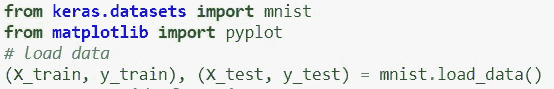

将数据分成训练和测试

## **标准化功能**

像素标准化在两个层面上得到支持:或者是每个图像(称为样本方式)或者是每个数据集(称为特征方式)。具体而言，标准化像素值所需的平均值和/或平均值和标准偏差统计可仅从每个图像中的像素值(样本方面)或跨整个训练数据集(特征方面)来计算。

您可以通过在 ImageDataGenerator 类上设置 featurewise_center 和 featurewise_std_normalization 参数来执行功能标准化。

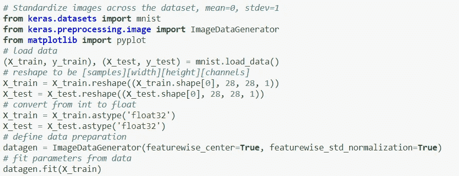

跨数据集标准化图像，平均值=0，标准偏差=1

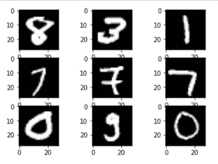

**输出图像:**标准化特征

运行这个例子，你可以看到效果是不同的，似乎变暗和变亮不同的数字。

## **ZCA 美白**

图像的白化变换是减少像素图像矩阵中冗余的线性代数运算。通常，使用主成分分析(PCA)技术来执行图像白化。最近，一种称为 ZCA 的替代方法显示了更好的结果，并且在变换后的图像中保持了所有的原始尺寸，并且与 PCA 不同，得到的变换后的图像看起来仍然像它们的原始图像。

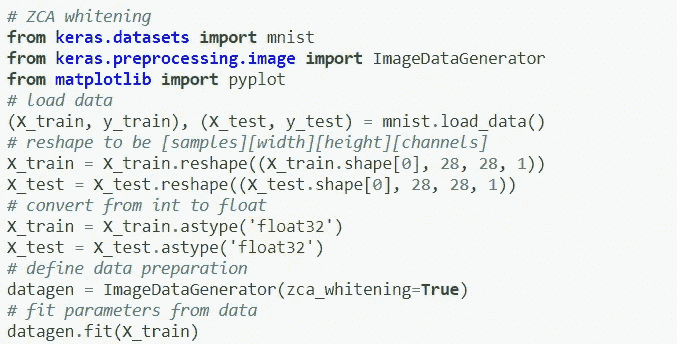

ZCA 美白

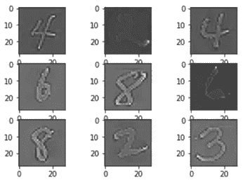

**输出图像:** ZCA

运行这个例子，你可以看到效果是不同的，似乎变暗和变亮不同的数字。

## **随机旋转**

通过在训练过程中人工随机旋转数据集中的图像，可以训练模型更好地处理图像的旋转。下面的示例通过设置 rotation_range 参数来创建 MNIST 位数的 90 度随机旋转。

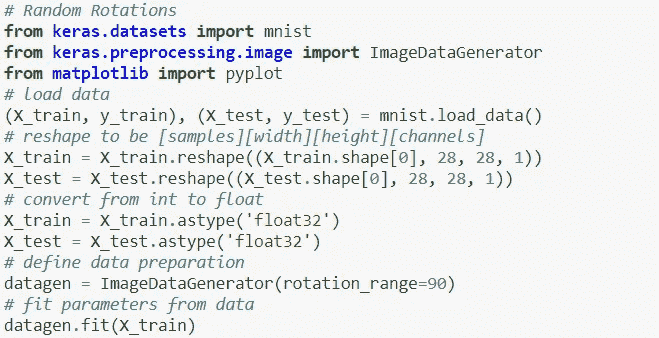

旋转 90 度

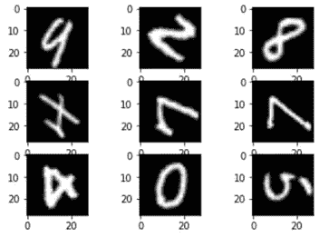

**输出图像:**随机旋转

你可以看到图像被左右旋转了 90 度。这在这个问题上没有帮助，因为 MNIST 数字具有归一化的方向，但是当从物体可能具有不同方向的照片中学习时，这种变换可能是有帮助的。

## **随机移位**

图像中的对象可能不在框架的中心。它们可能以各种不同的方式偏离中心。你可以通过人工创建训练数据的移位版本，来训练你的深度学习网络预期和当前处理偏离中心的对象。Keras 支持通过 width_shift_range 和 height_shift_range 参数对训练数据进行单独的水平和垂直随机移动。

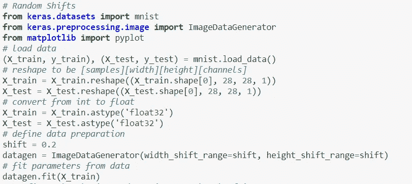

移动宽度和高度

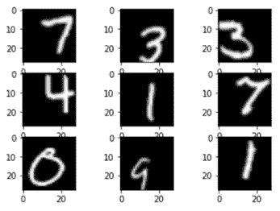

**输出图像:**随机偏移

同样，这对于 MNIST 来说不是必需的，因为手写数字已经居中，但是您可以看到这对于更复杂的问题域是如何有用的。

## **随机翻转**

对图像数据的另一个增强是在训练数据中创建图像的随机翻转，这可以提高处理大型复杂问题的性能。Keras 使用 vertical_flip 和 horizontal_flip 参数支持沿垂直轴和水平轴的随机翻转。

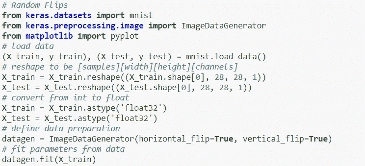

水平和垂直翻转

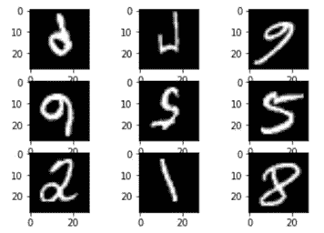

**输出图像:**随机翻转

翻转手指没有用，因为它们总是具有正确的左右方向，但是对于场景中可能具有不同方向的对象照片的问题，这可能是有用的。

*你可以在这里找到代码:* [*Github 链接*](https://github.com/Prachi-Gopalani13/Image-Augmentation-Using-Keras)

**感谢阅读！**

**干杯！**