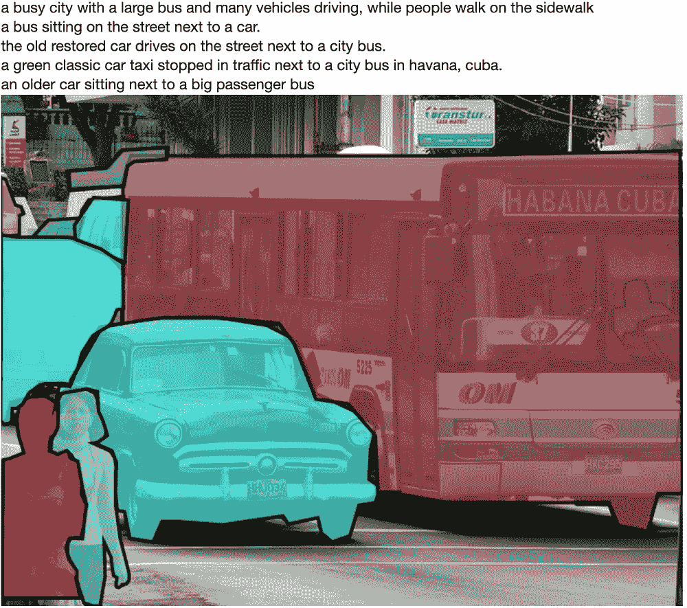
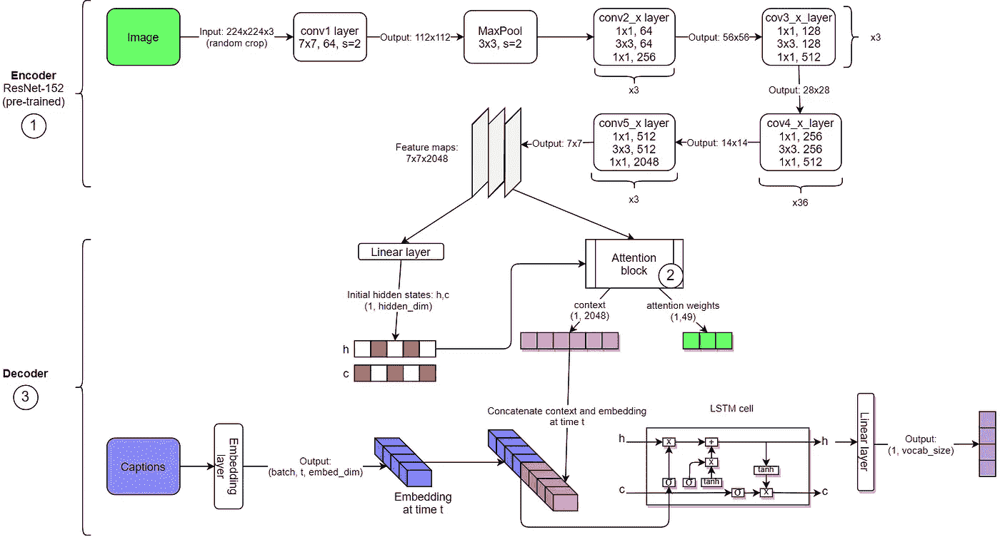
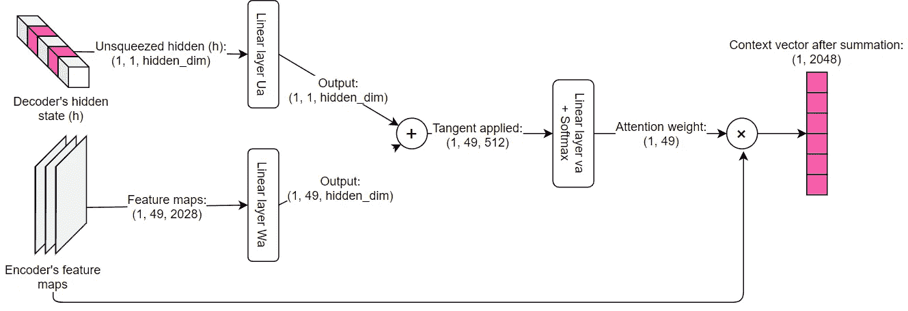
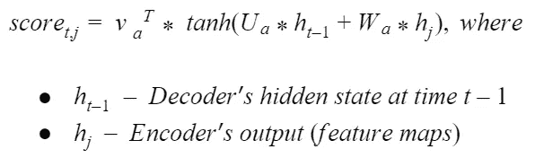
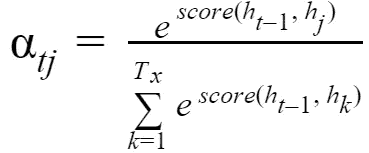
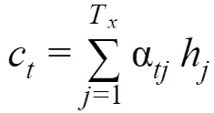
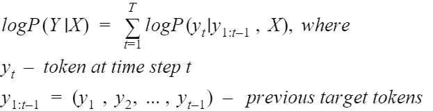
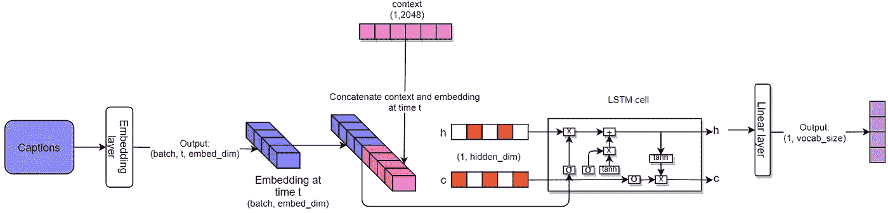
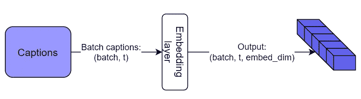
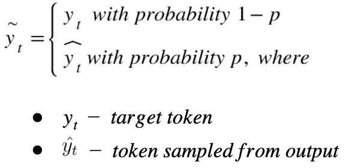

# 注意图像字幕:第一部分

> 原文：<https://medium.com/analytics-vidhya/image-captioning-with-attention-part-1-e8a5f783f6d3?source=collection_archive---------4----------------------->

## 第一部分概述了图像字幕的“编解码”模型及其在 PyTorch 中的实现



来源:[可可女士数据集](https://cocodataset.org/)

# 介绍

在多年的研究中，图像字幕问题一直是深度学习中一个活跃而又成熟的话题。最终目标是描述图像的内容，将其映射为一系列单词。

[这份](https://arxiv.org/pdf/1810.04020.pdf)综合调查可以作为各种方法、数据集和评估指标的重要参考。

在这个简短的系列文章中，我将坚持使用一种特殊的技术，这种技术允许使用基于“注意力”的序列到序列模型来完成捕获生成任务。

最初，我从我的 [Udacity 纳米学位项目](https://www.udacity.com/course/computer-vision-nanodegree--nd891)中提取了一个基线模型，并在数据加载(添加了验证集)、训练(预定采样)和推断(波束搜索)方面进行了重大调整。

在实施过程中，我遵循了来自“[展示、出席和讲述](https://arxiv.org/pdf/1502.03044.pdf)”论文和这个全面的[图像字幕教程](https://github.com/sgrvinod/a-PyTorch-Tutorial-to-Image-Captioning)的最佳实践。

代码是用 PyTorch 框架写的，可以在这个[原始回购](https://github.com/MakarovArtyom/Image-Captioning-with-Attention)中找到。

# 数据加载

在接下来的研究中，我使用了 [**MS COCO 数据集**](https://cocodataset.org/) 来训练和验证该模型。

该数据集版本于 2014 年**发布，包含:**

*   82783*培训；*
*   40504*验证；*
*   40775 张*测试*图像；
*   5 *标题*用于每个培训和验证部分。

让我们仔细看看数据加载。完整代码`data_loader.py`可在[回购](https://github.com/MakarovArtyom/Image-Captioning-with-Attention/blob/master/data_loader.py)中获得。

1.  来自`data_loader.py`的`get_loader()`函数接收`mode`作为参数，它有三个可能的值:`'train'`、`'valid'`或`'test'`。
2.  如果模式是`'train'`或`'valid'`，我们使用`CoCoDataset`类中的`*get_indices()*`方法，检索指定`batch_size`的图像批次和对应的*随机采样长度、*的字幕。

```
def get_indices(self):
    # randomly select the caption length from the list of lengths
    sel_length = np.random.choice(self.caption_lengths)

    all_indices = np.where([self.caption_lengths[i] == sel_length for i in np.arange(len(self.caption_lengths))])[0]

    # select m = batch_size captions from list above
    indices = list(np.random.choice(all_indices, size=self.batch_size))
    # return the caption indices of specified batch
    return indices
```

3.索引将被传递给数据加载器，数据加载器返回关于`mode`的数据点:

*   图像，字幕 if`mode == 'train'`；
*   图像、字幕和*所有字幕*，如果`mode == 'valid'`对应一幅图像；
*   原始图像、预处理图像(如果有`mode == 'test'`)。

为了在验证阶段计算 BLEU 评分，将需要字幕的整个语料库。

我们将把[词汇表](https://github.com/MakarovArtyom/Image-Captioning-with-Attention/blob/master/vocabulary.py)存储在`vocab.pkl`文件中，并为验证和测试数据集指定`vocab_from_file == True`，以便从文件中加载词汇表。

# 模型架构

一般来说，该模型包括三个主要部分:

*   编码器(预先训练好的 CNN)；
*   注意力网络；
*   解码器——可训练 RNN 模型。



图 1:“编码器-解码器”模型架构

## 1.编码器

当前的实现(图 1)假设 Resnet-152 是一个由卷积构建模块组成的*特征提取器*，嵌入了快捷连接。

它接收一个 224x224 随机裁剪的应用了变形器(稍后描述)的图像样本，并提取 2048 个大小为 7x7 的特征地图。

注意，我们从最后一个卷积块*获得特征向量，而不应用全连接层*。这允许注意力网络在解码期间具有选择性并聚焦于各种图像特征。

模型编码器

**详情**:

*   为了加载*预训练的* Resnet-152，我们使用 torchvision 的`models`子包:`models.resnet152(pretrained=True)`；
*   使用最低卷积块的输出(忽略底部的自适应平均池和线性层):`models = list(resnet.childern())[:-2]`；
*   为了准备用于解码的特征，我们置换维度- `features.permute(0,2,3,1)`并对其进行整形。输出的大小为`(batch, 49, 2048)`。

## 2.**注意**

使用注意机制，我们强调图像中最重要的像素。

为了关注每个解码步骤的相关部分，注意力网络输出*上下文向量*，它是编码器输出(特征)的加权和。

为了产生上下文向量:

*   首先，我们用*评分函数*对传递给注意力网络的编码器的每个输出(特征)进行**评分**。
*   然后我们**得到概率**，将 *softmax* 函数应用于分数。这些值表示我们输入到解码器的每个特征向量的相关性。
*   **计算加权和**，将特征乘以相应的概率。

我强烈推荐这个博客来深入了解不同类型的 attention⁵.

当前的模型采用软 [Bahdanau(加法)](https://arxiv.org/abs/1409.0473)注意力，在 training⁶.期间使用*前馈网络*学习注意力分数

在`4.2`章节下的“[展示、出席和讲述](https://arxiv.org/pdf/1502.03044.pdf)”论文中很好地描述了针对图像字幕问题的软注意的使用，并且可以示意性地表示如下。



图 2:“软注意块”

柔和的注意力

**详情**:

*   注意力分数`atten_score`是使用前馈网络计算的(符号可能因来源不同而不同，并与原始论文不同):



*   接下来，我们应用 softmax 来计算概率`atten_weights`:



*   最后，导出上下文向量:



## 3.解码器

在跳到解码器的架构之前，让我们来形式化一下图像字幕任务。

给定输入特征图 **X** 和长度为 **T** 的目标标题 **Y** ，模型学习精确预测序列 Y，计算对数概率**P(Y | X)**



[*递归神经网络序列预测的预定采样*](https://arxiv.org/pdf/1506.03099)

> 该模型学习一组参数 **θ*** ，使正确序列的*对数似然*最大化。

为了处理序列，我们使用 *LSTM(长-短时记忆)*单元，其输出隐藏状态(短时记忆) **h** 和单元状态(长时记忆) **c** 。

然后，我们将隐藏状态 **h** 提供给一个全连接层，之后是 softmax，以便为字典中的所有标记计算*概率*。

**重要**:如果我们用*交叉熵损失*进行训练，损失函数将 softmax 应用于输出，然后执行对数运算。

因此，只要给定一个隐藏状态和前一个令牌，模型*就会学习生成序列中的下一个令牌。*

逐步解码过程如下所示。



图 3:“解码器”

**解码步骤:**

1.  从目标标题:`embed = self.embeddings(captions)`创建**嵌入**。这个向量的大小为`(batch, t, embed_dim)`，其中`t`对应于一个序列长度。



图 3:“嵌入”

2.使用全连接层`h,c = self.init_hidden(features)`初始化**隐藏状态(h，c)** :

> LSTM 的初始存储状态和隐藏状态由通过两个独立的 MLP(init _ c 和 init_h)馈送的注释向量的**平均值来预测。**

隐藏状态的初始化

3.在训练的每一步执行 [**预定抽样**](https://arxiv.org/abs/1506.03099) 。我们将*采样概率*设置为从目标序列(所谓的**教师强制**)或输出样本中选择下一个输入令牌 **ỹ** 的条件。

计划抽样背后的主要思想是当目标标记不可用时，缩小教师强制训练和推理阶段之间的差距。



[平行预定抽样](https://arxiv.org/pdf/1906.04331)

设置采样概率

如果采样`sample_prob`的概率*高于随机*，我们选择从输出`top_idx`中采样令牌，否则目标令牌将被通过。

输出的缩放

利用采样温度`self.sample_temp`调整输出，在应用 softmax 之前放大输出。比如温度等于`0.5`会导致输出值更大，多样性更低。

这使得 LSTM 更挑剔，但是 [*在其样本*](http://karpathy.github.io/2015/05/21/rnn-effectiveness/) ⁵ *中更保守。*

4.将嵌入和上下文向量连接成到 LSTM 单元的**单输入**:

LSTM 单元的级联输入

5.最后，我们将具有`p=0.5`的丢失正则化应用于隐藏状态 **h** ，并将其提供给全连接层:

获得最终输出

解码器的**全码**:

模型解码器

## 后续步骤

在第二部分，我将深入了解训练过程(超参数选择、验证度量)和字幕采样(贪婪、波束搜索解码)。

## *参考*:

[1] Samy Bengio，Oriol Vinyals，Navdeep Jaitly，Noam Shazeer。(2015 年 9 月 23 日)。*用递归神经网络进行序列预测的预定采样。*

[2]开尔文·徐、吉米·巴雷、瑞安·基罗斯、赵京贤、亚伦·库维尔、鲁斯兰·萨拉胡季诺夫、理查德·泽梅尔、约舒阿·本吉奥。(2016 年 4 月 19 日)。*展示、出席、讲述:视觉注意的神经图像字幕生成。*

[3] MD. ZAKIR HOSSAIN，FERDOUS SOHEL，MOHD FAIRUZ SHIRATUDDIN，HAMID LAGA。(2018 年 10 月 14 日)。*对图像字幕深度学习的全面调查。*

[4] Dzmitry Bahdanau，Kyunghyun Cho，Yoshua Bengio。(2014 年 9 月 1 日)。*通过联合学习对齐和翻译的神经机器翻译。*

[5]安德烈·卡帕西。(2105 年 5 月 21 日)。*递归神经网络的不合理有效性。*

[6]莉莲翁。(2018 年 6 月 24 日)。*注意？立正！*

[7]萨加尔·维诺达巴布。一个 [PyTorch 图像字幕教程](https://github.com/sgrvinod/a-PyTorch-Tutorial-to-Image-Captioning)。

*项目的 GitHub 库:*[*https://GitHub . com/MakarovArtyom/Image-Captioning-with-Attention*](https://github.com/MakarovArtyom/Image-Captioning-with-Attention)