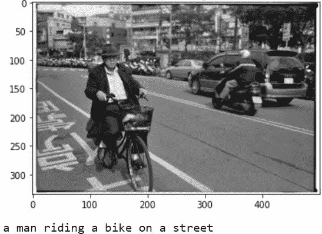

# 关注图像字幕:第二部分

> 原文：<https://medium.com/analytics-vidhya/image-captioning-with-attention-part-2-f3616d5cf8d1?source=collection_archive---------6----------------------->

## 图像字幕项目的第二部分包括模型训练和字幕采样的过程

视觉注意力

# 模特培训

在本文的第一部分[中，我们已经介绍了图像字幕编码器-解码器模型的整体架构。](https://makarovartyom-ma.medium.com/image-captioning-with-attention-part-1-e8a5f783f6d3)

现在我们来详细讨论一下训练过程。您可以通过 GitHub [链接](https://github.com/MakarovArtyom/Image-Captioning-with-Attention/blob/master/2_Training.ipynb)找到培训笔记本。

## 超参数

*   请注意，较小的`batch_size`会导致更强的*正则化* *效果*，并且更容易在内存中容纳一批。我选择了一个等于`64`的批量。
*   `vocab_threshold` -一个单词在作为词汇表的一部分之前必须出现在标题中的总次数。门槛越高，我们对创造词汇的限制就越严格。
*   基于实验，历元数被设置为`14`。在实践中，只要训练和验证错误持续下降，我们就持续训练。

## 变形金刚(电影名)

数据转换

*   首先，我们调整原始图像的大小，执行`transforms.Rezize(256)`并随机裁剪得到一个 224x224 的图像样本- `transforms.RandomCrop(224)`。
*   随后，我们水平翻转样本`transforms.RandomHorizontalFlip()`，转换成张量`transform.ToTensor()`并归一化。
*   注意，在给定`0.485`的*均值*和`0.229`的*标准差*的情况下，归一化应用于图像样本- `transform.Normalize((0.485, 0.485, 0.485), (0.229, 0.229, 0.229))`的所有通道(深度=3)。

## 训练循环

为了在单个历元上完成训练，我们定义接收以下参数的函数:

*   *历元* —当前历元的编号。
*   *编码器* —型号的编码器，设置为评估模式`eval()`。
*   *解码器* —模特的解码器，我们的目标是训练。
*   *优化器* —模型的优化器(在我们的例子中是 Adam)。亚当是训练的常见选择，它具有阿达格拉德和 RMSProp ⁶.的特性
*   *准则* —优化的损失函数。我们使用由 softmax 函数产生的交叉熵损失`CrossEntropyLoss()`，它包括应用于概率的负对数似然`NLLLoss()`的影响。
*   *次数* —总次数。我们使用`14`纪元来训练模型。
*   *数据加载器* —指定的数据加载器(用于训练、验证或测试)。
*   *write_file* —写入培训日志的文件。我们将统计数据存储在两个独立的`txt`文件中。
*   *save_every -* 保存每个训练时段后的结果。

注意，我们在`captions_train`变量中存储了我们在*上训练的没有第一个字*的字幕，在`captions_target`变量中存储了没有最后一个字的目标字幕*。*

训练循环的完整代码如下所示。

培训功能

## 验证循环

验证函数遵循与训练函数相同的逻辑，除了我们为模型的假设计算的蓝色分数。

在每个验证步骤中:

*   我们将模型生成的输出索引`terms_idx`传递给`get_hypothesis()`函数，并获得图像批次的假设列表`hyp_list`。
*   接下来，我们相应地用`hyp_list`和`caps_processed`填充`hypothesis`和`references`列表。第一个列表存储了我们在一个时期内得到的所有假设。第二个列表包含所有处理过的目标标题`caps_processed`，使用`get_batch_caps()`函数返回。
*   使用 [NLTK 包](https://www.nltk.org/_modules/nltk/translate/bleu_score.html)中的`corpus_bleu()`函数计算 BLEU 分数。

## BLEU 得分简单来说

BLEU 评分是一个标准的度量，广泛用于 NLP 和 CV 领域，用于评估机器生成的翻译或字幕相对于人的翻译或字幕。BLEU 算法的细节可以在吴恩达的[原论文](https://www.aclweb.org/anthology/P02-1040/)和这个著名的[深度学习课程](https://www.youtube.com/watch?v=DejHQYAGb7Q)中找到。

根据 NLTK 实现，我还提供了公式和支持性示例来演示单幅图像的 BLEU 分数计算。

BLEU 分数计算

BP——“简洁惩罚”。如果候选的长度与任何翻译长度相同，我们将其设置为 **1.0** 。

罚款计算简洁

让我们来看看基于 1、2、3 和 4 克精度的批量单个图像*的 BLEU 分数估计。*

n-gram BLEU 分数计算

图 1:“Unigram 修改的精度”

图 2:“2 克精度”

图 3:“3 克精度”

注意，如果削波计数等于 0，`epsilon`用于调整精度，加上它的命名者(默认`epsilon` = 0.1)。这种方法可以通过添加`smoothing_function=nltk.translate.bleu_score.SmoothingFunction().method1`作为`corpus_bleu()`的参数来实现。

图 4:“4 克精度”

在验证循环中，我们在每次迭代中对整批图像应用`corpus_bleu`。在这种情况下，计算整个时期的 BLEU 分数。

在这种情况下，修改后的精度𝑝由单个削波计数总和(分子)和单个 n 元文法计数(分母)的比率**表示。**

现在，我们可以如下定义验证循环。

验证循环

尽管 BLEU 算法的使用有缺点(一些警告在⁷的博客中列出)，但它在评估模型的性能时仍然表现良好。

图 5:“BLEU 评分评估”

## 培训结果

*   在 14 个时期的整个训练过程中，训练和验证损失以及*困惑*(损失的指数尺度)保持下降。
*   注意在训练的第一个和第五个时期之间的训练和验证损失之间的差距:与训练损失相比更低的验证损失可以通过应用于隐藏状态的丢失层来解释`h`。我们激活 dropout 以在训练期间引入噪声，并在验证期间停用它。

图 6:“培训/验证日志”

# 推理

采用了两种解码方法来从产生的标记中生成字幕:

*   贪婪的搜索。
*   光束搜索。

## 贪婪搜索

贪婪搜索方法假设在每个后续解码步骤中采用 *argmax* 或*最可能单词*。我们从特殊标记`<START>`开始，使用顶部的单词作为输入，继续生成一个序列。

例如，停止标准可以是生成的句子中的最大单词数(在我们的例子中是`max_sentence=20`)或到达`<END>`标记。

图 7:“贪婪解码”

解码器类下的贪婪解码方法

## 波束搜索

为了更灵活地选择假设，可以采用波束搜索的思想——与上面描述的贪婪搜索不同，我们跟踪 **k** 最有可能的假设，将表征的*个体分数*相加，并计算假设的*累积分数*(图表上的分数-1、分数-2、分数-3)。

我们继续搜索，直到达到最大令牌数或生成了`n`个完整的假设。由于较长的假设具有较低的累积分数，因此需要通过长度对其进行*归一化。*

我强烈推荐 [CS224N NLP 讲座](http://web.stanford.edu/class/cs224n/slides/cs224n-2019-lecture08-nmt.pdf)了解更多关于 seq-2-seq 模型的解码方法和波束搜索，特别是⁵.

另外，在[项目的资源库](https://github.com/MakarovArtyom/Image-Captioning-with-Attention/blob/master/beam_search.py)下检查我的 beam search 实现。

图 8:“k = 2 的波束搜索。可视化改编自 [CS224N/Ling284](http://web.stanford.edu/class/cs224n/slides/cs224n-2019-lecture08-nmt.pdf)

下面，您可以找到由贪婪搜索生成的模型预测的一些示例(目前波束搜索脚本需要一些变通方法和额外的评估):

贪婪搜索解码模型预测

注意力可视化

## 进一步的改进

1.  首先，*增加数据集的大小*并向数据添加更多的方差可以获得更好的性能，因为模型将能够学习更多的细微差别。
2.  *门控上下文*的用法 [*Show，Attend and Tell*](https://arxiv.org/abs/1502.03044)*论文第 4.2.1 节描述的方法建议将 sigmoid 应用于线性激活的解码器的最后隐藏状态，并将其用作上下文向量的门(将 gate 乘以注意上下文)。这提高了注意力模型强调图像中的对象的能力。*
3.  **修改模型的架构* —较大的模型需要足够多的数据来学习其参数。然而，即使使用更简单的 seq-2seq 无注意模型，您也可以获得不错的结果。尝试其他类型的注意力也是一种选择，例如，使用 [Luong *乘法注意力*](https://arxiv.org/abs/1508.04025) 或 [*自我注意力与变压器的机制*](https://arxiv.org/abs/1706.03762) *⁴.**

# *参考:*

*[1]基肖尔·帕皮涅尼，萨利姆·鲁科斯，托德·沃德，魏-朱婧。(2002 年 7 月)。 *Bleu:一种自动评估机器翻译的方法*。*

*[2]开尔文·徐、吉米·巴雷、瑞安·基罗斯、赵京贤、亚伦·库维尔、鲁斯兰·萨拉胡季诺夫、理查德·泽梅尔、约舒阿·本吉奥。(2016 年 4 月 19 日)。*展示、出席、讲述:视觉注意的神经图像字幕生成。**

*[3] Minh-Thang Luong，Hieu Pham，Christopher D. Manning。(2015 年 8 月 17 日)。*基于注意力的神经机器翻译的有效方法*。*

*[4]阿希什·瓦斯瓦尼、诺姆·沙泽尔、尼基·帕尔马、雅各布·乌兹科雷特、利翁·琼斯、艾丹·戈麦斯、卢卡兹·凯泽、伊利亚·波洛苏欣。(2017 年 6 月 12 日*)。你所需要的只是关注*。*

*[5]斯坦福。(2020 年冬)。 [CS224n:深度学习的自然语言处理](http://web.stanford.edu/class/cs224n/)。*

*[6]杰森·布朗利。(2017 年 7 月 3 日)。[温和介绍深度学习的 Adam 优化算法](https://machinelearningmastery.com/adam-optimization-algorithm-for-deep-learning/)。*

*[7]毛蕾。(2019 年 11 月 17 日)。[双语评价替角(BLEU)](https://leimao.github.io/blog/BLEU-Score/) 。*