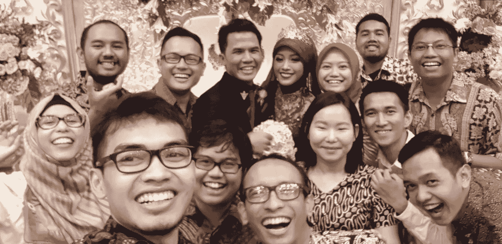
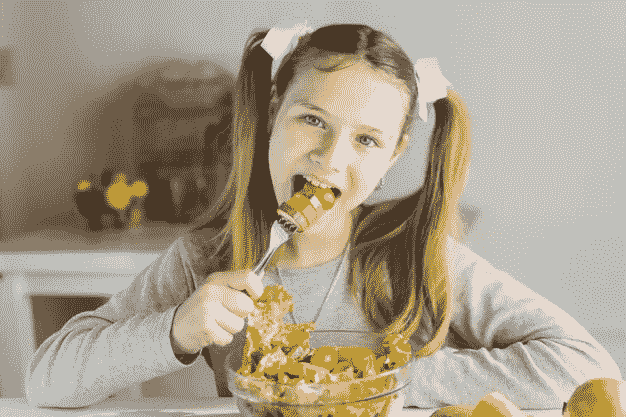

# 使用 Tensorflow 的图像字幕

> 原文：<https://medium.com/analytics-vidhya/image-captioning-with-tensorflow-2d72a1d9ffea?source=collection_archive---------7----------------------->

## 一张图片胜过千言万语，它说…


照片由[丹金](https://unsplash.com/@danielcgold?utm_source=medium&utm_medium=referral)在 [Unsplash](https://unsplash.com?utm_source=medium&utm_medium=referral) 上拍摄

当你感到怀旧时，你可能想在你的图库或 Instagram feed 中滚动你收集的图片，因为它捕捉了你在那些美好的日子里在做什么。或者，如果你需要解释某事，你可能需要图表或图像来更好地解释。所以，是的，图片可以帮助我们更好地交流。

通常，我们可以很容易地解释一幅图片，但在某些情况下，图片需要由机器来解释，例如当向有困难的人提供描述时。这一次，我和我的朋友合作了一个项目，教机器如何在给定一张图片时创建说明。

# 数据概述和预处理

## 数据集概述

本项目使用的数据集取自 Kaggle 的 Flickr8K。该数据集包含 8000 幅图像，每幅图像提供 5 个标题。

数据集链接:【https://www.kaggle.com/shadabhussain/flickr8k 


## 图像特征提取

在图像处理方面，我们应用 ResNet50 提取图像特征。我们还省略了最后一层(softmax 层)，因为我们只需要提取特征，而不需要对图像进行分类。此外，我们还使用 ImageNet 中的权重进行迁移学习。ImageNet 已经训练了超过 1400 万张图像，并且已经被分组到特定的类别和子类别中。我们希望它可以帮助模型识别对象，以便更好地添加字幕。

```
import tensorflow as tf
from keras.preprocessing import image
from tensorflow.keras.applications.resnet50 import ResNet50
from tensorflow.keras.applications.resnet50 import preprocess_input
import os*# Get all filenames of the images* folder = "../input/flickr8k/Flickr_Data/Flickr_Data/Images/"
images = os.listdir(folder)*#* *Load the CNN Architecture with Imagenet as weights* image_model = ResNet50(weights='imagenet')
model_new = tf.keras.Model(image_model.input,image_model.layers[-2].output)*# Store image features in dictionary* img_features = dict()  
for img **in** images: 
    img1 = image.load_img(folder + img, target_size=(224, 224))
    x = image.img_to_array(img1)
    x = np.expand_dims(x, axis=0)
    x = preprocess_input(x)

    fea_x = model_new.predict(x)
    fea_x1 = np.reshape(fea_x , fea_x.shape[1])
    img_features[img] = fea_x1
```

执行代码后，输出将是每个图像的 1x2048 矢量，包含图像的特征。

在进行这项工作时，我和我的朋友也尝试了简单或基本的 CNN 来从这些图像中提取特征。我们想知道在使用基本 CNN 模型时会有多好。该模型还生成 1x2048 矢量。这是我们创建的模型。

```
model = tf.keras.models.Sequential([
 tf.keras.layers.Conv2D(64, (3, 3), activation=’relu’, 
          input_shape=  (224, 224, 3)),
 tf.keras.layers.MaxPooling2D(2, 2),
 tf.keras.layers.Conv2D(64, (3, 3), activation=’relu’),
 tf.keras.layers.MaxPooling2D(2, 2),
 tf.keras.layers.Flatten(),
 tf.keras.layers.Dense(128, activation=tf.nn.relu),
 tf.keras.layers.Dense(2048, activation=tf.nn.softmax)
])
```

稍后，我们将比较 ResNet50 和这个基本 CNN 模型的结果…

## 字幕预处理

我们要做的第一件事是收集 Flickr8k 中的所有字幕。Token.txt，并通过一个键(即文件名)将它们分组。之后，我们根据 Flickr_8k.trainImages.txt、Flickr _ 8k . devi images . txt 和 Flickr_8k.testImages.txt 为训练、验证和测试集拆分标题。这三个文件只包含各自数据集的文件名。在根据这些文件分割标题时，我们还在每个标题的开头添加了“Startseq ”,在句子的结尾添加了“Endseq”。这是为了在训练阶段告知模型何时应该开始书写或停止预测下一个单词。

```
*# Get All Captions*
fn = "../input/flickr8k/Flickr_Data/Flickr_Data/Flickr_TextData/Flickr8k.token.txt"
f = open(fn, 'r')
capts = f.read()
*#Group all captions by filename, for references*
captions = dict()
i = 0

try:
    for line **in** capts.split("**\n**"):
        txt = line.split('**\t**')
        fn = txt[0].split('#')[0]
        if fn **not** **in** captions.keys():
            captions[fn] = [txt[1]]
        else:
            captions[fn].append(txt[1])
        i += 1
except:
    passModel def getCaptions(path):

    f = open(path, 'r')
    capts = f.read()
    desc = dict()

    try:
        for line **in** capts.split("**\n**"):
            image_id = line
            image_descs = captions[image_id]

            for des **in** image_descs:
                ws = des.split(" ")
                w = [word for word **in** ws if word.isalpha()]
                des = "startseq " + " ".join(w) + " endseq"
                if image_id **not** **in** desc:
                    desc[image_id] = list()
                desc[image_id].append(des)
    except:
        pass

    return desc*# Split captions*
train_caps = getCaptions("../input/flickr8k/Flickr_Data/Flickr_Data/Flickr_TextData/Flickr_8k.trainImages.txt")
val_caps = getCaptions("../input/flickr8k/Flickr_Data/Flickr_Data/Flickr_TextData/Flickr_8k.devImages.txt")
```

之后，我们必须对来自训练集的标题进行标记，并从中获得单词索引和索引单词字典。单词索引字典的目的是将标题表示为输入到模型中的数字，而索引单词是将下一个单词/预测转换为单词形式，正如我们所知。

```
from keras.preprocessing.text import Tokenizer*# Preparing to make word-index and index-word*
train_captions = []
for key, desc_list **in** train_caps.items():
    for i **in** range(len(desc_list)):
        train_captions.append(desc_list[i])

*# Tokenize top 5000 words in Train Captions*
tokenizer = Tokenizer(num_words=5000,
                      oov_token="<unk>",
                      filters='!"#$%&()*+.,-/:;=?@[\]^_`{|}~ ')
tokenizer.fit_on_texts(train_captions)
word_index = tokenizer.word_index
index_word = tokenizer.index_word
```

此外，不要忘记将提取的图像特征分割成训练集、开发集和测试集。

```
train_fns = list(train_caps.keys())
train_set = dict((k, img_fea[k]) for k **in** train_fns)
val_fns = list(val_caps.keys())
val_set = dict((k, img_fea[k]) for k **in** val_fns)fn_test = "../input/flickr8k/Flickr_Data/Flickr_Data/Flickr_TextData/Flickr_8k.testImages.txt"
f = open(fn_test, 'r')
t = f.read()

test_fns= t.split("**\n**")
test_set = dict((k, img_fea[k]) for k **in** list(test_fns[:-1]))
```

# 训练数据

## 模型的数据表示

复杂的部分来了。首先，既然有两种类型的数据(图像和标题)，我们如何向模型提供这些数据呢？

回想图像特征提取，现在图像都变成了长度为 2048 的向量。字幕也被符号化了。提取的图像特征将被附加到已经切片的字幕上。也许，用例子来解释更好…比如，我们有这张图片和标题:


这张图片的说明:五个人在跑步

标题必须附加“startseq”和“endseq ”,并进行标记化。假设这是已经生成的词到索引词典。

*   起始序列:1
*   结束序列:2
*   五点十分
*   人:3
*   分别是:5
*   跑步:90

输入机器的数据应该是这样的:

```
X1 : [1X2048 Image feature],[1, 0, 0, … , 0] (1 is for 'startseq')
y1 : 10 (10 is for 'five')X2 : [1X2048 Image feature],[1, 10, 0, … , 0] (append last output/next word in the caption to the input)
y2 : 3 (3 is for 'people')X3 : [1X2048 Image feature],[1, 10, 3, 0, … , 0] (again, append last output/next word in the caption to the input)
y3 : 5(5 is for 'are')X4 : [1X2048 Image feature],[1, 10, 3, 5, 0, … , 0] (again, append last output/next word in the caption to the input)
y4 : 90(90 is for 'running')X3 : [1X2048 Image feature],[1, 10, 3, 5, 90, 0, … , 0] (again, append last output/next word in the caption to the input)
y3 : 2(2 is for 'endseq')
```

简而言之，将有两个向量输入。一个是提取的图像特征，另一个是用数字表示的切片字幕。输出，即标题中的下一个单词，也用数字表示。

字幕可以有不同的长度，即使是相同的图像。为了处理这个问题，分片的字幕必须用零填充，达到训练集中最长字幕的长度。

## 单词嵌入

对于这个项目，我们使用了手套字嵌入字幕。字典中的每个单词都将从预训练的手套模型映射到一个向量中。我们用的手套尺寸是 200。

根据 GloVe 网站的报道，GloVe 是根据一个单词在另一个单词之后出现的频率来建模的。因此，我们希望预测的字幕可以得到改善。

```
*# Load Glove vectors*
embeddings_index = {} *# empty dictionary*
f = open("../input/glove-global-vectors-for-word-representation/glove.6B.200d.txt", encoding="utf-8")

for line **in** f:
    values = line.split()
    word = values[0]
    coefs = np.asarray(values[1:], dtype='float32')
    embeddings_index[word] = coefs
f.close()
print('Found **%s** word vectors.' % len(embeddings_index))*# Get 200-dim dense vector for each of the 10000 words in out vocabulary*
vocab_size = len(word_index) + 1
embedding_dim = 200
embedding_matrix = np.zeros((vocab_size, embedding_dim))

for word, i **in** word_index.items():
    *#if i < max_words:*
    embedding_vector = embeddings_index.get(word)
    if embedding_vector **is** **not** None:
        *# Words not found in the embedding index will be all zeros*
        embedding_matrix[i] = embedding_vector
```

首先，我们收集 GloVe 中的所有单词及其系数。然后，我们将以前字典中的所有单词映射到一个向量，并将它们收集到一个矩阵中(嵌入矩阵)

## 模型架构

```
max_length = 34
image_model = Sequential()

image_model.add(Dense(embedding_dim, input_shape=(2048,), activation='relu'))
image_model.add(RepeatVector(max_length))

language_model = Sequential()

language_model.add(Embedding(input_dim=vocab_size, output_dim=embedding_dim, input_length=max_length))
language_model.add(LSTM(256, return_sequences=True))
language_model.add(TimeDistributed(Dense(embedding_dim)))

conca = Concatenate()([image_model.output, language_model.output])
x = LSTM(128, return_sequences=True)(conca)
x = LSTM(512, return_sequences=False)(x)
x = Dense(vocab_size)(x)
out = Activation('softmax')(x)
model_1 = Model(inputs=[image_model.input, language_model.input], outputs = out)

model_1.layers[2].set_weights([embedding_matrix])
model_1.layers[2].trainable = False

model_1.compile(loss='categorical_crossentropy', optimizer = Adam(learning_rate = 0.0001), metrics=['accuracy'])
```

对于模型架构，开头有两个部分。第一个是处理图像特征(image_model)，它由密集层和重复向量组成。第二部分是处理标题的部分(language_model)。在语言模型的第一层，有一个嵌入层，其权重将由我们之前在嵌入矩阵中收集的手套系数来分配。我们还将该层设置为不可训练，因为它之前已经过预训练。

接下来，连接 image_model 和 language_model 来预测下一个单词(输出)。对于下一个单词预测部分，有 2 层 LSTM，接着是用于分类的密集和软最大层(因为这种情况无论如何是多类分类)。

# 结果

我们正在比较没有单词嵌入的基本 CNN 架构与高级 CNN 架构& GloVe 之间的结果。


建模的结果

除了基本的 CNN 和 ResNet50，我们还用 InceptionV3 提取图像。根据结果，使用更先进的 CNN 架构和单词嵌入，性能更好，在训练集和验证集中损失下降 1 个点。在训练集中，准确率提高了 8-14%，而在验证集中，准确率仅提高了 3%。

这里引入了一个称为“BLEU”的指标。什么是 BLEU 评分？

BLEU 代表双语评估替角，用一些参考资料来评估候选翻译。虽然最初用于翻译，但现在该分数通常用于其他 NLP 目的。对于完全匹配，分数为 1，对于完全不匹配，分数为 0。

对于上面的结果，使用 InceptionV3 时 BLEU 评分更好。简而言之，有了更先进的 CNN，BLEU 分数增加了 2-4%。

## 图像测试

所以，让我们在图像上测试！下面，图片是用 ResNet50 & GloVe 测试的。



来源:个人图片。预测说明:一群人正在摆好姿势拍照


来源:Youtube。预测描述:身穿蓝色制服的足球运动员拿着足球奔跑


来源:个人图片。预测说明:人们站在一座城市的城市景观前


资料来源:Unsplash。预测描述:狗正在草丛中奔跑



来源:Freepik。预测描述:穿红衬衫和蓝衬衫的男孩正在吃零食

# 改进的余地

在我们处理这个案例时，我们认为有一些想法可以提高性能:

## 向数据集添加品种

我们注意到数据集中出现的大多数对象不是人就是狗。一旦我们在猫身上做了测试，它就会在狗身上预测这个标题。我们很好奇，发现字幕里猫只出现了 61 次，而狗出现了 1000 次！

我们还注意到标题总是以人/动物开头，后面跟着动词。有一次，我们对一张从更高楼层拍摄的高楼照片进行了测试，预测从“人”开始，而照片上没有人。我们认为也许字幕应该更多样化。

这种情况下预测的动词实际上并不多种多样(也有可能我们没有在更多的图片上测试它)。出现最多的动词是:站、跑、坐、玩、爬。当我们提交一个睡在床上的人时，它说坐在床上。也许，应该首先评估单词在词典中的分布。

## 更好地预测颜色和性别

颜色经常被错误地分类。当实际图片是一件绿色衬衫时，预测说是另一种颜色。在其他情况下，男孩被预测为女孩，女人被预测为男孩，但这可能取决于照片中的姿势或位置。

对于本项目，我们参考以下链接:

[](https://towardsdatascience.com/image-captioning-with-keras-teaching-computers-to-describe-pictures-c88a46a311b8) [## 使用 Keras 的图像字幕——“教计算机描述图片”

### 目录:

towardsdatascience.com](https://towardsdatascience.com/image-captioning-with-keras-teaching-computers-to-describe-pictures-c88a46a311b8) [](https://machinelearningmastery.com/develop-a-deep-learning-caption-generation-model-in-python/) [## 如何从零开始开发深度学习照片字幕生成器-机器学习掌握

### 开发一个深度学习模型，用 Keras 一步一步地用 Python 自动描述照片。标题…

machinelearningmastery.com](https://machinelearningmastery.com/develop-a-deep-learning-caption-generation-model-in-python/) [](/@raman.shinde15/image-captioning-with-flickr8k-dataset-bleu-4bcba0b52926) [## 使用 Flickr8k 数据集和 BLEU 的图像字幕

### 目录:

medium.com](/@raman.shinde15/image-captioning-with-flickr8k-dataset-bleu-4bcba0b52926) [](https://www.kaggle.com/shadabhussain/flickr8k) [## Flickr8K

### Kaggle 是世界上最大的数据科学社区，拥有强大的工具和资源来帮助您实现您的数据…

www.kaggle.com](https://www.kaggle.com/shadabhussain/flickr8k) [](https://www.kaggle.com/rtatman/glove-global-vectors-for-word-representation) [## GloVe:单词表示的全局向量

### 来自维基百科 2014 + Gigaword 5 的预训练单词向量

www.kaggle.com](https://www.kaggle.com/rtatman/glove-global-vectors-for-word-representation)