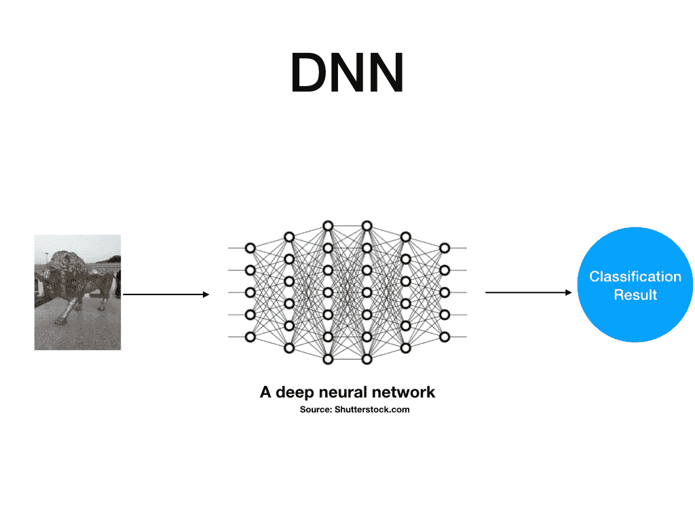
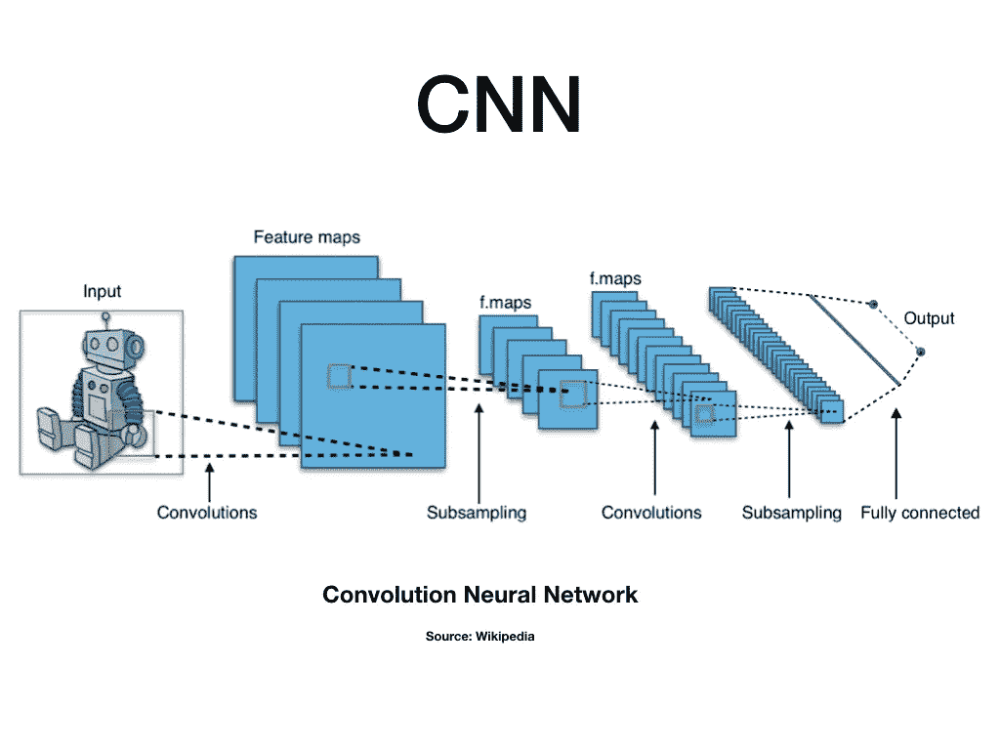
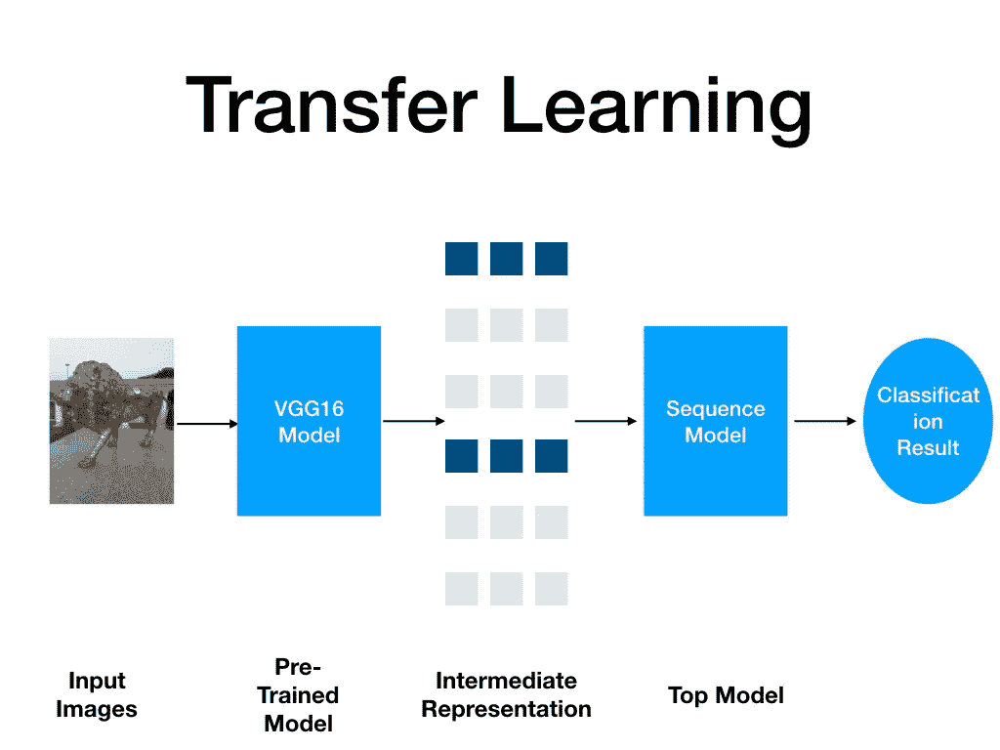

# 图像分类:DNN、CNN 和迁移学习方法的比较

> 原文：<https://medium.com/analytics-vidhya/image-classification-a-comparison-of-dnn-cnn-and-transfer-learning-approach-704535beca25?source=collection_archive---------2----------------------->

图像分类是深度学习模型非常成功地应用于实际应用的领域之一。这是一个活跃的研究领域。已经提出了许多方法，还有更多的方法正在涌现。最成功的深度学习模型，如 ImageNet、GoogleNet，其性能比人类更好，它们都是非常庞大和复杂的模型。

因此，作为初学者，您可能会发现很难在合理的时间内得到一个具有可接受性能的工作模型。在这篇文章中，我将尝试介绍一些基本的架构，我们可以设计来执行图像分类。在这个过程中，我将分享相关的代码样本和一些描述这些模型性能的指标。最终引入一个在合理时间内训练好并给出可接受性能的模型。

我的设置的主要组件包括:

1.  数据集:来自 Kaggle 的猫和狗的数据集。识别图像中的猫是深度学习的经典问题。所以，这个数据集提供了一个很好的起点。它有 8000 个训练图像，每只猫和狗有 4000 个图像，以及 2000 个测试图像，每只猫和狗有 1000 个图像。
2.  框架:Tensorflow 2.0.0 和 Keras，Keras 现在包含在 Tensorflow 2.0 中，所以可能不需要单独导入。[https://www.tensorflow.org/beta](https://www.tensorflow.org/beta)
3.  电脑配置:Ubuntu 18.04.3 LTS，内存:13 GB，处理器:英特尔酷睿 i5–6402 p CPU @ 2.80 GHz×4

进行这些实验的 PC 是一台配置一般的 PC，没有任何支持 DNN 模型执行的 GPU。目标是用这种配置实现合理的运行时间和性能。

# 模型 1:深度神经网络(DNN)

作为第一个模型，讨论了深度神经网络(DNN)模型。我们可以成功地训练一个简单的神经网络来执行回归和分类。但是，DNN 可能无法很好地处理图像。下图描述了使用 DNN 的实施概要。

基于深度神经网络模型的图像分类

为该实验设计的模型具有以下定义:

> model = Sequential()
> 
> model . add(Flatten(input _ shape = input _ shape))
> model . add(Dense(128))
> model . add(Activation(' relu '))
> model . add(Dropout(0.5))
> model . add(Dense(64))
> model . add(Activation(' relu '))
> model . add(Dropout(0.5))
> model . add(Dense(1))
> model . add(Activation(')。

为了减少训练时间，我将输入图像的大小调整为 64x64，因此，输入形状为 64x64x3。第一层将此输入展平为 1D 张量，然后馈送给密集层。

## 结果

训练时间:6.3 小时，损耗:7.7450 —准确度:0.4996—val _ loss:7.7479—val _ 准确度:0.5038

模型的准确性很差，我们可以通过以下方式提高 DNN 的性能

1.  添加更多层
2.  尝试不同的优化函数/正则化函数等。
3.  不断增加的时代数量
4.  不断增长的数据量

但是，我们不会在这里深入探讨。相反，我们将采用另一种模型:卷积神经网络。

# 模型 2:卷积神经网络

卷积层已经被证明在涉及图像的任务中非常成功，例如图像分类、对象识别、人脸识别等。它们允许参数共享，与使用密集层相比，这产生了非常优化的网络。以下是理解卷积神经网络的一个很好的来源:[http://cs231n.github.io/convolutional-networks/](http://cs231n.github.io/convolutional-networks/)

基于 CNN 的图像分类

为该实验设计的 CNN 模型具有以下定义:

> model = Sequential()
> 
> model . add(Conv2D(32，(3，3)，input _ shape = input _ shape))
> model . add(Activation(' relu ')
> model . add(MaxPooling2D(pool _ size =(2，2)))
> 
> model . add(Conv2D(32，(3，3)))
> model . add(Activation(' relu ')
> model . add(maxpooling 2d(pool _ size =(2，2))。

## 结果:

训练时间:5.4 小时，损耗:0.0546，val_loss: 3.2969

结果表明，CNN 在处理图像时表现得更好。我们已经减少了近 1 小时的训练时间。训练损失非常优化，但验证损失仍然有点高，这表明过度拟合。我们可以进一步调整我们的模型，以减少过度拟合，或者我们可以使用 DNN 部分建议的任何方法来提高我们的模型性能。但是，同样这不是我们在这里要做的，相反，我们将直接转到我们将在这里使用的最后一种方法。

# 模式 3:迁移学习

迁移学习是一种重用已有知识的方法。这个想法是使用一个已经在一个更大的数据集上训练了很长时间并被证明在相关任务中工作良好的最先进的模型。许多这样的模型可供我们使用。

Keras 提供了一些经过预先训练的先进模型。这些模型的细节可以在 https://keras.io/applications/找到

我们可以通过两种方式使用这些模型:

1.  直接应用:在这种方法中，

a.我们研究这个模型来检验它是否能解决我们的目标问题。

b.如果是，我们需要根据模型预处理我们的输入，然后将它提供给模型以获得结果。

2.表征学习:在这种方法中，我们认为预先训练的模型可能不直接适用于我们的问题。但是，我们可以用它来获得输入数据的有用表示。

a.我们将输入数据输入到预先训练的模型中，以获得数据的表示。

b.我们设计自己的模型，并用预先训练好的模型给出的表示来输入它，以获得结果。

对于这里的图像分类任务，应用上述第二种方法。

以下是相同的典型步骤:

1.  所用型号:vgg16 型号，[https://keras.io/applications/#vgg16](https://keras.io/applications/#vgg16)
2.  使用 vgg16 我们得到了有用的表示。
3.  我们从 vgg16 得到的表示被输入到一个序列模型中。

图像分类的迁移学习[第二种方法]

模型定义如下:

> VGG16 型号:
> 
> 型号=应用。VGG16(include_top = False，weights = 'imagenet ')
> 
> 顶级模特:
> 
> model = Sequential()
> model . add(Flatten(input _ shape = train _ data . shape[1:])
> model . add(Dense(256，activation = ' relu ')
> model . add(Dropout(0.5))
> model . add(Dense(1，activation = ' sigmoid ')
> 
> model . compile(optimizer = ' rms prop '，
> loss = 'binary_crossentropy '，
> metrics = ['accuracy'])

## 结果:

培训时间:12 分钟[10 分钟获得陈述]+2 分钟培训顶级模特。

损失:0.1985-精度:0.9219-val _ loss:0.6466-val _ accuracy:0.8045

因此，使用迁移学习，我们可以在仅 12 分钟内训练一个具有 92%训练准确度的模型，这与之前讨论的模型相比要好得多。

我们可以进一步提高这种训练模型的准确性，方法是使用

1.  更多数据/增强
2.  更多时代/训练步骤
3.  添加更多层
4.  更加正规化。

您可以在以下存储库中找到该作品的完整代码:

[https://github.com/lalitkpal/ImageClassification.git](https://github.com/lalitkpal/ImageClassification.git)