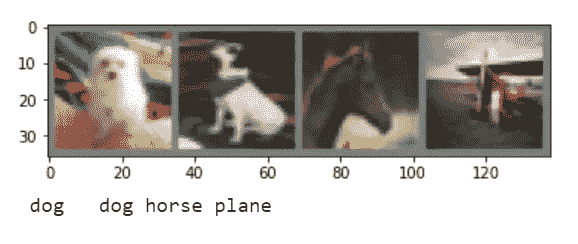
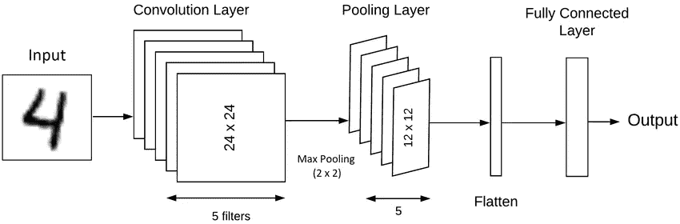
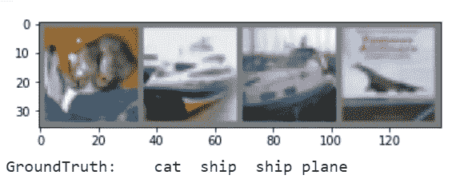

# Pytorch 中的图像分类

> 原文：<https://medium.com/analytics-vidhya/image-classification-in-pytorch-fbaa4f36bf47?source=collection_archive---------7----------------------->

在当今世界，随着海量数据和计算能力的可用性，机器学习获得了比以前更大的动力。数据有多种形式，其中最重要的数据形式之一是图像。

分类是一种 ML 问题，其中我们有一组数据点，我们将每个点分类或标记到各自的类别中。这样，特定的数据点可以与相邻的点区分开。同样，在图像分类的情况下，我们也将特定的图像分类到其所属的相应类别中。

在这篇博客中，我们将尝试看看 Pytorch 中图像分类器的实现。

# Pytorch 是什么？

PyTorch 是一个基于 Torch 库的开源机器学习库，用于计算机视觉和自然语言处理等应用，主要由脸书的人工智能研究实验室开发。

# 什么是 CIFAR10 数据集？

它是用于物体识别的已建立的计算机视觉数据集。它是[8000 万微小图像数据集](http://groups.csail.mit.edu/vision/TinyImages/)的子集，由 60，000 张 32x32 彩色图像组成，包含 10 个对象类中的一个，每个类 6000 张图像。它由亚历克斯·克里热夫斯基、维诺德·奈尔和杰弗里·辛顿收藏。

# 代码的结构:

*   加载数据集
*   图像预处理
*   构建 Pytorch 模型
*   训练模型
*   预测和结果

# 1.加载数据集

CIFAR-10 数据集已经与 Pytorch 中已经提供的数据集一起提供。要使用数据集，我们需要使用 Pytorch 导入和加载数据集，如下所示:

```
#Get the CIFAR10 Datasettransform = transforms.Compose( [transforms.ToTensor(),transforms.Normalize((0.5, 0.5, 0.5), (0.5, 0.5, 0.5))])trainset = torchvision.datasets.CIFAR10(root=’./data’, train=True,download=True, transform=transform)trainloader = torch.utils.data.DataLoader(trainset, batch_size=4,shuffle=True, num_workers=2)
testset = torchvision.datasets.CIFAR10(root=’./data’, train=False,download=True, transform=transform)testloader = torch.utils.data.DataLoader(testset, batch_size=4,shuffle=False, num_workers=2)classes = (‘plane’, ‘car’, ‘bird’, ‘cat’,‘deer’, ‘dog’, ‘frog’, ‘horse’, ‘ship’, ‘truck’)
```

# 2.图像预处理

```
import matplotlib.pyplot as plt
import numpy as np# functions to show an image
def imshow(img):
    img = img / 2 + 0.5 # unnormalize
    npimg = img.numpy()
    plt.imshow(np.transpose(npimg, (1, 2, 0)))
    plt.show()# get some random training images
dataiter = iter(trainloader)
images, labels = dataiter.next()# show images
imshow(torchvision.utils.make_grid(images))# print labels
print(‘ ‘.join(‘%5s’ % classes[labels[j]] for j in range(4)))
```



数据集的图像

# 3.构建 Pytorch 模型

使用 Pytorch，我们将尝试建立一个模型，可以对这 10 类图像进行分类(即飞机、汽车、鸟、猫、鹿、狗、青蛙、马、船、卡车)。图像分类模型分为两部分:特征学习和分类器。

**特征学习:**

模型的这一部分处理学习图像的不同特征和特性，以将图像与其他图像区分开来。为了学习这些特性，我们将利用 CNN(卷积神经网络)。Pytorch 附带卷积 2D 图层，可通过“torch.nn.conv2d”使用。

通过卷积层和池层的组合来完成特征学习。一幅图像可以被看作是一个像素矩阵，每个像素都有一个数值来存储该像素内的颜色信息。卷积层利用了一个核心，该核心突出了特定图像中的突出特征/像素。通过只保留那些包含重要信息的像素并拒绝其余的像素，池被用于对该图像进行下采样(即降低尺寸)。池有两种方式:全局平均池和最大池。在这个用例中，我们将利用最大池。



卷积层和池层的表示

```
self.conv1 = nn.Conv2d(3, 6, 5)
```

2D 卷积层可以用下面的方式来声明。第一个参数表示输入通道的数量，在本例中为 3 (R、G 和 B)。第二个参数表示输出通道的数量，第三个参数表示内核大小，在本例中为 5x5。

```
self.pool = nn.MaxPool2d(2, 2)
```

池层定义如下。第一个参数定义了用于选择重要特性的内核大小。

**分类头:**

学习到的特征或来自卷积层的输出被传递到展平层，使其成为 1D。这然后被馈送到由激活功能 ReLU(整流线性单元)激活的线性层。最后一层包含 10 个节点，因为在这个例子中类的数量是 10。

```
self.fc1 = nn.Linear(16 * 5 * 5, 120)
```

线性层定义如下，第一个参数表示输入通道的数量，该数量应该等于前一卷积层的输出数量。第二个参数是输出通道的数量。

这些是用于构建模型的重要层。让我们看一下构建模型的完整代码:

```
import torch.nn as nn
import torch.nn.functional as Fclass Net(nn.Module):def __init__(self):
    super(Net, self).__init__()
    self.conv1 = nn.Conv2d(3, 6, 5)
    self.pool = nn.MaxPool2d(2, 2)
    self.conv2 = nn.Conv2d(6, 16, 5)
    self.fc1 = nn.Linear(16 * 5 * 5, 120)
    self.fc2 = nn.Linear(120, 84)
    self.fc3 = nn.Linear(84, 10)
```

使用类网来建立模型。__init__ 方法用于定义层。创建层定义后，下一步是定义在网络中执行正向传递时，数据如何流经这些层:

```
def forward(self, x):
    x = self.pool(F.relu(self.conv1(x)))
    x = self.pool(F.relu(self.conv2(x)))
    x = x.view(-1, 16 * 5 * 5)
    x = F.relu(self.fc1(x))
    x = F.relu(self.fc2(x))
    x = self.fc3(x)
    return x
```

模型的第一层或输入层是 conv1，输出层是 fc3。此函数定义了数据在网络中的流动方式—来自输入层 conv1 的数据由 ReLU 激活函数(F.relu())激活，然后被传递到定义为 pool 的池层。第一层的输出存储在变量 x 中，然后被发送到下一层。在将其发送到分类器之前，最后一个回旋层的输出对于线性层是平坦的。由 ReLU 激活功能激活的前两个线性层(fc1 和 fc2)然后将输出发送到最后一个层 fc3。

# **4。训练模型**

模型的架构现在已经可以使用了，在开始训练过程之前，我们将创建一个 Net()类的实例，并设置优化器和损失函数。在这个特殊的问题中，我们将使用学习率为 0.001 的 SGD 优化器。学习率定义了模型的好坏或模型拟合的速度。因此，为了防止模型过度拟合，我们将尽量保持较低的值。使用的损失函数是交叉熵，因为这是一个多标签分类问题。

```
#Define Loss Function and optimizer
import torch.optim as optim
net = Net()
criterion = nn.CrossEntropyLoss()
optimizer = optim.SGD(net.parameters(), lr=0.001, momentum=0.9)
```

下面是训练前编译模型的代码。

然后，使用此函数将模型训练到所需的历元数。

```
def train_the_classifier(net,trainloader,optimizer, criterion, epochs):
     #Training the Classifier
     for epoch in range(epochs): # loop over the dataset multiple times
          running_loss = 0.0
          for i, data in enumerate(trainloader, 0): # get the inputs; data is a list of [inputs, labels]
              inputs, labels = data

              # zero the parameter gradients
              optimizer.zero_grad() # forward + backward + optimize
              outputs = net(inputs) loss = criterion(outputs, labels)
              loss.backward()
              optimizer.step() # print statistics
              running_loss += loss.item() 
              if i % 2000 == 1999: # print every 2000 mini-batches
                       print(‘[%d, %5d] loss: %.3f’ %
                        (epoch + 1, i + 1, running_loss / 2000))
                       running_loss = 0.0 print(‘Finished Training’)
```

通过传递模型、损失函数、优化器和时期数来调用该函数。

```
#train the classifier
train_the_classifier(net,trainloader,optimizer, criterion, 5)
```

培训日志如下:

```
[1, 2000] loss: 2.217 
[1, 4000] loss: 1.835 
[1, 6000] loss: 1.697 
[1, 8000] loss: 1.638 
[1, 10000] loss: 1.565 
[1, 12000] loss: 1.545 [2, 2000] loss: 1.467 
[2, 4000] loss: 1.389 
[2, 6000] loss: 1.395 
[2, 8000] loss: 1.346 
[2, 10000] loss: 1.325 
[2, 12000] loss: 1.297 [3, 2000] loss: 1.239 
[3, 4000] loss: 1.224 
[3, 6000] loss: 1.238 
[3, 8000] loss: 1.227 
[3, 10000] loss: 1.201 
[3, 12000] loss: 1.193 [4, 4000] loss: 1.133 
[4, 6000] loss: 1.125 
[4, 8000] loss: 1.135 
[4, 10000] loss: 1.112 
[4, 12000] loss: 1.123 [5, 2000] loss: 1.025 
[5, 4000] loss: 1.063 
[5, 6000] loss: 1.058 
[5, 8000] loss: 1.049 
[5, 10000] loss: 1.052 
[5, 12000] loss: 1.066 
Finished Training
```

最终得到的损耗是 1.066。让我们看看模型在测试数据集上的表现。该模型现在已保存，以供测试。

```
#Save the Model
PATH = ‘./cifar_net.pth’
torch.save(net.state_dict(), PATH)
```

# 5.测试和结果

在测试模型之前，我们将重新加载模型和权重。这样做是为了避免训练好的模型在运行时断开连接的情况下丢失。这是通过以下代码行完成的:

```
#load the model
net = Net()
net.load_state_dict(torch.load(PATH))
```

> 这一步的输出将是:

首先，让我们在第一批图像上测试图像。我们首先打印前 4 张图片和标签。

```
#Test the Network
dataiter = iter(testloader)
images, labels = dataiter.next()# print images
imshow(torchvision.utils.make_grid(images))
print(‘GroundTruth: ‘, ‘ ‘.join(‘%5s’ % classes[labels[j]] for j in range(BATCH_SIZE)))
```



带有原始标签的第一批图像

这些图像现在被输入到模型中，以获得预测的输出。

```
outputs = net(images)_, predicted = torch.max(outputs, 1)
print(‘Predicted: ‘, ‘ ‘.join(‘%5s’ % classes[predicted[j]]
         for j in range(BATCH_SIZE)))
```

> 预测的标签有:
> 
> 预言:猫船汽车飞机

我们可以看到，该模型成功预测了 3 幅图像，但未能正确预测第 3 幅图像。继续讨论这个结果，让我们预测 10000 个图像测试集，并计算总体准确性。

```
correct = 0
total = 0with torch.no_grad():
    for data in testloader:
            images, labels = data
            outputs = net(images)
            _, predicted = torch.max(outputs.data, 1)
            total += labels.size(0)
            correct += (predicted == labels).sum().item()
            print(‘Accuracy of the network on the 10000 test images: %d %%’ % (100 * correct / total))
```

> 总体精度为:
> 
> 网络对 10000 张测试图像的准确率:60 %

在多类分类的情况下，总体精度并不总是正确的度量。因此，我们计算每个类的准确度。这是通过计算被正确预测的图像的百分比来完成的。

```
class_correct = list(0\. for i in range(10))
class_total = list(0\. for i in range(10))with torch.no_grad():
     for data in testloader:
         images, labels = data
         outputs = net(images)
         _, predicted = torch.max(outputs, 1)
         c = (predicted == labels).squeeze() for i in range(4):
              label = labels[i]
              class_correct[label] += c[i].item()
              class_total[label] += 1for i in range(10):
     print(‘Accuracy of %5s : %2d %%’ % (
            classes[i], 100 * class_correct[i] / class_total[i]))
```

> 每类的精度为:
> 
> 飞机精度:67 %
> 汽车精度:71 %
> 鸟精度:55 %
> 猫精度:48 %
> 鹿精度:51 %
> 狗精度:47 %
> 青蛙精度:57 %
> 马精度:60 %
> 船精度:74 %
> 卡车精度:69 %

基线模型的结果相当可观。这可以使用各种技术进一步改进。

# 提高准确性

基线模型的准确率为 60%，我们将努力提高整体准确率和每个类别的准确率。为此，我们进行了三项更改:

*   添加批量标准化图层
*   将优化器更改为 Adam
*   为更多的时代训练它

型号:

```
import torch.nn as nn
import torch.nn.functional as Fclass ConvNet(nn.Module):
       def __init__(self):
            super(ConvNet, self).__init__()
            self.conv1 = nn.Conv2d(3, 16, 5)
            self.pool = nn.MaxPool2d(2, 2)
            self.bn1 = nn.BatchNorm2d(16)
            self.conv2 = nn.Conv2d(16, 32, 5)
            self.bn2 = nn.BatchNorm2d(32)

            self.fc1 = nn.Linear(32 * 5 * 5, 120)
            self.fc2 = nn.Linear(120, 84)
            self.fc3 = nn.Linear(84, 10) def forward(self, x):
            x = self.pool(F.relu(self.conv1(x)))
            x = self.bn1(x)
            x = self.pool(F.relu(self.conv2(x)))
            x = self.bn2(x)
            x = torch.flatten(x, 1)
            x = F.relu(self.fc1(x))
            x = F.relu(self.fc2(x))
            x = self.fc3(x) return x#Define Loss Function and optimizerimport torch.optim as optim
net = ConvNet()
criterion = nn.CrossEntropyLoss()
optimizer = optim.Adam(net.parameters(), lr=0.001)
```

如前所述训练模型，但这次直到 10 个时期，最后五个时期的训练日志如下所示。

培训日志:

```
[1, 2000] loss: 1.860 
[1, 4000] loss: 1.537 
[1, 6000] loss: 1.407 ....
[5, 2000] loss: 0.753 
[5, 4000] loss: 0.771 
[5, 6000] loss: 0.792 
[5, 8000] loss: 0.773 
[5, 10000] loss: 0.795 
[5, 12000] loss: 0.801 
[6, 2000] loss: 0.706 
[6, 4000] loss: 0.693 
[6, 6000] loss: 0.715 
[6, 8000] loss: 0.730 
[6, 10000] loss: 0.720 
[6, 12000] loss: 0.756 
[7, 2000] loss: 0.626 
[7, 4000] loss: 0.651 
[7, 6000] loss: 0.682 
[7, 8000] loss: 0.680 
[7, 10000] loss: 0.687 
[7, 12000] loss: 0.678 
[8, 2000] loss: 0.573 
[8, 4000] loss: 0.612 
[8, 6000] loss: 0.626 
[8, 8000] loss: 0.637 
[8, 10000] loss: 0.636 
[8, 12000] loss: 0.634 
[9, 2000] loss: 0.551 
[9, 4000] loss: 0.542 
[9, 6000] loss: 0.575 
[9, 8000] loss: 0.572 
[9, 10000] loss: 0.593 
[9, 12000] loss: 0.623 
[10, 2000] loss: 0.516 
[10, 4000] loss: 0.521 
[10, 6000] loss: 0.555 
[10, 8000] loss: 0.537 
[10, 10000] loss: 0.592 
[10, 12000] loss: 0.586 
Finished Training
```

10 个时期结束时的训练损失急剧减少到 0.586。

> 整体精度:
> 
> 网络对 10000 张测试图像的准确率:67 %

我们可以看到，整体精度也有所提高。因为整体的准确性不是合适的衡量标准，我们将看看每个职业的准确性。

> 每类精度:
> 
> 飞机精度:77 %
> 汽车精度:79 %
> 鸟精度:52 %
> 猫精度:50 %
> 鹿精度:64 %
> 狗精度:54 %
> 青蛙精度:71 %
> 马精度:74 %
> 船精度:73 %
> 卡车精度:76 %

我们可以看到，每类的准确率也有所提高。然而，通过添加更多层、构建更深层次的模型以及添加数据扩充，可以实现更高的准确性。这篇文章是关于如何在 Pytorch 中处理图像分类问题的指南。

完整的代码和数据集可以在这个 [Colab 笔记本](https://colab.research.google.com/drive/1TlxCy_A6ITFnHm3tIzqKwRlFYxXRpNqc?usp=sharing)中找到。请随意调整参数，并尝试提高精确度。

谢谢大家！

# 参考资料:

[1][https://py torch . org/tutorials/初学者/blitz/cifar 10 _ tutorial . html](https://pytorch.org/tutorials/beginner/blitz/cifar10_tutorial.html)

[2][https://analyticsindiamag . com/how-to-implementation-CNN-model-using-py torch-with-TPU/](https://analyticsindiamag.com/how-to-implement-cnn-model-using-pytorch-with-tpu/)