# 图像分类模型

> 原文：<https://medium.com/analytics-vidhya/image-classification-model-dc70dfbe869d?source=collection_archive---------20----------------------->

## 使用迁移学习— ResNet34

在这篇博客中，我们将使用迁移学习技术为英特尔图像分类建立一个 CNN 模型。这篇博客将是对这个问题的一次演练。我们将链接关于迁移学习和卷积神经网络的相关文章。

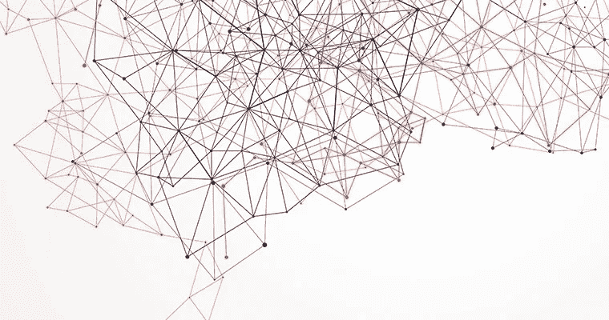

[来源](https://m.post.naver.com/viewer/postView.nhn?volumeNo=8328662&memberNo=36733075&searchKeyword=%EC%95%8C%EA%B8%B0%20%EC%89%AC%EC%9A%B4&searchRank=14)

该数据集包含大约 25k 幅大小为 150x150 的图像，分布在 6 个类别下。

{ '建筑群'--> 0，
'森林'- > 1，
'冰川'- > 2，
'山'- > 3，
'海'- > 4，
'街'- > 5 }

在训练中有大约 14k 的图像，在测试中有 3k，在预测中有 7k。
该数据集最初由英特尔在[https://datahack.analyticsvidhya.com](https://datahack.analyticsvidhya.com)发布，以举办一场图像分类挑战赛。我们开始吧。

## 导入所需的模块

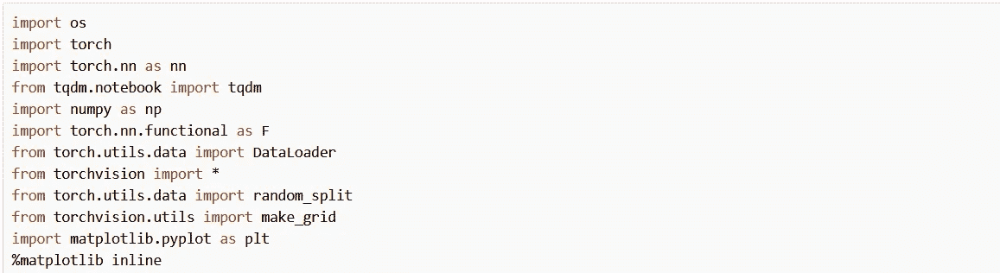

由作者生成

## 准备数据

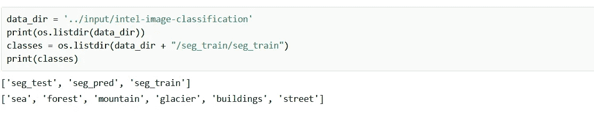

由作者生成

## 数据集预处理

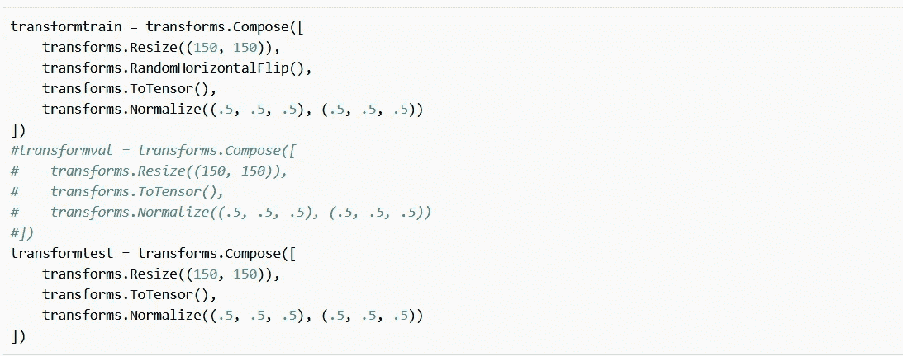

由作者生成

让我们来看一个来自训练数据集中的样本元素。每个元素是一个元组，包含一个图像张量和一个标签。由于数据由 3 个通道(RGB)的 150x150 px 彩色图像组成，因此每个图像张量的形状为(3，150，150)。

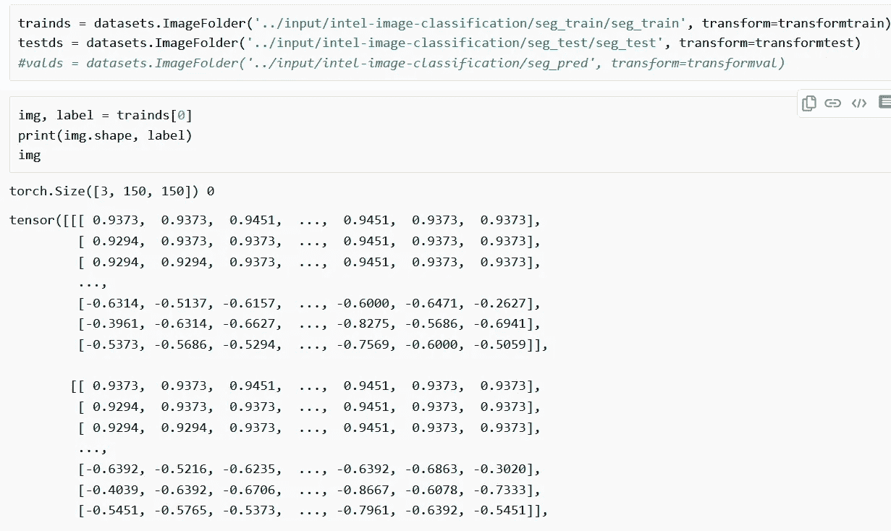

由作者生成

我们可以使用 matplotlib 查看图像，但我们需要将张量维数更改为(150，150，3)。让我们创建一个助手函数来显示图像及其标签。

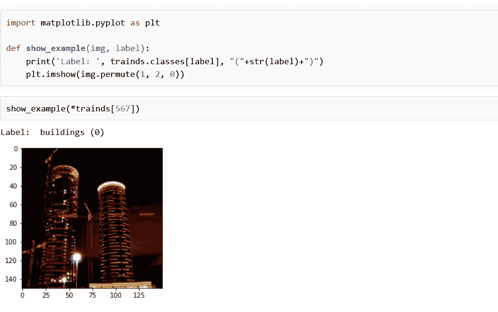

由作者生成

我们现在可以使用训练集创建一个验证数据集(2000 个图像)。我们将使用 PyTorch 中的 random_split 辅助方法来完成这项工作。为了确保我们总是创建相同的验证集，我们还将为随机数生成器设置一个种子。

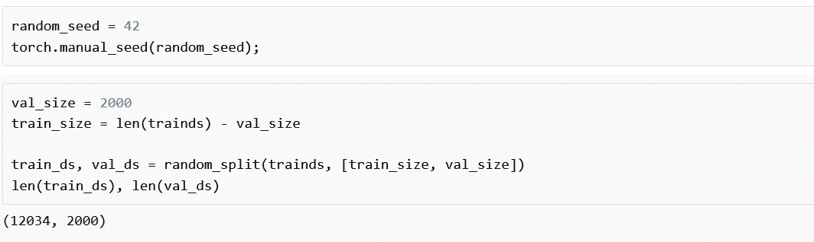

由作者生成

我们现在可以创建用于训练和验证的数据加载器，以批量加载数据。

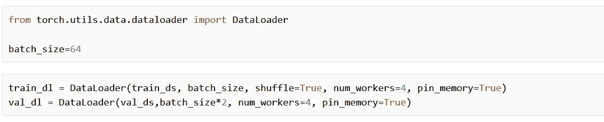

由作者生成

我们可以使用 torchvision 的 make_grid 方法查看数据集中的成批图像。每次运行下面的代码，我们都会得到一个不同的批处理，因为采样器在创建批处理之前会打乱索引。

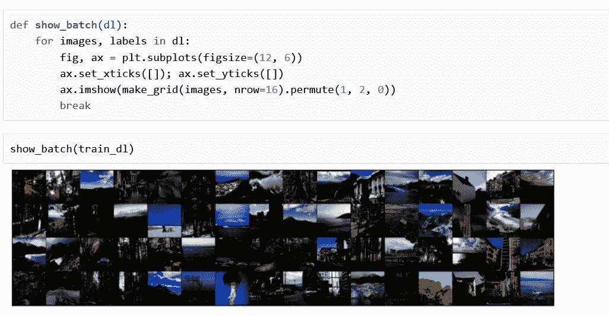

由作者生成

让我们通过扩展 ImageClassificationBase 类来定义模型，该类包含用于训练和验证的帮助器方法。

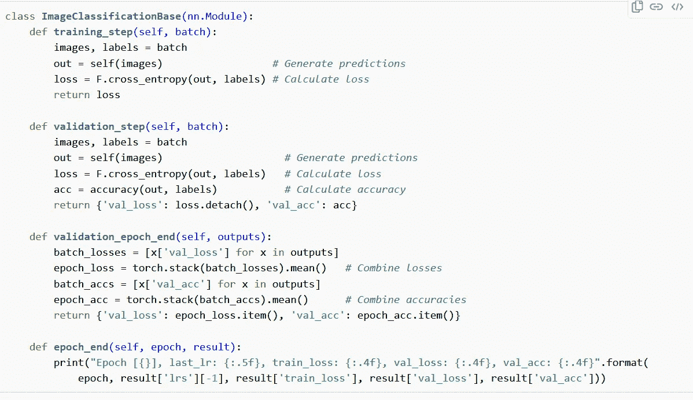

由作者生成

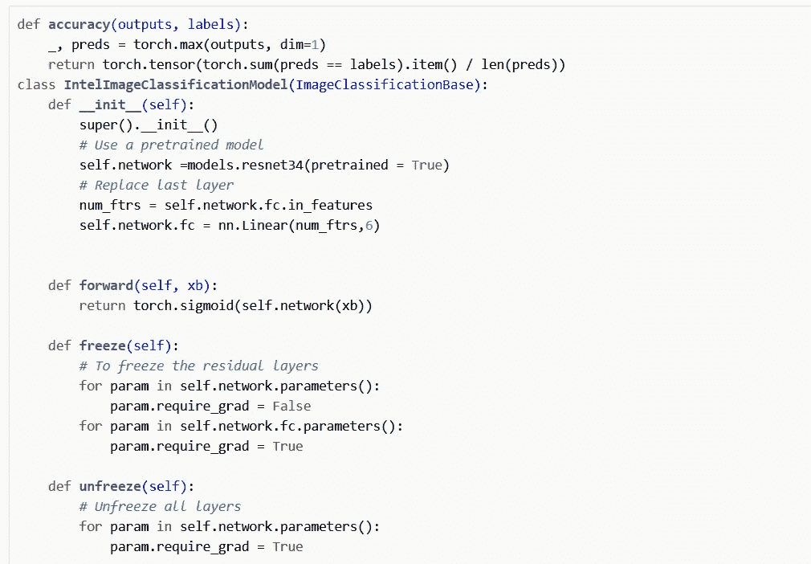

由作者生成

## 使用 GPU

随着我们的模型和数据集的大小增加，我们需要使用 GPU 在合理的时间内训练我们的模型。GPU 包含数百个内核，这些内核针对在短时间内对浮点数执行昂贵的矩阵运算进行了优化，这使得它们非常适合训练具有许多层的深度神经网络。

为了无缝地使用 GPU，如果有可用的 GPU，我们定义了两个助手函数(get_default_device 和 to_device)和一个助手类 DeviceDataLoader，以便根据需要将模型和数据移动到 GPU。

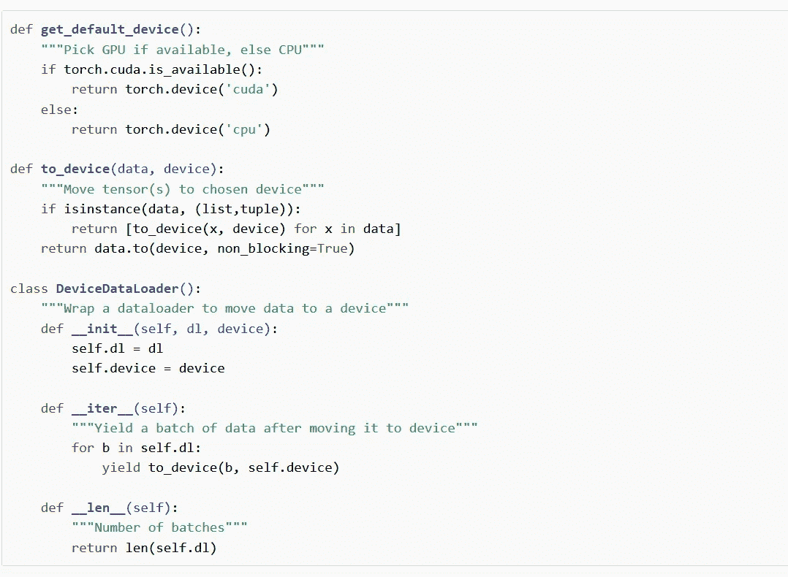

由作者生成

根据您运行此笔记本的位置，您的默认设备可能是 CPU (torch.device('cpu '))或 GPU (torch.device('cuda '))

我们可以使用 DeviceDataLoader 来包装我们的训练和验证数据加载器，以自动将数据批量传输到 GPU(如果可用)，并使用 to_device 将我们的模型移动到 GPU(如果可用)。

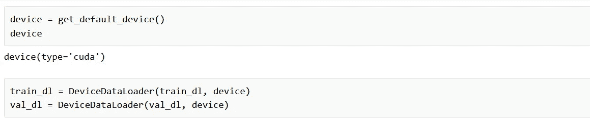

由作者生成

## 训练模型

在我们训练模型之前，我们将对拟合函数进行一系列微小但重要的改进:

*   **学习率调度**:不使用固定的学习率，我们会使用一个学习率调度器，它会在每一批训练后改变学习率。在训练过程中有许多改变学习率的策略，我们将使用的一种策略被称为**“一个周期学习率策略”**，它涉及从低学习率开始，在大约 30%的时期内逐批逐渐增加到高学习率，然后在剩余时期内逐渐减少到非常低的值。了解更多:【https://sgugger.github.io/the-1cycle-policy.html 
*   **权重衰减**:我们也使用权重衰减，这是另一种正则化技术，通过在损失函数中增加一个附加项来防止权重变得太大。了解更多:[https://towards data science . com/this-thing-thing-called-weight-decay-a 7 CD 4 BCF cab](https://towardsdatascience.com/this-thing-called-weight-decay-a7cd4bcfccab)
*   **渐变裁剪**:除了层权重和输出，将渐变值限制在一个小的范围内也有助于防止由于大的渐变值而导致参数发生不希望的变化。这种简单而有效的技术被称为渐变裁剪。了解更多:[https://towardsdatascience . com/what-is-gradient-clipping-b 8 e 815 cdfb 48](https://towardsdatascience.com/what-is-gradient-clipping-b8e815cdfb48)

让我们定义一个 fit_one_cycle 函数来包含这些变化。我们还将记录每批所用的学习率。

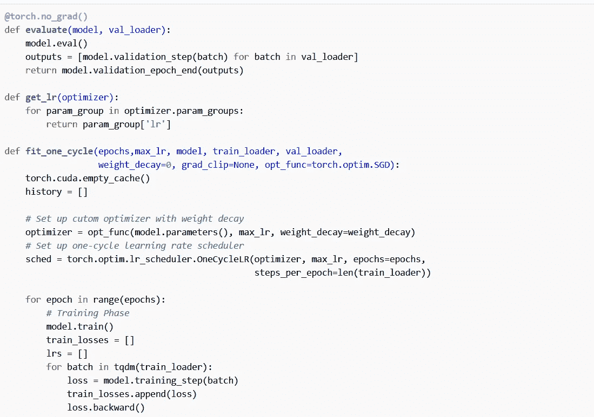

由作者生成

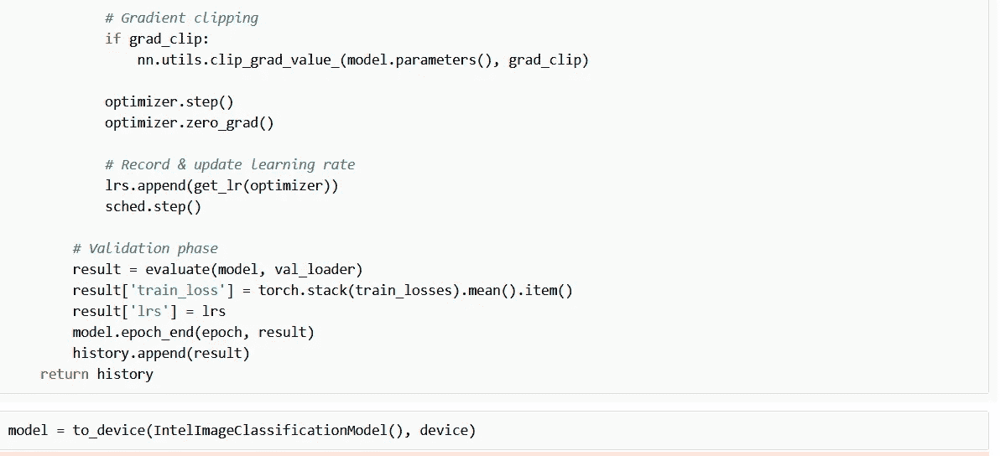

由作者生成

我们现在准备训练我们的模型。我们将使用 Adam 优化器来代替 SGD(随机梯度下降), Adam 优化器使用动量和自适应学习率等技术来加快训练。你可以在这里了解更多优化者:[https://ruder.io/optimizing-gradient-descent/index.html](https://ruder.io/optimizing-gradient-descent/index.html)

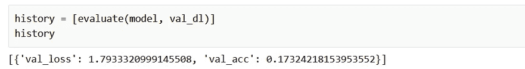

初始精度约为 17%，这是人们对随机初始化模型的预期。

我们将使用不同的超参数(学习率、时期数、批量大小等。)来训练我们的模型。

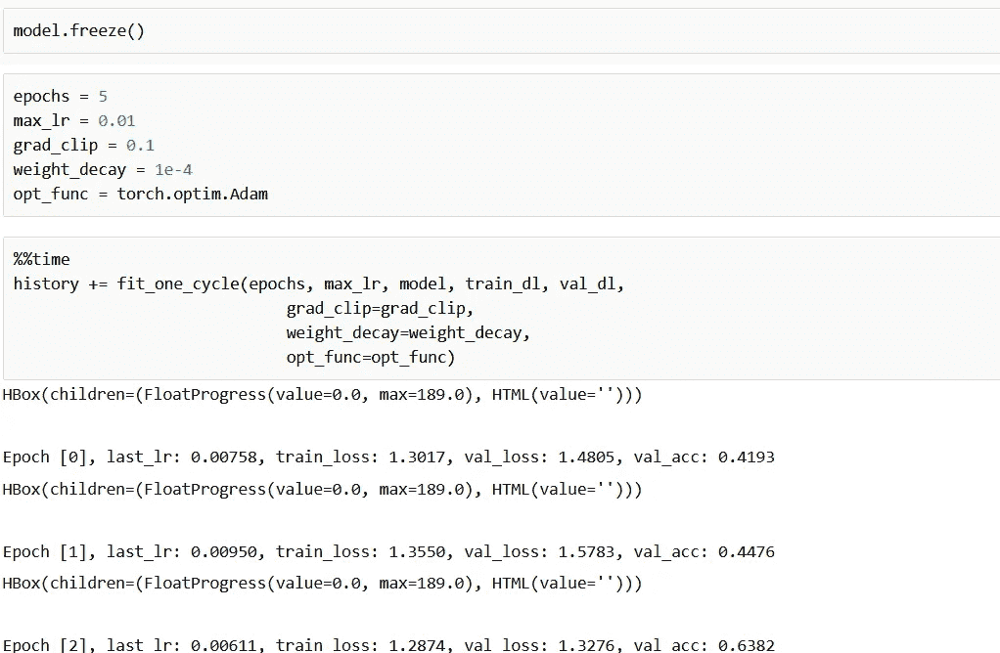

由作者生成

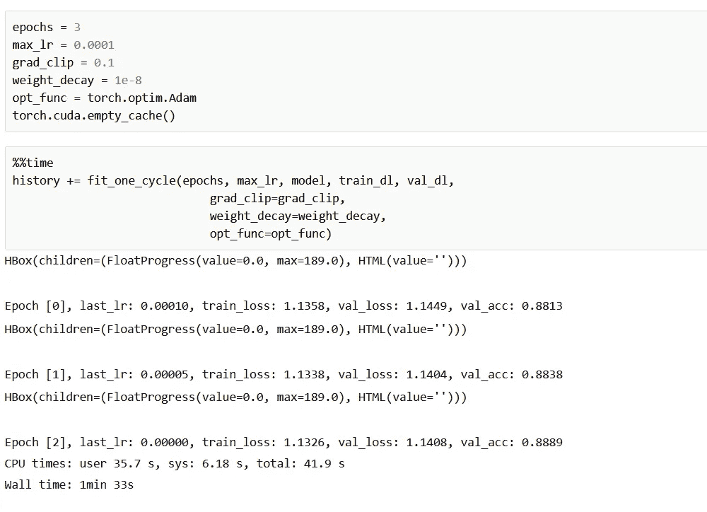

由作者生成

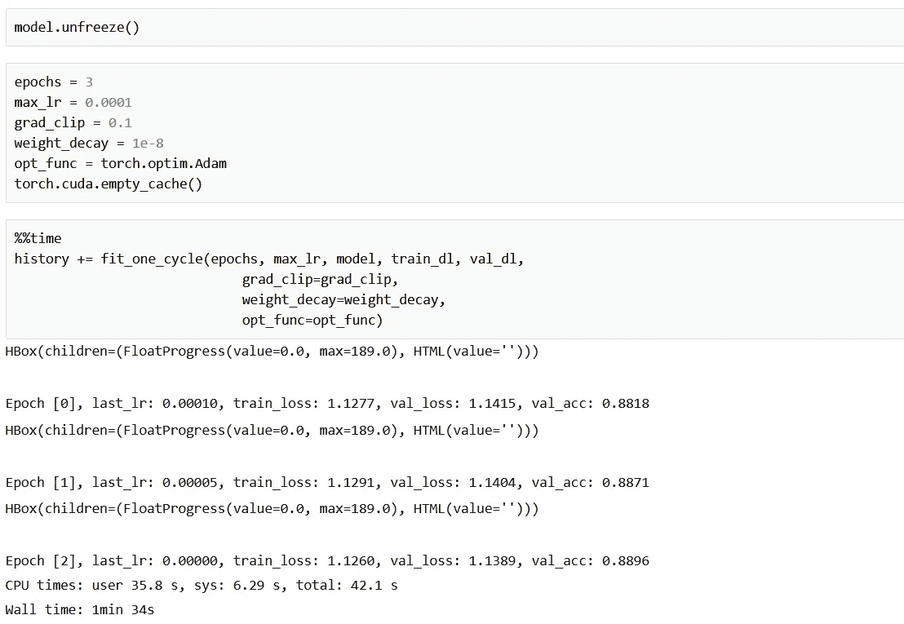

由作者生成

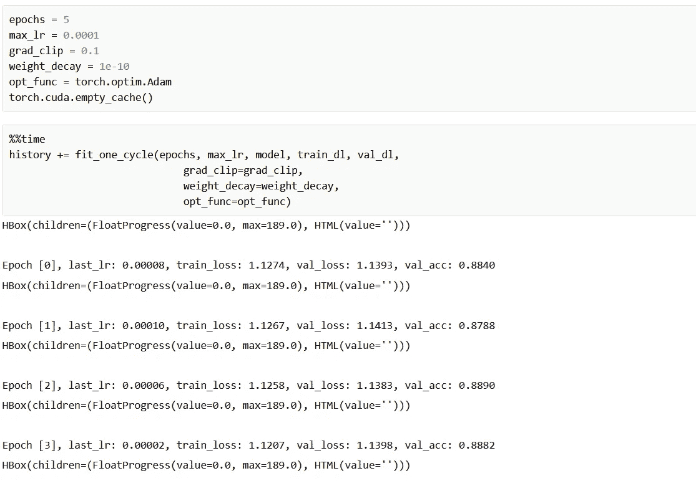

由作者生成

让我们绘制验证集精度图，研究模型如何随着时间的推移而改进。

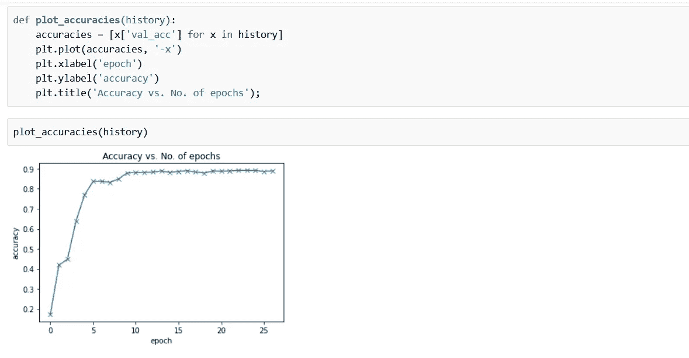

由作者生成

我们还可以绘制训练和验证损失图来研究趋势。

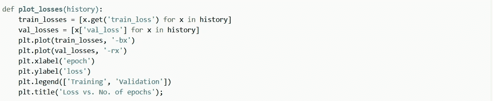

由作者生成

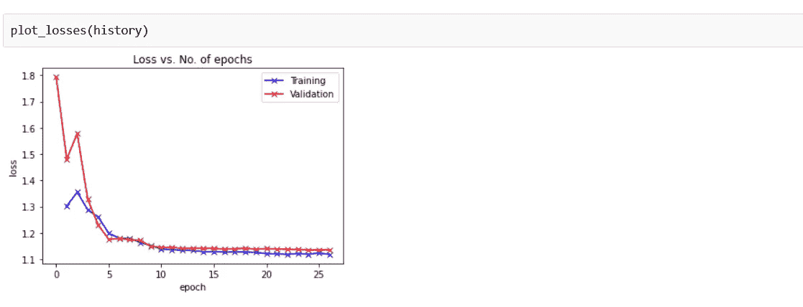

由作者生成

从趋势来看，我们的模型显然还没有过度适应训练数据。最后，让我们想象一下学习率是如何随着时间的推移而变化的，一批接一批地变化。

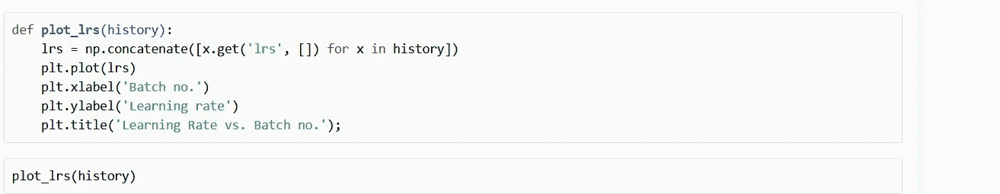

由作者生成

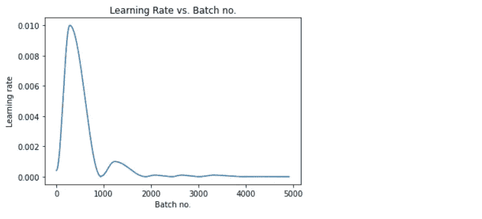

由作者生成

## 使用单个图像进行测试

虽然到目前为止我们一直在跟踪模型的整体准确性，但在一些样本图像上查看模型的结果也是一个好主意。让我们用预定义测试数据集中的一些图像来测试我们的模型。

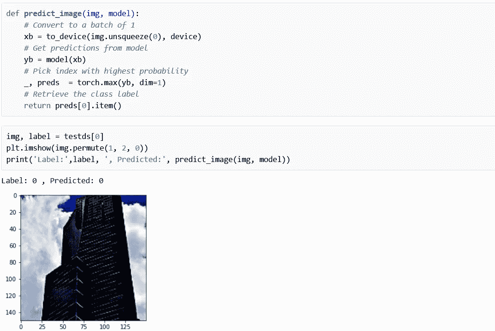

由作者生成

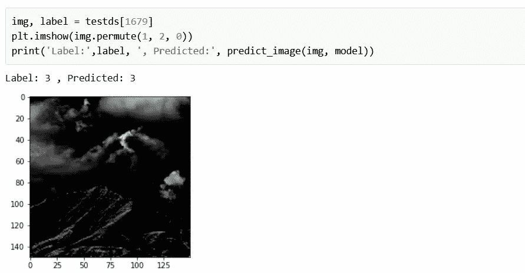

由作者生成

通过收集更多的训练数据、增加/降低模型的复杂性以及更改超参数，确定我们的模型表现不佳的地方可以帮助我们改进模型。

我们希望这些值与验证集的值相似。如果不是，我们可能需要一个更好的验证集，它具有与测试集相似的数据和分布(通常来自真实世界的数据)。

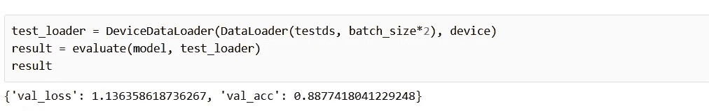

由作者生成

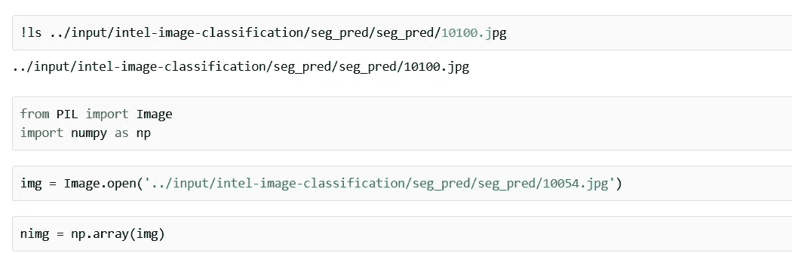

由作者生成

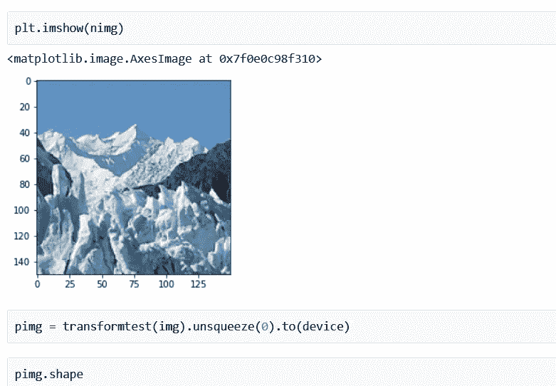

由作者生成

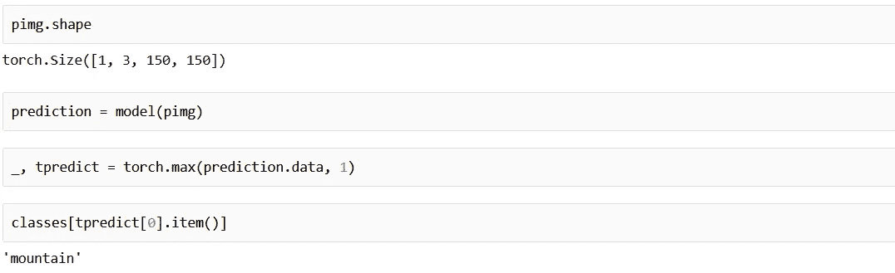

由作者生成

我们得到了相当好的验证准确性，我们的模型从预测文件夹中正确地预测了图像。尝试不同的迁移学习方法和超参数，以获得更好的模型。

*感谢阅读，下期再见！*

> 如果你需要这个博客的链接，请留下你的评论。

> 对于博客的进一步阅读，

 [## 什么是转换和转换正常化？(第 4 课 PyTorch 中的神经网络)

### 第四课的这一部分教我们如何训练神经网络识别手写数字！多酷啊。可能…

medium.com](/@ml_kid/what-is-transform-and-transform-normalize-lesson-4-neural-networks-in-pytorch-ca97842336bd)  [## 剩余块 ResNet 的构建块

### 理解一个剩余块是相当容易的。在传统的神经网络中，每一层都反馈到下一层。在…

towardsdatascience.com](https://towardsdatascience.com/residual-blocks-building-blocks-of-resnet-fd90ca15d6ec)  [## 直观理解用于深度学习的卷积

### 探索让它们工作的强大的视觉层次

towardsdatascience.com](https://towardsdatascience.com/intuitively-understanding-convolutions-for-deep-learning-1f6f42faee1)