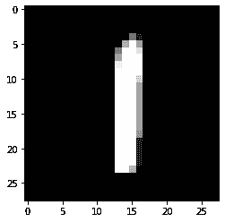

# PyTorch 和 TensorFlow 中的图像分类模型

> 原文：<https://medium.com/analytics-vidhya/image-classification-model-in-pytorch-and-tensorflow-25259cde8830?source=collection_archive---------17----------------------->


# 理解问题陈述:MNIST

在我们开始之前，让我们了解一下数据集。在这篇文章中，我们将解决流行的 MNIST 问题。这是一项数字识别任务，其中我们必须将手写数字图像分为 0 到 9 这 10 类中的任何一类。


在 MNIST 数据集中，我们有从各种扫描文档中获取的数字图像，这些图像的大小经过标准化，并且居中。随后，每个图像是一个 28×28 像素的正方形(总共 784 个像素)。数据集的标准分割用于评估和比较模型，其中 60，000 幅图像用于训练模型，而另一组 10，000 幅图像用于测试模型。

这是 CNN py torch 和 TensorFlow 的初学者指南

# 在 PyTorch 中实现 CNN

让我们首先从导入所有库开始:

```
*# importing the libraries*

import numpy as np
import pandas as pd
import torch
import torchvision
import matplotlib.pyplot as plt
from time import time
from torchvision import datasets, transforms
from torch import nn, optim
```

我们将对图像执行一些转换，比如归一化像素值，所以，让我们也定义这些转换

```
*# transformations to be applied on images*

transform = transforms.Compose([transforms.ToTensor(),
                              transforms.Normalize((0.5,), (0.5,)),
                              ])
```

现在，让我们加载 MNIST 数据集的训练集和测试集

```
trainset = datasets.MNIST('./data', download=True, train=True, transform=transform)
testset = datasets.MNIST('./', download=True, train=False, transform=transform)
```

接下来，我定义了训练和测试加载器，它将帮助我们批量加载训练和测试集。我将把批量定义为 64

```
*# defining trainloader and testloader*
trainloader = torch.utils.data.DataLoader(trainset, batch_size=64, shuffle=True)
testloader = torch.utils.data.DataLoader(testset, batch_size=64, shuffle=True)
```

我们先来看看训练集的概要

```
*# shape of training data*
dataiter = iter(trainloader)
images, labels = dataiter.next()

print(images.shape)
print(labels.shape)
```

输出

```
torch.Size([64, 1, 28, 28])
torch.Size([64])
```

所以，在每一批中，我们有 64 张图片，每张图片的尺寸都是 28，28，对于每一张图片，我们都有一个相应的标签。让我们想象一个训练图像，看看它是什么样子

```
*# visualizing the training images*
plt.imshow(images[0].numpy().squeeze(), cmap='gray')
```



这是 1 号的图像。类似地，让我们可视化测试集图像

```
*# shape of validation data*
dataiter = iter(testloader)
images, labels = dataiter.next()

print(images.shape)
print(labels.shape)
```

输出

```
torch.Size([64, 1, 28, 28])
torch.Size([64])
```

在测试集中，我们也有 64 号的批次。现在让我们来定义架构

```
*# defining the model architecture*
class **Net**(nn.Module):   
  def __init__(self):
      super(Net, self).__init__()

      self.cnn_layers = nn.Sequential(
          *# Defining a 2D convolution layer*
          nn.Conv2d(1, 4, kernel_size=3, stride=1, padding=1),
          nn.BatchNorm2d(4),
          nn.ReLU(inplace=True),
          nn.MaxPool2d(kernel_size=2, stride=2),
          *# Defining another 2D convolution layer*
          nn.Conv2d(4, 4, kernel_size=3, stride=1, padding=1),
          nn.BatchNorm2d(4),
          nn.ReLU(inplace=True),
          nn.MaxPool2d(kernel_size=2, stride=2),
      )

      self.linear_layers = nn.Sequential(
          nn.Linear(4 * 7 * 7, 10)
      )

  *# Defining the forward pass* 
  def forward(self, x):
      x = self.cnn_layers(x)
      x = x.view(x.size(0), -1)
      x = self.linear_layers(x)
      return x
```

让我们也定义优化器和损失函数，然后我们将查看此模型的摘要

```
*# defining the model*
model = Net()
*# defining the optimizer*
optimizer = optim.Adam(model.parameters(), lr=0.01)
*# defining the loss function*
criterion = nn.CrossEntropyLoss()
*# checking if GPU is available*
if torch.cuda.is_available():
    model = model.cuda()
    criterion = criterion.cuda()

print(model)
```

现在我们的模型架构已经准备好了，让我们为这个模型训练 10 个时期

```
for i **in** range(10):
    running_loss = 0
    for images, labels **in** trainloader:

        if torch.cuda.is_available():
          images = images.cuda()
          labels = labels.cuda()

        *# Training pass*
        optimizer.zero_grad()

        output = model(images)
        loss = criterion(output, labels)

        *#This is where the model learns by backpropagating*
        loss.backward()

        *#And optimizes its weights here*
        optimizer.step()

        running_loss += loss.item()
    else:
        print("Epoch **{}** - Training loss: **{}**".format(i+1, running_loss/len(trainloader)))
```

输出

```
Epoch 1 - Training loss: 0.18498120927162517
Epoch 2 - Training loss: 0.09083321380383297
Epoch 3 - Training loss: 0.08189530037383218
Epoch 4 - Training loss: 0.07542595624832361
Epoch 5 - Training loss: 0.07169675431065341
Epoch 6 - Training loss: 0.06836385150025012
Epoch 7 - Training loss: 0.06608668564340231
Epoch 8 - Training loss: 0.0635401263072499
Epoch 9 - Training loss: 0.06184220796615791
Epoch 10 - Training loss: 0.06065309989843955
```

您可以看到，训练随着时代数量的增加而减少。这意味着我们的模型正在从训练集中学习模式。让我们在测试集上检查这个模型的性能

```
*# getting predictions on test set and measuring the performance*
correct_count, all_count = 0, 0
for images,labels **in** testloader:
  for i **in** range(len(labels)):
    if torch.cuda.is_available():
        images = images.cuda()
        labels = labels.cuda()
    img = images[i].view(1, 1, 28, 28)
    with torch.no_grad():
        logps = model(img)

    ps = torch.exp(logps)
    probab = list(ps.cpu()[0])
    pred_label = probab.index(max(probab))
    true_label = labels.cpu()[i]
    if(true_label == pred_label):
      correct_count += 1
    all_count += 1

print("Number Of Images Tested =", all_count)
print("**\n**Model Accuracy =", (correct_count/all_count))
```

输出

```
Number Of Images Tested = 10000

Model Accuracy = 0.9728
```

因此，我们总共测试了 10000 张图像，该模型在预测测试图像的标签方面的准确率约为 90%。这就是如何在 PyTorch 中构建卷积神经网络。在下一节中，我们将研究如何在 TensorFlow 中实现相同的架构。

# 在 TensorFlow 中实现 CNN

```
*# importing the libraries*
import tensorflow as tf

from tensorflow.keras import datasets, layers, models
from tensorflow.keras.utils import to_categorical
import matplotlib.pyplot as plt
```

现在，让我们使用 tensorflow.keras 的数据集类加载 MNIST 数据集

```
(train_images, train_labels), (test_images, test_labels) = datasets.mnist.load_data(path='mnist.npz')
*# Normalize pixel values to be between 0 and 1*
train_images, test_images = train_images / 255.0, test_images / 255.0
```

这里，我们已经加载了 MNIST 数据集的训练集和测试集。此外，我们已经对训练图像和测试图像的像素值进行了归一化。接下来，让我们可视化数据集中的一些图像

```
*# visualizing a few images*
plt.figure(figsize=(10,10))
for i **in** range(9):
    plt.subplot(3,3,i+1)
    plt.xticks([])
    plt.yticks([])
    plt.grid(False)
    plt.imshow(train_images[i], cmap='gray')
plt.show()
```


随后，这就是我们的数据集的样子。我们有手写数字的图像。让我们看看训练集和测试集的形状

```
*# shape of the training and test set*
(train_images.shape, train_labels.shape), (test_images.shape, test_labels.shape)
```

输出

```
(((60000, 28, 28), (60000,)), ((10000, 28, 28), (10000,)))
```

因此，我们在训练集中有 60，000 张 28×28 形状的图像，在测试集中有 10，000 张相同形状的图像。接下来，我们将调整图像的形状，并对目标变量进行一次性编码

```
*# reshaping the images*
train_images = train_images.reshape((60000, 28, 28, 1))
test_images = test_images.reshape((10000, 28, 28, 1))

*# one hot encoding the target variable*
train_labels = to_categorical(train_labels)
test_labels = to_categorical(test_labels)
```

# 定义模型架构

```
*# defining the model architecture*
model = models.Sequential()
model.add(layers.Conv2D(4, (3, 3), activation='relu', input_shape=(28, 28, 1)))
model.add(layers.MaxPooling2D((2, 2), strides=2))
model.add(layers.Conv2D(4, (3, 3), activation='relu'))
model.add(layers.MaxPooling2D((2, 2), strides=2))
model.add(layers.Flatten())
model.add(layers.Dense(10, activation='softmax'))
```

让我们快速地看一下模型的概要

```
*# summary of the model*
model.summary()
```

输出

```
Model: "sequential"
_________________________________________________________________
Layer (type)                 Output Shape              Param #   
=================================================================
conv2d (Conv2D)              (None, 26, 26, 4)         40        
_________________________________________________________________
max_pooling2d (MaxPooling2D) (None, 13, 13, 4)         0         
_________________________________________________________________
conv2d_1 (Conv2D)            (None, 11, 11, 4)         148       
_________________________________________________________________
max_pooling2d_1 (MaxPooling2 (None, 5, 5, 4)           0         
_________________________________________________________________
flatten (Flatten)            (None, 100)               0         
_________________________________________________________________
dense (Dense)                (None, 10)                1010      
=================================================================
Total params: 1,198
Trainable params: 1,198
Non-trainable params: 0
_________________________________________________________________
```

总而言之，我们有两个卷积层，两个最大池层，一个平坦层和一个密集层。模型中的参数总数为 1，198。现在我们的模型已经准备好了，我们将编译它

```
*# compiling the model*
model.compile(optimizer='adam',
              loss='categorical_crossentropy',
              metrics=['accuracy'])
```

我们正在使用亚当优化，你也可以改变它。损失函数被设置为分类交叉熵，因为我们正在解决多类分类问题，并且度量是准确度。现在让我们为我们的模型训练 10 个纪元

```
*# training the model*
history = model.fit(train_images, train_labels, epochs=10, validation_data=(test_images, test_labels))
```

输出:

```
Epoch 1/10
1875/1875 [==============================] - 6s 3ms/step - loss: 0.4720 - accuracy: 0.8541 - val_loss: 0.2096 - val_accuracy: 0.9374
Epoch 2/10
1875/1875 [==============================] - 6s 3ms/step - loss: 0.2005 - accuracy: 0.9408 - val_loss: 0.1615 - val_accuracy: 0.9505
Epoch 3/10
1875/1875 [==============================] - 5s 3ms/step - loss: 0.1636 - accuracy: 0.9514 - val_loss: 0.1416 - val_accuracy: 0.9560
Epoch 4/10
1875/1875 [==============================] - 5s 3ms/step - loss: 0.1456 - accuracy: 0.9566 - val_loss: 0.1233 - val_accuracy: 0.9631
Epoch 5/10
1875/1875 [==============================] - 5s 3ms/step - loss: 0.1323 - accuracy: 0.9603 - val_loss: 0.1155 - val_accuracy: 0.9648
Epoch 6/10
1875/1875 [==============================] - 6s 3ms/step - loss: 0.1224 - accuracy: 0.9633 - val_loss: 0.1082 - val_accuracy: 0.9660
Epoch 7/10
1875/1875 [==============================] - 6s 3ms/step - loss: 0.1142 - accuracy: 0.9655 - val_loss: 0.1063 - val_accuracy: 0.9667
Epoch 8/10
1875/1875 [==============================] - 5s 3ms/step - loss: 0.1075 - accuracy: 0.9682 - val_loss: 0.0977 - val_accuracy: 0.9680
Epoch 9/10
1875/1875 [==============================] - 6s 3ms/step - loss: 0.1020 - accuracy: 0.9696 - val_loss: 0.0970 - val_accuracy: 0.9697
Epoch 10/10
1875/1875 [==============================] - 6s 3ms/step - loss: 0.0967 - accuracy: 0.9716 - val_loss: 0.0921 - val_accuracy: 0.9698
```

训练损失约为 0.46，10 个周期后，训练损失减少到 0.08。10 个周期后的训练和验证准确率分别为 97.31%和 97.48%。谢谢你的宝贵时间。希望这有用。

[](https://www.kaggle.com/c/digit-recognizer) [## 数字识别器

### 用著名的 MNIST 数据学习计算机视觉基础

www.kaggle.com](https://www.kaggle.com/c/digit-recognizer)