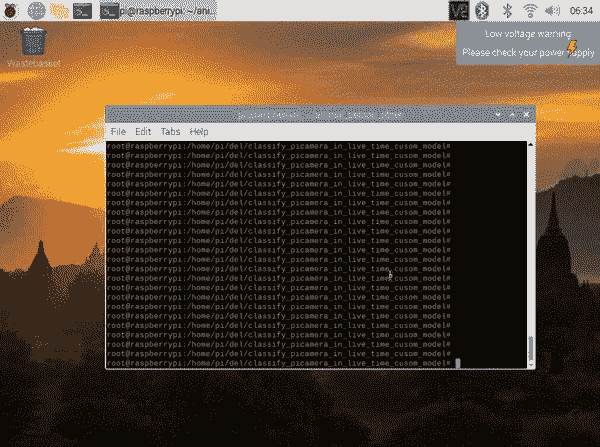

# 使用自定义模型. h5(输出到终端)，使用 TensorFlow，从 pi-camera(实时)在 raspberry pi 上进行图像分类(人、动物和其他)

> 原文：<https://medium.com/analytics-vidhya/image-classification-persons-animals-other-on-raspberry-pi-from-pi-camera-in-live-time-used-5e7ccc236781?source=collection_archive---------20----------------------->



raspberry pi 上的图像分类(人、动物、其他)来自 pi-camera(实时)使用自定义模型. h5(输出到终端)(照片、GIF 由作者提供)[https://github . com/oleks andr-g-rock/classify _ pica mera _ in _ live _ time _ cusom _ model/blob/main/0 _ 3 yxd 6 sisvvowpj 5 . GIF](https://github.com/oleksandr-g-rock/classify_picamera_in_live_time_cusom_model/blob/main/0_3yXD6SiSVVOvWpJ5.gif)

# 简短摘要:

在本文中，我将解释如何使用自定义模型. h5(输出到终端)从 pi-camera(实时)在 raspberry pi 上创建图像分类(人、动物、其他)。完整的代码位于[这里](https://github.com/oleksandr-g-rock/classify_picamera_in_live_time_cusom_model)。

> *开始前注意:*

# 所以，我们开始吧:)

# 硬件准备:

# 软件准备:

# 1.创建一个神经网络模型来预测 3 个类别:人、动物和其他。

我已经在下面的文章里做到了。所以在本文中，您不需要这样做。

[](https://oleksandrg.medium.com/create-image-classification-for-recognizing-persons-animals-others-daad028762cb) [## 创建用于识别人、动物和其他人的图像分类。

### 摘要:创建用于识别人、动物和其他的图像分类。

oleksandrg.medium.com](https://oleksandrg.medium.com/create-image-classification-for-recognizing-persons-animals-others-daad028762cb) 

# 2 尝试使用 Tensorflow Lite 和自定义模型. h5(我在上面训练并保存了它)实时预测来自 camera raspberry pi 的类，并输出到终端。

为此，您需要运行下面的代码:

```
#install Tensorflow Lite
pip3 install [https://github.com/google-coral/pycoral/releases/download/release-frogfish/tflite_runtime-2.5.0-cp37-cp37m-linux_armv7l.whl](https://github.com/google-coral/pycoral/releases/download/release-frogfish/tflite_runtime-2.5.0-cp37-cp37m-linux_armv7l.whl)#clone repo with my code
git clone [https://github.com/oleksandr-g-rock/classify_picamera_in_live_time_cusom_model.git](https://github.com/oleksandr-g-rock/classify_picamera_in_live_time_cusom_model.git)#go to direcory
cd classify_picamera_in_live_time_cusom_model#copy h5 custom model 
wget https://github.com/oleksandr-g-rock/create-image-classification-for-recognizing-persons-animals-others/raw/main/animall_person_other_v2_fine_tuned.h5#run script
python3 classify_picamera_with_live_time_custom_model.py
```

# 3 你应该看到类似的东西。


raspberry pi 上的图像分类(人、动物、其他)来自 pi-camera(实时)使用自定义模型. h5(输出到终端)(Photo，GIF 由作者提供)[https://github . com/oleks andr-g-rock/classify _ pica mera _ in _ live _ time _ cusom _ model/blob/main/0 _ 3 yxd 6 sisvvowpj 5 . GIF](https://github.com/oleksandr-g-rock/classify_picamera_in_live_time_cusom_model/blob/main/0_3yXD6SiSVVOvWpJ5.gif)

# 结果:

在本文中，我们在 raspberry pi 上从 pi-camera(实时)使用自定义模型. h5(输出到终端)创建了图像分类(人、动物和其他)。完整的代码位于[这里](https://github.com/oleksandr-g-rock/classify_picamera_in_live_time_cusom_model)。