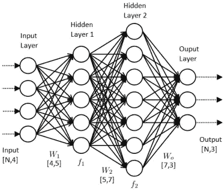
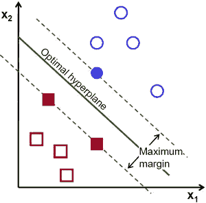
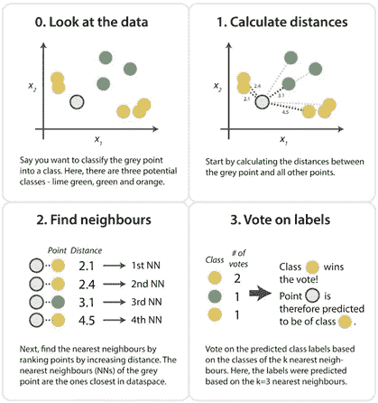
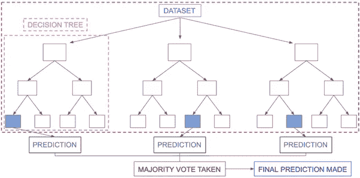

# 图像分类技术

> 原文：<https://medium.com/analytics-vidhya/image-classification-techniques-83fd87011cac?source=collection_archive---------1----------------------->

*图像分类是指计算机视觉中能够根据图像的视觉内容对图像进行分类的过程。*

**简介**

今天，随着人工智能的日益波动性、必要性和应用，机器学习及其子集、深度学习和神经网络等领域获得了巨大的动力。这种训练需要像分类器这样的软件和工具，它们可以输入大量的数据，分析这些数据并提取有用的特征。分类过程的目的是将数字图像中的所有像素归类到几个类别中的一个。通常，多光谱数据被用于执行分类，并且实际上，每个像素的数据中存在的光谱模式被用作分类的数字基础。图像分类的目的是根据图像中出现的特征在地面上实际代表的对象，将这些特征识别和描绘为独特的灰度级(或颜色)。图像分类可能是数字图像分析中最重要的部分。物体之间的分类是一项复杂的任务，因此图像分类是计算机视觉领域中的一项重要任务。图像分类是指将图像标记为多个预定义类别中的一个。给定图像可能有 n 个类别可以被分类。手动检查和分类图像可能是一项乏味的任务，尤其是当它们数量庞大时，因此如果我们能够使用计算机视觉来自动化整个过程，将会非常有用。自动驾驶领域的进步也是在现实世界中使用图像分类的一个很好的例子。这些应用包括自动图像组织、股票摄影和视频网站、用于提高产品可发现性的视觉搜索、大型视觉数据库、社交网络上的图像和面部识别等等；这就是为什么，我们需要分类器来达到最大可能的准确性。

**用于执行图像分类的结构**

1.  ***图像预处理*** *:* 该过程的目的是通过抑制不想要的失真和增强一些重要的图像特征来改善图像数据(特征)，以便计算机视觉模型可以受益于该改善的数据来工作。图像预处理步骤包括读取图像、调整图像大小、数据扩充(图像灰度、反射、高斯模糊、直方图、均衡、旋转、平移)。
2.  ***物体的检测*** *:* 检测是指物体的定位，即分割图像，确定感兴趣物体的位置。
3.  ***特征提取和训练*** *:* 这是一个至关重要的步骤，其中使用统计或深度学习方法来识别图像中最有趣的模式，这些特征可能是特定类别所独有的，并且稍后将帮助模型区分不同的类别。模型从数据集学习要素的过程称为模型训练。
4.  ***物体的分类*** *:* 该步骤通过使用将图像图案与目标图案进行比较的合适的分类技术，将检测到的物体分类到预定义的类别中。

**监督分类**

监督分类基于这样的思想，即用户可以选择图像中代表特定类别的样本像素，然后指导图像处理软件使用这些训练站点作为图像中所有其他像素分类的参考。训练站点(也称为测试集或输入类)是基于用户的知识选择的。用户还设置其他像素必须有多相似的界限，以将它们分组在一起。这些界限通常基于训练区域的光谱特征来设置。用户还指定图像被分类到的类别的数量。一旦获得了每个信息类别的统计特征，就可以通过检查每个像素的反射率来对图像进行分类，并确定它与哪个特征最相似。监督分类使用分类算法和回归技术来开发预测模型。这些算法包括线性回归、逻辑回归、神经网络、决策树、支持向量机、随机森林、朴素贝叶斯和 k-最近邻。

**无监督分类**

无监督分类是指结果(具有共同特征的像素分组)基于图像的软件分析，无需用户提供样本类别。计算机使用技术来确定哪些像素是相关的，并将它们分类。用户可以指定软件将使用的算法和输出类别的期望数量，但在分类过程中没有帮助。然而，当由计算机产生的具有共同特征的像素分组必须与地面上的实际特征相关时，用户必须了解被分类的区域。无监督学习中最常用的一些算法包括聚类分析、异常检测、神经网络和学习潜在变量模型的方法。

**卷积神经网络**

卷积神经网络(CNN，或ConvNet)是一种特殊的多层神经网络，旨在通过最少的预处理直接从像素图像中识别视觉模式。它是人工神经网络的一种特殊结构。卷积神经网络使用其视觉皮层的一些特征，因此在计算机视觉任务中取得了最先进的结果。卷积神经网络由两个非常简单的元素组成，即卷积层和池层。虽然简单，但对于给定的计算机视觉问题，有近乎无限的方式来安排这些层。卷积神经网络的元素(如卷积层和池层)相对容易理解。在实践中使用卷积神经网络的挑战部分是如何设计最好地使用这些简单元素的模型架构。卷积神经网络非常流行的原因是因为它们的架构，最好的是不需要特征提取。该系统学习进行特征提取，其核心概念是，它使用图像和滤波器的卷积来生成传递到下一层的不变特征。下一层中的特征用不同的滤波器进行卷积，以生成更不变和抽象的特征，并且该过程继续进行，直到它获得对遮挡不变的最终特征/输出。卷积神经网络最常用的架构是 LeNet、AlexNet、ZFNet、GoogLeNet、VGGNet 和 ResNet。

**人工神经网络**

受生物神经网络属性的启发，人工神经网络是统计学习算法，用于各种任务，从相对简单的分类任务到计算机视觉和语音识别。人工神经网络被实现为称为节点的互连处理元素的系统，其功能类似于生物神经元。不同节点之间的连接有称为权重的数值，通过系统地改变这些值，网络最终能够逼近期望的函数。隐藏层可以被认为是单独的特征检测器，当数据在网络中传播时，它识别数据中越来越复杂的模式。例如，如果给网络一个识别人脸的任务，第一个隐藏层可能充当线检测器，第二个隐藏层将这些线作为输入并将它们放在一起形成鼻子，第三个隐藏层将鼻子与眼睛匹配，以此类推，直到最终构建出整个人脸。这种层次结构使网络最终能够识别非常复杂的对象。不同类型的人工神经网络是卷积神经网络、前馈神经网络、概率神经网络、时间延迟神经网络、深度堆叠网络、径向基函数网络和递归神经网络。

**支持向量机**

支持向量机(SVM)是强大而灵活的监督机器学习算法，用于分类和回归。与其他机器学习算法相比，支持向量机有其独特的实现方式。它们非常受欢迎，因为它们能够处理多个连续变量和分类变量。支持向量机模型基本上是多维空间中超平面中不同类别的表示。超平面将由支持向量机以迭代的方式生成，以使误差最小化。目标是将数据集分成几类，以找到一个最大的边缘超平面。它在高维空间中建立一个超平面或一组超平面，并且通过与任何类的最近训练数据点具有最大距离的超平面来实现两个类之间的良好分离。该算法的真正能力取决于所使用的核函数。最常用的核是线性核、高斯核和多项式核。

**K-最近邻**

k-最近邻法是一种用于分类和回归的非参数方法。在这两种情况下，输入由特征空间中的 *k* 个最接近的训练样本组成。这是迄今为止最简单的算法。这是一个非参数的，懒惰的学习算法，其中函数只是局部近似，所有的计算都推迟到函数评估。该算法简单地依赖于特征向量之间的距离，并通过在 k 个最接近的例子中找到最常见的类来对未知数据点进行分类。为了应用 k-最近邻分类，我们需要定义一个距离度量或相似性函数，其中常见的选择包括欧几里德距离和曼哈顿距离。输出是一个类成员。通过其邻居的多次投票对对象进行分类，将该对象分配到其 k 个最近邻居中最常见的类别(k 是正整数，通常很小)。如果 k = 1，那么该对象被简单地分配给该单个最近邻的类。压缩最近邻(CNN，Hart 算法)是一种设计用于减少 K-最近邻分类数据集的算法。

**朴素贝叶斯算法**

朴素贝叶斯分类器是一组基于贝叶斯定理的分类算法。它不是一个单一的算法，而是一个算法家族，所有算法都有一个共同的原则，即每一对被分类的特征都是相互独立的。朴素贝叶斯是一种构造分类器的简单技术:将类别标签分配给问题实例的模型，表示为特征值的向量，其中类别标签是从一些有限集中提取的。给定类变量，所有朴素贝叶斯分类器都假设特定特征的值独立于任何其他特征的值。朴素贝叶斯算法是一种快速、高度可扩展的算法，可用于二值和多值分类。这取决于做一堆计数。它是文本分类、垃圾邮件分类等的流行选择。它可以很容易地在小数据集上训练。它有局限性，因为它认为所有的特征是不相关的，所以它不能学习特征之间的关系。朴素贝叶斯可以学习单个特征的重要性，但不能确定特征之间的关系。不同类型的朴素贝叶斯算法有高斯朴素贝叶斯、多项式朴素贝叶斯和伯努利朴素贝叶斯。

**随机森林算法**

随机森林是一种监督学习算法，用于分类和回归。正如我们所知，森林是由树木组成的，更多的树木意味着更健壮的森林，同样，随机森林算法在数据样本上创建决策树，然后从每个样本中获得预测，最后通过投票选择最佳解决方案。这是一种比单一决策树更好的集成方法，因为它通过平均结果来减少过拟合。随机森林是由许多决策树组成的分类算法。它在构建每棵树时使用 bagging 和特征随机性，试图创建一个不相关的森林，其委员会的预测比任何单棵树都更准确。

**联系人**

[邮箱](mailto:sanghvi_kavish@yahoo.in) | [LinkedIn](https://www.linkedin.com/in/kavishsanghvi) | [网站](https://kavishsanghvi.github.io) | [GitHub](https://www.github.com/kavishsanghvi) | [博客](https://kavishsanghviblog.wordpress.com) | [脸书](https://www.facebook.com/kavish.sanghvi.5) | [推特](https://twitter.com/kavishsanghvi25) | [Instagram](https://instagram.com/kavishsanghvi96)

> 感谢您阅读这篇文章。如果你喜欢它或发现它有用，请鼓掌、评论并分享。