# 基于人工神经网络的图像分类。

> 原文：<https://medium.com/analytics-vidhya/image-classification-using-ann-c524f36d22c?source=collection_archive---------15----------------------->

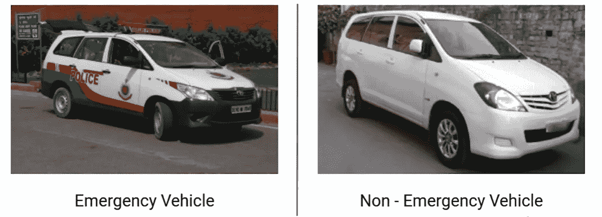

来源:Vidhya 分析

在这个博客中，我们将做一个基于图像分类的项目，其中我们的问题陈述描述我们将图像分为两类，即紧急和非紧急车辆，这是一个二元分类问题，我们将使用神经网络来解决。

在深入研究这个项目之前，我建议大家在我的深度学习博客中浏览一下图像处理的基础知识。我相信你会喜欢它，然后继续进行令人兴奋的理论和实践。

 [## 图像数据入门—深度学习

### 在这个博客中，我们将看到不同格式的图像，将它们转换成不同的形式，并提取边缘特征…

medium.com](/analytics-vidhya/getting-started-with-image-data-deep-learning-328faad6d929) 

说到急救车辆，可以有各种类型，如警车、救护车甚至消防车。

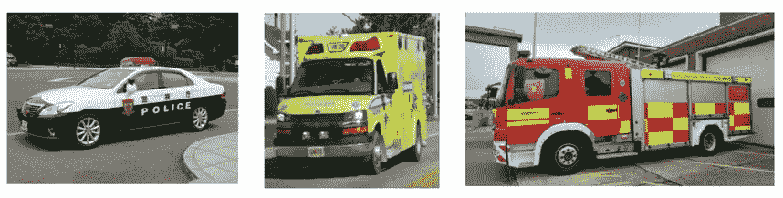

来源:Vidhya 分析公司(应急车辆)

不属于警车、救护车和消防车的任何其他车辆都属于非紧急车辆。

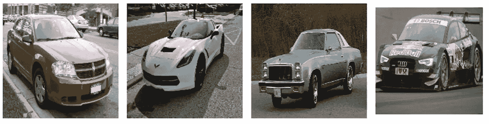

来源:Vidhya 分析公司(非紧急车辆)

**解决问题的步骤。**

1.  *加载数据*。
2.  *创建训练、验证和测试数据*:我们将根据训练数据进行训练，根据验证数据进行评估，根据测试数据进行测试。
3.  *定义我们模型的架构*:我们将定义输入神经元的数量，隐藏层和输出层神经元的数量。
4.  *编译模型(损失函数/优化器)*:这里我们将定义我们的成本函数，它将在反向传播期间使用。
5.  *训练模型:*我们将训练我们的模型，并定义纪元的数量。
6.  *评估模型在训练和验证数据上的表现*。

**查看数据集:**我们有 csv 文件形式的数据集，下面我们看到它的前五行。第一列代表图像名称，相应的列将告诉我们该图像是否是紧急车辆。

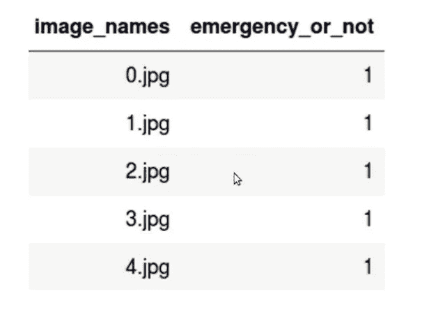

资料来源:Vidhya 分析。

你们都可以点击我的 GitHub 档案下载代码文件和数据集，我在那里实现了分类问题。

 [## graj pal 123/紧急 _ 非紧急 _ 车辆 _ 图像 _ 分类

github.com](https://github.com/grajpal123/Emergency_Non-Emergency_Vehicle_Image_Classification/tree/main) 

如果你只是对实现部分感兴趣，请访问下面的 URL，在那里你不必费力下载代码文件或数据集。

 [## 笔记本

### 看看这个 Jupyter 笔记本！

nbviewer.jupyter.org](https://nbviewer.jupyter.org/github/grajpal123/Emergency_Non-Emergency_Vehicle_Image_Classification/blob/main/EMERGENCY%20vs%20NON-EMERGENCY%20IMAGE%20CLASSIFICATION.ipynb) 

因此，我相信，如果您已经完成了实施，您会清楚地看到，我们已经完成了大量的超参数调整，可以实现 78%的精度，高于我们之前实现的 76%的精度。我们还关注通过各种超参数调整来减少假阴性(FN)。

现在，我们将看看如何即兴发挥我们已经建立的现有模型。

## **改进深度学习模型/神经网络。**

在这里，我们将研究可以用来改进我们的深度学习模型的技术。我们将把这些技术应用于我们的紧急与非紧急分类问题，并比较其性能。

1.  **早停。**

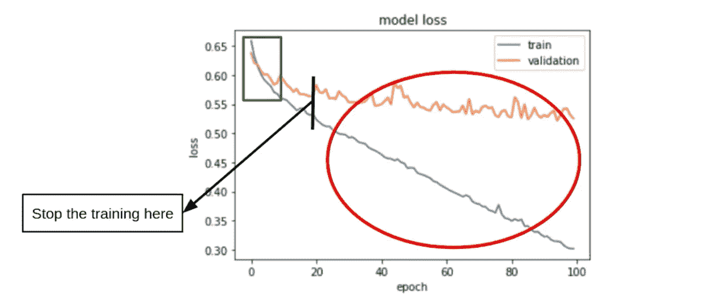

来源:Vidhya 分析

上图显示了损失图与时期数的关系。这里蓝线表示训练损失，橙线表示验证损失。在 x 轴上我们有纪元，在 y 轴上我们有损失。

如果我们考虑 0-20 之间的纪元数量，我们看到训练和验证损失都在减少。最初，它们都具有高损失值，并且随着训练的进行，即随着时期数的增加，它们的损失值降低。它们减少的数量也是相似的。所以，我们可以说他们在沉沦。随着超过 20 的时期数的增加，我们观察到训练损失在减少，而验证损失似乎在增加或保持不变。训练损失减少而验证损失增加或保持不变的这部分称为 ***过拟合。*** 在这个场景中，模型似乎在记忆训练数据，避免从数据中学习信号。我们不希望这种情况发生。如果我们实现了某种方法，它将有助于在验证数据或看不见的数据上表现良好。

为了解决上述问题，我们可以做的是在模型开始过拟合或记忆训练数据时停止模型的训练，这种技术称为 ***提前停止。*** 这种方法有助于在看不见的数据上很好地推广模型。 ***通过应用提前停止，我们可以在验证损失开始减少时停止模型的训练。***

通过使用提前停止，我们需要跟踪像*验证损失或验证准确性这样的指标。*另一个参数是*阈值*(如果损失没有减少一定的阈值)。最后是*段数*(如果损失在一定段数内没有减少，我们将停止训练过程)。

例如，考虑阈值= 0.01，历元数= 5。如果我们选择这些参数，当验证损失在 5 个连续时期内没有减少 0.01 时，训练将停止。这些是我们在使用早期停止方法时必须考虑的参数，我们在选择这些参数时必须非常小心，确保不会再次导致过度拟合。

让我们看看，在我们的正常解决步骤中，提前停止在哪里合适。

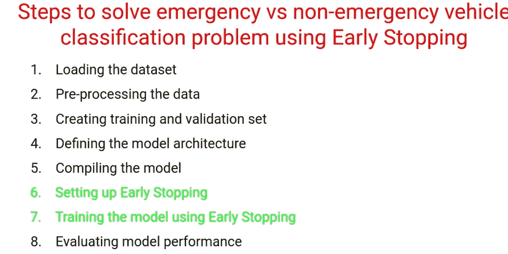

来源:Vidhya 分析

让我们看看提前停止的实际实现:

 [## nbviewer 笔记本

nbviewer.jupyter.org](https://nbviewer.jupyter.org/github/grajpal123/Emergency_Non-Emergency_Vehicle_Image_Classification/blob/main/Early_Stopping.ipynb) 

2.**退学转正。**

我们讨论了神经网络的一个问题，即在一定数量的时期后，模型开始过度拟合，以及我们如何通过使用先前的早期停止来解决它。早期停止只是防止过度拟合的一种方法。

让我们先找出过度拟合的原因，然后再来解决过度拟合问题。

*   不从训练数据中学习模式/信号。
*   模型开始记忆训练数据。

这里又出现了另一种防止过拟合的方法即 ***退出正则化。***

回想一下我们的神经网络架构，我们看到隐藏层负责创建特征，其中一些可能会因为记忆训练数据而导致过拟合，因此，dropout 所做的是，从隐藏层中删除一些神经元，并确保没有神经元依赖于某些特定的特征。

让我们更清楚地理解它。Dropout 将概率分配给我们希望应用 drop out 的每个隐藏层。这个概率表示神经元是否会被丢弃的可能性。

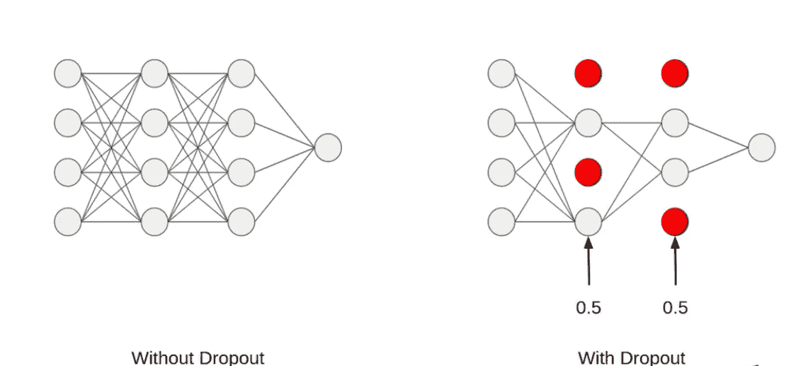

来源:Vidhya 分析

**它如何帮助克服过度拟合？**

在没有丢失的情况下，隐藏层中的特定神经元可能仅受特定特征的影响，这导致过度拟合，因为我们的模型现在正在记忆训练集。

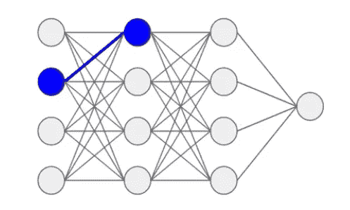

资料来源:分析 Vidhya(未辍学)

因此， ***dropout 确保任何一个神经元的输出不依赖于任何一个特性*** 。在 dropout 中，当我们在每次迭代中随机删除隐藏层中的神经元时，我们会看到，我们有不同的神经元集，这确保了没有神经元会记住输入或受到某些特征的影响。

**需要记住的要点:**

*   神经元在每次迭代中被随机丢弃。
*   一般情况下，我们不会在输入层应用 dropout。
*   测试期间无脱落。

让我们看看辍学在我们解决问题的正常步骤中处于什么位置。

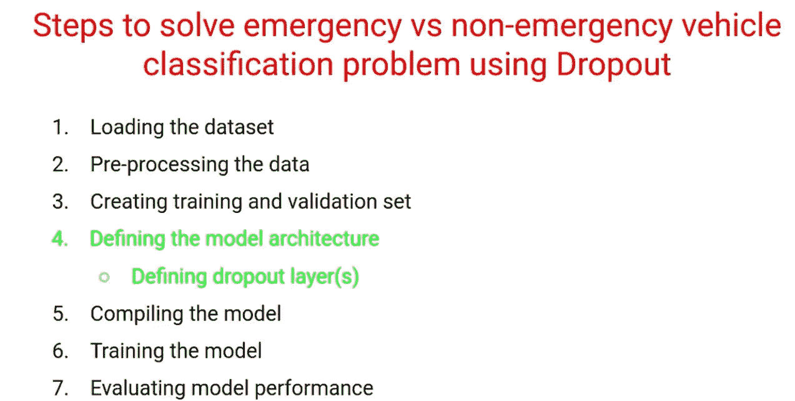

让我们看看退学的实际执行情况。

 [## nbviewer 笔记本

nbviewer.jupyter.org](https://nbviewer.jupyter.org/github/grajpal123/Emergency_Non-Emergency_Vehicle_Image_Classification/blob/main/Dropout_in_Neural_Networks_using_Keras.ipynb) 

3.**批量归一化。**

我们将在这里讨论的技术是深度学习实践者最常用的，它通常几乎每次都有效，即 ***批量规范化。***

考虑下面神经网络，

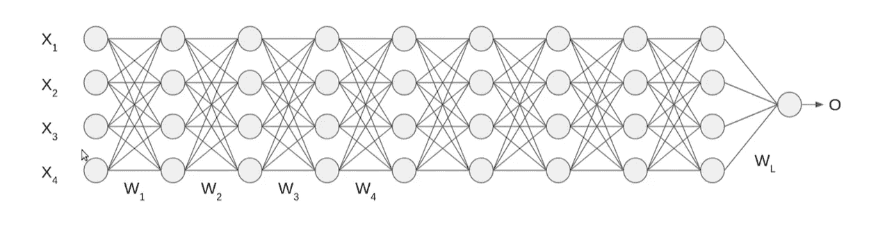

这里，

*   X1，X2，X3，X4 代表特征的数量。
*   W1，W2，W3，W4。。。Wn 代表重量。
*   为了简单起见，考虑 bias = 0。
*   激活函数= sigmoid。

如果我们回想一下，我们会在将输入发送到模型之前对其进行标准化，这有助于加快训练过程。使用这个归一化值，我们执行正向传播，并继续计算隐藏层的激活函数。

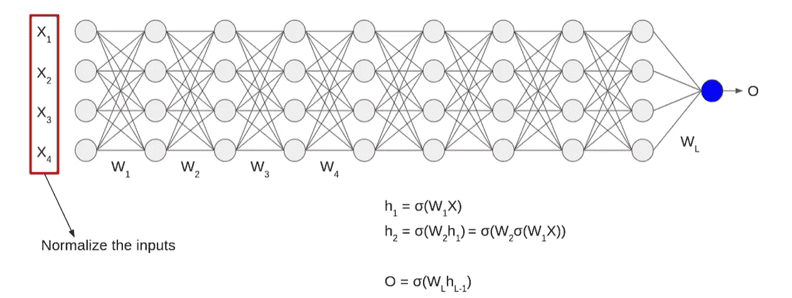

考虑上图，

如果我们在图中看到，输入是正常化的，但当我们通过执行点积来计算隐藏层激活时，这意味着这些值不是正常化的，因此，如果我们在隐藏层上应用的这些激活函数也是正常化的，那就太好了。因此，想象一下，如果这些激活值被归一化，我们将会取得很好的结果，并且我们的模型收敛所需的训练时间会更少。 ***批量规范化帮助我们实现这个任务。***

**批量正常化是如何发生的？**

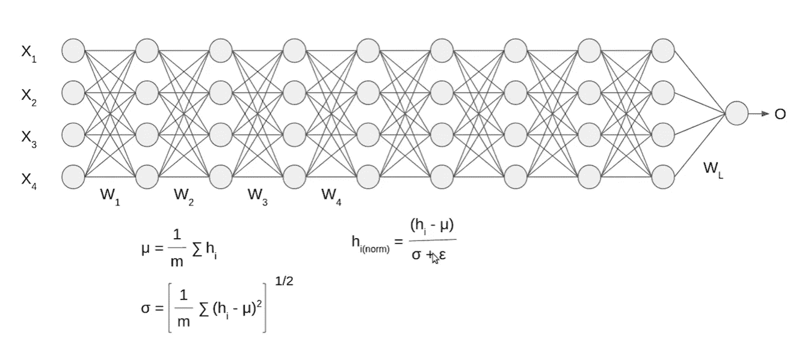

资料来源:Vidhya 分析。

*   我们计算特定层的所有激活的平均值。
*   接下来我们计算标准差
*   一旦我们有了 mean 和 std。我们将这些值标准化，从激活值中减去平均值，然后除以标准差。并添加一个非常小的值，称为*ε*，以确保分母不为 0。这使得均值和 std。所有隐藏层激活分别为 0 和 1。

让我们看看批量标准化在我们的常规解决步骤中的位置。

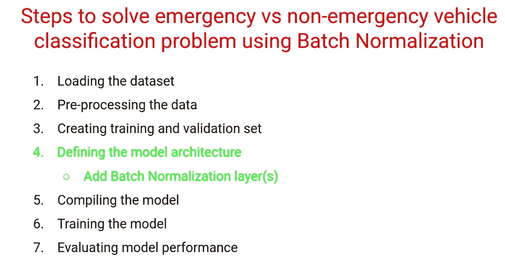

此外，在实际会话中，我们看到使用批量归一化，我们的模型收敛更快，并在更少的历元数中实现了更好的准确性。

**使用批量归一化有什么好处？**

*   批量标准化通过标准化隐藏层激活来加速训练过程。
*   平滑损失函数/成本函数。

让我们看看批量标准化的实际实现。

 [## graj pal 123/紧急 _ 非紧急 _ 车辆 _ 图像 _ 分类

github.com](https://github.com/grajpal123/Emergency_Non-Emergency_Vehicle_Image_Classification/blob/main/Batch_Normalization_in_Neural_Networks_using_Keras.ipynb) 

4.**图像放大**。

**我们为什么需要图像增强？**

***图像增强*** *基本上是在训练过程中改变已有的数据，以便为模型创造更多的数据。*

深度学习模型在拥有大量数据时效果很好。数据越多，模型的性能越好。但是获取大量数据也带来了挑战。每次我们都不会有大量的数据输入网络。

如果我们回忆一下紧急和非紧急分类，我们只有 2300 张图片。此外，收集数据变得太昂贵，这可能导致数据短缺，因为我们的深度学习模型无法从数据中学习模式，因此它可能不会提供良好的性能。所以，在这种情况下 ***图像增强*** 进入画面。

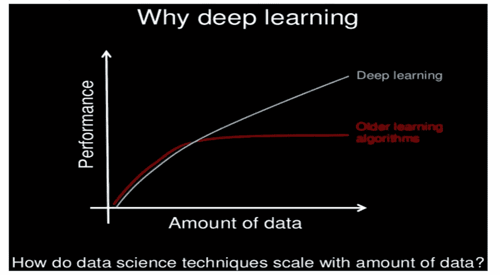

来源:Vidhya 分析

我们可以使用图像增强技术，从原始图像生成新的图像，而不是花费数天时间手动收集数据。有了图像增强，我们不再手动收集数据。同时，增加了训练样本的数量。

考虑下图，其中我们在左侧有原始图像形式的训练数据，剩下的是从图像增强中获得的图像样本

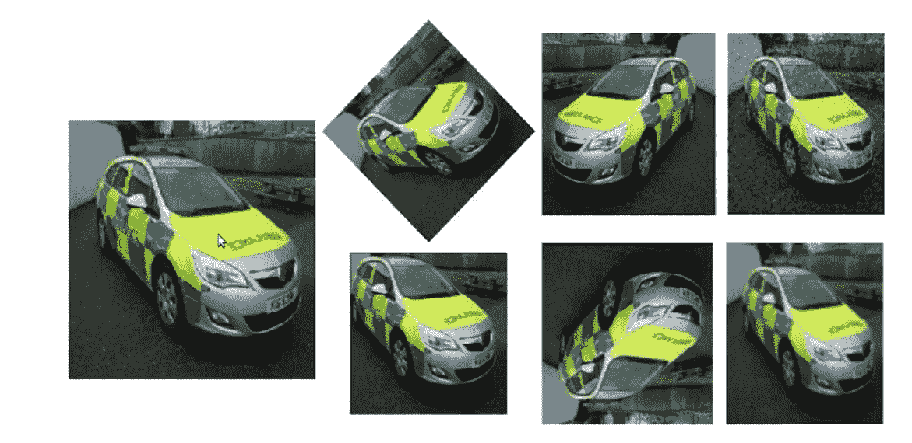

来源:Vidhya 分析

**图像增强技术。**

1.  *图像旋转*:这是最常用的手法之一。即使我们旋转图像，图像的信息保持不变。即使从不同的角度看，猫也是猫。

来源:Vidhya 分析

2.*图像移动*:如果我们使用这种技术，我们可以改变物体在图像中的位置，从而给模型更多的变化，这可以导致更一般化的模型。基本上是几何变换，将图像中每个对象的位置映射到最终图像中的新位置。出现在输入图像中的位置(X，Y)上的对象被移动到新的位置(X，Y)，其中 X = x + dx，Y = x + dy。这里 dx 和 dy 分别是沿不同方向的位移。

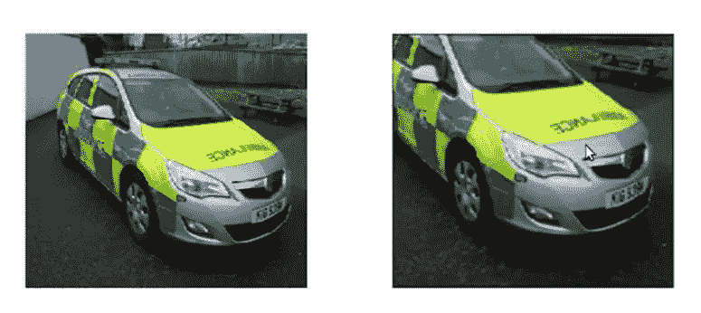

来源:Vidhya 分析

3.*图像翻转*:翻转可以认为是旋转的延伸。它允许我们在左右方向或上下方向翻转图像。最左边的图像是来自训练集的原始图像，另外两个图像是翻转图像。

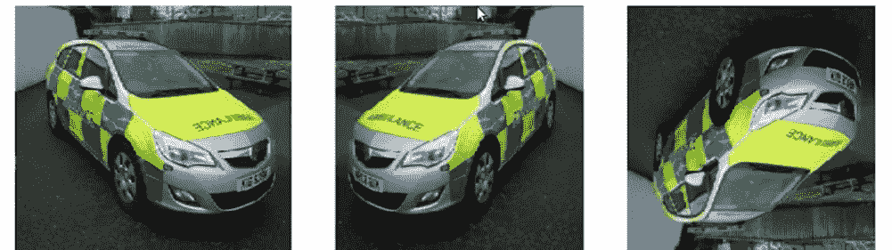

来源:Vidhya 分析

4.*图像噪声*:这是另一种流行的技术，我们将噪声添加到图像中，这基本上有助于我们的模型将图像中的信号与噪声分开。这使得我们的模型对输入图像的变化更加鲁棒。

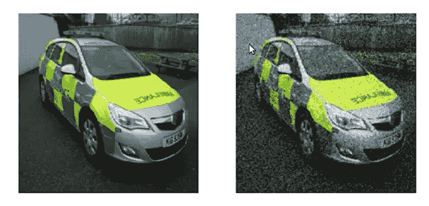

来源:Vidhya 分析

5.*图像模糊*:图像来源不同。一些可能是高质量图像，而一些可能是低质量图像。在这种情况下，我们可以模糊原始的高质量图像，这将使我们的模型对图像的变化更加鲁棒。

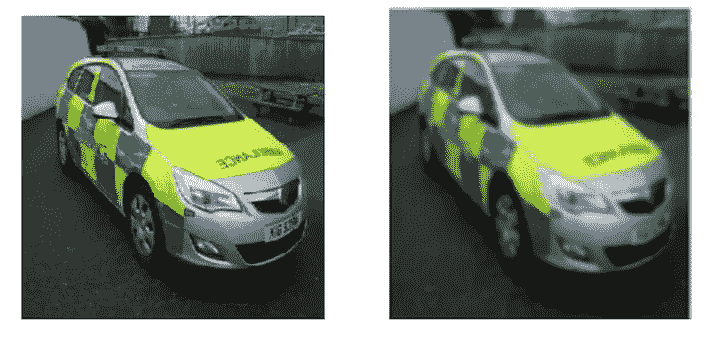

来源:Vidhya 分析

让我们看看图像增强的实际实现。

 [## graj pal 123/紧急 _ 非紧急 _ 车辆 _ 图像 _ 分类

github.com](https://github.com/grajpal123/Emergency_Non-Emergency_Vehicle_Image_Classification/blob/main/Image_Augmentation_Techniques.ipynb) 

5.**模型检查点。**

这项技术是另一项重要的技术，用于建立我们的神经网络模型。它具有以下优点:

*   **在训练过程中为我们保存最好的模型**。

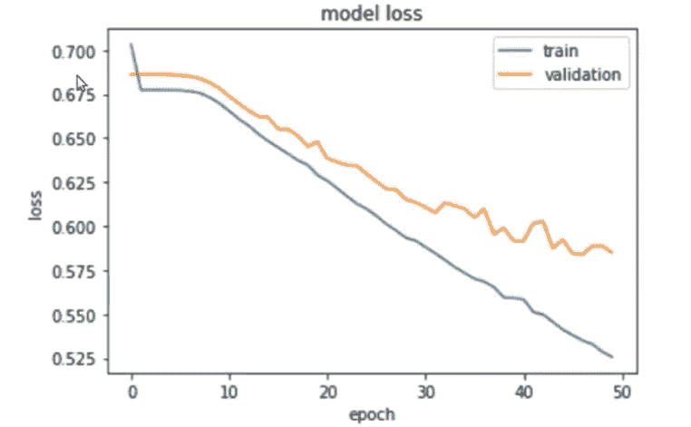

来源:Vidhya 分析

在上图中，在进行预测时，将使用在最后时期存储的权重和偏差。因此，该模型将训练到指定的历元数，在我们的情况下是 50，并且在最后一个历元期间学习的参数将用于进行预测。但是，如果我们仔细观察该图，最佳验证损失是在第 45 个纪元时实现的。

让我们看看模型历史，以便更清楚地理解它。

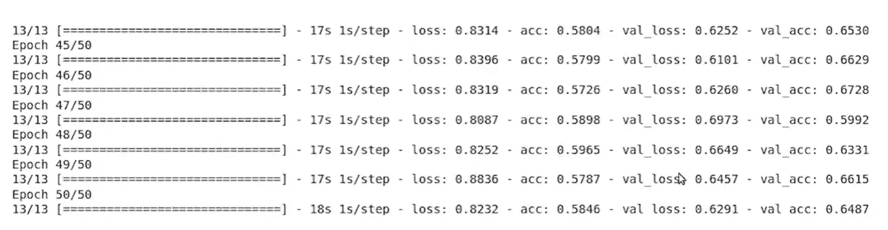

来源:Vidhya 分析

因此，通过模型检查点，而不是保存上一个模型或上一个时期的参数，我们将保存产生最佳结果的模型，该模型被称为最佳模型。

*   如果系统出现故障，我们不会丢失太多信息，因为模型会被不断保存。

因此，在理解了模型检查点背后的直觉之后，我们一定想知道它是如何保存最佳模型的。因此，为了回答这个问题，我们在 keras 中定义了两个参数，即*监视器&模式。*

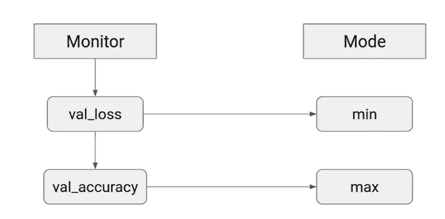

来源:Vidhya 分析

让我们看看模型检查点的实际实现。

 [## graj pal 123/紧急 _ 非紧急 _ 车辆 _ 图像 _ 分类

github.com](https://github.com/grajpal123/Emergency_Non-Emergency_Vehicle_Image_Classification/blob/main/Model%20Checkpointing%20in%20Keras.ipynb) 

所以，这些技术可以用来改进我们的深度学习模型。让我们将它们结合起来，看看我们的模型的性能。

以下是实际实施环节。你可以点击我的 GitHub 个人资料获取这部分的代码和数据集。请参考 ***紧急与非紧急—修改版. ipynb.***

 [## graj pal 123/紧急 _ 非紧急 _ 车辆 _ 图像 _ 分类

github.com](https://github.com/grajpal123/Emergency_Non-Emergency_Vehicle_Image_Classification) 

此外，如果您只是有兴趣观看该器件的演示，请访问下面的。

 [## nbviewer 笔记本

nbviewer.jupyter.org](https://nbviewer.jupyter.org/github/grajpal123/Emergency_Non-Emergency_Vehicle_Image_Classification/blob/main/EMERGENCY%20vs%20NON-EMERGENCY%20-%20MODIFIED%20VERSION.ipynb) 

C **结论**

因此，在这篇博客中，我们已经学会了如何使用人工神经网络来解决图像分类问题。我们还看到了各种即兴技术，如*提前停止、放弃、批处理规范化、模型检查点*，这些技术可以用来改进我们的深度学习模型。最后，我们结合了所有的技术，并看到了我们的模型的性能。

请务必在 LinkedIn 上联系我:[https://www.linkedin.com/in/gaurav-rajpal/](https://www.linkedin.com/in/gaurav-rajpal/)

***敬请关注演示项目的进一步更新，我们将在卷积神经网络中处理图像数据集。***

问候，

高拉夫·拉杰帕尔·(gauravrajpal1994@gmail.com)