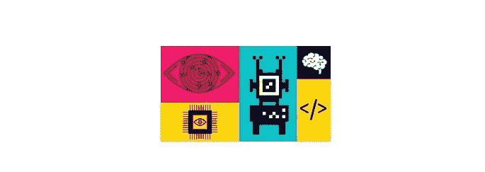

# 利用人工神经网络进行图像分类

> 原文：<https://medium.com/analytics-vidhya/image-classification-using-artificial-neural-network-61637c7c6f9f?source=collection_archive---------3----------------------->

## 使用深度学习模型在图像上识别模式和提取特征

SPCA 每年接纳 7000 到 9000 只动物。其中一半是被遗弃的宠物，如猫、狗、兔子和豚鼠。确认宠物需要时间，因此延长了登记领养的等待时间。