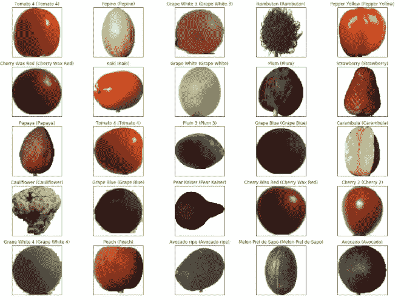

# 基于 CNN 和迁移学习方法的图像分类

> 原文：<https://medium.com/analytics-vidhya/image-classification-using-cnn-and-transfer-learning-approaches-8be8ffe4ff39?source=collection_archive---------4----------------------->

*本博客阐述了使用卷积神经网络和迁移学习方法的深度学习*


**世界各地的超市**需要**将不同的水果**集中起来，放到正确的货架上，贴上正确的价格**。这并不容易，尤其是现在每种水果都有很多种，彼此之间差别很小，甚至人眼都分不清。**

为了解决这个问题，机器学习和深度学习技术可能非常有用，因为这些技术的发展，特别是在神经网络领域，在过去十年中已经取得了巨大的进步。

在这篇博客中，我将探索深度学习方法。数据集和问题取自 Kaggle。以下是相同内容的链接:

[https://www.kaggle.com/moltean/fruits/tasks](https://www.kaggle.com/moltean/fruits/tasks)

**探索的方法** :-

1)构建**卷积层**以及最大池

2)从 VGG16 开始使用 T **转移学习**方法，然后添加一些额外的卷积层以及最大池层。

我使用 google Colab，因为它提供了一个免费的 GPU，并允许我们使用驱动器库。

该数据集包含 120 种水果的大约 83000 张图片。

我将使用 kaggle API 将庞大的数据集下载到 drive 中，并使用 Colab 获取它们。

让我们开始吧:

```
*#unzipping training folder*

!unzip -uq "/content/gdrive/My Drive/kaggle/Training.zip" -d "/content/gdrive/My Drive/kaggle"*#unzipping test folder*  !unzip -uq "/content/gdrive/My Drive/kaggle/Test.zip" -d "/content/gdrive/My Drive/kaggle"*#import necessary libraries*

**import** **numpy** **as** **np**
**import** **matplotlib.pyplot** **as** **plt**
**from** **sklearn.datasets** **import** load_files
**from** **keras.utils** **import** np_utils
**from** **sklearn.model_selection** **import** train_test_split
**from** **keras.preprocessing.image** **import** array_to_img, img_to_array, load_img
**from** **keras.models** **import** Sequential
**from** **keras.layers** **import** Conv2D,MaxPooling2D
**from** **keras.layers** **import** Activation, Dense, Flatten, Dropout
**from** **keras.preprocessing.image** **import** ImageDataGenerator
**from** **keras.callbacks** **import** ModelCheckpoint
**from** **keras** **import** backend **as** K
```

现在我已经导入了所有必要的库，我将导入不同文件夹中的训练和测试数据。训练和测试文件夹包含 120 个文件夹，每个文件夹中有不同的水果图像。

```
*# Loading data and putting them into training and test sets*

*#locations setting for training and test datasets*
train_data='/content/gdrive/My Drive/kaggle/Training'
test_data='/content/gdrive/My Drive/kaggle/Test'

*#creates X_train and Y_train using file_names and folders*
**def** get_data(path):
    data = load_files(path)
    files = np.array(data['filenames'])
    targets = np.array(data['target'])
    target_labels = np.array(data['target_names'])
    **return** files,targets,target_labels

X_train, Y_train, labels = get_data(train_data)
X_test, Y_test,_ = get_data(test_data)
Y_train = np_utils.to_categorical(Y_train, 120)
Y_test = np_utils.to_categorical(Y_test, 120)
```

现在，让我们将数据集分成训练集和验证集。

```
*# splitting train set into training and validation sets*

X_train, X_val = train_test_split(X_train, test_size=0.2, random_state=33)
Y_train, Y_val = train_test_split(Y_train, test_size=0.2, random_state=33)
```

现在我们已经为训练和测试创建了单独的 x 和 y，让我们将图像加载到数组格式中(使用像素值)。

```
*#converting images into array to start computation*

**def** convert_image_to_array(files):
    images_as_array=[]
    **for** file **in** files:
        images_as_array.append(img_to_array(load_img(file)))
    **return** images_as_array

X_train = np.array(convert_image_to_array(X_train))
X_val = np.array(convert_image_to_array(X_val))
X_test = np.array(convert_image_to_array(X_test))
```

由于 255 是最大可能的像素值，我们将使用除以 255 来归一化我们的输入 y。标准化输入有助于神经网络运行得更快，否则它会像碗中的球一样绕来绕去，直到达到最小目标点。

```
*#nomalizing the pixel values before feeding into a neural network*

X_train = X_train.astype('float32')/255
X_val = X_val.astype('float32')/255
X_test = X_test.astype('float32')/255
```

**方法 1** — **定制 CNN**

现在，让我们从使用定制卷积神经网络的第一种方法开始。CNN 是帮助神经网络学习**空间和相关特征**的神奇技术。在 CNN 出现之前，空间信息很难被学习到神经网络中，因为所有的数据都是以扁平的格式输入的。CNN 帮助神经网络学习图像的各个区域(如边缘、眼睛等)之间的关系。神经网络越深入，学习的复杂特征就越多。

在这里，作为方法 1，我们将使用 2 X 2 过滤器，并随着深度增加层数，使用 2 X 2 max-pooling 层，该层在特定区域选择最大值。

我们将使用 RELU 激活函数来消除线性以学习复杂的特征。

我们将使用 **dropout** 正则化，它使用我们将定义的概率来选择节点，这将有助于防止模型过拟合。

最后，一个 **softmax** 单元将用于分类和寻找损失函数。

```
*#Building model 1 using customized convolutional and pooling layers*

model = Sequential()

*#input_shape is 100*100 since thats the dimension of each of the fruit images*
model.add(Conv2D(filters = 16, kernel_size = 2,input_shape=(100,100,3),padding='same'))
model.add(Activation('relu'))
model.add(MaxPooling2D(pool_size=2))

model.add(Conv2D(filters = 32,kernel_size = 2,activation= 'relu',padding='same'))
model.add(MaxPooling2D(pool_size=2))

model.add(Conv2D(filters = 64,kernel_size = 2,activation= 'relu',padding='same'))
model.add(MaxPooling2D(pool_size=2))

model.add(Conv2D(filters = 128,kernel_size = 2,activation= 'relu',padding='same'))
model.add(MaxPooling2D(pool_size=2))*# specifying parameters for fully connected layer*
model.add(Dropout(0.3))
model.add(Flatten())
model.add(Dense(150))
model.add(Activation('relu'))
model.add(Dropout(0.4))
model.add(Dense(120,activation = 'softmax'))
model.summary()
```

这是我们模型的结构:


为了加快我们的训练，我们将使用**亚当优化器**代替随机梯度下降。Adam 利用 momentum 和 rmsprop，带领我们快速达到优化值。

```
*#importing ootimizers*

**from** **keras.optimizers** **import** SGD, Adam, RMSprop

optimizer = Adam()
model.compile(loss='categorical_crossentropy',
              optimizer=optimizer,
              metrics=['accuracy'])
```

是时候适应我们的模型了。我们将使用 128 个的**批量，并检查**的 20 个时期**。**

```
*# creating a file to save the trained CNN model* 
checkpointer = ModelCheckpoint(filepath = 'cnn_from_scratch_fruits.hdf5', verbose = 1, save_best_only = **True**)

*# fitting model using above defined layers* 
CNN_model = model.fit(X_train,Y_train,
        batch_size = 128,
        epochs=20,
        validation_data=(X_val, Y_val),
        callbacks = [checkpointer],
        verbose=2, shuffle=**True**)
```

为说明起见，显示了最后 4 个时期:


```
*#checking testset accuracy*

score = model.evaluate(X_test, Y_test)
print('Test accuracy:', score[1])
```


嗯，它给出了一个惊人的结果，精度为 0.995 ，这对人眼来说也很难。想象一下深度学习和神经网络的力量。有卷积层的神经网络确实很神奇。

为了获得更多的兴奋，让我们想象一下它预测的水果的名字以及实际的名字和图像。

```
*# using model to predict on test data*
Y_pred = model.predict(X_test)

*# Lets plot the predictions of different fruits and check their original labels*

fig = plt.figure(figsize=(20, 15))
**for** i, idx **in** enumerate(np.random.choice(X_test.shape[0], size=25, replace=**False**)):
    ax = fig.add_subplot(5, 5, i + 1, xticks=[], yticks=[])
    ax.imshow(np.squeeze(X_test[idx]))
    pred_idx = np.argmax(Y_pred[idx])
    true_idx = np.argmax(Y_test[idx])
    ax.set_title("**{}** (**{}**)".format(labels[pred_idx], labels[true_idx]),
                 color=("green" **if** pred_idx == true_idx **else** "red"))
```



现在，让我们看看当模型训练 20 个时期时，损失函数和准确度如何变化

```
*#plotting the loss function and accuracy for different epochs*

plt.figure(1, figsize = (10, 10))  
plt.subplot(211)  
plt.plot(CNN_model.history['acc'])  
plt.plot(CNN_model.history['val_acc'])  
plt.title('Model Accuracy')  
plt.ylabel('Accuracy')  
plt.xlabel('Epoch')  
plt.legend(['train', 'validation'], loc='upper left')   

*# plotting model loss* 
plt.subplot(212)  
plt.plot(CNN_model.history['loss'])  
plt.plot(CNN_model.history['val_loss'])  
plt.title('Model Loss')  
plt.ylabel('Loss')  
plt.xlabel('Epoch')  
plt.legend(['train', 'validation'], loc='upper left')  
plt.show()
```


**方法 2** : **对基础层使用迁移学习，并添加更多卷积层和池层**

在这种方法中，我们将使用迁移学习来准备基础层。 **VGG16** 是在 **imagenet** 数据集上训练的神经网络架构，用于对 1000 幅不同的图像进行分类，我们将使用已经在 VGG16 上训练的权重用于我们的方法 2。

```
*#importing vgg16*

*#Part 2 using transfer learning*

*#importing vgg16 architecture which is trained on Imagenet*

**from** **keras.applications.vgg16** **import** VGG16

vgg_model = VGG16(input_shape=[100,100,3], weights='imagenet', include_top=**False**)*#We will not train the layers imported.*

**for** layer **in** vgg_model.layers:
   layer.trainable = **False
**  *
#summary of the imported vgg model*  vgg_model.summary()
```

以下是 vgg16 外观的总结:


我们将向 vgg 模型添加一个具有 1024 个过滤器的卷积层，随后是最大池层和密集层，并在 fruits 数据集上拟合该模型，并遵循上述相同的过程。

```
*#adding some layers to the vgg_model imported and again fitting the model to check the performance*

transfer_learning_model = Sequential()

transfer_learning_model.add(vgg_model)

transfer_learning_model.add(Conv2D(1024, kernel_size=3, padding='same'))

transfer_learning_model.add(Activation('relu'))

transfer_learning_model.add(MaxPooling2D(pool_size=(2, 2)))
transfer_learning_model.add(Dropout(0.3))

transfer_learning_model.add(Flatten())
transfer_learning_model.add(Dense(150))
transfer_learning_model.add(Activation('relu'))
transfer_learning_model.add(Dropout(0.4))
transfer_learning_model.add(Dense(120,activation = 'softmax'))
transfer_learning_model.summary()
```


```
**from** **keras.optimizers** **import** SGD, Adam, RMSprop

optimizer = Adam()
transfer_learning_model.compile(loss='categorical_crossentropy',
              optimizer=optimizer,
              metrics=['accuracy'])*#fitting the new model*

checkpointer = ModelCheckpoint(filepath = 'transfer_learning.hdf5', verbose = 1, save_best_only = **True**)

*# running* 
transfer_learning_cnn = transfer_learning_model.fit(X_train,Y_train,
        batch_size = 128,
        epochs=20,
        validation_data=(X_val, Y_val),
        callbacks = [checkpointer],
        verbose=2, shuffle=**True**)
```

最近 4 个时期:


```
*#score of the new model built using transfer learning*

score = transfer_learning_model.evaluate(X_test, Y_test)
print('Test accuracy:', score[1])
```


我们可以看到精度下降了一点，但想象一下，我们甚至没有像在我们的第一种方法中那样建立一个复杂的层。我们只是使用了来自 vgg16 的权重，并添加了 1 层，即使这样，大约 0.98 的精度也不差。


```
*#plotting curves for the transfer learning model*

plt.figure(1, figsize = (10, 10))  
plt.subplot(211)  
plt.plot(transfer_learning_cnn.history['acc'])  
plt.plot(transfer_learning_cnn.history['val_acc'])  
plt.title('Model Accuracy')  
plt.ylabel('Accuracy')  
plt.xlabel('Epoch')  
plt.legend(['train', 'validation'], loc='upper left')   

*# plotting model loss* 
plt.subplot(212)  
plt.plot(transfer_learning_cnn.history['loss'])  
plt.plot(transfer_learning_cnn.history['val_loss'])  
plt.title('Model Loss')  
plt.ylabel('Loss')  
plt.xlabel('Epoch')  
plt.legend(['train', 'validation'], loc='upper left')  
plt.show()
```


如果我们拥有强大的计算能力，还能做些什么来提高方法 1 的准确性？

1) **数据增强**:我们可以通过使用增强技术来增加我们的训练集，如旋转图像、裁剪图像等，这可以产生更大的训练集，因此可以产生更好的准确性。

2) **更复杂的层**:我们可以尝试构建更复杂的层，例如再次训练所有的 vgg 层，这可能会导致更好的准确性

3) **超参数调整**:我们可以尝试使用不同的正则化技术，将参数网格用于动量参数、正则化参数、rmsprop 参数、学习率等，这可能会导致更好的结果。

4) **增加周期数**:我们可以运行更多的周期，尝试不同的批量。

希望你在 CNN 和迁移学习上获得了一些直觉。如果你喜欢，请鼓掌。

谢谢你，一定要发表一些反馈。