# PyTorch 中基于 CNN 的图像分类

> 原文：<https://medium.com/analytics-vidhya/image-classification-using-cnn-in-pytorch-65b1968d9e1f?source=collection_archive---------6----------------------->

在本文中，我们将在 PyTorch 中讨论使用 CNN 的多类图像分类，这里我们将使用 Inception v3 深度学习架构。

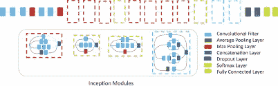

初始架构

# 从这篇文章中吸取教训

*   你将学习更深入的卷积神经网络进行图像分类
*   为什么 PyTorch 比其他框架更灵活
*   将 Inception v3 与 cifar10 数据集一起使用。

什么是卷积神经网络？

在深度学习中，卷积神经网络是一类深度神经网络，最常用于分析视觉图像。基于它们的共享权重架构和平移不变性特征，它们也被称为移位不变或空间不变人工神经网络。

# 使用的数据集:-CIFS ar 10 数据集

# 关于使用的数据集:-

[CIFAR-10](http://www.cs.toronto.edu/~kriz/cifar.html) 是一个已建立的用于物体识别的计算机视觉数据集。它是[8000 万微小图像数据集](http://groups.csail.mit.edu/vision/TinyImages/)的子集，由 60，000 张 32x32 彩色图像组成，包含 10 个对象类中的一个，每个类 6000 张图像。它由亚历克斯·克里热夫斯基、维诺德·奈尔和杰弗里·辛顿收藏。

Kaggle 正在为机器学习社区主办一个 CIFAR-10 排行榜，用于娱乐和练习。你可以在罗德里戈·贝纳森的[分类结果页面](http://rodrigob.github.io/are_we_there_yet/build/classification_datasets_results.html)上看到你的方法与最新研究方法的对比。

# 用于代码实现的 Git hub 链接:-https://git hub . com/vats manish/Inception-v3-with-py torch

# 《盗梦空间》第三版:-

 [## 重新思考计算机视觉的初始架构

### 卷积网络是大多数最先进的计算机视觉解决方案的核心，适用于各种各样的任务…

arxiv.org](https://arxiv.org/abs/1512.00567) 

有一种简单但强大的方法来创建更好的深度学习模型。你可以做一个更大的模型，无论是深度，也就是层数，还是每层中神经元的数量。但是正如你所想象的，这经常会造成复杂的情况:

*   **模型越大，越容易过度拟合。**当训练数据很小时，这一点尤其明显
*   **增加参数数量意味着您需要增加现有的计算资源**

正如该论文所建议的，解决这一问题的方法是转向稀疏连接的网络架构，它将取代全连接的网络架构，尤其是在卷积层内部。这个想法可以在下面的图片中概念化:

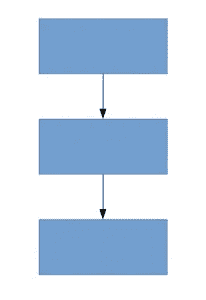

密集连接的架构

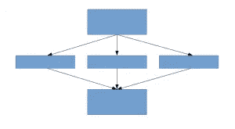

稀疏连接的架构

本文提出了创造深层建筑的新思路。这种方法可以让您保持“计算预算”，同时增加网络的深度和宽度。听起来好得难以置信！概念化的想法看起来是这样的:

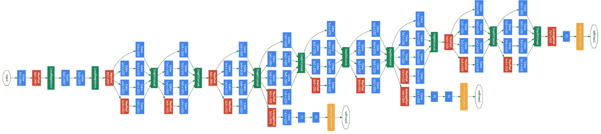

让我们更详细地看一下提议的架构。

# 提议的建筑细节

本文提出了一种新型架构——Google net 或 Inception v1。基本上就是一个 27 层深的卷积神经网络(CNN)。以下是模型总结:

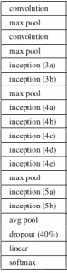

请注意，在上面的图像中，有一个层称为初始层。这实际上是论文方法背后的主要思想。初始层是稀疏连接架构的核心概念。

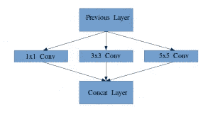

一个初始模块的想法

让我更详细地解释一下什么是初始层。从报纸上摘录:

> “(初始层)是所有这些层(即 1×1 卷积层、3×3 卷积层、5×5 卷积层)的组合，它们的输出滤波器组连接成一个输出向量，形成下一级的输入。”

除了上面提到的层，在最初的初始层中还有两个主要的附加组件:

*   1×1 卷积层，然后应用另一层，主要用于降维
*   并行最大池层，为初始层提供了另一种选择

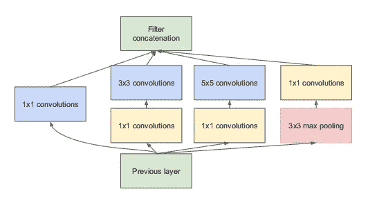

初始层

为了理解起始层结构的重要性，作者引用了人类学习的赫布边原理。上面写着“一起放电的神经元，连接在一起”。作者建议**在深度学习模型中创建后续层时，应该注意前一层的学习。**

例如，假设我们深度学习模型中的一个层已经学会专注于面部的单个部分。网络的下一层可能会集中在图像中的整个面部，以识别那里存在的不同物体。现在要真正做到这一点，该层应该有适当的过滤器大小来检测不同的对象。

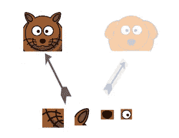

这就是先启层脱颖而出的地方。它允许内部层挑选与学习所需信息相关的过滤器尺寸。因此，即使图像中人脸的大小不同(如下图所示)，图层也会相应地识别人脸。对于第一幅图像，它可能需要较大的过滤器尺寸，而对于第二幅图像，它将需要较小的过滤器尺寸。

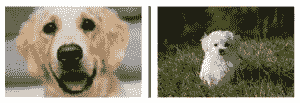

包含所有规格的整体架构如下所示:

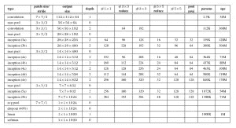

## 使用 Pytorch 在 cifar10 数据集上实施 Inception v3 分步代码解释

我曾经用 google colab(gpu)来训练模型，用 google colab(cpu)来测试。

1 —导入有用的库并安装 google drive。

```
from collections import namedtuple

import torch
import torch.nn as nn
import torch.nn.functional as F __all__ = ['Inception3', 'inception_v3']

_InceptionOutputs = namedtuple('InceptionOutputs', ['logits', 'aux_logits'])Mount Drive
from google.colab import drive
drive.mount('/content/drive')Change the path
import os
if not os.path.exists('/content/drive/My Drive/Inception_CIFAR10/'):
  os.makedirs('/content/drive/My Drive/Inception_CIFAR10/')
os.chdir('/content/drive/My Drive/Inception_CIFAR10/')
```

2 —从头开始第三版

```
def inception_v3(pretrained=False, **kwargs):
  if pretrained:
    if 'transform_input' not in kwargs:
      kwargs['transform_input'] = True
    if 'aux_logits' in kwargs:
      original_aux_logits = kwargs['aux_logits']
      kwargs['aux_logits'] = True
    else:
      original_aux_logits = True
    model = Inception3(**kwargs)
    if not original_aux_logits:
      model.aux_logits = False
    return model

  return Inception3(**kwargs)
```

3-我们将从头开始制作模型，因此将模型返回到参数，因此将关键字返回到我们的模型。**kwargs 允许你传递**关键字**可变长度的参数给一个函数。如果你想在一个函数中处理**命名参数**，你应该使用**kwargs。这里有一个例子可以帮助你理解:

```
class Inception3(nn.Module):

  def __init__(self, num_classes=10, aux_logits=True, transform_input=True):
    super(Inception3, self).__init__()
    self.aux_logits = aux_logits
    self.transform_input = transform_input
    self.Conv2d_4a_3x3 = BasicConv2d(3, 32, kernel_size=3,padding=1)
    self.Mixed_5b = InceptionA(32, pool_features=8)
    self.Mixed_5c = InceptionA(64, pool_features=72)
    self.Mixed_6a = InceptionB(128)
    self.Mixed_6b = InceptionC(256, channels_7x7=64)
    if aux_logits:
      self.AuxLogits = InceptionAux(512, num_classes)
    self.Mixed_7a = InceptionD(512)
    self.fc = nn.Linear(768, num_classes)

    for m in self.modules():
      if isinstance(m, nn.Conv2d) or isinstance(m, nn.Linear):
        import scipy.stats as stats
        stddev = m.stddev if hasattr(m, 'stddev') else 0.1
        X = stats.truncnorm(-2, 2, scale=stddev)
        values = torch.as_tensor(X.rvs(m.weight.numel()), dtype=m.weight.dtype)
        values = values.view(m.weight.size())
        with torch.no_grad():
          m.weight.copy_(values)
      elif isinstance(m, nn.BatchNorm2d):
        nn.init.constant_(m.weight, 1)
        nn.init.constant_(m.bias, 0)

  def forward(self, x):
    global aux
    print(x.shape) 
    x = self.Conv2d_4a_3x3(x)
    x = self.Mixed_5b(x)
    x = self.Mixed_5c(x)
    x = self.Mixed_6a(x)
    x = self.Mixed_6b(x)
    if self.training and self.aux_logits:
      aux = self.AuxLogits(x)
    x = self.Mixed_7a(x)
    x = F.adaptive_avg_pool2d(x, (1, 1))
    x = F.dropout(x, training=self.training)
    x = torch.flatten(x, 1)
    x = self.fc(x)
    print(x.shape)
    if self.training and self.aux_logits:
      return _InceptionOutputs(x, aux)
    return x
```

4 —这里我们定义了一个类，并传递我们拥有的类的数量 10。`aux_logits`只会在`train()`模式下返回，所以确保在下一个纪元和 transform_input 说改变图像形状之前激活它。

```
class InceptionA(nn.Module):

  def __init__(self, in_channels, pool_features):
    super(InceptionA, self).__init__()
    self.branch1x1 = BasicConv2d(in_channels, 8, kernel_size=1)

    self.branch5x5_1 = BasicConv2d(in_channels, 8, kernel_size=1)
    self.branch5x5_2 = BasicConv2d(8, 16, kernel_size=5, padding=2)

    self.branch3x3dbl_1 = BasicConv2d(in_channels, 8, kernel_size=1)
    self.branch3x3dbl_2 = BasicConv2d(8, 16, kernel_size=3, padding=1)
    self.branch3x3dbl_3 = BasicConv2d(16, 32, kernel_size=3, padding=1)

    self.branch_pool = BasicConv2d(in_channels, pool_features, kernel_size=1)

  def forward(self, x):
    branch1x1 = self.branch1x1(x)

    branch5x5 = self.branch5x5_1(x)
    branch5x5 = self.branch5x5_2(branch5x5)

    branch3x3dbl = self.branch3x3dbl_1(x)
    branch3x3dbl = self.branch3x3dbl_2(branch3x3dbl)
    branch3x3dbl = self.branch3x3dbl_3(branch3x3dbl)

    branch_pool = F.avg_pool2d(x, kernel_size=3, stride=1, padding=1)
    branch_pool = self.branch_pool(branch_pool)

    outputs = [branch1x1, branch5x5, branch3x3dbl, branch_pool]
    return torch.cat(outputs, 1)
```

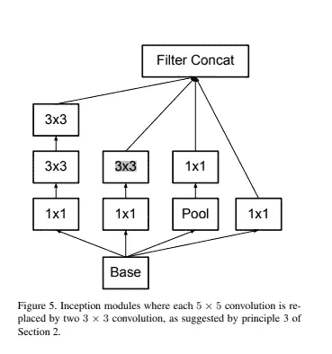

```
class InceptionB(nn.Module):

  def __init__(self, in_channels):
    super(InceptionB, self).__init__()
    self.branch3x3 = BasicConv2d(in_channels, 32, kernel_size=3, stride=2)

    self.branch3x3dbl_1 = BasicConv2d(in_channels, 32, kernel_size=1)
    self.branch3x3dbl_2 = BasicConv2d(32, 64, kernel_size=3, padding=1)
    self.branch3x3dbl_3 = BasicConv2d(64, 96, kernel_size=3, stride=2)

  def forward(self, x):
    branch3x3 = self.branch3x3(x)

    branch3x3dbl = self.branch3x3dbl_1(x)
    branch3x3dbl = self.branch3x3dbl_2(branch3x3dbl)
    branch3x3dbl = self.branch3x3dbl_3(branch3x3dbl)

    branch_pool = F.max_pool2d(x, kernel_size=3, stride=2)

    outputs = [branch3x3, branch3x3dbl, branch_pool]
    return torch.cat(outputs, 1)
```

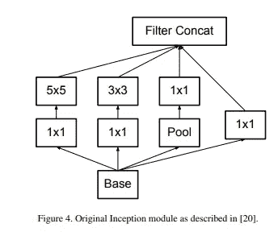

```
class InceptionC(nn.Module):

  def __init__(self, in_channels, channels_7x7):
    super(InceptionC, self).__init__()
    self.branch1x1 = BasicConv2d(in_channels, 128, kernel_size=1)

    c7 = channels_7x7
    self.branch7x7_1 = BasicConv2d(in_channels, c7, kernel_size=1)
    self.branch7x7_2 = BasicConv2d(c7, c7, kernel_size=(1, 7), padding=(0, 3))
    self.branch7x7_3 = BasicConv2d(c7, 128, kernel_size=(7, 1), padding=(3, 0))

    self.branch7x7dbl_1 = BasicConv2d(in_channels, c7, kernel_size=1)
    self.branch7x7dbl_2 = BasicConv2d(c7, c7, kernel_size=(7, 1), padding=(3, 0))
    self.branch7x7dbl_3 = BasicConv2d(c7, c7, kernel_size=(1, 7), padding=(0, 3))
    self.branch7x7dbl_4 = BasicConv2d(c7, c7, kernel_size=(7, 1), padding=(3, 0))
    self.branch7x7dbl_5 = BasicConv2d(c7, 128, kernel_size=(1, 7), padding=(0, 3))

    self.branch_pool = BasicConv2d(in_channels, 128, kernel_size=1)

  def forward(self, x):
    branch1x1 = self.branch1x1(x)

    branch7x7 = self.branch7x7_1(x)
    branch7x7 = self.branch7x7_2(branch7x7)
    branch7x7 = self.branch7x7_3(branch7x7)

    branch7x7dbl = self.branch7x7dbl_1(x)
    branch7x7dbl = self.branch7x7dbl_2(branch7x7dbl)
    branch7x7dbl = self.branch7x7dbl_3(branch7x7dbl)
    branch7x7dbl = self.branch7x7dbl_4(branch7x7dbl)
    branch7x7dbl = self.branch7x7dbl_5(branch7x7dbl)

    branch_pool = F.avg_pool2d(x, kernel_size=3, stride=1, padding=1)
    branch_pool = self.branch_pool(branch_pool)

    outputs = [branch1x1, branch7x7, branch7x7dbl, branch_pool]
    return torch.cat(outputs, 1)class InceptionD(nn.Module):

  def __init__(self, in_channels):
    super(InceptionD, self).__init__()
    self.branch3x3_1 = BasicConv2d(in_channels, 32, kernel_size=1)
    self.branch3x3_2 = BasicConv2d(32,64, kernel_size=3, stride=2)

    self.branch7x7x3_1 = BasicConv2d(in_channels, 32, kernel_size=1)
    self.branch7x7x3_2 = BasicConv2d(32,64, kernel_size=(1, 7), padding=(0, 3))
    self.branch7x7x3_3 = BasicConv2d(64, 128, kernel_size=(7, 1), padding=(3, 0))
    self.branch7x7x3_4 = BasicConv2d(128,192, kernel_size=3, stride=2)

  def forward(self, x):
    branch3x3 = self.branch3x3_1(x)
    branch3x3 = self.branch3x3_2(branch3x3)

    branch7x7x3 = self.branch7x7x3_1(x)
    branch7x7x3 = self.branch7x7x3_2(branch7x7x3)
    branch7x7x3 = self.branch7x7x3_3(branch7x7x3)
    branch7x7x3 = self.branch7x7x3_4(branch7x7x3)

    branch_pool = F.max_pool2d(x, kernel_size=3, stride=2)
    outputs = [branch3x3, branch7x7x3, branch_pool]
    return torch.cat(outputs, 1)class BasicConv2d(nn.Module):

  def __init__(self, in_channels, out_channels, **kwargs):
    super(BasicConv2d, self).__init__()
    self.conv = nn.Conv2d(in_channels, out_channels, bias=False, **kwargs)
    self.bn = nn.BatchNorm2d(out_channels, eps=0.001)

  def forward(self, x):
    x = self.conv(x)
    x = self.bn(x)
    return F.relu(x, inplace=True)
```

5-训练模型

```
# incremental training comments out that line of code.

# Device configuration
device = torch.device('cuda' if torch.cuda.is_available() else 'cpu')

WORK_DIR = './data'
NUM_EPOCHS = 100
BATCH_SIZE = 32
#LEARNING_RATE = 0.01

MODEL_PATH = './model'
MODEL_NAME = 'Inception_v3.pth'

# Create model
if not os.path.exists(MODEL_PATH):
  os.makedirs(MODEL_PATH)

#AUGMENTATIONS
transform = transforms.Compose([
  transforms.RandomCrop(32, padding=4),
  #torchvision.transforms.ColorJitter(brightness=0.2, contrast=0.4, saturation=0.5, hue=0.1),
  transforms.RandomHorizontalFlip(),
  torchvision.transforms.RandomVerticalFlip(),
  # torchvision.transforms.RandomAffine(degrees=0, translate=(0.2,0.2), scale=None,shear=50, resample=False, fillcolor=0),
  torchvision.transforms.RandomRotation((20), resample=False,expand=False, center=None),
  transforms.ToTensor(),
  transforms.Normalize([0.4913997551666284, 0.48215855929893703, 0.4465309133731618], [0.24703225141799082, 0.24348516474564, 0.26158783926049628])
])

# Load data
dataset = torchvision.datasets.CIFAR10(root=WORK_DIR,
                                        download=True,
                                        train=True,
                                        transform=transform)

dataset_loader = torch.utils.data.DataLoader(dataset=dataset,
                                             batch_size=BATCH_SIZE,
                                             shuffle=True)
```

6-现在计算模型中参数的数量

```
# Total parameters
model = inception_v3().to(device)
pytorch_total_params = sum(p.numel() for p in model.parameters())
pytorch_total_params2534260def main():
  print(f"Train numbers:{len(dataset)}")
  LEARNING_RATE = 0.001
  MOMENTUM=0.9
  # first train run this line
  #model = inception_v3().to(device)
  print(model)
  #model_save_name = 'Inception_v3e1.pth'
  model.load_state_dict(torch.load(MODEL_NAME))
  # Load model
  #if device == 'cuda':

    #model = torch.load(MODEL_PATH + MODEL_NAME).to(device)
  #else:
    #model = torch.load(MODEL_PATH + MODEL_NAME, map_location='cpu')
  # cast
  cast = torch.nn.CrossEntropyLoss().to(device)
  # Optimization
  optimizer = torch.optim.SGD(
    model.parameters(),
    lr=LEARNING_RATE,
    momentum=MOMENTUM)
  step = 1
  loss_values=[]
  for epoch in range(1, NUM_EPOCHS + 1):
    print(loss_values)
    model.train()
    running_loss = 0.0

    # cal one epoch time
    start = time.time()
    correct = 0
    total = 0
    for images, labels in dataset_loader:
      images = images.to(device)
      print(images.shape)
      labels = labels.to(device)

      outputs, aux_outputs = model(images)
      loss1 = cast(outputs, labels)
      loss2 = cast(aux_outputs, labels)
      loss = loss1 + 0.4*loss2
      running_loss =+ loss.item() * images.size(0)

      optimizer.zero_grad()
      loss.backward()
      optimizer.step()
      print("epoch: ", epoch)
      print(f"Step [{step * BATCH_SIZE}/{NUM_EPOCHS * len(dataset)}], "
            f"Loss: {loss.item():.8f}.")
      print("Running Loss=",running_loss)
      step += 1
      # equal prediction and acc
      _, predicted = torch.max(outputs.data, 1)
      # val_loader total
      total += labels.size(0)
      # add correct
      correct += (predicted == labels).sum().item()

      print(f"Acc: {correct / total:.4f}.")
        # cal train one epoch time
    end = time.time()
    loss_values.append(running_loss / len(dataset_loader))

    print(f"Epoch [{epoch}/{NUM_EPOCHS}], "
          f"time: {end - start} sec!")

    # Save the model checkpoint
    if epoch%20==0:
    #   LEARNING_RATE=LEARNING_RATE/10
    #   torch.save(model, MODEL_PATH + '/' + MODEL_NAME)

      model_save_name = 'Inception_v3_CIFAR10_32BATCH_lr0.001_crop_bflip_rot'+str(epoch)+'.pth'   #WE keep changing this and saving states ,can be found in excel sheet attached
      torch.save(model.state_dict(), model_save_name)
    print("epoch completed and model copy completed")

  torch.save(model,MODEL_NAME)
  print(f"Model save to {MODEL_PATH + '/' + MODEL_NAME}.")if __name__ == '__main__':
  main()
```

7 —培训准确性

```
Streaming output truncated to the last 5000 lines.
torch.Size([64, 3, 32, 32])
torch.Size([64, 3, 32, 32])
torch.Size([64, 10])
epoch:  96
Step [959296/1000000], Loss: 0.01983919.
Running Loss= 1.2697083950042725
Acc: 0.9987.
torch.Size([64, 3, 32, 32])
torch.Size([64, 3, 32, 32])
torch.Size([64, 10])
epoch:  96
Step [959360/1000000], Loss: 0.01000556.
Running Loss= 0.6403558254241943
Acc: 0.9988.
torch.Size([64, 3, 32, 32])
torch.Size([64, 3, 32, 32])
torch.Size([64, 10])
epoch:  96
Step [959424/1000000], Loss: 0.01426543.
Running Loss= 0.9129873514175415
Acc: 0.9988.
torch.Size([64, 3, 32, 32])
torch.Size([64, 3, 32, 32])
torch.Size([64, 10])
epoch:  96
Step [959488/1000000], Loss: 0.01021658.
Running Loss= 0.6538611650466919
Acc: 0.9988.
torch.Size([64, 3, 32, 32])
torch.Size([64, 3, 32, 32])
torch.Size([64, 10])
epoch:  96
Step [959552/1000000], Loss: 0.01176894.
Running Loss= 0.7532118558883667
Acc: 0.9988.....................................
```

我们的模型对参数的每步(历元)计算量很大。如果您想查看每一步的损失，那么您可以使用我的 git hub 库。

8-测试模型

```
evice = torch.device('cuda' if torch.cuda.is_available() else 'cpu')

WORK_DIR = './data'
BATCH_SIZE = 32

#MODEL_PATH = './model'
#MODEL_NAME = 'Inception_v3.pth'
#MODEL_NAME = "Inception_v3_CIFAR10_32SIZE_512BATCH_102_lr_low_para10.pth"
MODEL_NAME="Inception_v3_CIFAR10_32BATCH_lr0.001_crop_bflip_rot100.pth"

transform = transforms.Compose([
  transforms.ToTensor(),
  transforms.Normalize([0.4913997551666284, 0.48215855929893703, 0.4465309133731618], [0.24703225141799082, 0.24348516474564, 0.26158783926049628])
])
```

9-加载验证数据集

```
dataset = torchvision.datasets.CIFAR10(root=WORK_DIR,
                                        download=True,
                                        train=False,
                                        transform=transform)

dataset_loader = torch.utils.data.DataLoader(dataset=dataset,
                                             batch_size=BATCH_SIZE,
                                             shuffle=True)
```

进行验证并获得验证准确性的代码

```
def main():
  print(f"Val numbers:{len(dataset)}")
  #model = inception_v3().to(device)
  print(model)
  # Load model
  if device == 'cuda':
    #model = torch.load(MODEL_PATH+"/"+MODEL_NAME).to(device)
    model.load_state_dict(torch.load(MODEL_NAME))
  else:
    #model = torch.load(MODEL_PATH+"/"+MODEL_NAME, map_location='cpu')
    model.load_state_dict(torch.load(MODEL_NAME))
  model.eval()

  correct = 0.
  total = 0
  for images, labels in dataset_loader:
    # to GPU
    images = images.to(device)
    labels = labels.to(device)
    # print prediction
    outputs = model(images)
    # equal prediction and acc
    _, predicted = torch.max(outputs.data, 1)
    # val_loader total
    total += labels.size(0)
    # add correct
    correct += (predicted == labels).sum().item()

  print(f"Acc: {correct / total:.4f}.")if __name__ == '__main__':

  main()
```

10-模型摘要

```
Val numbers:10000
Inception3(
  (Conv2d_4a_3x3): BasicConv2d(
    (conv): Conv2d(3, 32, kernel_size=(3, 3), stride=(1, 1), padding=(1, 1), bias=False)
    (bn): BatchNorm2d(32, eps=0.001, momentum=0.1, affine=True, track_running_stats=True)
  )
  (Mixed_5b): InceptionA(
    (branch1x1): BasicConv2d(
      (conv): Conv2d(32, 8, kernel_size=(1, 1), stride=(1, 1), bias=False)
      (bn): BatchNorm2d(8, eps=0.001, momentum=0.1, affine=True, track_running_stats=True)
    )
    (branch5x5_1): BasicConv2d(
      (conv): Conv2d(32, 8, kernel_size=(1, 1), stride=(1, 1), bias=False)
      (bn): BatchNorm2d(8, eps=0.001, momentum=0.1, affine=True, track_running_stats=True)
    )
    (branch5x5_2): BasicConv2d(
      (conv): Conv2d(8, 16, kernel_size=(5, 5), stride=(1, 1), padding=(2, 2), bias=False)
      (bn): BatchNorm2d(16, eps=0.001, momentum=0.1, affine=True, track_running_stats=True)
    )
    (branch3x3dbl_1): BasicConv2d(
      (conv): Conv2d(32, 8, kernel_size=(1, 1), stride=(1, 1), bias=False)
      (bn): BatchNorm2d(8, eps=0.001, momentum=0.1, affine=True, track_running_stats=True)
    )
    (branch3x3dbl_2): BasicConv2d(
      (conv): Conv2d(8, 16, kernel_size=(3, 3), stride=(1, 1), padding=(1, 1), bias=False)
      (bn): BatchNorm2d(16, eps=0.001, momentum=0.1, affine=True, track_running_stats=True)
    )
    (branch3x3dbl_3): BasicConv2d(
      (conv): Conv2d(16, 32, kernel_size=(3, 3), stride=(1, 1), padding=(1, 1), bias=False)
      (bn): BatchNorm2d(32, eps=0.001, momentum=0.1, affine=True, track_running_stats=True)
    )
    (branch_pool): BasicConv2d(
      (conv): Conv2d(32, 8, kernel_size=(1, 1), stride=(1, 1), bias=False)
      (bn): BatchNorm2d(8, eps=0.001, momentum=0.1, affine=True, track_running_stats=True)
    )
  )
  (Mixed_5c): InceptionA(
    (branch1x1): BasicConv2d(
      (conv): Conv2d(64, 8, kernel_size=(1, 1), stride=(1, 1), bias=False)
      (bn): BatchNorm2d(8, eps=0.001, momentum=0.1, affine=True, track_running_stats=True)
    )
    (branch5x5_1): BasicConv2d(
      (conv): Conv2d(64, 8, kernel_size=(1, 1), stride=(1, 1), bias=False)
      (bn): BatchNorm2d(8, eps=0.001, momentum=0.1, affine=True, track_running_stats=True)
    )
    (branch5x5_2): BasicConv2d(
      (conv): Conv2d(8, 16, kernel_size=(5, 5), stride=(1, 1), padding=(2, 2), bias=False)
      (bn): BatchNorm2d(16, eps=0.001, momentum=0.1, affine=True, track_running_stats=True)
    )
    (branch3x3dbl_1): BasicConv2d(
      (conv): Conv2d(64, 8, kernel_size=(1, 1), stride=(1, 1), bias=False)
      (bn): BatchNorm2d(8, eps=0.001, momentum=0.1, affine=True, track_running_stats=True)
    )
    (branch3x3dbl_2): BasicConv2d(
      (conv): Conv2d(8, 16, kernel_size=(3, 3), stride=(1, 1), padding=(1, 1), bias=False)
      (bn): BatchNorm2d(16, eps=0.001, momentum=0.1, affine=True, track_running_stats=True)
    )
    (branch3x3dbl_3): BasicConv2d(
      (conv): Conv2d(16, 32, kernel_size=(3, 3), stride=(1, 1), padding=(1, 1), bias=False)
      (bn): BatchNorm2d(32, eps=0.001, momentum=0.1, affine=True, track_running_stats=True)
    )
    (branch_pool): BasicConv2d(
      (conv): Conv2d(64, 72, kernel_size=(1, 1), stride=(1, 1), bias=False)
      (bn): BatchNorm2d(72, eps=0.001, momentum=0.1, affine=True, track_running_stats=True)
    )
  )
  (Mixed_6a): InceptionB(
    (branch3x3): BasicConv2d(
      (conv): Conv2d(128, 32, kernel_size=(3, 3), stride=(2, 2), bias=False)
      (bn): BatchNorm2d(32, eps=0.001, momentum=0.1, affine=True, track_running_stats=True)
    )
    (branch3x3dbl_1): BasicConv2d(
      (conv): Conv2d(128, 32, kernel_size=(1, 1), stride=(1, 1), bias=False)
      (bn): BatchNorm2d(32, eps=0.001, momentum=0.1, affine=True, track_running_stats=True)
    )
    (branch3x3dbl_2): BasicConv2d(
      (conv): Conv2d(32, 64, kernel_size=(3, 3), stride=(1, 1), padding=(1, 1), bias=False)
      (bn): BatchNorm2d(64, eps=0.001, momentum=0.1, affine=True, track_running_stats=True)
    )
    (branch3x3dbl_3): BasicConv2d(
      (conv): Conv2d(64, 96, kernel_size=(3, 3), stride=(2, 2), bias=False)
      (bn): BatchNorm2d(96, eps=0.001, momentum=0.1, affine=True, track_running_stats=True)
    )
  )
  (Mixed_6b): InceptionC(
    (branch1x1): BasicConv2d(
      (conv): Conv2d(256, 128, kernel_size=(1, 1), stride=(1, 1), bias=False)
      (bn): BatchNorm2d(128, eps=0.001, momentum=0.1, affine=True, track_running_stats=True)
    )
    (branch7x7_1): BasicConv2d(
      (conv): Conv2d(256, 64, kernel_size=(1, 1), stride=(1, 1), bias=False)
      (bn): BatchNorm2d(64, eps=0.001, momentum=0.1, affine=True, track_running_stats=True)
    )
    (branch7x7_2): BasicConv2d(
      (conv): Conv2d(64, 64, kernel_size=(1, 7), stride=(1, 1), padding=(0, 3), bias=False)
      (bn): BatchNorm2d(64, eps=0.001, momentum=0.1, affine=True, track_running_stats=True)
    )
    (branch7x7_3): BasicConv2d(
      (conv): Conv2d(64, 128, kernel_size=(7, 1), stride=(1, 1), padding=(3, 0), bias=False)
      (bn): BatchNorm2d(128, eps=0.001, momentum=0.1, affine=True, track_running_stats=True)
    )
    (branch7x7dbl_1): BasicConv2d(
      (conv): Conv2d(256, 64, kernel_size=(1, 1), stride=(1, 1), bias=False)
      (bn): BatchNorm2d(64, eps=0.001, momentum=0.1, affine=True, track_running_stats=True)
    )
    (branch7x7dbl_2): BasicConv2d(
      (conv): Conv2d(64, 64, kernel_size=(7, 1), stride=(1, 1), padding=(3, 0), bias=False)
      (bn): BatchNorm2d(64, eps=0.001, momentum=0.1, affine=True, track_running_stats=True)
    )
    (branch7x7dbl_3): BasicConv2d(
      (conv): Conv2d(64, 64, kernel_size=(1, 7), stride=(1, 1), padding=(0, 3), bias=False)
      (bn): BatchNorm2d(64, eps=0.001, momentum=0.1, affine=True, track_running_stats=True)
    )
    (branch7x7dbl_4): BasicConv2d(
      (conv): Conv2d(64, 64, kernel_size=(7, 1), stride=(1, 1), padding=(3, 0), bias=False)
      (bn): BatchNorm2d(64, eps=0.001, momentum=0.1, affine=True, track_running_stats=True)
    )
    (branch7x7dbl_5): BasicConv2d(
      (conv): Conv2d(64, 128, kernel_size=(1, 7), stride=(1, 1), padding=(0, 3), bias=False)
      (bn): BatchNorm2d(128, eps=0.001, momentum=0.1, affine=True, track_running_stats=True)
    )
    (branch_pool): BasicConv2d(
      (conv): Conv2d(256, 128, kernel_size=(1, 1), stride=(1, 1), bias=False)
      (bn): BatchNorm2d(128, eps=0.001, momentum=0.1, affine=True, track_running_stats=True)
    )
  )
  (AuxLogits): InceptionAux(
    (conv0): BasicConv2d(
      (conv): Conv2d(512, 128, kernel_size=(1, 1), stride=(1, 1), bias=False)
      (bn): BatchNorm2d(128, eps=0.001, momentum=0.1, affine=True, track_running_stats=True)
    )
    (conv1): BasicConv2d(
      (conv): Conv2d(128, 512, kernel_size=(5, 5), stride=(1, 1), bias=False)
      (bn): BatchNorm2d(512, eps=0.001, momentum=0.1, affine=True, track_running_stats=True)
    )
    (fc): Linear(in_features=512, out_features=10, bias=True)
  )
  (Mixed_7a): InceptionD(
    (branch3x3_1): BasicConv2d(
      (conv): Conv2d(512, 32, kernel_size=(1, 1), stride=(1, 1), bias=False)
      (bn): BatchNorm2d(32, eps=0.001, momentum=0.1, affine=True, track_running_stats=True)
    )
    (branch3x3_2): BasicConv2d(
      (conv): Conv2d(32, 64, kernel_size=(3, 3), stride=(2, 2), bias=False)
      (bn): BatchNorm2d(64, eps=0.001, momentum=0.1, affine=True, track_running_stats=True)
    )
    (branch7x7x3_1): BasicConv2d(
      (conv): Conv2d(512, 32, kernel_size=(1, 1), stride=(1, 1), bias=False)
      (bn): BatchNorm2d(32, eps=0.001, momentum=0.1, affine=True, track_running_stats=True)
    )
    (branch7x7x3_2): BasicConv2d(
      (conv): Conv2d(32, 64, kernel_size=(1, 7), stride=(1, 1), padding=(0, 3), bias=False)
      (bn): BatchNorm2d(64, eps=0.001, momentum=0.1, affine=True, track_running_stats=True)
    )
    (branch7x7x3_3): BasicConv2d(
      (conv): Conv2d(64, 128, kernel_size=(7, 1), stride=(1, 1), padding=(3, 0), bias=False)
      (bn): BatchNorm2d(128, eps=0.001, momentum=0.1, affine=True, track_running_stats=True)
    )
    (branch7x7x3_4): BasicConv2d(
      (conv): Conv2d(128, 192, kernel_size=(3, 3), stride=(2, 2), bias=False)
      (bn): BatchNorm2d(192, eps=0.001, momentum=0.1, affine=True, track_running_stats=True)
    )
  )
  (fc): Linear(in_features=768, out_features=10, bias=True)
)torch.Size([32, 10])
torch.Size([32, 3, 32, 32])
torch.Size([32, 10])
torch.Size([32, 3, 32, 32])
torch.Size([32, 10])
torch.Size([32, 3, 32, 32])
torch.Size([32, 10])
torch.Size([32, 3, 32, 32])
torch.Size([32, 10])
torch.Size([32, 3, 32, 32])
torch.Size([32, 10])
torch.Size([32, 3, 32, 32])
torch.Size([32, 10])
torch.Size([32, 3, 32, 32])
torch.Size([32, 10])
torch.Size([32, 3, 32, 32])
torch.Size([32, 10])
torch.Size([16, 3, 32, 32])
torch.Size([16, 10])
Model accuracy on 10000 test images: 99.95%
```

在这里，我们获得了 99.95%的测试准确性，一些工作也像数据扩充一样执行，这里不解释，所以通过我的 github repo，您也可以派生模型并部署它

模型部署部分:-

[https://github.com/vatsmanish/Deploy_Inception_v3](https://github.com/vatsmanish/Deploy_Inception_v3)

这篇文章越来越长，所以我将在下一部分描述模型的部署。

参考资料:-[https://arxiv.org/pdf/1512.00567.pdf](https://arxiv.org/pdf/1512.00567.pdf)

[](https://www.analyticsvidhya.com/blog/2018/10/understanding-inception-network-from-scratch/) [## 战壕中的深度学习:从零开始理解盗梦空间网络

### 随着越来越多的研究论文从世界各地涌现出来，深度学习正在迅速获得动力。这些文件…

www.analyticsvidhya.com](https://www.analyticsvidhya.com/blog/2018/10/understanding-inception-network-from-scratch/) [](https://github.com/vatsmanish/Inception-v3-with-pytorch/blob/master/InceptionV3FromScratch.ipynb) [## vatsmanish/Inception-v3-with-py torch

### permalink dissolve GitHub 是超过 5000 万开发人员的家园，他们一起工作来托管和审查代码，管理…

github.com](https://github.com/vatsmanish/Inception-v3-with-pytorch/blob/master/InceptionV3FromScratch.ipynb) 

**我的另一篇关于介质的文章:-**[https://medium . com/@ manish . Kumar _ 61520/introduction-to-vector-auto regression-6ec 386 db 387 e](/@manish.kumar_61520/introduction-to-vector-autoregression-6ec386db387e)

[](/@manish.kumar_61520/the-default-of-credit-card-clients-dataset-81908562a67e) [## 信用卡客户数据集的默认值

### 数据集信息

medium.com](/@manish.kumar_61520/the-default-of-credit-card-clients-dataset-81908562a67e)