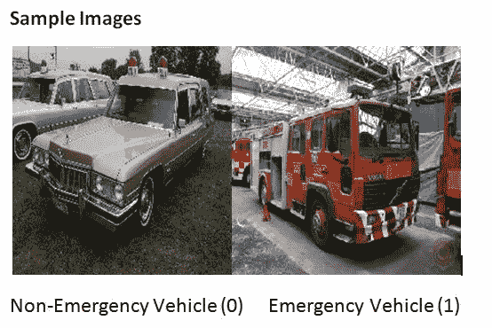

# 使用 Fast.ai 的图像分类

> 原文：<https://medium.com/analytics-vidhya/image-classification-using-fast-ai-a67078f6954e?source=collection_archive---------4----------------------->


**问题陈述:**

问题陈述是将车辆图像分类为属于紧急车辆或非紧急车辆类别。同样，我们提供了训练和测试数据集。

*   急救车辆通常包括警车、救护车和消防队。
*   非紧急车辆包括通常用于通勤的所有其他车辆。



[来源](https://s3-ap-south-1.amazonaws.com/av-blog-media/wp-content/uploads/2018/08/Emgen.jpg)

**数据描述:**

1.  train.csv — ['image_names '，' emergency_or_not']包含 1646 (70%)个列车图像的图像名称和正确类别
2.  图像—包含 2352 幅训练集和测试集的图像
3.  test.csv: ['image_names']仅包含 706 个(30%)测试图像的图像名称

本问题陈述由 Analytics Vidhya 提供:[计算机视觉黑客马拉松](https://datahack.analyticsvidhya.com/contest/janatahack-computer-vision-hackathon/)

让我们快速地将训练和测试图像从用于训练的图像文件夹中分离出来

```
import numpy as np
import pandas as pd
import os
import glob
from PIL import Imagetrain_csv = pd.read_csv('train_av_cv.csv')
test_csv = pd.read_csv('test_av_cv.csv')
path = 'images'
os.chdir(path)train_csv_emergency = train_csv[train_csv['emergency_or_not']==1]
train_csv_non_emergency = train_csv[train_csv['emergency_or_not']==0]for i in range(0,train_csv_emergency.shape[0]):
    name = train_csv_emergency['image_names'].iloc[i]
    im = Image.open(name)
    to_save = 'emergency/'+ name
    im.save(to_save, 'JPEG')

for i in range(0,train_csv_non_emergency.shape[0]):
    name = train_csv_non_emergency['image_names'].iloc[i]
    im = Image.open(name)
    to_save = 'non_emergency/'+ name
    im.save(to_save, 'JPEG')

for i in range(0,test_csv.shape[0]):
    name = test_csv['image_names'].iloc[i]
    im = Image.open(name)
    to_save = 'test_images/'+ name
    im.save(to_save, 'JPEG')
```

让我们来看一下图片的尺寸

```
from PIL import Imagedef get_num_pixels(filepath):
    width, height = Image.open(filepath).size
    return width,heightprint(get_num_pixels("images/1.jpg"))Output: (224,224)
```

既然我们已经分离了训练和测试图像，让我们开始构建分类模型。该解决方案的端到端流程分为以下 6 个步骤:

1.  **读取数据**
2.  **定义模型**
3.  **定义学习率**
4.  **拟合模型**
5.  **解读结果**
6.  **推论**

让我们从**从文件夹**中读取数据开始

ImageDataBunch 帮助我们创建训练、验证和测试数据集

```
xtra = [(contrast(scale=(0.1,2.0), p = 0.5)),
(brightness(change = 0.6, p = 0.25)),
(perspective_warp(magnitude = 0.25, p = 0.25)),
(squish(scale = 1.2, p = 0.25))]augmentations = get_transforms(do_flip=True,flip_vert=False, max_rotate=None, max_zoom=1.5,max_warp=None, p_affine = 0.5, max_lighting=0.2,p_lighting=0.5, xtra_tfms=xtra) data=ImageDataBunch.from_folder('/content/gdrive/My Drive/', train =  'train_images', valid= 'train_images' ,size=224, bs=16, ds_tfms = get_transforms(do_flip=True,
max_rotate=None, ## amount of rotaion
max_zoom=1.2, ## amount of zoom
max_warp=0.2, ## amount of wraping
p_affine = 0.5, ## probability by which above 3 tfms will take place
max_lighting=0.2, ## amount of lightin
p_lighting=0.5 ## probability for lighting))data.normalize(imagenet_stats)#for extra augmentations - 
#ds_tfms = augmentations.normalize(imagenet_stats)
```

让我们检查数据中出现的类

```
data.classesOutput: ['emergency', 'non_emergency']
```

现在让我们**定义模型**

cnn_learner 方法用于快速获得适合迁移学习的模型。简而言之，它是一个用于使用预定义/训练的模型来训练我们的模型的概念。目前，我们正在建立一个模型，该模型将图像作为输入，并将输出每个类别的预测概率。

```
## Defining callbacksSave_Model_Callback=partial(SaveModelCallback, every='improvement', monitor='accuracy', name='av_cv')
EarlyStoppingCallback = partial(EarlyStoppingCallback, monitor='valid_loss', min_delta=0.01, patience=5)#defining model and optimizerlearn  = cnn_learner(data, models.resnet152 , pretrained= True ,opt_func=optim.Adam, metrics=[accuracy,error_rate,FBeta(beta=1),Precision(),Recall()], callback_fns=[Save_Model_Callback,EarlyStoppingCallback])
```

使用预训练模型的原因是为了避免从头开始训练模型。使用 ImageNet 数据集，使用数百万张图像和数千个类别对预训练模型进行了良好的训练。ImageNet 的最后一层由 1000 列组成，对应于 1000 个不同的类别。不能保证预定义的类别包含我们需求的类别，但是有一点我们很有信心，那就是这个模型知道一些东西，并且能够区分一只狗和一辆卡车(比如说)。

有许多针对不同图像数据集进行训练的预训练架构。在这里，我采用了在 ImageNet 数据集上训练的 resnet152。

就优化程序而言，我已经尝试了 Adam 和 SGD，而 Adam 给出了更好的结果。

在训练时可以使用一堆指标，我已经提到了准确性、错误率、FBeta(beta=1)、精度()、召回()。

“保存模型回调”用于在训练期间自动保存新的“最佳损失”模型。在训练结束时，它加载顶部模型。人们可以指定定义最佳模型的标准。我指定的标准是“准确性”。

“EarlyStoppingCallback”用于在损失连续三次增加或损失连续三次变化小于 0.01 时自动停止训练

**定义学习率**

```
# This helps to find best learning rate for model.learn.lr_find()#Plot of LRlearn.recorder.plot()
```

我们可能希望在拟合模型(下一步)时给出学习率，以获得更好的结果。它定义了模型中参数更新的速度。剧情大概是这样的。


考虑曲线显示急剧下降的范围。我们可以观察到，学习率在范围[1e-04，1e-02]内急剧下降。

**拟合模型**

```
num_of_epochs = 20learn.fit_one_cycle(num_of_epochs,max_lr=slice(1e-04,1e-02),moms=(0.95,0.85))learn.recorder.plot_losses()#Iterations Vs LR and Iterations Vs Momslearn.recorder.plot_lr(show_moms=True)#Plot Metrics across Iterationslearn.recorder.plot_metrics()
```

在这里，历元数是整个数据应该通过模型学习的次数。

**解读结果**

```
learn.load('av_cv')interpret=ClassificationInterpretation.from_learner(learn)interpret.plot_confusion_matrix(figsize=(5,5),dpi=100)
```

绘制混淆矩阵有助于我们理解模型的性能。


```
interpret.plot_top_losses(6, heatmap=True)
```

plot_top_losses 显示被错误预测且对损失有最大影响的图像。

**推理**

将模型导出为. pkl 格式，以便在对未知数据进行预测时使用。

```
learn.export('av_cv.pkl')
```

下一步是向学习者加载测试数据并进行预测

```
test = ImageList.from_folder(base_path + 'test_images')learn = load_learner(base_path, file = 'av_cv.pkl', test = test) thresh = 0.5preds, _ = learn.get_preds(ds_type=DatasetType.Test)labelled_preds = [' '.join([learn.data.classes[i] for i,p in enumerate(pred) if p > thresh]) for pred in preds]fnames = [f.name[:-4] for f in learn.data.test_ds.items]df = pd.DataFrame({'image_name':fnames, 'tags':labelled_preds}, columns=['image_name', 'tags'])df.to_csv('fastai_adam.csv', index=False)
```

预测以 csv 文件的形式保存。

**该车型可做出的进一步改进**:

```
learn.freeze_to(-4)
```

freeze_to(-4)冻结除最后四层之外的所有层，并且只在这四层上训练。这可以在定义模型时添加。

可以尝试增加测试时间来改善结果。

**参考文献:**

Fast.ai

[](/analytics-vidhya/image-classification-using-fastai-5ff5b374d414) [## 使用 fastai 的图像分类

### 我将使用 fastai 库来实现图像分类。

medium.com](/analytics-vidhya/image-classification-using-fastai-5ff5b374d414)