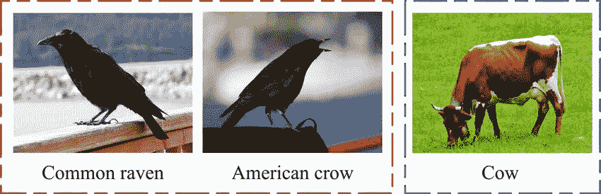
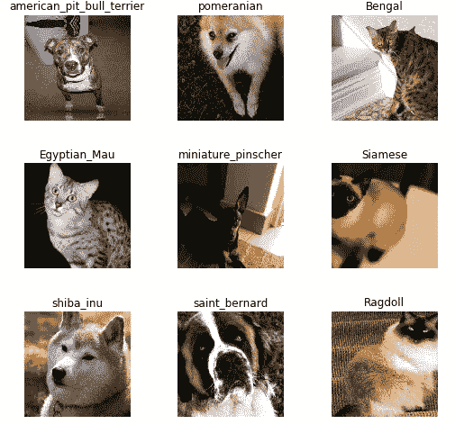
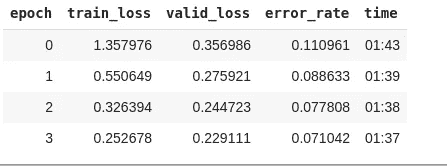
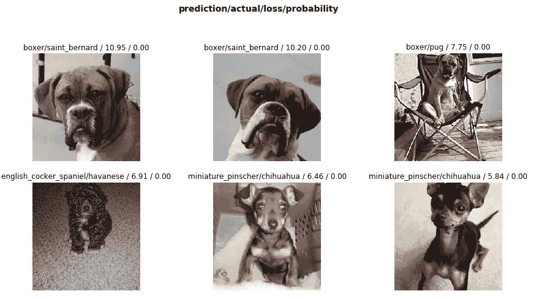
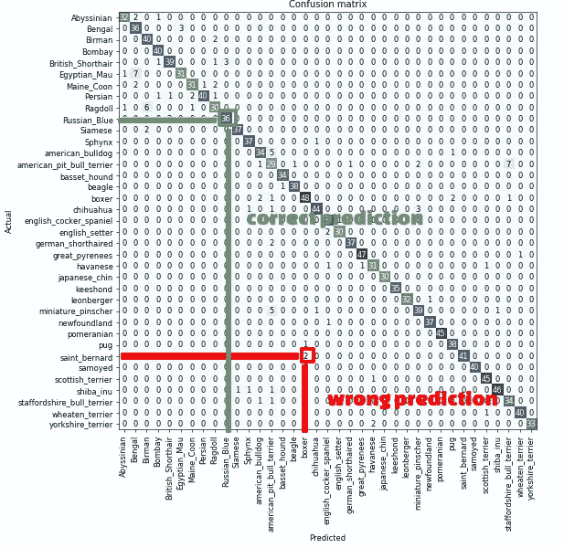
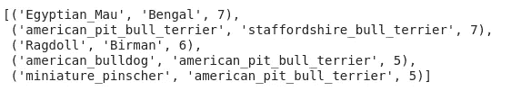
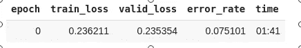
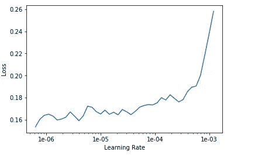
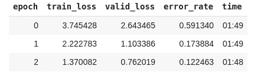

# 利用 fastai 进行影像分类—第一部分

> 原文：<https://medium.com/analytics-vidhya/image-classification-using-fastai-5ff5b374d414?source=collection_archive---------2----------------------->

*我将使用 fastai 库实现图像分类。没有什么比 fastai 库更容易使用和理解了。让我们开始吧。*

我将使用 pet 数据集，默认情况下由 fastai 提供。在其他博客文章中，我将解释如何通过网络下载和分类来自其他人的任何可能的东西。

💡有两种不同类型的数据集:

*   学术数据集——这是学术人员花费大量时间来管理和收集数据的东西，这通常需要大量的头脑风暴技术来传递最先进的学术成果。
*   Kaggle 竞赛数据集-ka ggle 竞赛期间提供的数据集。

💁精细分类——这是一种我们必须在非常相似的类别之间进行分类的分类，如鸟类、花卉或动物的种类、汽车的型号等。



精细分类

让我们导入分类所需的包:

```
**from fastai.vision import ***(Vision module in fastai package provides us the classification methods.)
```

fastai 图书馆提供了大量的学术数据集。其中之一是在 URLs.PETS 下定义的宠物。

```
URLs.PETS = [https://s3.amazonaws.com/fast-ai-imageclas/oxford-iiit-pet](https://s3.amazonaws.com/fast-ai-imageclas/oxford-iiit-pet)
```

我们要做的第一件事是下载并提取我们想要的数据。我们将使用这个名为的函数，它会自动下载并解压缩它。会将数据集下载到某个方便的路径，并为我们解包，然后它会返回路径的值。路径是

```
path = untar_data(URLs.PETS); path= PosixPath('/root/.fastai/data/oxford-iiit-pet')
```

❓什么是 [untar_data](https://docs.fast.ai/datasets.html#untar_data)

```
untar_data(**url**:str, **fname**:PathOrStr=***None***, **dest**:PathOrStr=***None***, **data**=***True***, **force_download**=***False***) → Path
```

untar_data 使用 URL 下载 fname 下的 tgz 文件，然后将 tgz fname 解压缩到 dest 下的文件夹中。

让我们看看我们下载的数据里面。

```
path.ls= PosixPath('/root/.fastai/data/oxford-iiit-pet/annotations'),     PosixPath('/root/.fastai/data/oxford-iiit-pet/images')
```

它已经返回到两个 PosixPaths。我们可以创建如下两个路径字符串:

```
path_anno = path/'annotations'
path_img = path/'images'
```

当我们处理一个问题时，我们做的第一件事就是看一看数据。我们*总是*需要很好地理解问题是什么，数据看起来像什么，然后才能想出如何解决它。查看数据意味着理解数据目录是如何构造的，标签是什么，以及一些示例图像是什么样子。影像分类数据集处理的主要区别在于标注的存储方式。在机器学习中，标签指的是我们试图预测的东西。

我们来看看 path_img 里面是什么。fastai 提供了一个便捷的方法，即 *get_image_files。*

❓什么是 [get_image_files](https://docs.fast.ai/vision.data.html#get_image_files)

```
get_image_files(**c**:PathOrStr, **check_ext**:bool=***True***, **recurse**=***False***) → FilePathList
```

返回图像中的文件列表。

```
fnames = get_image_files(path_img)
fnames[:4]= PosixPath('/root/.fastai/data/oxford-iiit-pet/images/saint_bernard_40.jpg'),PosixPath('/root/.fastai/data/oxford-iiit-pet/images/Abyssinian_89.jpg'),PosixPath('/root/.fastai/data/oxford-iiit-pet/images/boxer_89.jpg'),PosixPath('/root/.fastai/data/oxford-iiit-pet/images/pug_188.jpg')
```

在这个特定的数据集中，标签存储在文件名本身中，如 x _*path/label _ name . extension*。我们将需要提取它们，以便能够将图像分类到正确的类别中。这是任何分类问题最著名的地方。

现在，为了从路径中提取文件名，fastai 为我们提供了一个对象，即 ImageDataBunch。

❓什么是 ImageDataBunch

ImageDataBunch 提供了许多类方法，帮助我们创建训练、验证和测试数据加载器，这些加载器可进一步用于提取数据集的束。它返回给我们数据束对象。我们将要使用的一个类方法是 *from_name_re。* `from_name_re`取正则表达式并分隔数据。

❓什么是来自 _name_re

```
from_name_re(**path**:PathOrStr, **fnames**:FilePathList, **pat**:str, **valid_pct**:float=***0.2***, ********kwargs**)
```

*   路径:包含图像的路径
*   文件名列表
*   pat:用于从文件名中提取标签的正则表达式(即模式)
*   尺寸:你想处理多大尺寸的图像。

```
np.random.seed(2)
pat = r'/([^/]+)_\d+.jpg$'data = ImageDataBunch.from_name_re(path_img, fnames, pat, ds_tfms=get_transforms(), size=224)data.normalize(imagenet_stats)
```

目前，深度学习处理器有一个限制，即所有图像必须具有相同的大小；否则就达不到预期的效果。224*224 是标准的图像尺寸，也能给出好的结果。您可以尝试这个值。我们将整个数据标准化，使平均值为 0，标准差为 1。在几乎所有的机器学习任务中，你必须让所有的数据都具有相同的“大小”——它们特别是关于相等的均值和标准差。

❓什么是图像正常化

图像规格化将图像的像素规格化，该像素可以是从 0 到 255 的任何数字。如果这些红色、绿色和蓝色通道中的每一个都具有零的均值和一的标准差，那么它有助于训练深度学习模型。
如果您的数据没有标准化，您的模型很难训练好。因此，如果你在训练一个模型时遇到困难，要检查的一件事就是你已经将它规范化了。

❓什么是内幕数据

```
**data****= ImageDataBunch;** 

**Train**: LabelList (5912 items) 
**x: ImageList** 
Image (3, 224, 224),Image (3, 224, 224),Image (3, 224, 224),Image (3, 224, 224),Image (3, 224, 224)  
**y: CategoryList** saint_bernard,Abyssinian,boxer,pug,staffordshire_bull_terrier 
Path: /root/.fastai/data/oxford-iiit-pet/images;**Valid**: LabelList (1478 items) 
**x: ImageList** Image (3, 224, 224),Image (3, 224, 224),Image (3, 224, 224),Image (3, 224, 224),Image (3, 224, 224) 
**y: CategoryList** 
beagle,samoyed,newfoundland,boxer,chihuahua 
Path: /root/.fastai/data/oxford-iiit-pet/images;**Test**: None
```

# 让我们看看数据内部

要成为一名优秀的从业者，对数据的感知是必不可少的。所以，你应该总是详细地查看你的数据。

*   C/classes:图像标签的数量称为类别。您可以使用下面的命令来计算标签的数量。**它接受这些字符串(标签的数量)，它会找到所有可能的唯一值，它会创建一个列表，然后它会把字符串变成数字(内部)。**

```
data.c

 = 37data.classes

 = ['Abyssinian',  'Bengal',  'Birman',  'Bombay',   'British_Shorthair',  'Egyptian_Mau',  'Maine_Coon',  'Persian',  'Ragdoll',  'Russian_Blue',  'Siamese',  'Sphynx',  'american_bulldog',  'american_pit_bull_terrier',  'basset_hound',  'beagle',  'boxer',  'chihuahua',  'english_cocker_spaniel',  'english_setter',  'german_shorthaired',  'great_pyrenees',  'havanese',  'japanese_chin',  'keeshond',  'leonberger',  'miniature_pinscher',  'newfoundland',  'pomeranian',  'pug',  'saint_bernard',  'samoyed',  'scottish_terrier',  'shiba_inu',  'staffordshire_bull_terrier',  'wheaten_terrier',  'yorkshire_terrier']
```

*   显示批处理:

```
show_batch(**rows**:int=***5***, **ds_type**:[DatasetType](https://docs.fast.ai/basic_data.html#DatasetType)=***<DatasetType.Train: 1>***, **reverse**:bool=***False***, ********kwargs**)
```



data.show_batch(rows=3，figsize=(7，6))

# 学习者

现在，我们准备训练我们的模型。一个模型在 fastai 中用一种叫做“学习者”的东西来训练。

我们将建立 convnet 风格的学习者。我们将使用 *create_cnn* 。

❓什么是 create_cnn
Vision.learner 是定义 cnn_learner 方法的模块，用来快速获得适合迁移学习的模型。我们将很快学习迁移学习。简而言之，这是一个概念，其中我们使用预定义/训练的模型来训练我们的模型。目前，你需要知道我们正在建立一个模型，该模型将图像作为输入，并将输出每个类别的预测概率。

```
from fastai.metrics import error_ratelearn = create_cnn(data, models.resnet34, metrics=error_rate)
```

不过，我还会给它一个东西，这是一个指标列表。指标只是在培训过程中打印出来的东西。所以我想让你打印出错误率。我们使用 ResNet34 模型作为迁移学习的一部分。

❓使用 ResNet34
的原因是什么 ResNet34 是一个预先训练好的模型架构，已经定义了一组权重。使用预训练模型背后的思想是避免使用对模型一无所知的模型，该模型通过使用图像数据集 ImageNet 将数百万张图像分类成数千种类别而训练有素。ImageNet 的最后一层由 1000 列组成，对应于 1000 个不同的类别。因此，它将减少学习者的大量工作。我们不确定这些预定义的一千个类别是否包含我们所有的宠物类别，但我们有信心的一件事是，模型了解动物，模型知道 dos 看起来像什么，猫看起来像什么，以及它们与其他东西有什么不同。这就足够了。我第一次在新安装的机器上运行时，它下载了 ResNet34 预训练的砝码。

有许多架构可供选择，公平地说，没有一个最好的，但如果你看看像图像分类基准这样的东西，ResNet 就足够好了。

❓:什么是迁移学习
这个概念背后的基本思想是，我们将一个模型的学习转移到我们的模型中。因此，我们对它进行了调整，这样它就可以用你的宠物数据预测 37 种宠物，而不是用 ImageNet 数据预测 1000 种 ImageNet。这样做，你可以用常规模型训练的 1/100 或更少的数据，用常规模型训练的 1/100 或更少的时间训练模型。令人印象深刻。

# 符合您的模型

现在，我们有一个学习者。我们需要将数据放入学习者体内，这样它才能学习数据。现在，在学习或拟合数据时，我们必须注意过度拟合。我们希望我们的模型能够区分不同品种的宠物，而不是仅仅学习输入数据集，即填鸭式输入数据集。如果我们的模型过拟合，那么它将在验证数据集上表现不佳。

```
learn.fit_one_cycle(4)
```



错误率是我们的衡量标准。我们有 93%的准确结果。

4，基本上决定了我们遍历整个数据集多少次，我们向模型显示数据集多少次，以便它可以从中学习。每当它看到一张照片，它就会变得更好一点。我们没有过度拟合，因为我们的验证损失总是小于训练损失。😉

我们的模型正在学习一组特殊的权重，这些权重在对宠物品种进行分类时非常有效。我们可以保存这些权重，以便我们可以重复使用已经设置的权重，而不是一次又一次地进行拟合。这将是试衣/训练时间。

```
learn.save('pets-classifier-1')
```

**？create_cnn** 背后发生了什么现在，既然我们知道了 fit_one_cycle()，那就让我们来了解一下卷积神经网络背后发生了什么。create_cnn 基本上破坏了 ImageNet 的最后一层，它有 1000 个列，用于各种 1000 个类别。这取决于我们用于分类的类的数量。因此，我们丢弃了完整的权重矩阵，并且在它们之间增加了两个具有非激活函数的权重矩阵。最后一个矩阵的列数等于我们在分类的情况下定义的类别数。然后我们训练这些权重矩阵。

现在，当我们调用`fit`或`fit_one_cycle`时，它会冻结除新层之外的所有层。这意味着我们要求 fastai 和 PyTorch，当我们训练时，即当我们调用 fit 时，不要将渐变反向传播到那些层中。换句话说，当你这样做的时候，`weights = weights - learning rate * weight_grad`只对新的层做，而不对其他层做，这就是冻结的意思——只是意味着不要更新那些参数。

所以它也会快一点，因为要做的计算更少。它会占用更少的内存，因为我们需要存储的梯度更少了。但最重要的是，它不会改变已经比没有好的权重——它们至少比随机要好。这就是你调用 freeze 的结果。它不会冻结整个事情。它冻结了所有东西，除了我们为你添加的随机生成的图层。

# 结果

为了解释结果，我们将使用 ClassificationInterpretation，这是来自学习者的工厂方法，因此我们将传递 learn 对象。

❓什么是[分类释义](https://docs.fast.ai/train.html#ClassificationInterpretation)

```
ClassificationInterpretation(learn:Learner, preds:Tensor, y_true:Tensor, losses:Tensor, ds_type:DatasetType=<DatasetType.Valid: 2>) :: Interpretation
```

分类模型的解释方法。

```
interp = ClassificationInterpretation.from_learner(learn)
```

interp 有一堆技术可以帮助找到高损失。当我们对错误的预测最有信心时，高损失就会发生。

*   [plot_top_losses](https://docs.fast.ai/vision.learner.html#_cl_int_plot_top_losses) —显示 top_losses 中的图像及其预测、实际、损失和实际类别的概率。

```
interp.plot_top_losses(9, figsize=(15,11))
```



*   [plot _ confusion _ matrix](https://docs.fast.ai/train.html#ClassificationInterpretation.plot_confusion_matrix)—为您显示每种实际类型的狗或猫，有多少次被预测为那只狗或猫。



混淆矩阵——不太用户友好

*   [most_confused](https://docs.fast.ai/train.html#ClassificationInterpretation.most_confused) —混淆矩阵的最大规模非对角线条目的降序列表，以实际、预测、出现次数表示。



实际、预测的错误发生次数

# 解冻和学习率

现在，我们所做的是保持整个模型不变，我们只训练模型的最后几层。这是因为早期的层有利于识别我们不想改变或重新训练的不同模式。因此，当我们对学习者调用 freeze()时，它会冻结模型的早期层，以防止重新训练它们。最后一层是我们添加的用来区分宠物模型的层。所以，这样的话，我们会让整个模型保持同样的状态；我们将权重只凝胶或合并我们的最后一层与已经定义的层。

## 如果我们要从头开始训练整个模型呢？

我们可以这样做，使用 unfreeze 属性。它永远不会过量，但要使它合适，你必须调用`unfreeze`。`unfreeze`就是那个说，请训练整个模型考虑到所有层的东西。然后我可以再调用 fit_one_cycle。

```
learn.unfreeze()
learn.fit_one_cycle(1)
```



差错率

当你这样做的时候，我们的错误损失会比以前更多，或者比以前没有改善。这主要是因为我们用默认的学习率来拟合我们的模型。我们想要改变模型的初始层是不太可能的，这些层已经被预先训练以找到一些模式。当我们解冻整个模型时，它也试图适应初始层，这导致简化的模型。因此，我们想要的是初始层的学习率低，因为我们不想将初始权重改变相当大的量，而我们想要设置的最新层的学习率高。

❓How 发现学习率

```
learn.load('pets-classifier-1')
learn.lr_find()
learn.recorder.plot()
```



学习率图

学习率表示我更新模型中参数的速度。这里的 x 轴显示了当我提高学习率时会发生什么。y 轴表示损失是多少。所以你可以看到，一旦学习率超过 10^-4，我的损失会更严重。因为我们现在在尝试微调东西，所以不能用这么高的学习率。

```
learn.unfreeze()
learn.fit_one_cycle(3, max_lr=slice(1e-6,1e-4))
```



更少的错误率

Python 中的这个关键字叫做`slice`，它可以接受一个起始值和一个终止值，基本上它的意思是以 1e-6 的学习速率训练最开始的层，以 1e-4 的速率训练最后的层，并将所有其他层分布在其上(即在这两个值之间相等)。

我们将学习如何更深入地选择学习率；现在，您可以浏览定义的值。请随意试验这些值。

如果你已经理解了分类背后的动力，那么你很好地阅读了分类的[第二部分](/@PJrohan/face-recognition-using-fastai-part-2-44360f6471fb)。

# 参考资料:

*   Fast.ai