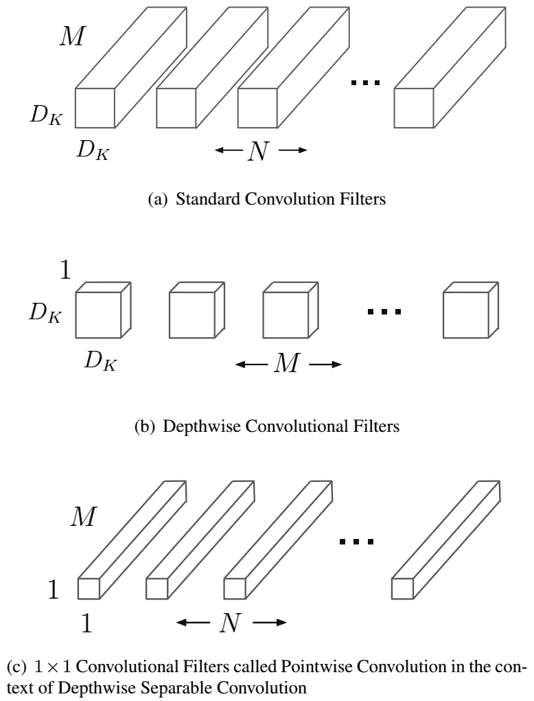
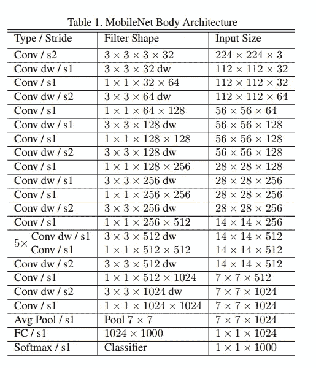

# 在浏览器中使用 MobileNet 进行图像分类

> 原文：<https://medium.com/analytics-vidhya/image-classification-using-mobilenet-in-the-browser-b69f2f57abf?source=collection_archive---------2----------------------->

# 什么是图像分类？

图像分类是深度学习中一项非常重要的任务，广泛应用于各个领域，具有很高的可用性和应用范围。在日常生活中，我们会遇到将图像分成一组或多组的问题。让我们假设你考虑下面的图像。

它是一件 T 恤衫。你一眼就能认出来。这是因为我们的大脑惊人地发达，它已经一次又一次地看到了这种类型的图像。但是我们如何教一台机器做同样的任务。在日常生活中，我们会遇到无数这样的东西，对它们进行分类是一项巨大的劳动和乏味的任务。现实生活中的一个用例可能是自动驾驶汽车，它需要识别和识别道路上的交通信号标志并做出决策。

# 什么是 MobileNet？

MobileNet 是用于图像分类和移动视觉的 CNN 架构模型。还有其他模型，但 MobileNet 的特别之处在于它运行或应用迁移学习的计算能力非常低。这使得它非常适合没有 GPU 或计算效率较低的移动设备、嵌入式系统和计算机，同时大大降低了结果的准确性。它也最适合网络浏览器，因为浏览器在计算、图形处理和存储方面有限制。

## MobileNet 架构

*   提出了用于移动和嵌入式视觉应用的 MobileNets，其基于流线型架构，使用深度方向可分离卷积来构建轻量级深度神经网络。
*   引入了两个简单的全局超参数，它们有效地在延迟和准确性之间进行权衡。

MobileNet 的核心层是深度方向可分离滤波器，称为深度方向可分离卷积。网络结构是提高性能的另一个因素。最后，可以调整宽度和分辨率，在延迟和准确性之间进行权衡。

## 深度方向可分卷积

深度方向可分离卷积是因子分解卷积的一种形式，它将标准卷积因子分解为深度方向卷积和称为点方向卷积的 1×11×1 卷积。在 MobileNet 中，深度方向卷积对每个输入通道应用单个滤波器。逐点卷积然后应用 1×11×1 卷积来组合深度卷积的输出。下图说明了标准卷积和深度方向可分离卷积之间的区别。

移动网络结构

标准卷积的计算成本为

dₖ⋅dₖ⋅⋅⋅迪夫⋅迪夫

深度方向可分离卷积成本

dₖ⋅dₖ⋅⋅⋅+⋅⋅⋅

下面是 Mobilenet 的完整层结构

Mobilenet 层

# 在浏览器中构建图像分类模型

在浏览器中用 MobileNet 构建一个图像分类系统很简单。您需要在同一目录下创建以下文件。

1.  一个**index.html**文件在浏览器中显示图像和预测。

index.html

2.一个 index.js 文件，用于承载加载 mobilenet 的逻辑。

索引. js

3.存储用于预测的本地图像的图像文件夹。我们也可以使用在线图像预测。我们只需将 index.html 文件中图像的地址插入到 html 中 **img** 标签的“src”属性中。 ***<图像地址在下面的>*** 代码中。

*" width = " 227 " height = " 227 "/>*

链接完所有文件后，你只需要在最新的浏览器中打开 index.html 文件。点击**预测**按钮。请参考下面的输出样本截图。

在浏览器控制台中，您可以查看 3 个最高预测的置信度得分。

浏览器输出

希望你喜欢阅读！！你可以给它一个❤或者分享它。谢谢！:)

**链接到我的 gists:**

*   [https://gist . github . com/mipra 282/Fe 7902d 83006405495054 a 0733 BFA 645](https://gist.github.com/mipra282/fe7902d83006405495054a0733bfa645)
*   [https://gist . github . com/mipra 282/3956 e 71 A8 a 2714 a 63 a 87 B1 d 930339 a61](https://gist.github.com/mipra282/3956e71a8a2714a63a87b1d930339a61)