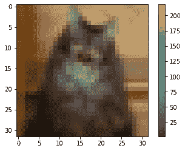
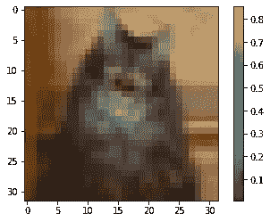
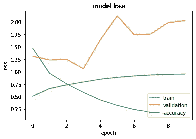

# 基于 CIFAR-10 数据集的 Tensorflow2.0 影像分类

> 原文：<https://medium.com/analytics-vidhya/image-classification-using-tensorflow2-0-with-cifar-10-dataset-cc595ceb0082?source=collection_archive---------6----------------------->

这是我关于 TensorFlow 2.0 的第二篇博客，我将在 [CIFAR-10 数据集](https://www.cs.toronto.edu/~kriz/cifar.html)上解释图像分类。CIFAR 代表加拿大高级研究所，10 指 10 个班级。它由 10 类 60000 幅 32×32 彩色图像组成，每类 6000 幅图像。有 50000 个训练图像和 10000 个测试图像。

让我们从导入库和数据集开始

*   第 2–5 行，导入的 *Tensorflow，Keras，Numpy 和 Matplotlib*
*   第 8 行，在 CIFAR 变量中加载数据 CIFAR10
*   第 9 行，当数据集通过调用 *cifar.load_data()* 分两组加载时，将数据分两组存储
*   第 10 行，检查了数据的形状，它有 50000 个 32*32 像素的图像，3 是颜色的表示。
*   第 17 行，为标签中的每个类定义了一个类名

现在，我们将绘制图像并重新缩放。

*   第 2–4 行，用颜色条绘制图像，显示 0–255 颜色条

*   第 7 行和第 8 行，重新缩放图像，因为张量流只接受 0-1 之间的输入
*   第 12–14 行再次用颜色条绘制图像，现在它显示在 0–1 之间

现在我们将导入库来构建模型

*   第 2–5 行，导入库*顺序、扁平化、密集、批处理规范化、最大池化、激活和 Conv2D*
*   第 8 行，定义一个模型为 ***序列。这是一个线性的层堆栈，我们可以通过向构造函数传递一个层实例列表或者仅仅通过添加层来创建我们的模型。***
*   第 9 & 12 行，定义一个***【Conv2D】****图层。卷积层用于从图像或部分图像中提取特征。它创建一个卷积核，该卷积核与层输入相关，以产生输出张量。我们已经传递了三个参数。*

1.  ***滤波器大小** (64 和 32)-它是一个决定输出滤波器数量的整数值*
2.  *内核大小 (3，3)-这是运行在图像上的过滤器的大小。它是由两个数字组成的元组，表示高度和宽度*
3.  ***激活** (relu)-正则化函数控制应用于 conv2d 的正则化方法的类型和数量*

*   *第 10 行，定义了 ***MaxPooling2D*** 层。这一层减少了数据的大小、参数的数量和所需的计算量。简而言之，我们可以说它类似于缩小图像的尺寸。*
*   *第 11 行和第 14 行定义了一个 ***批次规格化*** 层。该层将每个小批量的输入标准化到一个层。*
*   *第 14 行，定义了一个 ***展平*** 图层。该层将 n 维数组转换为 1 维数组。*
*   *第 15 & 16 行，定义了一个 ***密集的*** 层。它只是神经网络中密集连接的规则神经元层。每个神经元接收来自所有神经元的输入。*

> **我们需要在训练前编译我们的模型，因为训练使用损失函数优化器。**

*   *line20，***model . compile****用于编译一个模型。它定义了损失函数、优化器和指标。**

1.  *****损失函数-*** 它是一种评估特定模型对给定数据有多好的方法。这里我们使用了 **' *稀疏分类交叉熵。*** 分类交叉熵是分类数据的损失函数，稀疏意味着它使用所有可能的类，但不使用其中的一些。**
2.  *****优化器-*** 它用于改变神经网络的属性，如权重和学习率。这里我们使用了 ***【亚当】*** 优化器。代表 ***自适应矩估计。*** 有助于更快得到结果。**
3.  *****度量-*** 它用于评估机器学习算法。这里我们用了' ***'的准确度。*** 它是*正确预测数与输入样本总数的比值。***

*   **第 24 行，***是用来训练我们的模特。需要训练和测试数据来拟合我们的模型。*****

1.  *******冗长****——它有 3 个参数来传递 0、1、2。* **verbose = 1** ，包括进度条和每个时期一行， **verbose = 0** 表示静默， **verbose = 2** ，每个时期一行，即时期号/时期总数****
2.  *******历元*** -一个历元是指整个数据集仅通过神经网络前后传递一次。****

****现在，我们将绘制损失、验证损失和准确性****

********

****图表****

****在上图中，蓝线代表训练损失、橙色验证损失和绿色准确性。****

****看到**验证损失和**培训损失的关系图，有四点需要注意****

1.  ****验证损失应与培训损失相似，但略高。****
2.  ****如果训练损失远大于验证损失，那么就是*过度拟合*****
3.  ****如果培训损失远小于验证损失，那么这就是*欠拟合*。****

****在查看**验证损失和验证准确度**之间的图表时，有 3 点需要注意****

1.  ****如果 val_loss 增加而 val_acc 减少，则我们的模型没有学习。****
2.  ****如果 val_loss 和 val_acc 都在增加，则模型过拟合。****
3.  ****如果 val_loss 在减少，而 val_acc 在增加，则模型是好的****

****所以这里我们可以说我们的模型是不适合的。现在，在我的下一篇博客中，我们将会看到如何解决过度适应的问题。****

****一次全部编码。****

*****笔记本可以在这里找到***。******

******参考文献:******

*   ****[2D Max pooling block | pelta rion 平台](https://peltarion.com/knowledge-center/documentation/modeling-view/build-an-ai-model/blocks/2d-max-pooling-block)****
*   ****[卷积层— Keras 文档](https://keras.io/layers/convolutional/)****
*   ****[TensorFlow Conv2D 图层:实用指南— MissingLink.ai](https://missinglink.ai/guides/tensorflow/tensorflow-conv2d-layers-practical-guide/)****
*   ****[机器学习——交叉熵与稀疏交叉熵:何时使用一个而不是另一个——交叉验证](https://stats.stackexchange.com/questions/326065/cross-entropy-vs-sparse-cross-entropy-when-to-use-one-over-the-other)****
*   ****[https://forums . fast . ai/t/determining-when-you-over-fitting-under-fitting-or-just-right/7732/4](https://forums.fast.ai/t/determining-when-you-are-overfitting-underfitting-or-just-right/7732/4)****