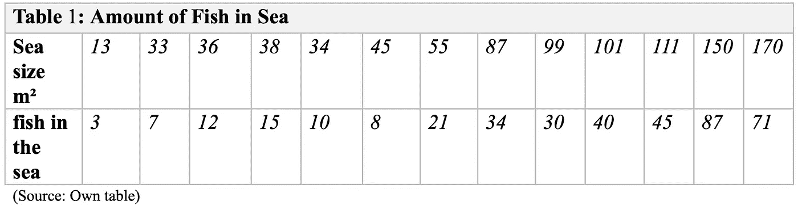
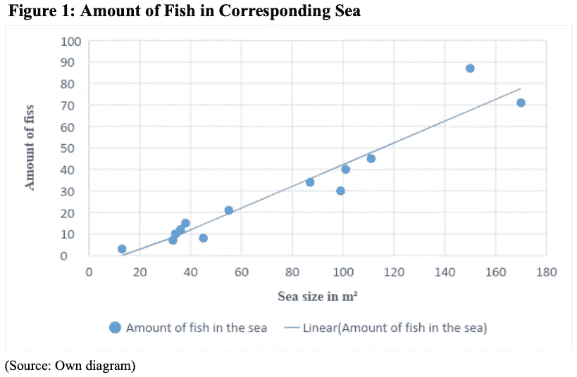
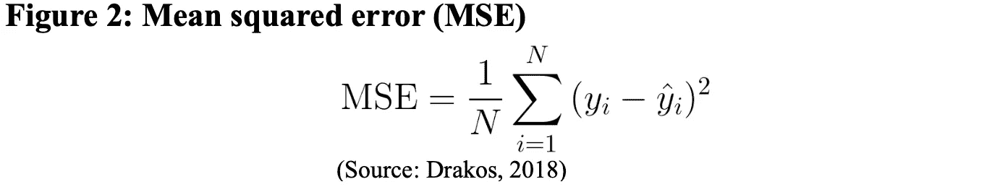
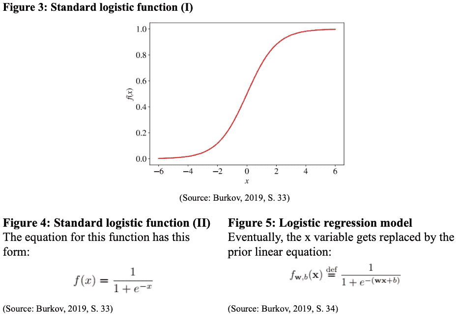
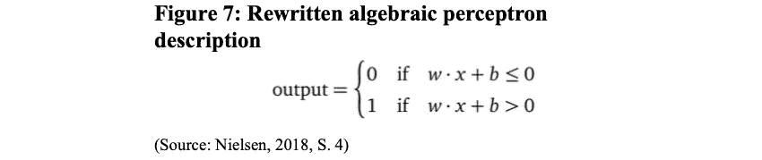
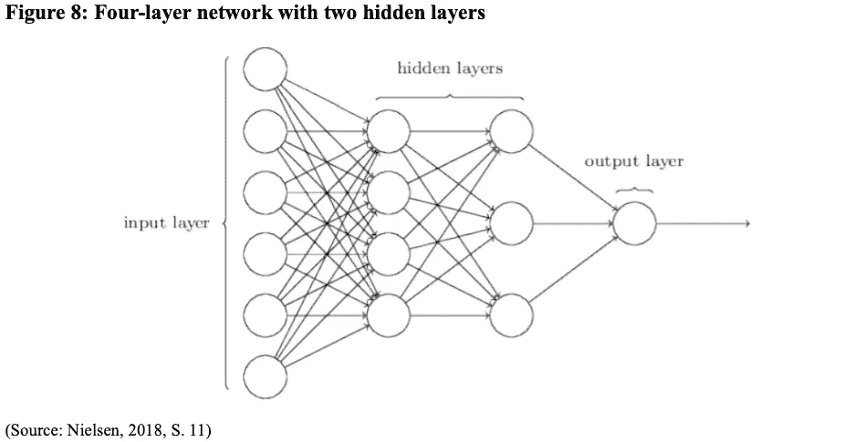

# 具有深度学习的图像分类:机器学习和深度学习的理论介绍

> 原文：<https://medium.com/analytics-vidhya/image-classification-with-deep-learning-a-theoretical-introduction-to-machine-learning-and-deep-d118905c6d3a?source=collection_archive---------8----------------------->

关于识别图像，人类通常能够容易地识别物体中的大量细节。多年来，我们训练我们的大脑来解释我们所看到的，从而下意识地形成我们的现实。

**随着先进技术成为我们生活中不可替代的元素，人工智能等突破性技术的出现为不同的领域和用例提供了巨大的潜力。**

**特别是，卷积神经网络(CNN)，一种深度神经网络被应用于分析图像。让计算机视觉成为可能，或者换句话说，增强机器像人类一样看待世界，不再是未来的愿景。**

**在这篇文章中，你将获得机器学习和深度学习的简短理论介绍，并更好地理解利用深度学习对图像进行分类。**

# **内容**

1.AI、机器学习和深度学习的区别
2。机器学习理论介绍
2.1 关键术语
2.2 基本概念
3。深度学习:神经网络
3.1 感知器
3.2 Sigmoid 神经元
3.3 神经网络的架构
4 .深度学习:用卷积神经网络进行图像分类

**1。AI、机器学习和深度学习的区别**

为了理解深度学习的概念，将它置于人工智能和机器学习的背景中是至关重要的。在计算机科学中，人工智能(AI)是一个广义的术语，用于描述机器显示的智能。这种描绘的特点是模仿自然的人类智能，如学习或解决问题(Russell and Norvig，2003)。机器学习是计算机直接从数据中“学习”的能力，就像人类和动物从现实生活经验中学习一样。一个重要的方面是，所使用的算法不依赖于预定的方程，而是自适应地发展其性能(MathWorks Inc .，2016)。而且，深度学习是机器学习和所谓的神经网络训练的结合，这将在后续章节中解释(Burkov，2019)。事先，必须解释相关的机器学习术语和概念。

**2。机器学习理论介绍**

**2。1 关键术语**

简而言之，构建的机器学习系统学习如何组合输入因素，以根据之前未见过的数据生成预测。当系统或模型被训练时，标签被提供。标签是要预测的变量 y。从案例模型的角度来看，电子邮件被分为垃圾邮件和非垃圾邮件。这里“垃圾邮件”和“非垃圾邮件”代表标签。

考虑到这一点，特征是描述数据的输入变量，例如电子邮件中的单词、电子邮件地址和任何类型的其他相关信息。一个例子是作为电子邮件的一段数据。这可能是用于训练模型的已标记示例，也可能是用于对新数据进行预测的未标记示例。

最后，强调回归和分类之间的区别是很重要的。回归模型预测连续值，如某事物的值或概率。然而，分类模型预测离散值，并将解释图像中是否有猫、狗或仓鼠(谷歌开发者，框架:关键 ML 术语，2019 年)

**3。2 基本概念**

线性回归

如前所述，回归可以预测给定输入集下的输出概率。这是通过猜测变量之间的线性关系实现的。下表显示了以平方米为单位的海洋面积以及每片海洋中相应的鱼类数量。

数据可以通过绘制图表来检查。这种简单的线性关系可以通过给定数据拟合一条线来显示。

这种关系由以下等式描述(麻省理工学院-麻省理工学院，n. D .):

y = b + mx

在这种情况下，

*   y 是因变量，它是我们试图预测的值(鱼的数量)，
*   x 是独立变量，它是我们输入特征的值(海洋的大小)，
*   m 是斜率，并且
*   线的截距(麻省理工学院-麻省理工学院，未注明)。

**训练和损失**

但是如何知道创造出来的线可以被认为是“好”还是“坏”？在这种背景下，就涉及到了损失的概念。损失表明模型在预测结果方面做得有多好。损耗可以定义为示例中预测值和真实值之间的差异。在一个完美的预测中，损失的数量等于零。单次观测的等式称为平方损失或 L2 损失:

标注和预测之间的差值的平方=(观察值-预测值(x))

=(y—y’)

为了将这个概念扩展到整个数据集，使用了所谓的均方误差(MSE)方程:

为此，所有平方损失的总和除以示例的数量。

此外，这也是培训变得相关的地方。训练描述了使用训练数据逐步提高模型预测结果的能力的过程。在实践中，机器学习算法通过检查几个带标签的例子来建立一个系统，以找到一个使损失最小化的模型(Google Developers，Descending into ML:Training and Loss，2019)。

**逻辑回归**

如果人们感兴趣的不是预测海洋中的鱼的数量，而是预测水体是淡水还是咸水，会怎么样？对于分类问题类型，逻辑回归开始起作用。这种分类学习算法可以是二进制的，也可以是多类的。不是预测一个值，而是预测一个发生的概率。为此，有必要从可能在负无穷大和正无穷大之间的输出转换到 0 和 1 之间的输出。在这种情况下，模型为输入 x 返回的更接近 0 的值将被指定为负值，而更接近 1 的值将被指定为正值(Burkov，2019，S. 32)。符合这一确切目的的函数是 sigmoid 函数:

**4。深度学习:神经网络**

随着复杂性的增加以及从线性问题向非线性问题的转变，以前的概念很快就遇到了它们的极限。深度学习，一类神经网络优化提供了一个解决方案。

**4。1 感知器**

为了理解神经网络背后的概念，从感知器开始是至关重要的。

这个人工神经元保存几个输入(xj)并产生一个二进制输出。

向输入提供权重(wj ),并且确定 0 或 1 的输出是权重之和大于还是小于阈值。

将许多感知器组合成一个网络，使得更微妙的决策成为可能。第一层感知器基于加权做出三个基本决策，而第二层感知器根据第一层的结果做出决策。网络的层数越多，可以做出的选择就越复杂。尽管如此，还是只有一个输出。

由于从单个感知器到整个网络的转变，数学描述也从两个方面发生了变化。

首先，∑j wjxj 成为以 w 和 x 为向量，以权重和输入为元素的乘积 w * x。而且，阈值移动到不等式的另一边，成为所谓的感知机偏差 b≦-阈值。偏差可以理解为感知机获得输出 1 的难易程度的值(Nielsen，2018，s . 2–4)。

**4。2 个乙状结肠神经元**

在这一点上，人工神经元网络仅仅是作为实现布尔函数的逻辑门运行，而没有任何学习视角。在这种情况下，学习将等于对权重或偏差进行最小的修改，以获得输出中最小的相应变化，直到设计的模型完全按照预期的方式运行。一个特别的困难是感知器的特性，它通过最小的调整就能使整个网络发生根本的变化。这个问题是由所谓的 sigmoid 神经元来解决的，它的行为类似于感知器。乙状结肠神经元的优势在于，权重和偏差的变化仅引起输出的微小变化。

sigmoid 神经元的输入值能够具有 0 和 1 之间的每个值，这是由于已经熟悉的 sigmoid 函数的特征(Nielsen，2018，s . 7–8)。

**4。3 神经网络的架构**

下图显示了神经网络体系结构的标准描述。

最左边的层称为输入层及其输入神经元。最右边是输出层，仍然包含单个输出神经元。一个新的元素是隐藏层，它在数量上是可变的。隐藏层简单定义为“不是输入也不是输出”。它的任务是将输入转换成输出层可用的形式。

神经网络的方法可以用一个例子来说明。如果神经网络应该确定手写图像是否是数字“9 ”,那么每个图像像素的亮度起着主要作用。在一个 64 乘 64 的灰度图像中，4 096 个输入神经元将灰度强度保持在 0 和 1 之间。最后，神经网络的输出值表明，如果该值低于 0.5，则输入图像不是 9；如果该值高于 0.5，则输入图像是 9(Nielsen，2018，s . 10–12)。

**5。深度学习:卷积神经网络**

在图像分类的背景下，依赖于经典的神经网络结构是无益的。这是因为它们没有考虑到图像的空间结构。因此，离得远和离得近的输入像素被视为相同。这就是为什么使用一种利用空间结构的架构:卷积神经网络(CNN) (Nielsen，2018，S. 169)。

CNN 用于逐步提取输入图像的更高级表示。它获得每一层的抽象特征。例如，物体的边缘可能首先被识别，然后是更基本的形状，最后是更高级的特征，如面部(Albawi，Mohammed & Alzawi，2017)。

该模型不再对给定的数据进行预处理以生成形状和纹理等特征。相反，CNN 处理图像的像素数据，并学习推导这些特征(谷歌开发者，ML Practicum:图像分类，2019)。

虽然神经网络的输入层显示为神经元的垂直线，但卷积神经网络的输入是神经元的正方形:输入特征图。和以前一样，输入像素连接到一个隐藏层。这次实现了输入图像的小局部区域的连接。

CNN 提取输入特征地图的分块，并对其应用过滤器以生成新特征，从而产生输出特征地图。

在卷积过程中，过滤器滑过输入特征地图以提取相应的图块。在本例中，有一个输入要素地图和一个具有给定值的卷积过滤器。过滤器被应用于输入要素地图，这导致过滤器的值与输入要素的值相乘。然后，将结果求和为输出特征图的单个值。(尼尔森，2018，S. 170 谷歌开发者，ML 实习:图像分类，2019)。

[https://www.youtube.com/watch?v=YRhxdVk_sIs&t = 339s](https://www.youtube.com/watch?v=YRhxdVk_sIs&t=339s)

下面的例子说明了这种方法。左边的对象是 7 的图像表示，以及将通过具有单个过滤器的卷积层运行的输入特征地图。这个矩阵的值是图像中的单个像素。中间的物体是带有随机数的过滤器。过滤器从左上角开始，落在输入的第一个 3×3 像素块上。这两个元素的点积将针对输入要素地图的每个 3 乘 3 块进行存储，以将其存储在输出要素地图的相应站点上(deeplizard，2017)。可以在 YouTube 上随意观看 deeplizard 的“[卷积神经网络(CNN)解释的](https://www.youtube.com/watch?v=YRhxdVk_sIs&t=339s)视频:[https://www.youtube.com/watch?v=YRhxdVk_sIs&t = 339s](https://www.youtube.com/watch?v=YRhxdVk_sIs&t=339s)

虽然这仍然是一个基本的例子，但 CNN 能够很容易地以高达 90 %的准确率对物体、动物、人类、植物或截图的图像进行分类。CNN 用例的突出例子是脸书的照片标签系统，虚拟助手，如 Siri、聊天机器人和物体识别相机(Mhalagi，n. D .)。

**参考文献**

阿尔巴维，s .，穆罕默德，t .，阿尔扎维，S. (2017)。*对卷积神经网络的理解。*迪亚拉/基尔库克:迪亚拉大学/基尔库克大学。DOI:10.1109/icengtechnol . 17863863867

布尔科夫，A. (2019)。*机器学习的合页书。*可在:[https://file . ai 100 . com . cn/files/file-code/original/CD 136 ebe-0e 34-4e 43-966 b-224 acff 83005/100 mlbook/The+bai 百页+Machine+Learning+book . pdf](https://file.ai100.com.cn/files/file-code/original/cd136ebe-0e34-4e43-966b-224acff83005/100MLBOOK/The+Hundred-Page+Machine+Learning+Book.pdf)(28 . 09 . 2019)。

深海蜥蜴。(2017 年 12 月 9 日)。*卷积神经网络(CNN)解释。*可在:[https://www.youtube.com/watch?v=YRhxdVk_sIs](https://www.youtube.com/watch?v=YRhxdVk_sIs)(05 . 10 . 2019)。

德拉科斯，G. (2018)。*如何为机器学习模型选择正确的评估指标:第 1 部分回归指标。*可从以下网址获得:[https://towards data science . com/how-to-select-the-right-evaluation-metric-for-machine-learning-models-part-1-regr regression-metrics-3606 e 25 beae 0](https://towardsdatascience.com/how-to-select-the-right-evaluation-metric-for-machine-learning-models-part-1-regrression-metrics-3606e25beae0)(01 . 10 . 2019)。

谷歌开发者。(2019).*降入 ML:训练与损耗|机器学习速成班。*可在:[https://developers . Google . com/machine-learning/crash-course/descending-into-ml/training-and-loss](https://developers.google.com/machine-learning/crash-course/descending-into-ml/training-and-loss)(01 . 10 . 2019)。

谷歌开发者。(2019).*框架:关键 ML 术语|机器学习速成班*。可在:[https://developers . Google . com/machine-learning/crash-course/framing/ml-terminals](https://developers.google.com/machine-learning/crash-course/framing/ml-terminology)(31 . 09 . 2019)查阅。

谷歌开发者。(2019). *ML 实习:图像分类。*可从以下网址获得:[https://developers . Google . com/machine-learning/practica/image-class ification/convolutionary-neural-networks](https://developers.google.com/machine-learning/practica/image-classification/convolutional-neural-networks)(03 . 10 . 2019)。

MathWorks Inc. (2016)。*引入机器学习。*可在:[https://www . mathworks . com/content/dam/mathworks/tag-team/Objects/I/88174 _ 92991 v00 _ machine _ learning _ section 1 _ ebook . pdf](https://www.mathworks.com/content/dam/mathworks/tag-team/Objects/i/88174_92991v00_machine_learning_section1_ebook.pdf)(25 . 09 . 2019)。

Mhalagi，s .(未注明)*对 CNN 模型更高精确度的探索。*可在:[https://towardsdatascience . com/the-quest-of-higher-accuracy-for-CNN-models-42 df5d 731 faf](https://towardsdatascience.com/the-quest-of-higher-accuracy-for-cnn-models-42df5d731faf)(06 . 10 . 2019)。

麻省理工学院。(未注明)。*第 3 章—线性回归*。可在:[www.mit.edu/~6.s085/notes/lecture3.pdf](http://www.mit.edu/~6.s085/notes/lecture3.pdf)(01 . 10 . 2019)。

尼尔森，M. (2018)。*神经网络和深度学习。*可在:[http://static . latex studio . net/article/2018/0912/neuralnetworksanddeeplearning . pdf](http://static.latexstudio.net/article/2018/0912/neuralnetworksanddeeplearning.pdf)(03 . 10 . 2019)。

Russell s .和 nor vig p .(2003 年)。*人工智能*(第二版。).新耶尔西:普伦蒂斯霍尔。