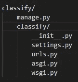
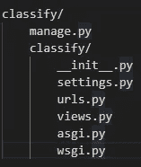
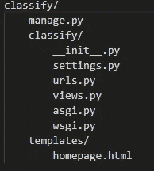
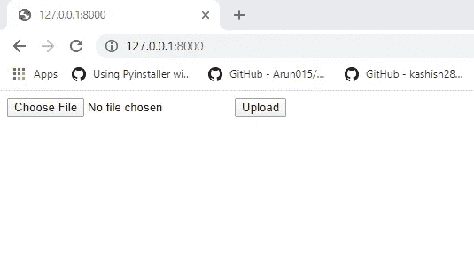
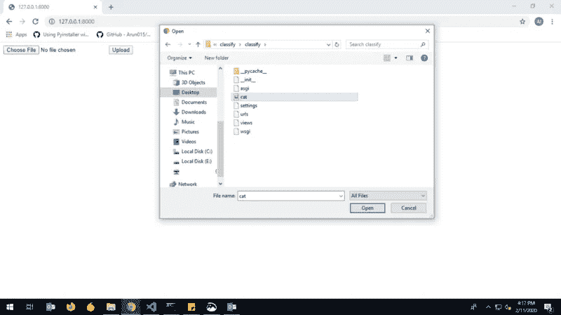
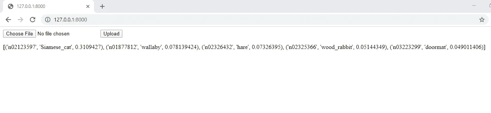

# 使用 django 进行图像分类(部署)

> 原文：<https://medium.com/analytics-vidhya/image-classification-with-django-deployment-d18dfc224270?source=collection_archive---------2----------------------->


# 什么是 django？

D jango 是一个 python web 框架，由于其附带的大量功能，在 python 社区中很受欢迎。这让您可以快速开发应用程序。

对于图像分类，我们将使用带有 **ImageNet** 权重的 **VGG-16** **预训练**模型

> 要求:
> 
> 克拉斯
> 
> 姜戈

# **让我们开始构建项目**

## **创建项目:**

从 django 项目开始，我们必须做一些初始设置。Django 提供了一些命令行工具来帮助你开始你的项目。转到您想要创建项目的首选目录。为 Linux 用户打开终端，为 windows 用户打开 cmd，并键入以下命令

```
django-admin startproject classify
```

该命令将创建一个包含以下文件的“分类”存储库



文件夹结构

**这些文件是:**

> 外部分类/根目录是项目的容器。它的名字对 Django 来说无关紧要；你可以把它改名为任何你喜欢的名字。
> 
> manage.py:一个命令行实用程序，允许您以各种方式与这个 Django 项目进行交互。
> 
> 内部分类/目录是项目的实际 Python 包。它的名称是 Python 包的名称，您需要使用它来导入包中的任何内容(例如 classify.urls)。
> 
> classify/__init__。py:一个空文件，告诉 Python 这个目录应该被认为是一个 Python 包。如果您是 Python 初学者，请在官方 Python 文档中阅读更多关于包的内容。
> 
> classify/settings.py:这个 Django 项目的设置/配置。Django 设置会告诉你所有关于设置如何工作的信息。
> 
> classify/urls.py:这个 Django 项目的 URL 声明；你的 Django 网站的“目录”。
> 
> classify/ASGI . py:ASGI 兼容的 web 服务器为您的项目服务的入口点。
> 
> classify/wsgi.py:兼容 wsgi 的 web 服务器为您的项目服务的入口点。

让编码开始 **…** 首先，让我们加载我们的模型。

从 classify 项目中打开 settings.py 文件，并插入下面的代码。

```
import keras
import numpy as np
from keras import backend as K
import tensorflow as tf
from tensorflow.python.keras.backend import set_session
from keras.applications import vgg16

def get_session():
    config = tf.ConfigProto()
    config.gpu_options.allow_growth = True
    return tf.Session(config=config)

K.tensorflow_backend.set_session(get_session())

config = tf.ConfigProto()
config.gpu_options.allow_growth = True
SESS = tf.Session(config=config)
print("model loading")
GRAPH1 = tf.get_default_graph()

set_session(SESS)
# Load the VGG model
VGG_MODEL = vgg16.VGG16(weights="imagenet")
```

这段代码将在您运行项目时加载您的模型，这样每次您必须预测时就不必加载模型了。记住，在这段代码中，我们将很快使用 **views.py** 文件中的 **VGG-16 模型**、 **SESS** 、 **GRAPH1** 变量。

在您的 **settings.py** 文件的末尾插入以下代码

```
STATIC_URL = '/static/'
STATIC_ROOT = os.path.join(BASE_DIR, 'static')

MEDIA_ROOT = os.path.join(BASE_DIR, 'media')
MEDIA_URL = 'media/'
```

这段代码将创建一个保存上传图片的媒体文件。

现在让我们在内部分类目录中创建一个 **views.py** 文件，用于访问模型以对图像**进行分类。这就是此时你的文件夹结构应该看起来的样子。**



文件夹结构

让我们编辑 **views.py** 文件。插入以下代码

```
from django.shortcuts import render
from django.http import JsonResponse
import base64
from django.core.files.base import ContentFile
from django.core.files.storage import default_storage
from django.conf import settings 
from tensorflow.python.keras.backend import set_session
from keras.preprocessing.image import load_img
from keras.preprocessing.image import img_to_array
from keras.applications.imagenet_utils import decode_predictions
import matplotlib.pyplot as plt
import numpy as np
from keras.applications import vgg16
import datetime
import traceback

def index(request):
    if  request.method == "POST":
        f=request.FILES['sentFile'] # here you get the files needed
        response = {}
        file_name = "pic.jpg"
        file_name_2 = default_storage.save(file_name, f)
        file_url = default_storage.url(file_name_2)
        original = load_img(file_url, target_size=(224, 224))
        numpy_image = img_to_array(original)

        image_batch = np.expand_dims(numpy_image, axis=0)
        # prepare the image for the VGG model
        processed_image = vgg16.preprocess_input(image_batch.copy())

        # get the predicted probabilities for each class
        with settings.GRAPH1.as_default():
            set_session(settings.SESS)
            predictions=settings.VGG_MODEL.predict(processed_image)

        label = decode_predictions(predictions)
        label = list(label)[0]
        response['name'] = str(label)
        return render(request,'homepage.html',response)
    else:
        return render(request,'homepage.html')
```

这里，索引函数帮助对图像进行分类，并将预测结果发送到 homepage.html 文件。if 块验证图片已经上传，并给出一个预测，否则显示一个简单的表单。

最后，让我们在模板目录**中创建**homepage.html**。**在 manage.py 文件的同级创建一个模板目录。



文件夹结构

让我们在**homepage.html**文件中制作一个表单，从用户那里获取图像。

```
<form method="post" enctype="multipart/form-data">
    
    <input type="file" name="sentFile" />
    <input type="submit" name="submit" value="Upload" />
</form>
{{name}}
```

这里，该表单帮助我们从用户那里获得一个图像，其中{{name}}是由 **views.py** 文件发送的渲染预测。

为了路由所有这些，我们必须将 **urls.py** 文件更改为以下内容。

```
from django.contrib import admin
from django.urls import path
from . import views
urlpatterns = [
    path('', views.index, name='homepage'),
    path('admin/', admin.site.urls),
]
```

就是这样。

# **检查魔法**

现在，让我们通过在终端或 cmd 中运行以下命令来检查您是否做对了所有事情。

```
python manage.py runserver
```

您应该会得到以下响应。

```
Starting development server at [http://127.0.0.1:8000/](http://127.0.0.1:8000/)Quit the server with CTRL-BREAK.
```

**打开您的浏览器并粘贴网址**[http://127 . 0 . 0 . 1:8000/](http://127.0.0.1:8000/)然后点击选择文件按钮上传图像，几秒钟后您就可以在同一页面上看到显示的结果。

**结果**



点击选择文件



前五大预测将被收入词典

如果你喜欢这篇文章，点击给我买杯咖啡！感谢阅读。😊

[](https://www.payumoney.com/paybypayumoney/#/147695053B73CAB82672E715A52F9AA5)

你的每一个小小的贡献都会鼓励我创造更多这样的内容。