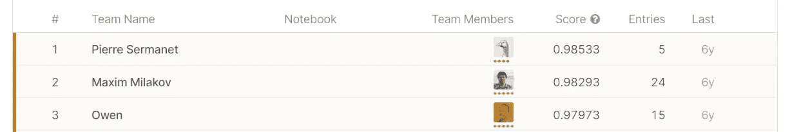

# 使用 Fastai 轻松进行图像分类

> 原文：<https://medium.com/analytics-vidhya/image-classification-with-ease-using-fastai-71d491d42f44?source=collection_archive---------25----------------------->


完整的笔记本可从[这里](https://colab.research.google.com/drive/1-e-HXyRA1fiROQALhFJHYeIB5ypSdTv2)获得

我正在做 Fastai 的[程序员实用深度学习 v3](https://course.fast.ai/) 中关于实用深度学习的课程。它是在线 moocs 格式的，非常棒。

这个课程是关于他们在 pytorch 上建立的 fastai 库的。从一开始，他们就用深度学习弄脏了我们的手。他们遵循自上而下的方法。

我有一些使用 pytorch 的经验，所以我知道我必须写多少行代码，从准备数据加载器或数据迭代器到训练模型，但是在 fastai 中只有几行。我喜欢它，在这篇文章中，我将展示如何在经典的[狗对猫](https://www.kaggle.com/biaiscience/dogs-vs-cats)数据集上使用迁移学习进行图像分类。

# *1。设置*

安装 fastai 非常容易。如果您正在使用 anaconda 环境，那么

你可以用

```
conda install -c pytorch -c fastai fastai
```

或者你想用 pip

```
pip install fastai
```

会为你工作。

这两个命令将安装最新的 pytorch-gpu 版本以及最新的 cuda-toolkit。

Fastai 非常有效地使用 GPU，因此如果你有一个好的 GPU，它将运行得很好，否则最好的选择是 [GOOGLE COLAB](https://colab.research.google.com/) ，它是免费的，提供良好的 GPU，并且没有使用限制。我有一个 GTX-1050，所以它对 resnet 50 之前的基本东西很好，但为了更好的架构，我切换到 colab。

# 2.导入数据集并对其进行处理以进行模型定型

```
import os
os.environ['KAGGLE_USERNAME'] = "your username"
os.environ['KAGGLE_KEY'] = "your unique key"
!kaggle datasets download -d biaiscience/dogs-vs-cats
```

这将把数据集从 kaggle 下载到 colab workspace。狗对猫数据集有 25000 幅训练图像和 12500 幅测试图像。

```
import fastai
from fastai.vision import *
path='train/train/'
fnames = np.array([f'train/train/{f}' for f in sorted(os.listdir(f'{path}'))])
tfms=get_transforms()
def get_labels(file_path):
     return 'cat' if 'cat' in str(file_path) else 'dog'
data=ImageDataBunch.from_name_func(f'{path}train',label_func=get_labels,fnames=fnames, ds_tfms=tfms, size=224)
```

这几行代码将导入库，为图像准备转换，并创建一个图像数据库。数据集中就像数据加载器。

我们可以通过键入以下命令来显示当前的类

```
data.classes
```

这会输出一个标签列表

```
[‘cat’, ‘dog’]
```

我们也可以通过使用

```
data.show_batches(rows=3,figsize=(5,5))
```


用于训练的一批图像

# 3.模特培训

我们可以只用一行代码创建一个 CNN 模型

```
learn=cnn_learner(data,models.resnet50,metrics=[accuracy,error_rate])
```

Fastai 支持从 resnets、vgg 到 densenets 的许多预训练架构。我们还可以创建定制的架构。

为了拟合模型，我们使用 fit_one_cycle()

```
learn.fit_one_cycle(4)
```

这将在训练图像上训练模型的最后一层。


即使有冻结层，我们也能在仅仅 4 个时期内获得非常好的精度。我们可以在这里节省重量

```
learn.save('stage-1')
```

我们可以通过解冻来进一步提高模型的准确性。解冻有助于训练模型的所有层。

```
learn.unfreeze()
```

在训练任何深度学习模型时，设置学习率是非常重要的。

Fastai 也有用于此目的的 API。

```
learn.lr_find()
learn.recorder.plot()
```


当损失急剧减少时，我们应该选择一个学习率。我们将使用相同的 fit_one_cycle api 为所有层进一步训练 2 个周期。

这进一步提高了我们的准确性。


我们的准确率甚至超过了 kaggle 竞赛中的前 3 名



[https://www.kaggle.com/c/dogs-vs-cats/leaderboard](https://www.kaggle.com/c/dogs-vs-cats/leaderboard)

我们还可以看到分类报告和验证集中最容易混淆的案例

```
interp = ClassificationInterpretation.from_learner(learn)
interp.plot_confusion_matrix(figsize=(12,12), dpi=60)
interp.most_confused()
```

它输出

```
[(‘cat’, ‘dog’, 21), (‘dog’, ‘cat’, 8)]
```

和


我们的模型运行得非常好，所以我们可以用它来预测。

# 4.推理

我忘了将测试图像添加到我们的数据集中，所以我们现在将在导出之前完成它。

```
test=ImageList.from_folder('./test/test')
data.add_test(test)
```

我们现在可以使用训练好的模型来预测测试图像。我们将使用两个图像，一个为猫，一个为狗。预测的语法是

```
learn.predict(img)
```


(类别狗，张量(1)，张量([1.7682e-07，1.0000e+00])(类别猫，张量(0)，张量([9.9987e-01，1.2751e-04]))

所以我们的模型正确地预测了这两只宠物。

# 5.结论

Fastai 是一个非常容易使用的库，用于从计算机视觉到自然语言处理的各种深度学习应用，它还有一个[活跃社区](https://forums.fast.ai/)。

它的最新课程将于今年 7 月推出，他们的图书馆也将更新。

这是我第一次写中型文章。请给一个反馈，以便我可以改进，如果你喜欢它，请鼓掌。