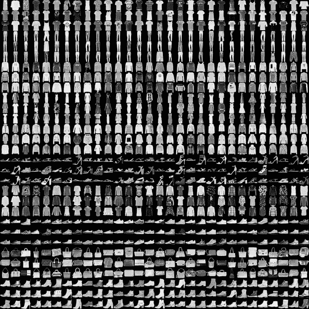
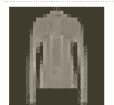
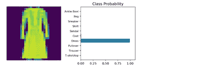

# 基于 PyTorch 的时尚 MNIST 数据集上的图像分类

> 原文：<https://medium.com/analytics-vidhya/image-classification-with-fashion-mnist-dataset-and-pytorch-719a305d7374?source=collection_archive---------8----------------------->


PyTorch 是由脸书人工智能研究小组开发的著名的 Python 开源机器学习库。PyTorch 相信动态图，不像 TensorFlow 创建静态图。PyTorch 支持 CPU 和 GPU 计算。

在这篇文章中，我们将看到机器学习模型的“HELLO WORLD ”,其中有一个非常著名的数据集可用于图像分类，即 *Fashion_MNIST 数据集*,其中我们将针对给定的图像，判断它是一件衣服(区分两性的各种上装和下装)、鞋类还是一个包。从而确定它属于哪一类的概率。

**关于数据集:**

对于这个模型，我将使用由 Zalando 的文章图像组成的时尚 MNIST 数据集，这是一组 28x28 灰度的衣服图像，是 MNIST 数据集的替代物。在这里，你将学会建立你的神经网络。

下图显示了您将在本文中了解的数据集。

# 时尚 MNIST 数据集



时尚 MNIST 数据集

时尚 MNIST 数据集由 70，000 幅灰度图像和 10 个类别组成。你可以在这里看到:【https://github.com/zalandoresearch/fashion-mnist#labels】T4

首先，请遵循以下步骤:

1.  **通过 torchvision 加载数据集。**

```
import torch
from torchvision import datasets, transforms
import helper# Define a transform to normalize the data
transform = transforms.Compose([transforms.ToTensor(),
                                #transforms.Lambda(lambda x: x.repeat(3,1,1)),
                                transforms.Normalize((0.5, ), (0.5,))])
# Download and load the training data
trainset = datasets.FashionMNIST('~/.pytorch/F_MNIST_data/', download=True, train=True, transform=transform)
trainloader = torch.utils.data.DataLoader(trainset, batch_size=64, shuffle=True)# Download and load the test data
testset = datasets.FashionMNIST('~/.pytorch/F_MNIST_data/', download=True, train=False, transform=transform)
testloader = torch.utils.data.DataLoader(testset, batch_size=64, shuffle=True)
```

要加载图像，

```
image, label = next(iter(trainloader))
helper.imshow(image[0,:]);
```

这里我们可以看到来自数据集的图像。



数据集中单件服装的图像

**2。** **构建网络**

与 MNIST 一样，每个图像是 28×28，总共是 784 个像素，并且有 10 个类别。您应该包括至少一个隐藏层。我们建议您对层使用 ReLU 激活，并从正向过程返回 logits 或 log-softmax。添加多少层以及这些层的大小由您决定。

我们使用**激活功能(Relu，sigmoid 等)**来限制输出信号，并将输出值限制在某个有限值

```
from torch import nn, optim
import torch.nn.functional as F#Nwtwork Architecture:class Classifier(nn.Module):
    def __init__(self):
        super().__init__()
        self.fc1 =  nn.Linear(784,256)
        self.fc2 =  nn.Linear(256,128)
        self.fc3 =  nn.Linear(128,64)
        self.fc4 =  nn.Linear(64,10)

    def forward(self,x):
        x = x.view(x.shape[0],-1) ## flattening the Tensor

        x = F.relu(self.fc1(x))
        x = F.relu(self.fc2(x))
        x = F.relu(self.fc3(x))
        x = F.log_softmax(self.fc4(x), dim = 1)

        return x
```

**3。** **训练模型**

在这一步的模型训练中，我们将像 nn 一样定义准则(*)。交叉熵或 nn。NLLLoss* )和优化器 *(optim。*亚当只喜欢梯度下降以尽量减少损失)。接下来，我们将通过网络向前传递，以获取 logits 并计算损耗。此外，使用**loss . backward()*在网络中执行反向传递，以计算梯度并使用优化器更新权重。*

```
*#Defining the criterion and optimizer
model = Classifier()
criterion =  nn.NLLLoss()
optimizer = optim.Adam(model.parameters(), lr = 0.005)#Network Training
epochs = 5for e in range(epochs):
    running_loss=0
    for images, labels in trainloader:
        logps = model(images)
        loss = criterion(logps, labels)

        optimizer.zero_grad()
        loss.backward()
        optimizer.step()

        running_loss += loss.item()

    else:

        print(f"Training loss:{running_loss}")*
```

*4.**绘制图像和概率***

*最后，我们将使用 softmax 和 plot 计算概率。*

*它会给我们图像所属类别的概率*

```
*%matplotlib inline
%config InlineBackend.figure_format = 'retina'import helper **#user define for library classification and label**dataiter = iter(testloader)
images,lables = dataiter.next()
img =  images[2]ps =  torch.exp(model(img)) #Class probabilities (softmax)#Image and probabilities
helper.view_classify(img,ps,version = 'Fashion')*
```

*这里你已经学会了你的一个机器学习模型。！！*

**

*分类服装的图像。*

*我知道这篇文章中有很多技术性的东西，可能会让人望而生畏，或者超出了任何刚刚涉足机器学习的人的范围。我将在未来连续发表文章详细解释其中的许多问题。*

*要了解更多关于激活函数，优化技术，和损失函数 [*点击这里*](/analytics-vidhya/activation-functions-optimization-techniques-and-loss-functions-75a0eea0bc31)*

*希望这有所帮助:)*

*如果你喜欢我的帖子，请关注。*

*如需更多帮助，请查看我的 Github:-[https://Github . com/Afaf-at har/Fashion mnist/blob/master/Fashion-% 20 mnist . ipynb](https://github.com/Afaf-Athar/FashionMNIST/blob/master/Fashion-%20MNIST.ipynb)*