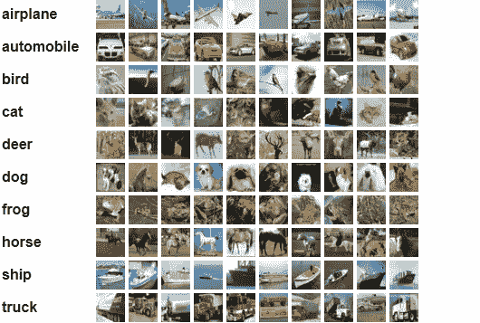
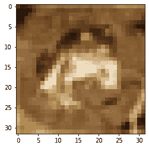
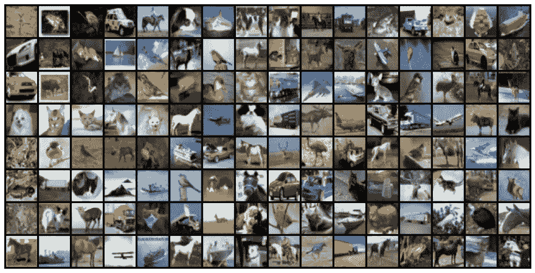
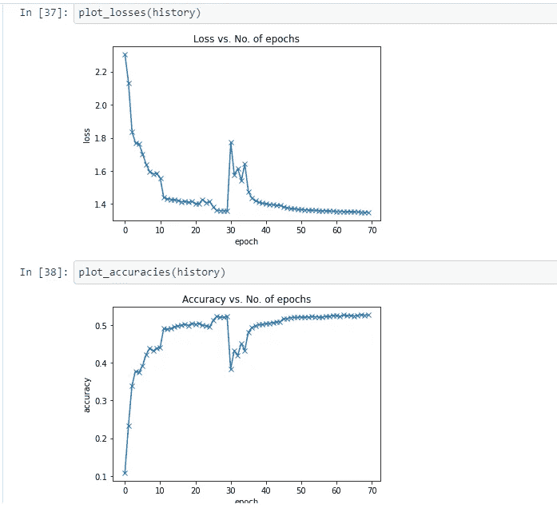

# PyTorch 图像分类

> 原文：<https://medium.com/analytics-vidhya/image-classification-with-pytorch-184e76c2cf3b?source=collection_archive---------11----------------------->

***CIFAR 10 数据集使用逻辑回归***



CIFAR-10 数据集(来源:【https://www.cs.toronto.edu/~kriz/cifar.html】T4)

在我之前的帖子中，我们已经讨论过了

1.  [深度学习——人工神经网络](/analytics-vidhya/deep-learning-artificial-neural-network-ann-13b54c3f370f?source=your_stories_page---------------------------)
2.  [张量 pytorch 编程基础](/@arun.purakkatt/tensors-basics-of-pytorch-programming-5de82ea45ebf?source=your_stories_page---------------------------)
3.  [使用 PyTorch 进行线性回归](/analytics-vidhya/linear-regression-with-pytorch-147fed55f138)

*让我们尝试用逻辑回归来解决*[*CIFAR-10*](https://www.cs.toronto.edu/~kriz/cifar.html)*数据集的图像分类。*

***第一步:导入必要的库&浏览数据集***

我们正在进口必要的图书馆熊猫，numpy，matplotlib，火炬，火炬视觉。使用基本 EDA，我们可以推断 CIFAR-10 数据集包含 10 类图像，训练数据集大小为 50000 个图像，测试数据集大小为 10000 个图像。每个图像的大小为[3 x 32 x 32 ]。其表示 3 通道 RGB，32×32 像素大小。

```
*#Explore CIFAR Data set*
dataset = CIFAR10(root='data/', download=True, transform=ToTensor())
test_dataset = CIFAR10(root='data/', train=False, transform=ToTensor())*#size of training data*
dataset_size = len(dataset)
dataset_size*#size of test data*
test_dataset_size = len(test_dataset)
test_dataset_size*#number of classes in the data set*
classes = dataset.classes
classes
```

可视化样本图像和样本图像的尺寸。

```
*#Let us understand the size of one image*
img, label = dataset[0]
img_shape = img.shape
img_shape*#Let us look at a sample image*
img, label = dataset[0]
plt.imshow(img.permute((1, 2, 0)))
print('Label (numeric):', label)
print('Label (textual):', classes[label])
```

因为这是一个 3 通道 RGB 图像，Pytorch 期望通道作为第一维，而 matplotlib 期望作为图像的最后一维。给你。使用置换 tesnor 方法将通道移动到最后一个维度



标签(数字):6
标签(文本):青蛙

***第二步:为训练准备数据***

我们使用训练集，验证集，测试集。我们为什么需要它们？

训练集:用于训练我们的模型，计算损失和调整权重验证集:评估具有超参数的模型，并在训练期间选择最佳模型。我们使用 10%的训练数据作为验证集测试数据集:用于比较不同的模型并报告最终的准确性。

我们使用 pytorch 中的 random_split 来创建 train_ds 和 val_ds。设置 torch.manual_seed(43)用于再现结果。

```
#validation set size 5000 ie 10% 
torch.manual_seed(43)
val_size = 5000
train_size = len(dataset) - val_size#creating training & validation set using random_split
train_ds, val_ds = random_split(dataset, [train_size, val_size])
len(train_ds), len(val_ds)
```

我们使用的数据加载器与上一个示例中使用的一样，批量大小为 128。为了可视化我们的数据，我们使用 torch vision 的 make_grid 辅助函数。

```
#Creating data loader to load data in batches
batch_size=128train_loader = DataLoader(train_ds, batch_size, shuffle=True, num_workers=4, pin_memory=True)
val_loader = DataLoader(val_ds, batch_size*2, num_workers=4, pin_memory=True)
test_loader = DataLoader(test_dataset, batch_size*2, num_workers=4, pin_memory=True)#visualize data using make_grid helper function from torch vision
for images, _ in train_loader:
    print('images.shape:', images.shape)
    plt.figure(figsize=(16,8))
    plt.axis('off')
    plt.imshow(make_grid(images, nrow=16).permute((1, 2, 0)))
    break
```



图像。形状:火炬。尺寸([128，3，32，32])

***第三步:创建基础模型类&在 GPU 上训练***

我们正在创建一个从 nn.module 继承的 ImageClassificationBase 类，它不包含模型体系结构，即 __init__ & __forward__ 方法。

```
class ImageClassificationBase(nn.Module):
    def training_step(self, batch):
        images, labels = batch 
        out = self(images)                  # Generate predictions
        loss = F.cross_entropy(out, labels) # Calculate loss
        return loss

    def validation_step(self, batch):
        images, labels = batch 
        out = self(images)                    # Generate predictions
        loss = F.cross_entropy(out, labels)   # Calculate loss
        acc = accuracy(out, labels)           # Calculate accuracy
        return {'val_loss': loss, 'val_acc': acc}

    def validation_epoch_end(self, outputs):
        batch_losses = [x['val_loss'] for x in outputs]
        epoch_loss = torch.stack(batch_losses).mean()   # Combine losses
        batch_accs = [x['val_acc'] for x in outputs]
        epoch_acc = torch.stack(batch_accs).mean()      # Combine accuracies
        return {'val_loss': epoch_loss.item(), 'val_acc': epoch_acc.item()}

    def epoch_end(self, epoch, result):
        print("Epoch [{}], val_loss: {:.4f}, val_acc: {:.4f}".format(epoch, result['val_loss'], result['val_acc']))
```

*我们都听说过，要训练深度学习模型，CPU 是不够的，但我们需要 GPU。如何在 GPU 上训练我们的模型？*

我们正在检查设备可用性，它会根据您的系统设置显示 GPU/CPU。我们正在创建辅助函数 to_device 来将张量移动到所选的设备。将数据移动到设备的 devicedataloader()类。我们将需要帮助函数来绘制损失和准确性。

```
device = get_default_device()
devicedef to_device(data, device):
    """Move tensor(s) to chosen device"""
    if isinstance(data, (list,tuple)):
        return [to_device(x, device) for x in data]
    return data.to(device, non_blocking=True)class DeviceDataLoader():
    """Wrap a dataloader to move data to a device"""
    def __init__(self, dl, device):
        self.dl = dl
        self.device = device

    def __iter__(self):
        """Yield a batch of data after moving it to device"""
        for b in self.dl: 
            yield to_device(b, self.device)def __len__(self):
        """Number of batches"""
        return len(self.dl)
```

将数据加载器移动到适当的设备。

```
train_loader = DeviceDataLoader(train_loader, device)
val_loader = DeviceDataLoader(val_loader, device)
test_loader = DeviceDataLoader(test_loader, device)
```

***第三步:训练模式***

与线性回归相似，不同之处在于我们也有验证阶段。输入尺寸为 3x32x32，输出尺寸为 10。我们使用了两个隐藏层。神经网络架构将看起来像 2048 x 1650 x 512 x 138 x 10。图像被展平成矢量，应用图层和激活函数，最后使用输出图层得到预测。Relu 在这里用作激活函数。

```
**class** **CIFAR10Model**(ImageClassificationBase):
    **def** __init__(self):
        super().__init__()
        self.linear1 = nn.Linear(input_size, 1650)
        *# hidden layers*
        self.linear2 = nn.Linear(1650, 512)
        self.linear3 = nn.Linear(512, 138)
        *# output layer*
        self.linear4 = nn.Linear(138, output_size)

    **def** forward(self, xb):
        *# Flatten images into vectors*
        out = xb.view(xb.size(0), -1)
        *# Apply layers & activation functions*
        out = self.linear1(out)
        *# Apply activation function*
        out = F.relu(out)
        *# Get intermediate outputs using hidden layer 2*
        out = self.linear2(out)
        *# Apply activation function*
        out = F.relu(out)
        *# Get predictions using output layer*
        out = self.linear3(out)
        *# Apply activation function*
        out = F.relu(out)
        *# Get predictions using output layer*
        out = self.linear4(out)
        *# Apply activation function*
        out = F.relu(out)
        **return** out
```

利用拟合函数训练模型，减少损失，提高精度。在这里，我们正在尝试不同的学习速度和时期。在学习率为 0.001 和周期数为 25 的情况下，我们获得了最佳精度。

```
history += fit(10, 0.05, model, train_loader, val_loader)
history += fit(8, 0.005, model, train_loader, val_loader)
history += fit(7, 0.01, model, train_loader, val_loader)
history += fit(4, 0.001, model, train_loader, val_loader)
history += fit(10, 0.0001, model, train_loader, val_loader)#since 0.001 gives best accuracy, will go with that
history += fit(25, 0.001, model, train_loader, val_loader)
```



精度和损失与时代的数量

***第四步:记录结果&保存模型***

我们可以用下面的代码保存这个模型，它可以用来预测。

```
evaluate(model, test_loader)
arch =  '4 layers (1650,512,138,10)'
lrs = [0.5,0.01,0.05,0.001,0.1]
epochs = [5,7,8,10,4, 25]test_acc =  0.54
test_loss = 1.30torch.save(model.state_dict(), 'cifar10-feedforward.pth')
```

请在笔记本 [*Github*](https://github.com/Arun-purakkatt/Deep_Learning_Pytorch) 上查看完整代码，在[*上保持连接，在*](https://www.linkedin.com/in/arun-purakkatt-mba-m-tech-31429367/) 中保持链接。

***演职员表&参考文献:***

1.  [https://jovian.ml/aakashns/03-logistic-regression](https://jovian.ml/aakashns/03-logistic-regression)
2.  [https://www . deep learning wizard . com/deep _ learning/practical _ py torch/py torch _ linear _ regression/](https://www.deeplearningwizard.com/deep_learning/practical_pytorch/pytorch_linear_regression/)
3.  [https://pytorch.org/docs/stable/tensors.html](https://pytorch.org/docs/stable/tensors.html)