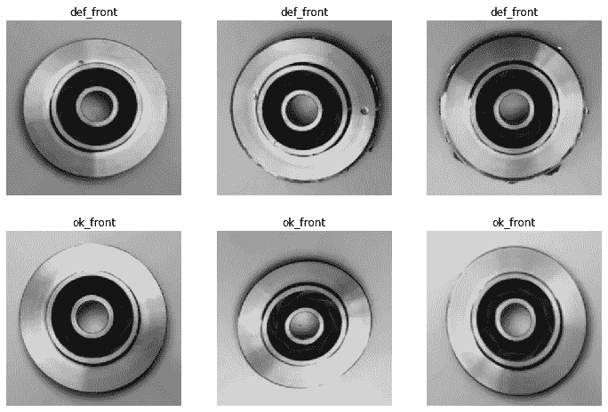
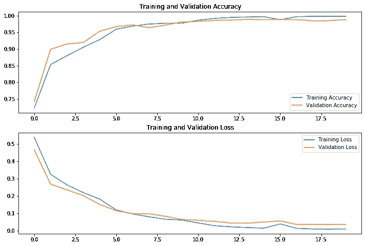

# 张量流图像分类

> 原文：<https://medium.com/analytics-vidhya/image-classification-with-tensorflow-2a406bdfe0c1?source=collection_archive---------1----------------------->

本文是使用 TensorFlow python 包训练、测试和保存用于图像分类的机器学习模型的端到端示例。

# 张量流

TensorFlow 是 Google 开发并开源的机器学习(主要是深度学习)包；TensorFlow 最初发布时是为有经验的用户提供的一个相对低级的包，但是在最近几年，尤其是自从 TensorFlow 2.0 发布以来，它现在面向更广泛的用户。

几年前，我与我们的一名开发人员一起进行了一次概念验证，研究如何在我们的一个移动应用程序上离线运行 TensorFlow 模型。虽然我们发现这是可能的，但我们也遇到了一些挑战，使得解决方案相当复杂。向前滚动到 2020 年，TensorFlow 提升了很多；最新版本与 Keras APIs 有了更大的集成，它正在扩展以覆盖更多的数据处理管道，并且还扩展到支持新语言，TensorFlow.js 包及其支持的用例尤其有趣。

# 图像分类

图像分类是深度学习最著名的应用之一，它被用于一系列技术开发，包括新颖的人脸交换应用程序，放射学的新方法和环境的拓扑分析。通常情况下，图像分类是使用一种特殊类型的神经网络来实现的，这种网络称为卷积神经网络(CNN)，[如果你想了解更多一点，这篇文章](https://towardsdatascience.com/a-comprehensive-guide-to-convolutional-neural-networks-the-eli5-way-3bd2b1164a53)对 CNN 进行了很好的介绍。

# 示例笔记本

一个相应的 Jupyter 笔记本可以在[这里找到](https://github.com/timbusfield/TensorFlow-Notebooks/blob/main/Image%20Classification%20-%20Cast%20Parts.ipynb)。

# 预读

首先，如果你还没有安装 TensorFlow，并希望遵循这个例子，请查看[安装指南](https://www.tensorflow.org/install)。此处显示的代码主要取自 TensorFlow 网站上的两个图像分类示例。首先是这个[基本示例](https://www.tensorflow.org/tutorials/keras/classification)，其次是[这个](https://www.tensorflow.org/tutorials/images/classification)引入了更多概念来提高模型性能。

# 数据

我不想重复 TensorFlow 中规定的练习，而是想使用另一个数据集，我发现这有助于我更好地理解每个步骤，因为示例代码总是需要一些修改。

在这种情况下，我使用了来自 Kaggle 的开放数据集，包含潜水泵叶轮的 7348 灰度、300x300 像素图像。其中一些叶轮被归类为“合格”,而另一些被归类为“有缺陷”。面临的挑战是根据这些数据训练一个模型，用来准确地将图像分类。

[](https://www.kaggle.com/ravirajsinh45/real-life-industrial-dataset-of-casting-product) [## 用于质量检查的铸造产品图像数据

### 工业数据，铸造产品，质量检测，自动化

www.kaggle.com](https://www.kaggle.com/ravirajsinh45/real-life-industrial-dataset-of-casting-product) 

# 设置

首先导入 TensorFlow，确认版本；此示例是使用版本 2.3.0 创建的。

```
import tensorflow as tf
print(tf.__version__)
```

接下来，指定处理图像所需的一些元数据，如前所述，这些是灰度图像，因此只有 1 层或 1 个通道的数据，如果这些是 rgb 图像，则颜色层的数量将为 3。

```
color_mode = "grayscale"
number_colour_layers = 1
image_size = (300, 300)
image_shape = image_size + (number_colour_layers,)
```

# 导入和预处理数据

在这种情况下，数据已经被分割到单独的训练和测试数据目录中。但是，我想进一步将训练数据分为训练和验证数据集，对于那些不熟悉这些术语的人来说，训练数据集用于训练模型，验证数据集用于在训练时验证模型，测试集用于在训练完成后评估模型。有用的是，有一个 [Keras API 用于摄取图像数据](https://www.tensorflow.org/api_docs/python/tf/keras/preprocessing/image_dataset_from_directory),图像数据被分成目录，这可以从文件夹结构中推断出分类类名，我们需要做的只是提供数据的位置和我们已经定义的元数据。此外，在开发代码时，最好使用种子，以便您知道每次运行的性能变化是由于您所做的更改，而不仅仅是由于数据分割的更改。

*注意:确保将下面的数据路径替换为您保存数据的位置。*

```
training_data_path = "./casting_data/casting_data/train"
test_data_path = "./casting_data/casting_data/test"
SEED = 42
```

我将创建一个方法，它接收数据并为分析做准备，这样我可以为训练集调用一次该方法，为验证集调用一次，然后为测试集调用一次，并且知道它们是以相同的方式准备的。

```
def get_image_data(data_path, color_mode, image_size, seed = None, subset = None, validation_split = None):
    if subset:
        validation_split = 0.2
    return tf.keras.preprocessing.image_dataset_from_directory(
        data_path,
        color_mode=color_mode,
        image_size=image_size,
        seed=seed,
        validation_split=validation_split, 
        subset=subset
    )
```

在使用这种方法之前，我想在中添加一些增强功能，首先帮助优化训练性能，以充分利用可用的内存和计算，要深入了解这一点，请查看此 [TensorFlow 性能指南](https://www.tensorflow.org/guide/data_performance)。

```
def get_image_data(data_path, color_mode, image_size, seed = None, subset = None, validation_split = None):
    if subset:
        validation_split = 0.2
    raw_data_set = \
    tf.keras.preprocessing.image_dataset_from_directory(
        data_path,
        color_mode=color_mode,
        image_size=image_size,
        seed=seed,
        validation_split=validation_split, 
        subset=subset
    )

    return raw_data_set.cache().prefetch(
        buffer_size = tf.data.experimental.AUTOTUNE
    )
```

其次，我想输出分类类的数量和名称，所以我将把返回类型从 FetchedDataset 改为包含 FetchedDataset 和类名列表的 dict。

```
def get_image_data(data_path, color_mode, image_size, seed = None, subset = None, validation_split = None):
    if subset:
        validation_split = 0.2
    raw_data_set = \
    tf.keras.preprocessing.image_dataset_from_directory(
        data_path,
        color_mode=color_mode,
        image_size=image_size,
        seed=seed,
        validation_split=validation_split, 
        subset=subset
    )

    raw_data_set.class_names.sort()

    return {
        "data": raw_data_set.cache().prefetch(
        buffer_size = tf.data.experimental.AUTOTUNE
        ),
        "classNames": raw_data_set.class_names
    }
```

然后我可以调用这个方法来创建我的训练、验证和测试数据集。

```
training_ds = get_image_data(
    training_data_path,
    color_mode,
    image_size,
    SEED,
    subset = "training"
)validation_ds = get_image_data(
    training_data_path,
    color_mode,
    image_size,
    SEED,
    subset = "validation"
)test_ds = get_image_data(
    test_data_path,
    color_mode,
    image_size
)
```

作为健全性检查，我只想确保两个集合中的类的名称和数量是相同的，然后存储用于分类的类的数量，以用于定义模型的输出形状。

```
equivalence_check = training_ds["classNames"] == validation_ds["classNames"]
assert_fail_message = "Training and Validation classes should match"
assert(equivalence_check), assert_fail_message
class_names = training_ds["classNames"]
number_classes = len(class_names)
```

就在我开发训练代码的时候，我想看看这些图片的一个小样本。

```
from os import listdir
from os.path import join
import matplotlib.image as mpimg
import matplotlib.pyplot as plt
%matplotlib inlineimage_indexes = [286, 723, 1103]
selected_image_file_paths = dict()for classification in class_names:
    image_directory = join(training_data_path, classification)
    image_file_names = listdir(image_directory)
    selected_image_file_paths[classification] = [join(image_directory, image_file_names[i]) for i in image_indexes]plt.figure(figsize=(12, 8))

for i,classification in enumerate(class_names):
    for j,image in enumerate(selected_image_file_paths[classification]):
        image_number = (i * len(image_indexes)) + j + 1
        ax = plt.subplot(number_classes,3,image_number)
        plt.title(classification)
        plt.axis("off")
        plt.imshow(mpimg.imread(image))
```



每个分类的图像样本

最后，在开始构建模型之前，我还需要考虑一件事。灰度通道值在范围`[0, 255]`内，但是对于神经网络训练，这些值应该很小，因此我想将这些值重新调整到范围`[0, 1]`内。可选地，我可以在我的`get_image_data`方法中添加一个步骤，类似于`raw_data_set = raw_data_set / 255.0`的步骤，但是如果我将该步骤作为训练数据准备的一部分，那么该模型的任何消费者(在我的例子中是一些前端代码)也必须以同样的方式重新缩放图像值…

# 模型定义

令人欣慰的是，Keras 现在允许我将 rescale 操作添加到模型的开头，这意味着当稍后使用它时，前端代码可以只传递原始图像文件数据(假设图像也是灰度和 300x300 像素)。

```
preprocessing_layers = [
    tf.keras.layers.experimental.preprocessing.Rescaling(1./255, input_shape=image_shape)
]
```

对于模型本身，我将使用一系列散布在池层中的卷积层来部署一个通用模式。

```
def conv_2d_pooling_layers(filters, number_colour_layers):
    return [
        tf.keras.layers.Conv2D(
            filters,
            number_colour_layers,
            padding='same',
            activation='relu'
        ),
        tf.keras.layers.MaxPooling2D()
    ]core_layers = \
    conv_2d_pooling_layers(16, number_colour_layers) + \
    conv_2d_pooling_layers(32, number_colour_layers) + \
    conv_2d_pooling_layers(64, number_colour_layers)
```

要完成模型，首先需要将数据展开到 1D，然后部署密集层，以确保输出的节点数等于可能的分类数。

```
dense_layers = [
    tf.keras.layers.Flatten(),
    tf.keras.layers.Dense(128, activation='relu'),
    tf.keras.layers.Dense(number_classes)
]
```

然后，我可以将所有这些层放在一个顺序模型中。

```
model = tf.keras.Sequential(
    preprocessing_layers +
    core_layers +
    dense_layers
)
```

然后定义模型的编译选项。

```
loss = tf.keras.losses.SparseCategoricalCrossentropy(from_logits=True)
model.compile(
    optimizer='adam',
    loss=loss,
    metrics=['accuracy']
)
```

# 训练模型

我将最大历元数设置为 20，但为了防止过度拟合，我将设置训练在检测到验证损失不再改善时停止。

```
callback = tf.keras.callbacks.EarlyStopping(
    monitor='val_loss', min_delta=0, patience=3, verbose=0, mode='auto',
    baseline=None, restore_best_weights=True
)history = model.fit(
    training_ds["data"],
    validation_data = validation_ds["data"],
    epochs = 20,
    callbacks = [callback]
)
```

在 20 个时期结束时，模型训练已经完成，并且精确度非常高(在 98%和 99%之间)，这更可能是由于对数据被捕获的条件的仔细控制或者图像的一些增强，而不是模型本身特别好，因为它还没有被优化。通常在真实世界场景中，数据的可变性使得在没有仔细预处理图像本身的情况下难以训练精确的模型(针对照明、背景、设备质量、拍摄角度、拍摄距离等进行标准化)。).

# 评估模型和培训

训练完模型后，下一步是测试它，我们可以通过调用 evaluate 方法并向其传递测试数据来完成。

```
model.evaluate(test_ds["data"])
```

在这种情况下，模型在测试(99%的准确率)和训练中表现得非常好，但是在某些情况下，您可能会发现模型在训练中达到了很高的准确率，但是在测试中表现很差；这可能是由于过度拟合，但在我们的情况下，我们已经采取措施防止过度拟合，或者可能是测试和训练数据集取自不同的分布，研究这一点的一种方法是组合、洗牌和重新分割数据集。

我们还可以绘制模型在训练期间的性能，下面我们可以看到精度和损失相对稳定地提高，然后在精度非常高时开始趋于平稳(如您所料)，但是也有性能恶化的时期，如果耐心设置较低，训练将在这些点停止。

```
acc = history.history['accuracy']
val_acc = history.history['val_accuracy']loss = history.history['loss']
val_loss = history.history['val_loss']epochs_range = range(len(acc))plt.figure(figsize=(12, 8))
plt.subplot(2, 1, 1)
plt.plot(epochs_range, acc, label='Training Accuracy')
plt.plot(epochs_range, val_acc, label='Validation Accuracy')
plt.legend(loc='lower right')
plt.title('Training and Validation Accuracy')plt.subplot(2, 1, 2)
plt.plot(epochs_range, loss, label='Training Loss')
plt.plot(epochs_range, val_loss, label='Validation Loss')
plt.legend(loc='upper right')
plt.title('Training and Validation Loss')
plt.show()
```



每个时期的模型训练性能

# 保存模型

因为我的用例是用于 TensorFlow.js 的，所以我将把模型保存为 TensorFlow.js 要求的格式，而不是通常的格式。为此，我需要[安装另一个包](https://pypi.org/project/tensorflowjs/)。

```
import tensorflowjs as tfjstfjs.converters.save_keras_model(
    model,
    "./tmp/model_js_1"
)
```

一旦它是这种格式，我就可以与前端开发人员分享，他们可能会创建一个应用程序，用于在线或离线加载和分类图像。

# 结论

TensorFlow 在过去几年中的改进意味着，对于那些希望开始培训和部署深度学习模型的人来说，它更容易使用，在线上也有很好的文档，因此绝对值得一看。如果你想让这些代码适应你自己的用例或数据集，我试图让它们更容易使用，我认为这是一个很好的学习方法，因为它迫使你在每个阶段都更仔细地观察。

# 谢谢

感谢 Chris Mann、Ravirajsinh Dabhi、Sean Hennelly & Shri nishan th raje ndran 在整理这些内容时提供的注释和建议。