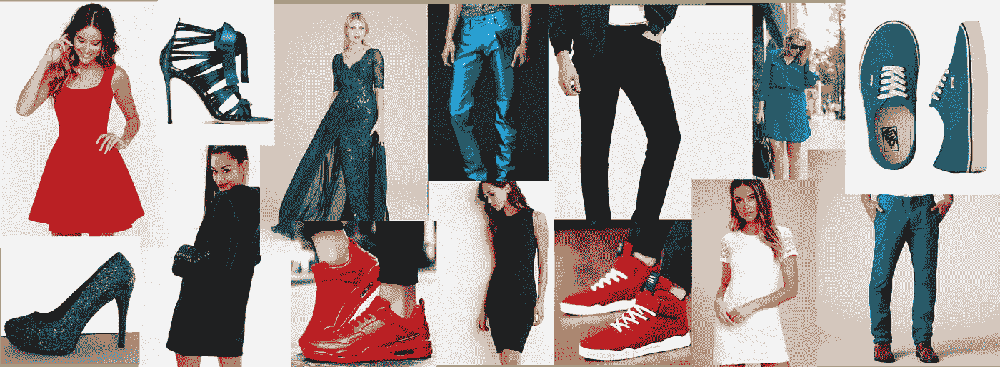
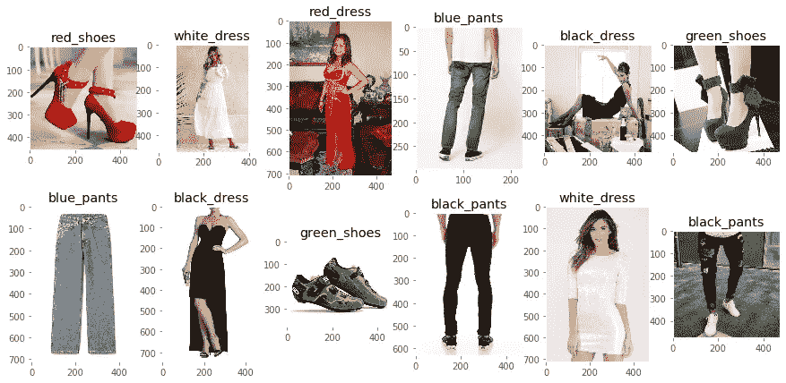
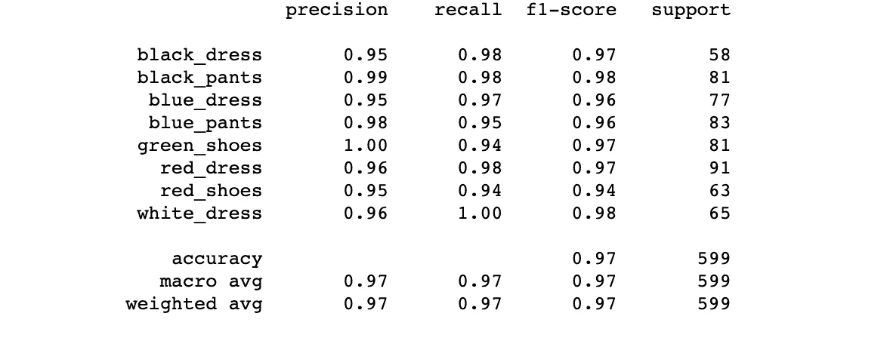
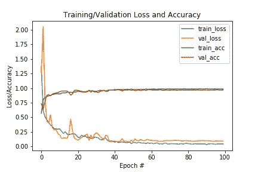
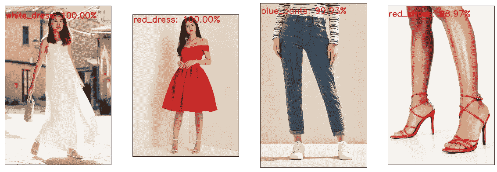
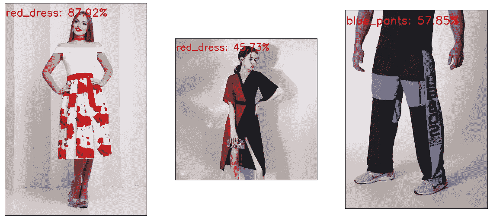

# 基于 Keras 的 VGG 卷积神经网络图像分类

> 原文：<https://medium.com/analytics-vidhya/image-classification-with-vgg-convolutional-neural-network-using-keras-for-beginners-61767950c5dd?source=collection_archive---------2----------------------->



图像分类和检测是计算机视觉和机器学习领域中最重要的任务之一。在这篇博客中，我训练了一个机器学习模型，使用类似 VGG(视觉几何组)的卷积神经网络对不同种类的服装进行分类( [Simonyan 等人，2014](https://arxiv.org/abs/1409.1556) )。

这个博客对那些对 CNN 有基本了解，并且正在寻找使用 Keras 实现它们的实用前景的人会很有用。读完这篇博客后，你会熟悉:

*   如何组织自定义数据集并为您自己的分类任务配置模型。
*   如何训练图像分类模型，在训练、评估和预测新的看不见的图像上的类别标签时使用不同的回调函数来监控进度。

在 VGG 架构中，所有卷积层都使用大小为 3×3 的滤波器，跨距=1，填充与*相同，所有最大池层都使用大小为 2×2 的滤波器，跨距= 2。对于每组卷积层，过滤器的数量增加一倍，而对于每一个合并层，图像的宽度和高度减少一半。在这里，我使用一个更小的类似 VGG 的模型来执行分类任务。我没有使用完整的 VGG 模型，因为它庞大的体积和大量的参数(众所周知 VGG 有)。尽管有许多其他模型的表现超过了 VGG，如 ResNet、Inception 等，但 VGG 对初学者来说很容易理解，并给出了一个关于如何实现卷积网的直观概念。如果你想重温一下关于卷积神经网络的记忆，可以参考[这篇](https://towardsdatascience.com/a-comprehensive-guide-to-convolutional-neural-networks-the-eli5-way-3bd2b1164a53)博客。*

博客被分为几乎所有图像分类任务共有的四个主要步骤:

*   **步骤 1:** **加载数据**(设置工作目录，初始化图像，调整大小，并执行测试序列分割)
*   **步骤 2:配置模型**(数据扩充、构建模型、设置回调和其他超参数)
*   **第三步:** **训练模型**(训练并监控进度)
*   **第四步:** **评估和预测**(获得分类报告，预测新的未看见图像的类别标签)

[数据集](https://www.kaggle.com/trolukovich/apparel-images-dataset/kernels)已从 Kaggle 下载。虽然原始数据集包含大约 24 种不同类别的服装，但在这篇博客中，我只包括了其中的 8 种。代码可以在我的 Github repo [这里](https://github.com/ashima0109/VGG-classification)获得。下载数据集后，您可以在该目录结构下组织数据(您可以通过进入目标目录并在终端中使用`tree --filelimit=15`来生成该结构)。

```
.
├── Dataset
│   ├── black_dress [450 entries]
│   ├── black_pants [539 entries]
|   .  
|   .
│   └── white_dress [506 entries]
├── Output
├── logs
├── main.py
├── predict.py
├── train.py
└── vgg.py
```

不同类别的数据存储在文件夹*数据集*下。每个类别有大约 450-550 个条目，给我们一个平衡的数据集。训练模型和损失精度图将保存在*输出*文件夹中。 *logs* 文件夹用于存储检查点，用于在模型被训练时监控 *tensorboard* 上的实时损失和精确度的进度。

导入 vgg.py 模块和必要的包

## **第一步:加载数据**

对于分类，我们需要初始化我们的输入 X 和输出 Y，其中 X 和 Y 是图像和它们各自的类标签。在下面的代码块中，我们定义了工作目录，并将所有图片的路径从`data_dir`加载到列表`imagePaths`中。在加载之前打乱输入图像的顺序是一个很好的做法，这样可以避免数据序列中的任何偏差。我们遍历所有的图像路径，从路径中提取图像并调整大小(64 x 64 像素大小)。图像(输入 X)和它们各自的标签(输出 Y)现在分别存储在`data`和`labels`列表中。

从图像目录加载数据

下面是对数据集的快速浏览:



我们将`data`和`labels`列表转换为 NumPy 数组，并对`data`进行规范化以加快收敛。为了训练模型，分类标签必须被转换成独热向量编码。对于多个标签，我们使用***label binarizer***，但是如果你只有两个类别，你可以使用 ***LabelEncoder*** 来代替，这将产生整数编码。编码的类名以序列化的方式存储在 pickle 文件中，以便以后在预测时查找类名。

现在我们已经有了正确格式的数据(X)和它们的标签(Y)，使用***train _ test _ split****函数将数据分割成训练集和测试集(顾名思义，用于训练和测试)。它采用诸如*数据(* X *)* 和它们的*标签(* Y *)* 、确定分割比例的 *test_size* 和决定洗牌参数的 *random_state* 等参数。*

*保存标签二进制化器并将数据分成训练和测试*

## *步骤 2:配置模型*

*分割数据集后，我们通过生成线性平移、反射、旋转和剪切不同的原始数据的相似图像来扩充数据，以防止过度拟合并提高泛化能力。也可以人为地将转换后的图像添加到数据集中，但是 Keras 有[***imagedata generator***](https://keras.io/preprocessing/image/)类，它会根据提供的参数自动执行此操作。可以根据数据集调整 *rotation_range、width_shift_range、height_shift_range、shear_range、zoom_range、horizontal_flip* 等参数的值。如果您选择人工添加转换后的图像，请记住只在训练集而不是测试集上这样做，因为这将导致数据泄漏，从而导致高错误精度。VGG 模型架构可以通过从 *vgg.py* 模块*导入来初始化。**

*数据扩充和模型初始化*

*Keras 中非常有用的功能之一是 [*回调*](https://keras.io/callbacks/) ，它们在模型的训练期间用于监控、记录和调试目的。这里我们在训练 ***时使用 ***ModelCheckpoint，TerminateOnNaN，ReduceLROnPlateau，*** 和 ***TensorBoard*** 。****

*   ****模型检查点*** 每隔几个时期(数量由*周期*参数指定)创建一个检查点，文件名包含该特定时期的值。例如:*' VGG _ 纪元-{纪元:02d } _ 损失-{损失:. 4f } _ 瓦尔 _ 损失-{瓦尔 _ 损失:. 4f}.h5'* 将在检查点文件的名称中包含纪元编号、训练损失和验证损失。*
*   ****终止 NaN*** 如果在任意一点损失值变为 NaN，则停止训练。*
*   ****ReduceLROnPlateau***在某个量(此处为验证损失)不随历元数减少的情况下，以某个因子降低学习率。参数 *patience* 决定了如果没有观察到改进，学习率将会降低的周期数。*
*   ****TensorBoard*** 可让您动态可视化并监控训练进度。日志存储在由参数 *log_dir 给出的文件夹路径中。要打开 tensorboard，请确保 tensorboard 已安装。在终端`*tensorboard --logdir=/path_to_logs*` 中使用该命令，然后在您的浏览器*中打开 *localhost:6006* ，可以可视化该训练。*对于这种特定的目录结构，使用`*tensorboard --logdir='./logs*` *。***

对于预测属于每个已知类别标签的样本的概率的分类任务，我们使用交叉熵作为损失函数。这里，*分类 _ 交叉熵*被选择作为我们的损失函数，因为我们有两个以上的类，并且我们假设每个图像只有一个真正的类，即这是多类问题(而不是在一个图像中可以有一个以上的类标签的多标签问题)。在这种情况下，为一个类别计算的对数损失也会影响其他类别的决策(因为只有一个正确答案)。如果我们手头有一个多标签分类问题，我们会使用' *binary_crossentropy '。*有关分类问题损失函数的更多信息和数学解释，请参考[这篇](https://gombru.github.io/2018/05/23/cross_entropy_loss/)博客。

准备回调并编译模型

## 第三步:培训

在配置模型之后，我们根据一次一批生成的数据对其进行训练。我们使用`flow()`创建一个迭代器，为每次迭代返回一批增强图像。训练完成后，模型应该保存在本地输出目录中。

训练模型并在完成时保存它

该模型用 Adam optimizer 训练超过 100 个时期，在这种情况下，初始学习率为 0.0007，批次大小为 64。我最初开始使用学习率 0.001，这是使用 Adam 的默认参数。然而，精确度和损失值显示出很大的波动，所以我降低了学习率，并得出最佳值 0.0007。

```
Epoch 1/100
53/53 [==============================] - 109s 2s/step - loss: 1.3691 - acc: 0.5699 - val_loss: 1.2561 - val_acc: 0.7312
.
.
.
Epoch 100/100
53/53 [==============================] - 86s 2s/step - loss: 0.0825 - acc: 0.9653 - val_loss: 0.0921 - val_acc: 0.9666
```

损失和准确度的训练图表明，当损失处于平稳状态时，使用 ***降低学习率*** 会产生显著的差异。该模型实现了 97%的总体准确率。

## 第四步:评估和预测

通过对批量大小的训练模型进行预测，可以找到各个类别的分类报告。

评估并生成分类报告



分类报告

使用 *matplotlib* 绘制训练和验证损失和准确度，可视化增加的准确度和减少的损失。70 个周期后损失没有减少，所以我也可以在那之后停止训练。

用历元数绘制训练/测试损失和准确度曲线



随着时期数的训练和验证损失/准确性

以下是一些由经过训练的模型所做预测的图像。



预测标签及其置信度值

该模型预测准确，可信度高。显然，人们可以找到服装是两种或三种不同类别的组合的例子。在这些情况下，置信度值会下降，标签会减少到两个类别中的任何一个。例如:



对混乱情况的预测

为了处理这种情况，应该训练一个多标签分类模型，它可以在一个图像中包含不同颜色和类型的服装。

总而言之，在这篇博客中，我们了解了:

*   如何从零开始建立图像分类模型？
*   配置模型，设置回调函数，并对其进行训练。
*   根据训练好的模型进行评估和预测。

你可以在我的 Github [repo](https://github.com/ashima0109/VGG-classification) 找到源代码和安装说明。请随时提出任何意见或建议来改进我的代码或进一步解释。

我还想感谢 Adrian Rosebrock，感谢他在计算机视觉方面的博客带给我的一切。

## 参考

*   [https://arxiv.org/abs/1409.1556](https://arxiv.org/abs/1409.1556)
*   [https://gombru.github.io/2018/05/23/cross_entropy_loss/](https://gombru.github.io/2018/05/23/cross_entropy_loss/)
*   [https://www . pyimagesearch . com/2017/03/20/imagenet-vggnet-resnet-inception-xception-keras/](https://www.pyimagesearch.com/2017/03/20/imagenet-vggnet-resnet-inception-xception-keras/)