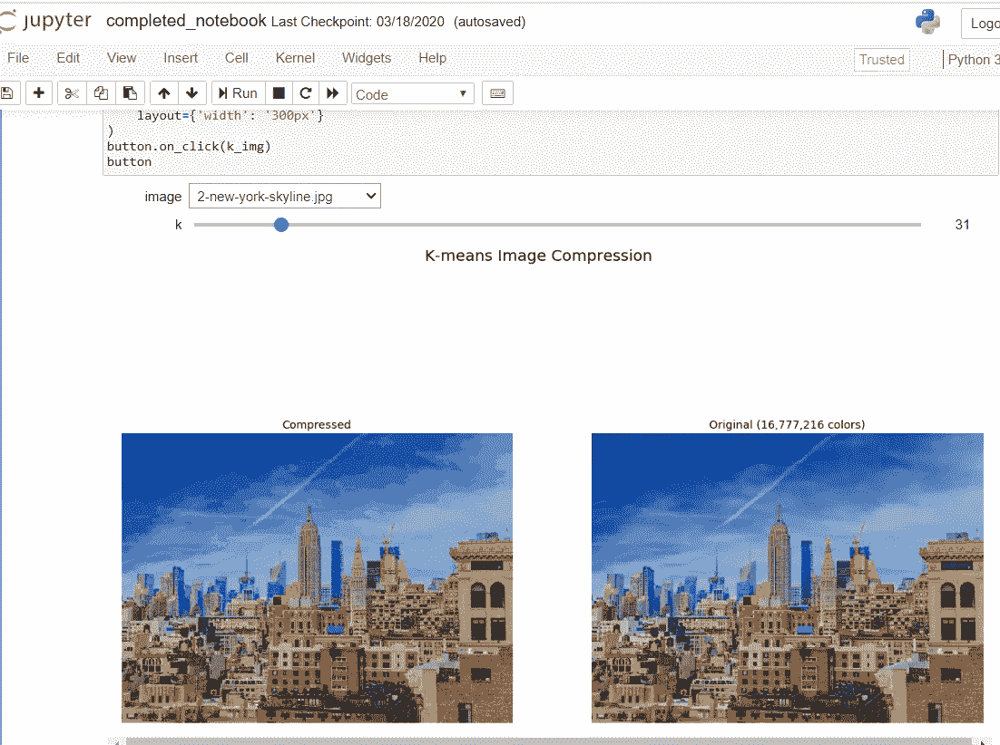
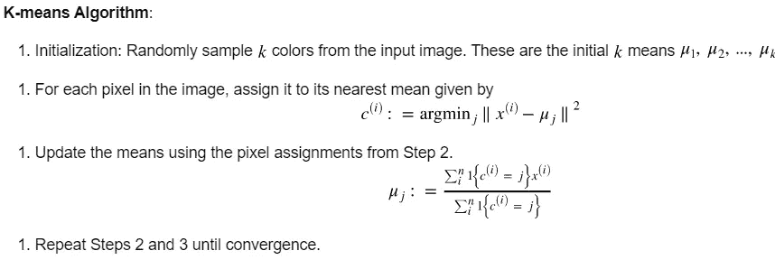
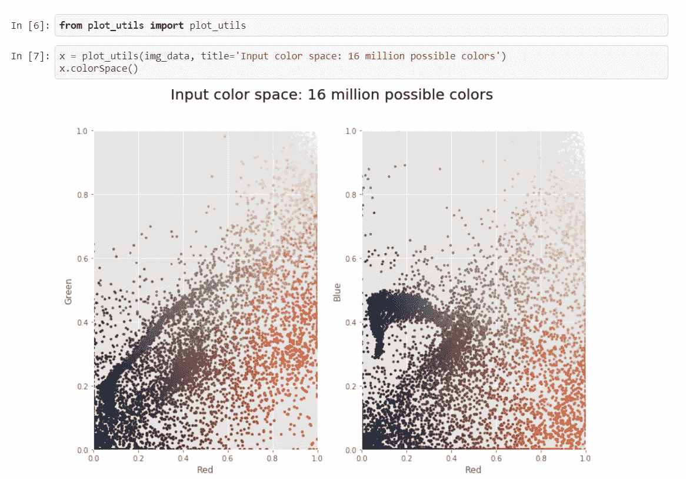
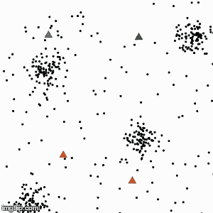
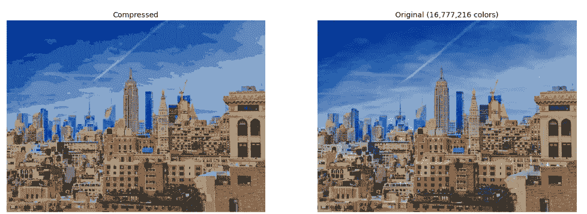

# 基于“K-均值聚类”的图像压缩

> 原文：<https://medium.com/analytics-vidhya/image-compression-using-k-means-clustering-c26c85bce502?source=collection_archive---------20----------------------->

我总是在想，如果不使用 andriod 应用程序，每次只需在我的 jupyter 笔记本上使用 2-3 步就可以压缩图像，那该多好。因此，我发现 k-means 聚类可以用于这一次设置，并消除所有未来的延迟和挫折，而填写表格或任何注册过程。

只需 3 个步骤，我就可以根据需要压缩我的图像:

1.  上传图像进行压缩。
2.  选择像素或尺寸要求。
3.  下载压缩图像。

这个一次性的过程节省了我很多，这就是为什么我在这里与你分享这个。

让我们从什么是 k-means 聚类开始？它将如何帮助压缩图像？为什么我们用这个过程来压缩图像？

# 简介:

`[**K-Means**](https://scikit-learn.org/stable/modules/generated/sklearn.cluster.KMeans.html#sklearn.cluster.KMeans)`算法通过尝试将样本分成 n 组等方差的样本来对数据进行聚类，从而最小化一个被称为*惯性*或类内平方和的标准(见下文)。该算法要求指定聚类数。它适用于大量样品，并已在许多不同领域的大范围应用中使用。

k-means 算法将一组 N 个样本 X 分成 K 个不相交的聚类 C，每个聚类由聚类中样本的平均值μj 来描述。这些平均值通常被称为星团“质心”；注意，一般来说，它们不是来自 X 的点，尽管它们生活在同一个空间。

K-means 算法旨在选择最小化**惯性的质心。**

# 步骤:

1.  导入所有库:numpy，matplotlib，sklearn，ipywidget。
2.  数据预处理:图像被绘制，尺寸被固定和整形。
3.  使用点云可视化颜色空间

4.可视化 K-意味着减少颜色空间。

5.k-均值图像压缩与交互式控制。

这些步骤最终会产生所需的输出，您可以查看我的 [jupyter 笔记本。](https://github.com/sakshi13-m/Image-Compression/blob/master/completed_notebook.ipynb)

# 结果:

# 参考:

*   [https://www . coursera . org/learn/sci kit-learn-k-means-clustering-image-compression](https://www.coursera.org/learn/scikit-learn-k-means-clustering-image-compression/home/info)。
*   [https://sci kit-learn . org/stable/modules/clustering . html # k-means](https://scikit-learn.org/stable/modules/clustering.html#k-means)