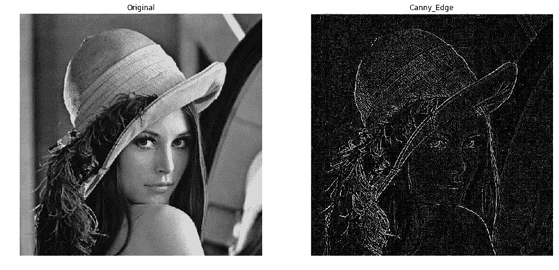

# 从头开始图像卷积

> 原文：<https://medium.com/analytics-vidhya/image-convolution-from-scratch-d99bf639c32a?source=collection_archive---------0----------------------->

两个函数的数学运算，产生第三个函数，表示一个函数的形状如何被另一个函数修改。


图像卷积—核滤波

卷积背后的思想是研究一个函数与另一个函数映射时如何产生一个新的修改函数。当同样的情况应用于信号时，称为卷积 1d，图像称为卷积 2d，视频称为卷积 3d。本文主要关注卷积 2d。

# 概观

我们可以把一幅图像想象成一个二维矩阵，包含 0 到 255 范围内的像素颜色值。数学上，我们可以通过应用各种矩阵运算来操纵这个矩阵。

我们将使用 [OpenCV](http://bit.ly/2R8Auux) (一个灵活的图像处理库)，NumPy 用于矩阵和数组操作，Matplotlib 用于绘制图像。

## 例子

我们使用`imread()`对象来读取图像。默认情况下，`cv2.imread()`读取蓝色、绿色和红色格式的图像。我们需要把它转换成红色、蓝色和绿色的格式，这样才有意义。

```
# Image url ==> [https://upload.wikimedia.org/wikipedia/en/7/7d/Lenna_%28test_image%29.png](https://upload.wikimedia.org/wikipedia/en/7/7d/Lenna_%28test_image%29.png)
# Download the image and save it as 'lena.png' in your directoryimport cv2
import numpy as np
import math
import matplotlib.pyplot as pltsrc = cv2.imread('lena.png')
img = cv2.cvtColor(src, cv2.COLOR_BGR2RGB)
plt.figure(figsize=(8, 5))
plt.axis("off")
plt.imshow(img)
```


莉娜原始图片(谷歌)

## 图像到矩阵

我们取灰度图像的矩阵值，其中每个像素包含 0 到 255 之间的值。彩色图像的问题在于，每个像素值是 3 个值的组合，可能是`[R, G, B]`或`[B, G, R]`的形式，这会使计算变得复杂。所以，为了简单起见，我们取一张灰度图像。

```
img = cv2.cvtColor(src, cv2.COLOR_BGR2GRAY)
plt.imsave('lena_gray.png', img, cmap='gray')
gsrc = cv2.imread('lena_gray.png', 0)
img_mat = []
for i in range(0, gsrc.shape[0]):
    row = []
    for j in range(0, gsrc.shape[1]):
        pixel = gsrc.item(i, j)
        row.append(pixel)
    img_mat.append(row)
```

如果我们查看矩阵，我们会看到它包含 0 到 255 范围内的像素值。

```
>>> img_mat = np.array(img_mat)
>>> print(img_mat)
[[142 149 145 ...  94  94  94]
 [145 149 142 ...  97  97  97]
 [149 138 149 ...  97  94  94]
 ...
 [113 117 121 ...  32  32  32]
 [113 113 117 ...  28  28  32]
 [100 113 113 ...  28  32  36]]
>>> print(img_mat.shape)
(512, 512)
```

让我们转置上面的矩阵，看看图像是否被转置。

```
>>> img_tran_mat = img_mat.T
>>> print(img_tran_mat)
[[142 145 149 ... 113 113 100]
 [149 149 138 ... 117 113 113]
 [145 142 149 ... 121 117 113]
 ...
 [ 94  97  97 ...  32  28  28]
 [ 94  97  94 ...  32  28  32]
 [ 94  97  94 ...  32  32  36]]
>>> print(img_tran_mat.shape)
(512, 512)
```

你看出原矩阵和转置矩阵的区别了吗？现在使用`imwrite()`方法将矩阵保存为图像——该方法读取矩阵和数字，并作为图像写入。

```
>>> cv2.imwrite('lena_gray_tran.png', img_tran_mat)
```

让我们看看区别，了解一下。

```
fig = plt.figure(figsize=(16, 25))orig = cv2.imread('lena_gray.png')
tran = cv2.imread('lena_gray_tran.png')ax1 = fig.add_subplot(2,2,1)
ax1.axis("off")
ax1.title.set_text('Original')
ax1.imshow(orig)ax2 = fig.add_subplot(2,2,2)
ax2.axis("off")
ax2.title.set_text('Transposed')
ax2.imshow(tran)
```


Lena —原始与移调

我们得到一个完全转置的图像，这是因为我们之前执行的转置矩阵。

# 从头开始图像卷积的代码

对于卷积，我们需要一个单独的内核滤波器，它对整个图像进行操作，从而产生一个完全修改的图像。

> *g(x，y) = w * f(x，y)；w =内核，g =结果，f =输入*

在图像处理中；内核、卷积矩阵或遮罩是一种小型矩阵，用于模糊、锐化、浮雕、边缘检测等。这是通过在内核和图像之间进行卷积来实现的。

## 图像卷积的步骤

1.  将图像转换为灰度并获得矩阵。
2.  从原始矩阵中获得包含大小为核的子矩阵的巨型矩阵。
3.  通过在内核和每个子矩阵之间进行逐元素乘法来执行卷积，并将结果求和为单个整数或浮点值。通过这样做，获得一个变换或过滤的矩阵。
4.  将变换或过滤后的矩阵转换成图像。
5.  结束。

## 第一步

```
def convert_image_matrix(img_name):
    src = cv2.imread(img_name)
    img = cv2.cvtColor(src, cv2.COLOR_BGR2GRAY)
    name, ext = img_name.split('.')
    plt.imsave(str(name + '_gray.' + ext), img, cmap='gray')

    gray_img = cv2.imread(str(name + '_gray.' + ext), 0)
    gimg_shape = gray_img.shape
    gimg_mat = []
    for i in range(0, gimg_shape[0]):
        row = []
        for j in range(0, gimg_shape[1]):
            pixel = gray_img.item(i, j)
            row.append(pixel)
        gimg_mat.append(row)
    gimg_mat = np.array(gimg_mat)
    return gimg_mat
```

上述函数返回包含像素值的二维 NumPy 数组。

## 第二步

```
def get_sub_matrices(orig_matrix, kernel_size):
    width = len(orig_matrix[0])
    height = len(orig_matrix)
    if kernel_size[0] == kernel_size[1]:
        if kernel_size[0] > 2:
            orig_matrix = np.pad(orig_matrix, kernel_size[0] - 2, mode='constant')
        else: pass
    else: pass

    giant_matrix = []
    for i in range(0, height - kernel_size[1] + 1):
        for j in range(0, width - kernel_size[0] + 1):
            giant_matrix.append(
                [
                    [orig_matrix[col][row] for row in range(j, j + kernel_size[0])]
                    for col in range(i, i + kernel_size[1])
                ]
            )
    img_sampling = np.array(giant_matrix)
    return img_sampling
```

上面的函数返回了一个巨大的矩阵，其中包含了大小为 kernel 的子矩阵，稍后将再次使用这些子矩阵。合成矩阵也可以称为采样矩阵。

在该函数中，使用方法`[np.pad()](https://docs.scipy.org/doc/numpy/reference/generated/numpy.pad.html)`通过添加`0`来保存沿边缘出现的数据，因此在应用卷积时不会有任何数据丢失。

## 第三步

```
def get_transformed_matrix(matrix_sampling, kernel_filter):
    transform_mat = []
    for each_mat in matrix_sampling:
        transform_mat.append(
            np.sum(np.multiply(each_mat, kernel_filter))
        )
    reshape_val = int(math.sqrt(matrix_sampling.shape[0]))
    transform_mat = np.array(transform_mat).reshape(reshape_val, reshape_val)
    return transform_mat
```

巨型矩阵或采样矩阵作为参数与上述函数中的内核过滤器一起传递，以执行卷积。

## 第四步

```
def original_VS_convoluted(img_name, kernel_name, convoluted_matrix):
    name, ext = img_name.split('.')
    cv2.imwrite(str(name + '_' + kernel_name + '.' + ext), convoluted_matrix)
    orig = cv2.imread(str(name + '_gray.' + ext))
    conv = cv2.imread(str(name + '_' + kernel_name + '.' + ext))

    fig = plt.figure(figsize=(16, 25))
    ax1 = fig.add_subplot(2,2,1)
    ax1.axis("off")
    ax1.title.set_text('Original')
    ax1.imshow(orig)
    ax2 = fig.add_subplot(2,2,2)
    ax2.axis("off")
    ax2.title.set_text(str(kernel_name).title())
    ax2.imshow(conv)
    return True
```

上述函数是将原始图像与卷积后的变换图像进行比较的绘图函数。

## 卷积的类型

我们有几种可以应用于图像的卷积运算。他们中很少有人是

*   **恒等运算**:返回与自变量相同值的函数。

> f(x)= x；内核= [[0，0，0]，[0，1，0]，[0，0，0]]

```
>>> img_name = 'lena.png'
>>> img_mat = convert_image_matrix(img_name)
>>> identity_kernel = np.array([[0,0,0],[0,1,0],[0,0,0]])
>>> img_sampling = get_sub_matrices(img_mat, identity_kernel.shape)
>>> transform_mat = get_transformed_matrix(img_sampling, identity_kernel)
>>> original_VS_convoluted(img_name,'identity', transform_mat)
```


Lena——原始与相同

从以上结果可以清楚地看出，原始图像和变换后的图像之间没有区别。

*   **边缘检测操作**:功能包括多种数学方法，旨在识别数字图像中图像亮度发生变化的点。Canny 的边缘检测技术有效地工作。

> 内核= [[-1，-1，-1]，[-1，8，-1]，[-1，-1，-1]]

```
>>> img_name = 'lena.png'
>>> img_mat = convert_image_matrix(img_name)
>>> identity_kernel = np.array([[-1,-1,-1],[-1,8,-1],[-1,-1,-1]])
>>> img_sampling = get_sub_matrices(img_mat, identity_kernel.shape)
>>> transform_mat = get_transformed_matrix(img_sampling, identity_kernel)
>>> original_VS_convoluted(img_name,'canny_edge', transform_mat)
```



Lena —原创 vs canny_edge

从上面的结果，我们可以说，边缘被白色突出，其余的都是黑色。该算法能够识别眼睛和头发等特定细节的边缘。然而，还有其他种类的边缘检测算法。

*   **锐化操作**:增加图像亮暗区域对比度的功能。

> 内核= [[0，-1，0]，[-1，5，-1]，[0，-1，0]]

```
>>> img_name = 'lena.png'
>>> img_mat = convert_image_matrix(img_name)
>>> identity_kernel = np.array([[0,-1,0],[-1,5,-1],[0,-1,0]])
>>> img_sampling = get_sub_matrices(img_mat, identity_kernel.shape)
>>> transform_mat = get_transformed_matrix(img_sampling, identity_kernel)
>>> original_VS_convoluted(img_name,'sharpen', transform_mat)
```


莉娜——原创 vs 锐化

从上面的结果可以清楚地看出，变换后的图像仍然存在某种噪声，我们还看到较亮的区域变得更亮，而较暗的区域变得更暗。

*   **Box blur operation**:Function 是一种线性滤波器，其结果图像中的每个像素的值等于其输入图像中相邻像素的平均值。

> 内核= (1 / 9) * [[1，1，1]，[1，1，1]，[1，1，1]]

```
>>> img_name = 'lena.png'
>>> img_mat = convert_image_matrix(img_name)
>>> identity_kernel = (1/9)*np.array([[1,1,1],[1,1,1],[1,1,1]])
>>> img_sampling = get_sub_matrices(img_mat, identity_kernel.shape)
>>> transform_mat = get_transformed_matrix(img_sampling, identity_kernel)
>>> original_VS_convoluted(img_name,'box_blur', transform_mat)
```


莉娜——原创 vs 方块 _ 模糊

从结果中，我们注意到转换后的图像比原始图像稍微平滑一些。正如我们现在所知道的，当核与子矩阵一起操作时，求和结果立即被平均，从而使其具有归一化值。

*   **高斯模糊操作**:该函数也称为高斯平滑函数，通常用于减少图像中的噪声。

> kernel = (1 / 16) * [[1，2，1]，[2，4，2]，[1，2，1]]

```
>>> img_name = 'lena.png'
>>> img_mat = convert_image_matrix(img_name)
>>> identity_kernel = (1/16)*np.array([[1,2,1],[2,4,2],[1,2,1]])
>>> img_sampling = get_sub_matrices(img_mat, identity_kernel.shape)
>>> transform_mat = get_transformed_matrix(img_sampling, identity_kernel)
>>> original_VS_convoluted(img_name,'gaussian3', transform_mat)
```


莉娜——原创 vs 高辛 3

高斯算法可以很好地降低图像噪声，并以更漂亮的方式呈现图像。转换后的图像实际上看起来比原始图像更平滑。

我的自定义卷积随机调整内核矩阵。


莉娜——原创 vs 定制 _conv

# 结论

*   卷积是一种简单的数学运算，是许多常见图像处理运算符的基础。
*   它在数学领域有各种应用，如概率和统计，线性系统等。

PS:虽然卷积是处理图像操作的概念，但是能够实现和理解它的数学原理是很好的。在下一篇文章中，我将解释为什么我使用默认内核来实现某种转换。

如果你喜欢，你可以在这里的的[给我买咖啡。](https://www.buymeacoffee.com/msameeruddin)

[](https://www.buymeacoffee.com/msameeruddin)

# 参考

1.  `cv2`文档:[http://bit.ly/2R8Auux](http://bit.ly/2R8Auux)。
2.  卷积:[https://en.wikipedia.org/wiki/Convolution](https://en.wikipedia.org/wiki/Convolution)。
3.  内核过滤器:[https://en . Wikipedia . org/wiki/Kernel _(image _ processing)](https://en.wikipedia.org/wiki/Kernel_(image_processing))。
4.  图片来源:谷歌图片。