# 在分类任务中平衡数据集的图像数据扩充

> 原文：<https://medium.com/analytics-vidhya/image-data-augmentation-to-balance-dataset-in-classification-tasks-5e25bbd9a228?source=collection_archive---------2----------------------->

## 尝试使用不平衡数据集的影像分类模型，并通过数据增强技术提高其准确性。

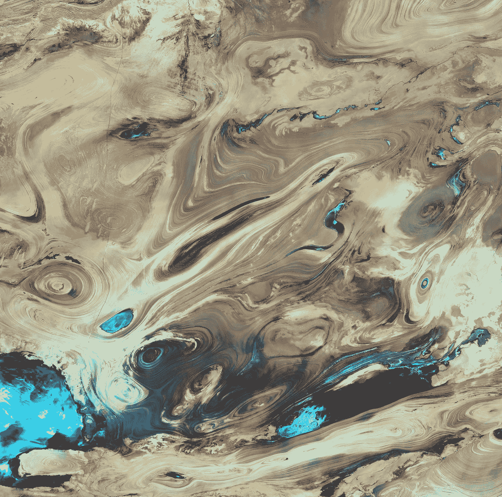

美国地质勘探局在 [Unsplash](https://unsplash.com?utm_source=medium&utm_medium=referral) 上拍摄的照片

我们将从最小且不平衡的数据集创建一个图像分类模型，然后使用数据增强技术来平衡和比较结果。

# 数据集

我们的数据集有 200 幅花的图像和 20 幅鸟的图像，比例为 1:10。为了形成这个数据集，我们使用了通过谷歌搜索引擎下载图像 URL 的技术，正如在[的上一篇文章](/analytics-vidhya/fantastic-and-straightforward-image-classification-with-fastai-library-for-pytorch-30c3380ac284)中一步一步描述的那样。

## 下载和检查图像

一旦我们有了 CSV 文件中每个类别的 URL 列表，我们将运行代码来下载照片并构建我们的数据集。路径' data/data_aug '是我们的基本目录。在那个目录中，我们放置了两个 CSV 文件的类别；让我们执行代码来创建下载图像的子目录，并验证它们。

```
%reload_ext autoreload
%autoreload 2
%matplotlib inline
from fastai.vision import *classes = ['birds','flowers']
path = Path('data/data_aug')#creating folders
for folder in classes:
   dest = path/folder
   dest.mkdir(parents=True, exist_ok=True)#downloading images from urls in csv
file = 'urls_'+'**birds**''.csv'
dest = path/'birds'
download_images(path/file, dest, max_pics=**20**)file = 'urls_'+'**flowers**''.csv'
dest = path/'flowers'
download_images(path/file, dest, max_pics=**200**)#verifying images
for c in classes:
   print(c)
   verify_images(path/c, delete=True, max_size=500)
```

## 创建和可视化数据集

在下载照片并在对应于每个类别的目录中检查后，我们可以创建一个 fast.ai 数据框架，以便能够将标记的图像放入其中，并开始可视化和使用它们。我们保留 20%用于验证设置。

```
np.random.seed(7)data = ImageDataBunch.from_folder(path, train=".", **valid_pct=0.2**, ds_tfms=get_transforms(), size=224, num_workers=4).normalize(imagenet_stats)
```

并运行代码来显示一个随机的 3 行批处理:

```
data_gt.show_batch(rows=3, figsize=(7,8))
```

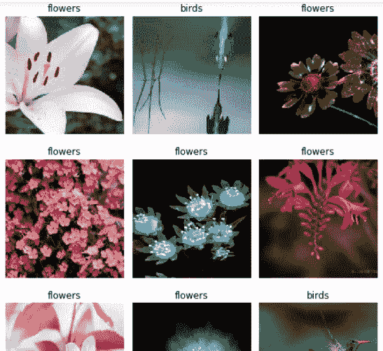

# 分类模型

在本练习中，我们将使用 resnet34 格式的卷积网络。
在“模型”中，有一组预定义的网络架构，涉及不同的结构和复杂性。

```
learn_gt = cnn_learner(data_gt, models.resnet34, metrics=error_rate)learn_gt.fit_one_cycle(4)
```

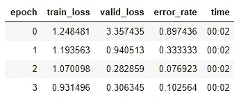

```
learn_gt.save('gt_stage-1')
learn_gt.load('gt_stage-1')
learn_gt.unfreeze()learn_gt.lr_find()
```

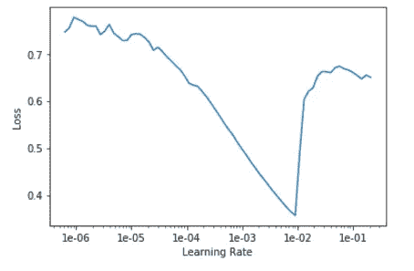

```
learn_gt.fit_one_cycle(2, max_lr=slice(1e-5,1e-2))
learn_gt.save('gt_stage-2')
learn_gt.load('gt_stage-2')
```

## 混淆矩阵中的结果

```
interp = ClassificationInterpretation.from_learner(learn_gt)
interp.plot_confusion_matrix()
```

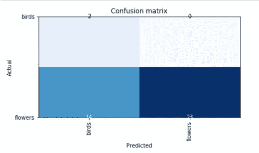

正如我们可以看到的，该模型在预测类别
较少代表的类别(鸟类)方面非常无效，其中存在许多关于验证集的混淆。

# 数据扩充

我们必须在鸟的类别中创建 180 个新的图像。为此，我们将使用 fast.ai 的 apply_tfms 方法遍历每个真实图像，为每个图像创建十个额外的图片。

```
path = Path('data/data_aug')
path_hr = path/'birds'il = ImageList.from_folder(path_hr)
tfms = get_transforms(max_rotate=25)def data_aug_one(ex_img,prox,qnt):
   for lop in range(0,qnt):
      image_name = str(prox).zfill(8) +'.jpg'
      dest = path_hr/image_name
      prox = prox + 1
      new_img = open_image(ex_img)
      new_img_fin = new_img.apply_tfms(tfms[0], new_img, xtra={tfms[1][0].tfm: {"size": 224}}, size=224)
      new_img_fin.save(dest)prox = 20
qnt = 10
for imagen in il.items:
   data_aug_one(imagen,prox,qnt)
   prox = prox + qnt
```

如果我们将任何一个源图像和它们的 10 个新图像可视化，我们会发现这样的事情:

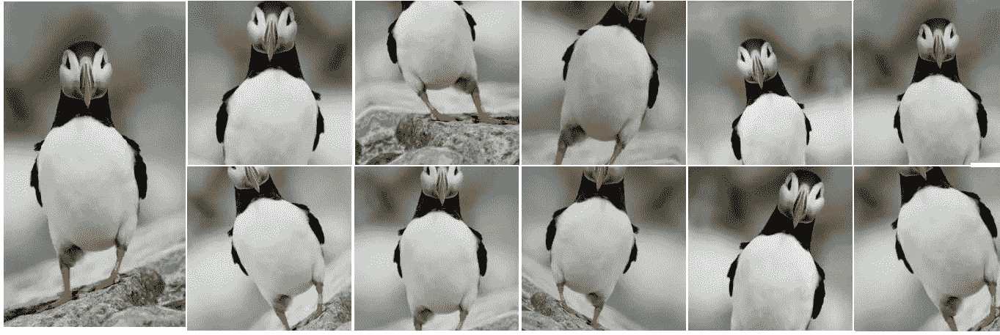

左边是原图，右边是 10 张变换后图像

关于“应用 _tfms”转换功能工作及其所有可能性的详细信息可在此处找到[。](https://docs.fast.ai/vision.transform.html#get_transforms)

# 具有平衡数据的相同模型

我们用平衡的数据集创建了一个新的模型

```
np.random.seed(7)tfms = get_transforms()
data = ImageDataBunch.from_folder(path, train=".", valid_pct=0.2, ds_tfms=tfms, size=224, num_workers=4).normalize(imagenet_stats)learn = cnn_learner(data, models.resnet34, metrics=error_rate)
learn.fit_one_cycle(4)
```

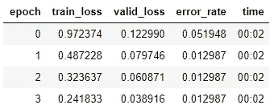

```
interp = ClassificationInterpretation.from_learner(learn)
interp.plot_confusion_matrix()
```

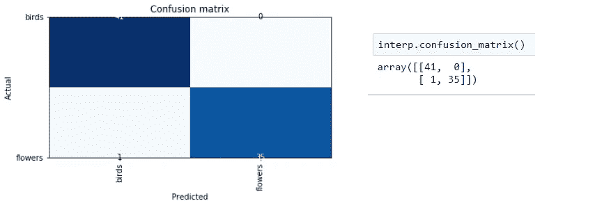

# 好了，现在让我们展示一组新的图像

我们拍摄了 20 张新图片，每个类别 10 张，我们看到，尽管准确性比最初的版本有了很大的提高，但在分类时仍然存在一些问题。在 20 张新图片中，该模型预测了 18 张正确的图片和两张错误的图片:

```
path = Path('data/data_aug_test')
defaults.device = torch.device('cpu')
img = open_image(path/'bird01.jpg')
img
```

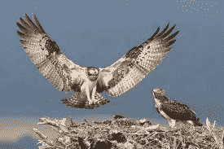

```
pred_class,pred_idx,outputs = learn.predict(img)
pred_class
```

鸟类分类

```
for test in range(1,11):
   image_name = 'bird'+str(test).zfill(2)+'.jpg'
   img = open_image(path/image_name)
   pred_class,pred_idx,outputs = learn.predict(img)
   print ('For image ' + image_name + ' predicted class: ');
   print (pred_class) image_name = 'flower'+str(test).zfill(2)+'.jpg'
   img = open_image(path/image_name)
   pred_class,pred_idx,outputs = learn.predict(img)
   print ('For image ' + image_name + ' predicted class: ');
   print (pred_class)
```

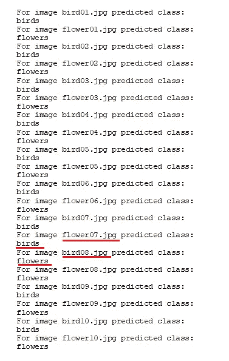

flower07.jpg 预言的鸟的形象，和 bird08.jpg 预言的花的形象。

这是混乱的图像:

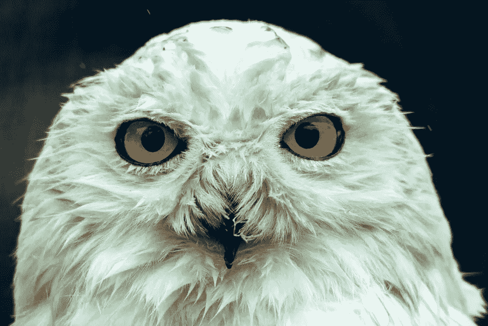

bird08.jpg


flower07.jpg

# 摘要

正如我们所看到的，用平衡数据集和不平衡数据集训练同一个模型的区别是根本性的；但是，如果数据集很小，可能是我们达到的精度不够。

在之前的[文章](/analytics-vidhya/fantastic-and-straightforward-image-classification-with-fastai-library-for-pytorch-30c3380ac284)中，我们从每个类别的 200 张图片中创建了一个非常相似的模型。当我们向他展示同样的 20 张新的测试图像时，他在同样的照片中也有同样的困惑。

我们使用 fast.ai 的 apply_tfms 方法对少量鸟类的初始图像进行转换，创建了 10 倍大的数据集。

# 来源和参考

[1]—[https://towards data science . com/an-overview-of-resnet-and-its-variants-5281 e2f 56035](https://towardsdatascience.com/an-overview-of-resnet-and-its-variants-5281e2f56035)

[2]—[https://medium . com/@ 14 Prakash/understanding-and-implementing-architectures-of-resnet-and-resnext-for-state-the-art-image-cf 51669 e 1624](/@14prakash/understanding-and-implementing-architectures-of-resnet-and-resnext-for-state-of-the-art-image-cf51669e1624)

[](/usf-msds/deep-learning-best-practices-1-weight-initialization-14e5c0295b94) [## 深度学习最佳实践(1) —权重初始化

### 基础知识、重量初始化陷阱和最佳实践

medium.com](/usf-msds/deep-learning-best-practices-1-weight-initialization-14e5c0295b94) 

在 fast.ai 课程中，这项技术的灵感来自:弗朗西斯科·英厄姆和杰瑞米·霍华德/ [ [阿德里安·罗斯布鲁克](https://www.pyimagesearch.com/2017/12/04/how-to-create-a-deep-learning-dataset-using-google-images/) ]

https://course.fast.ai，第二课，Jupyter 笔记本:第二课-下载