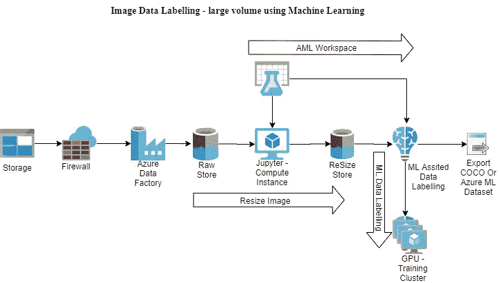

# 图像数据标记—使用机器学习的大量数据

> 原文：<https://medium.com/analytics-vidhya/image-data-labelling-large-volume-using-machine-learning-ae9146bb491d?source=collection_archive---------33----------------------->

为了使用自定义视觉或 ML 辅助数据标记来构建对象检测模型，我们需要调整较大图像的大小。下面是一个将图像大小调整到 6MB 的脚本。我的数据集从 4MB 到 14MB 不等。当我尝试 ML 辅助标记时，它通过检查内存出错。

图像大小调整甚至可以在本地计算机上完成，但这里的挑战是需要较长的时间，并消耗本地笔记本电脑或计算机的 CPU。

为了使解决方案不依赖于本地资源并根据需要增加规模，我选择在 Azure machine learning services workspace 中使用计算实例和笔记本运行这段代码。这种组合在云中为我提供了一个隔离的环境，图像可以存储在云中，也可以存储在 blob 存储中。这避免了网络延迟，并且所有的处理都在云中完成。现在，计算实例的大小取决于我们想要使用的数量，并且可以根据需要进行扩展。

将文件移动到云 blob 存储可以通过任何数据移动工具来实现，如 Azure data factory 来移动数据。



*   创建 Blob 存储帐户
*   创建一个容器
*   使用 Azure 数据工厂复制向导上传图片或我从另一个移动的图片
*   创建 Azure ML 服务工作区
*   创建计算实例
*   创建新笔记本
*   选择 Python 版本 3

首先，让我们为 azure blob 存储更新新的 sdk

```
pip install azure-storage-blob --upgrade
```

现在进口必要的进口品

```
import os, uuid from azure.storage.blob 
import BlobServiceClient, BlobClient, ContainerClient
```

现在连接并列出所有容器。替换您的存储帐户名称并键入连接字符串。

```
import os, uuid from azure.storage.blob 
import BlobServiceClient, BlobClient, ContainerClient 
try: 
print("Azure Blob storage v12 - Python quickstart sample") 
# Quick start code goes here AZURE_STORAGE_CONNECTION_STRING="DefaultEndpointsProtocol=https;AccountName=xxxx;AccountKey=xxxxxxxxxxxxxxxxxxxx;EndpointSuffix=core.windows.net" 
# Create the BlobServiceClient object which will be used to create a container client 
blob_service_client = BlobServiceClient.from_connection_string(AZURE_STORAGE_CONNECTION_STRING) 
# List containers 
print("\nListing containers...") 
containers_list = blob_service_client.list_containers() 
for c in containers_list: 
   print("\t" + c.name) 
except Exception as ex: 
   print('Exception:') print(ex)
```

现在你应该会看到一个文件列表

列出所有源图像文件，以确保 blob 中有图像

```
print("\nListing blobs...") 
# List the blobs in the container 
blob_list = blob_service_client.get_container_client("Containername").list_blobs() 
for blob in blob_list: 
   print("\t" + blob.name)
```

导入图像操作以及源和目标容器设置，以调整到不同的图像大小，请更改变量 newSize

```
from PIL import Image 
from pathlib import Path 
DEST_FILEIMG = "img1.jpg" 
RE_FILEIMG = "imgresize1.jpg" 
newSize = 6000000 
# bytes equal to 6MB 
filename = "image1.jpj" 
container_client = blob_service_client.get_container_client("sourcecontainer") container_client1 = blob_service_client.get_container_client("destinationcontainer")
```

下面是一次读取一个并调整其大小的代码

```
blob_list = blob_service_client.get_container_client("excelon1").list_blobs() for blob in blob_list: 
    #print("\t" + blob.name) 
    if("jpg" in blob.name): 
        print("\t" + blob.name) 
        blob_client = container_client.get_blob_client(blob.name)
        download_stream = blob_client.download_blob() 
        #print("File name" + blob.name + str(download_stream.readall()) + "\t") 
        with open(DEST_FILEIMG, "wb") as my_blob_img:  
            my_blob_img.write(download_stream.readall()) 
        img = Image.open(DEST_FILEIMG) 
        width, height = img.size 
        fileSize = os.stat(DEST_FILEIMG).st_size 
        resizeFactor = 1 - (fileSize - newSize)/fileSize
        #resizeFactor = 1 - (fileSize - newSize)/fileSize 
        if(fileSize > newSize): 
           resizeFactor = 1 - (fileSize - newSize)/fileSize 
           if(resizeFactor > 1): resizeFactor = 1 
           newX = round(img.size[0] * resizeFactor) 
           newY = round(img.size[1] * resizeFactor) 
           img = img.resize((newX,newY), Image.ANTIALIAS) 
           img.save(RE_FILEIMG) 
        local_file_name = blob.name blob_client1 = blob_service_client.get_blob_client(container="destinatoncontainername", blob=local_file_name) 
        with open(RE_FILEIMG, "rb") as data:
           blob_client1.upload_blob(data)
```

我保留了相同的名称，以便在需要时进行比较。另外，我一次只处理一个文件，这可能是将来的另一篇好文章。

这里是数尺寸

```
print("\nListing blobs...") 
count = 0 
# List the blobs in the container 
blob_list = blob_service_client.get_container_client("destinationcontainername").list_blobs() 
for blob in blob_list: 
    #print("\t" + blob.name) 
    count += 1 print("Total Files in container: " + str(count))
```

对于我的上述运行，它花了大约 30 分钟来处理大约 1000 个不同大小的图像。

谢谢

*最初发表于*[*【https://github.com】*](https://github.com/balakreshnan/customvisionai2020/blob/master/ReSize/resizeimages.md)*。*