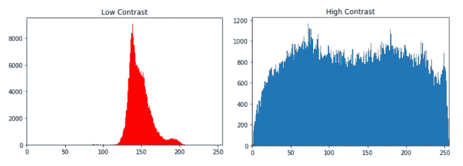
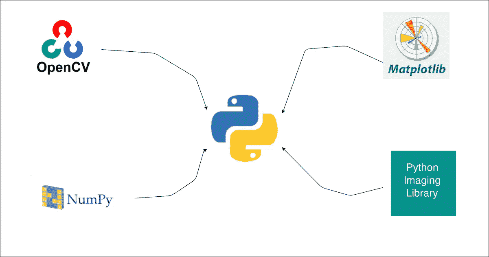

# Python 中的图像均衡(对比度增强)

> 原文：<https://medium.com/analytics-vidhya/image-equalization-contrast-enhancing-in-python-82600d3b371c?source=collection_archive---------2----------------------->

安德烈亚斯·古尔霍恩在 [Unsplash](https://unsplash.com?utm_source=medium&utm_medium=referral) 上拍摄的照片

我练习图像处理已经有一段时间了——处理图像(准确地说是图像矩阵)。在此过程中，我开始探索图像的均衡方法，以便在一定程度上增强[对比度](https://theailearner.com/2019/01/30/what-is-contrast-in-image-processing/)，使处理后的图像看起来比原始图像更好。这种技术被称为 [**直方图均衡**](https://en.wikipedia.org/wiki/Histogram_equalization) 。

经常发生的情况是，当图像被捕获时，它将不会与自然视图相同。为了满足自然视图的水平，需要进行后期处理。因此，直方图均衡化(标准化)是通过调整图像的像素值来增强对比度的技术之一。

下面是一个例子——原始图像和均衡图像。

如果我们要绘制图像直方图，它看起来会像下面这样

**鸣谢** —以上图片取自互联网，用于展示示例。

# 直方图均衡化的重要性

*   这种方法对于明亮和黑暗的图像都更有效，特别是在医学领域中，在分析 X 射线图像中具有更高的重要性。
*   它也非常有助于查看科学图像，如热图像和卫星图像。

# 履行

在本文中，我将通过使用`openCV`库和从头开始使用`NumPy`和`Matplotlib`来实现这个方法。虽然我想不使用`NumPy`，但计算起来会花费很多时间。

作者图片

**注意**——对于从头开始编码，我将使用`openCV`来读取图像，而不是其他。

我已经采取了[莉娜图像](https://upload.wikimedia.org/wikipedia/en/7/7d/Lenna_%28test_image%29.png)测试功能。我已经在我的工作目录中保存了相同的内容。

# 导入需求

# 阅读图像

上述函数读取`gray_scale`或`RGB`中的图像，并返回图像矩阵。

# 用库实现代码

对于均衡，我们可以简单地使用库`cv2`中可用的`equalizeHist()`方法。我们有两个方面-

1.  当图像被读入`RGB`时。

*   根据颜色组合分离像素。我们可以使用图书馆`cv2`里的`split()`方法。
*   对每个矩阵应用均衡方法。
*   使用库`cv2`中可用的方法`merge()`合并均衡后的图像矩阵。

2.在`gray_scale`中读取图像时。

3.绘制原始图像和均衡图像。

让我们测试一下上面的函数—

作者图片

作者图片

上面的图很清楚，我们可以说均衡后的图像比原始图像看起来更好。这是使用`cv2`库实现的。

# 从头开始代码实现

为此，我使用`NumPy`进行所有的矩阵运算。同样，我们可以用`for`循环来做，但是这将花费更多的时间来计算。即使在这里，我们也和以前一样有两个方面-

1.  在`RGB`中读取图像时。

*   根据颜色组合分离像素。我们可以使用`NumPy`操作对其进行分割。
*   对每个矩阵应用均衡方法。
*   使用库`NumPy`中可用的方法`dstack(tup=())`合并均衡后的图像矩阵。

2.在`gray_scale`中读取图像时。

3.绘制原始图像和均衡图像。

让我们编写自己的函数来计算图像均衡。图像像素值通常在 0 到 255 的范围内。所以总共，我们将有 256 个像素。

**演职员表** —以上代码是从 ***托利·沃克*** 写的[文章](/hackernoon/histogram-equalization-in-python-from-scratch-ebb9c8aa3f23)中得到的灵感。

当原始图像矩阵作为参数传递时，上面的函数返回均衡的图像矩阵。

让我们编写另一个函数，使用上述函数计算`RGB`图像和`gray_scale`图像的均衡。

让我们测试一下上面的函数—

作者图片

作者图片

上面的图很清楚，我们可以说均衡后的图像比原始图像看起来更好。这是使用`NumPy`库从头开始实现的。

# 比较

让我们比较一下从`cv2`库中获得的均衡图像和从零开始编写的代码获得的均衡图像。

作者图片

我们可以注意到`library image`和`scratch image`之间有一点点不同。但与`original image`相比，两者似乎都很清晰。在这里我用自己的外卖来完成我的文章。

# 外卖食品

*   就我个人而言，通过探索和实施不同的方法来增加图像强度，我学到了很多。特别是，通过参考和学习，尝试从零开始实现代码。
*   使用库方法总是好的，因为它们看起来更优化并且 100%有效。
*   图像处理是一个非常重要的学习科目，一个人真的值得带着如此多的好奇心和自己的探索去尝试实践。

请阅读我的其他文章，让我知道你的想法

1.  [图像镜像和翻转](/analytics-vidhya/image-flipping-and-mirroring-with-numpy-and-opencv-aecc08558679)
2.  [图像卷积](/analytics-vidhya/image-convolution-from-scratch-d99bf639c32a)

如果你喜欢，你可以在这里给我买咖啡。

