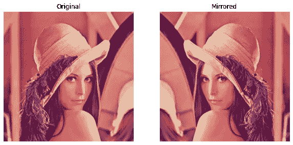
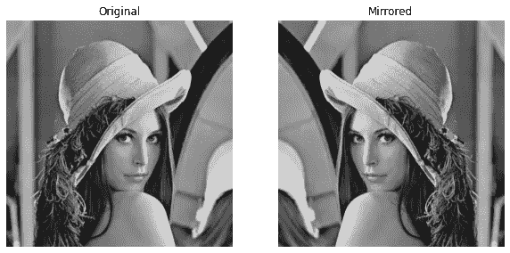
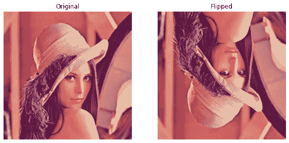
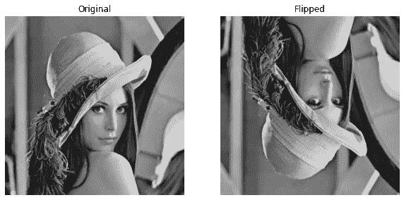

# 使用 NumPy 和 OpenCV 进行图像翻转和镜像

> 原文：<https://medium.com/analytics-vidhya/image-flipping-and-mirroring-with-numpy-and-opencv-aecc08558679?source=collection_archive---------2----------------------->

在这篇博客文章中，我将解释如何在 Python 中镜像或翻转图像。所需要的只是理解各种矩阵运算和矩阵操作背后的基本数学。

# 包装要求

*   NumPy —用于矩阵运算及其操作。
*   OpenCV —用于读取图像并将其转换为 2D 数组(矩阵)。
*   Matplotlib —用于将矩阵绘制为图像。


作者图片

对于这个迷你项目，我使用一个著名的[莉娜图像](https://upload.wikimedia.org/wikipedia/en/7/7d/Lenna_%28test_image%29.png)，它主要用于测试计算机视觉模型。确保下载该图像并保存在当前工作目录中。

```
import cv2
import numpy as np
from matplotlib import pyplot as plt
```

# 我们开始吧

首先，我们使用模块`cv2`中的方法`imread()`读取图像文件。为此，我们只需导入包并使用 so。因此，通过这样做，我们得到了矩阵形式的图像。

默认情况下，`imread()`方法以`BGR` ( `Blue`、`Green`、`Red`)格式读取图像。为了将读取的图像转换成常规格式，即`RGB` ( `Red`、`Green`、`Blue`)，我们使用了来自同一模块`cv2`的`cvtColor()`方法。

```
def read_this(image_file, gray_scale=False):
    image_src = cv2.imread(image_file)
    if gray_scale:
        image_rgb = cv2.cvtColor(image_src, cv2.COLOR_BGR2GRAY)
    else:
        image_rgb = cv2.cvtColor(image_src, cv2.COLOR_BGR2RGB)
    return image_rgb
```

上述函数从传递的图像文件中返回一个图像矩阵。如果我们想得到`gray_scale`或`RGB`格式的图像矩阵，它由常规的`if`和`else`条件组成。

# 镜像图像

为了镜像图像，我们需要从左到右逐行反转矩阵。例如，让我们考虑一个矩阵`A`。

```
>>> A = [
       [4, 1, 1],
       [2, 8, 0],
       [3, 8, 1]
]
```

如果我们想要镜像这个矩阵(按行)，那么它将是-

```
>>> import numpy as np
>>> mirror_ = np.fliplr(A)
>>> mirror_
[[1, 1, 4],
 [0, 8, 2],
 [1, 8, 3]]
```

我们也可以不使用`NumPy`模块来完成此操作。如果是这样，我们就可以使用循环来反转每一行。这将需要一段时间，如果执行相同的图像矩阵，因为它们是非常大的矩阵，我们不希望我们的代码执行非常慢。

```
def mirror_this(image_file, gray_scale=False, with_plot=False):
    image_rgb = read_this(image_file=image_file, gray_scale=gray_scale)
    image_mirror = np.fliplr(image_rgb)
    if with_plot:
        fig = plt.figure(figsize=(10, 20)) ax1 = fig.add_subplot(2, 2, 1)
        ax1.axis("off")
        ax1.title.set_text('Original')
        ax2 = fig.add_subplot(2, 2, 2)
        ax2.axis("off")
        ax2.title.set_text("Mirrored") if not gray_scale:
            ax1.imshow(image_rgb)
            ax2.imshow(image_mirror)
        else:
            ax1.imshow(image_rgb, cmap='gray')
            ax2.imshow(image_mirror, cmap='gray')
        return True
    return image_mirror
```

上面的函数返回一个从左到右逐行反转的图像矩阵。

让我们画出同样的-

```
mirror_this(image_file="lena_original.png", with_plot=True)
```



作者图片

```
mirror_this(image_file="lena_original.png", gray_scale=True, with_plot=True)
```



作者图片

# 翻转图像

为了翻转图像，我们需要从上到下逐列翻转矩阵。例如，让我们考虑一个矩阵`B`。

```
>>> B = [
       [4, 1, 1],
       [2, 8, 0],
       [3, 8, 1]
]
```

如果我们想翻转这个矩阵(按列)，那么它会是-

```
>>> import numpy as np
>>> flip_= np.flipud(B)
>>> flip_
[[3, 8, 1],
 [2, 8, 0],
 [4, 1, 1]]
```

为了保持代码的快速性，我们使用`NumPy`来翻转矩阵。

```
def flip_this(image_file, gray_scale=False, with_plot=False):
    image_rgb = read_this(image_file=image_file, gray_scale=gray_scale)
    image_flip = np.flipud(image_rgb)
    if with_plot:
        fig = plt.figure(figsize=(10, 20)) ax1 = fig.add_subplot(2, 2, 1)
        ax1.axis("off")
        ax1.title.set_text('Original')
        ax2 = fig.add_subplot(2, 2, 2)
        ax2.axis("off")
        ax2.title.set_text("Flipped") if not gray_scale:
            ax1.imshow(image_rgb)
            ax2.imshow(image_flip)
        else:
            ax1.imshow(image_rgb, cmap='gray')
            ax2.imshow(image_flip, cmap='gray')
        return True
    return image_flip
```

上面的函数返回一个从上到下逐列反转的图像矩阵。

让我们画出同样的-

```
flip_this(image_file='lena_original.png', with_plot=True)
```



作者图片

```
flip_this(image_file='lena_original.png', gray_scale=True, with_plot=True)
```



作者图片

# 完整的代码

```
class ImageOpsFromScratch(object):
    def __init__(self, image_file):
        self.image_file = image_file def read_this(self, gray_scale=False):
        image_src = cv2.imread(self.image_file)
        if gray_scale:
            image_rgb = cv2.cvtColor(image_src, cv2.COLOR_BGR2GRAY)
        else:
            image_rgb = cv2.cvtColor(image_src, cv2.COLOR_BGR2RGB)
        return image_rgb def mirror_this(self, with_plot=True, gray_scale=False):
        image_rgb = self.read_this(gray_scale=gray_scale)
        image_mirror = np.fliplr(image_rgb) if with_plot:
            self.plot_it(orig_matrix=image_rgb, trans_matrix=image_mirror, head_text='Mirrored', gray_scale=gray_scale)
            return None
        return image_mirror def flip_this(self, with_plot=True, gray_scale=False):
        image_rgb = self.read_this(gray_scale=gray_scale)
        image_flip = np.flipud(image_rgb) if with_plot:
            self.plot_it(orig_matrix=image_rgb, trans_matrix=image_flip, head_text='Flipped', gray_scale=gray_scale)
            return None
        return image_flip def plot_it(self, orig_matrix, trans_matrix, head_text, gray_scale=False):
        fig = plt.figure(figsize=(10, 20)) ax1 = fig.add_subplot(2, 2, 1)
        ax1.axis("off")
        ax1.title.set_text('Original') ax2 = fig.add_subplot(2, 2, 2)
        ax2.axis("off")
        ax2.title.set_text(head_text) if not gray_scale:
            ax1.imshow(orig_matrix)
            ax2.imshow(trans_matrix)
        else:
            ax1.imshow(orig_matrix, cmap='gray')
            ax2.imshow(trans_matrix, cmap='gray') return True
```

# 基本图像操作包

```
imo = ImageOpsFromScratch(image_file='lena_original.png')
### Mirroring ###
imo.mirror_this()
imo.mirror_this(gray_scale=True)
### Flipping ###
imo.flip_this()
imo.flip_this(gray_scale=True)
```

将显示上述图像结果。现在一切都已排序，我们可以创建其他图像操作，如`equalize()`、`solarize()`等。我在本文中没有涉及到这个问题，但是在下一篇文章中肯定会涉及到。

# 我从中获得了什么？

*   通过实现这一点，我已经学习并理解了各种图像操作背后的逻辑，以及如何将其以代码的形式表达出来。

我们也可以使用一个众所周知的图像库`Pillow`来做同样的事情。但是，作为一名开发人员，我们需要知道事情从开始到结束都是有效的。这才是大家应该好奇的地方。

请务必阅读我的另一篇关于图像处理和计算机视觉的[文章](/analytics-vidhya/image-convolution-from-scratch-d99bf639c32a)，在那里我从头开始解释*图像卷积*。