# 使用 UNET 建筑的图像伪造定位(IFL)

> 原文：<https://medium.com/analytics-vidhya/image-forgery-localization-ifl-using-unet-architecture-772ba1b15a2d?source=collection_archive---------5----------------------->

## 图像伪造定位是检测伪造或篡改区域的技术之一，目前已有一些图像伪造检测算法。但这种方法与典型的伪造检测器略有不同，伪造检测器可以对给定图像是否被操纵进行分类，而伪造定位通过将图像分割成不同的区域来确定被操纵的区域。在这篇博客中，我们将使用 UNET 架构实现 IFL。

封面图片([来源](https://www.thairath.co.th/news/business/1348497))

# 理解问题

T 数字取证部门正在积极开展研究，以确保给定的数字内容是经过认证的，但为什么研究人员非常关注数字取证呢？看看下面的图片，你注意到了什么？看起来非常自然，没有什么可疑的权利，但它实际上是操纵。

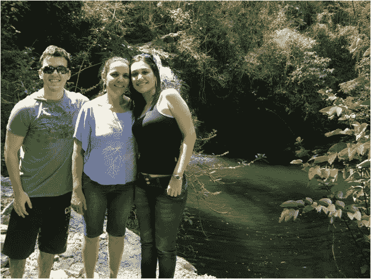

图 1:一个看起来真实的数字内容的例子([来源](http://web.archive.org/web/20171013200331/http:/ifc.recod.ic.unicamp.br/fc.website/index.py?sec=5)

如今，我们不能信任任何数字内容，因为由于数字篡改工具(如 Photoshop、Adobe After effects，甚至一些人工智能算法)的可用性更高，这些内容被攻击的可能性非常高。

下图(图 2)显示了图 1 中被篡改的区域，这意味着黑色突出显示的区域表示特定区域已经被篡改。

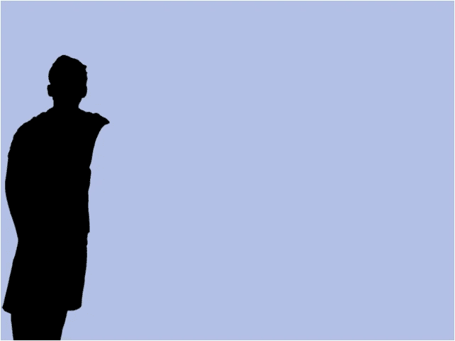

图 2:一个被操作图像的蒙版图像的例子([源](http://web.archive.org/web/20171013200331/http:/ifc.recod.ic.unicamp.br/fc.website/index.py?sec=5)

对于人类来说，几乎不可能每次都确定数字内容是原始的还是被操纵的。基本上最常见的图像篡改方法有**复制移动**、**图像拼接**、**图像绘画**。**复制-移动**是一种将图像的一小部分复制粘贴到同一图像的其他区域的攻击。**图像修复**是去除图像中的一些细节，并在被去除的区域用其相邻的颜色和属性进行平滑，从而使人无法识别图像受到了攻击。最后，**图像拼接**是选择一幅特定图像中的某个区域，并将该区域粘贴到另一幅合适的图像中。

应该有一个合适的算法系统来检测被攻击的图像。已经说过，检测图像是否被操纵是不够的，并且它不能给出完整的解决方案，因此算法应该定位给定图像中被操纵的区域。

在理解了上述问题之后，这里的 ***我们的目标是建立一个模型，使得对于给定的图像，它应该能够定位被篡改的区域。***

# 为什么只和 AI？

对于被篡改区域的图像，统计参数会发生突变，特别是对于图像拼接类攻击。虽然说篡改可以通过统计参数的变化来检测，但是我们是否可以只用传统的图像处理技术来解决这个问题呢？是的，我们可以，但这可能需要大量的人工努力，大量的研究和数年的时间，让我来详细解释一下。

例如，如果我的目标是检测并消除给定图像中的高频。是的，这是一个非常简单的目标，对吗？我们可以通过使用具有一些均值和标准差的高斯滤波器来衰减其中的较高频率，以某种方式实现这一点。注意，对于这个目标，我们有一个非常合适的滤波器，但是对于我们的主要目标(即定位篡改区域),没有**预定义的滤波器函数**,并且基于目标确定完美的滤波器可能需要多次尝试，这显然需要多年的研究和时间。

同样在上面的例子中，对于所有类型的图像，滤波器的传递函数是相同的，因此滤波器的权重不会按照我们的要求改变。每当我们有一个复杂的目标，并且不知道使用哪个过滤器/过滤器的组合时，工程师或研究人员就会选择深度学习技术。

使用像 CNN 这样的 DL 技术可以自动学习我们目标所需的滤波器传递函数。而在训练阶段，CNN 随着获得的结果到实际结果的变化，不断更新和学习滤波器权重，这是任何人工智能算法的主要核心部分。

# 数据和 EDA

在进入深度学习架构的进一步细节之前，我们需要获得适合我们目标的数据。这里，我考虑的是 IEEE IFS-TC 图像取证挑战[1]数据，其中包含原始图像数据和经过处理的图像数据。数据中经过处理的图像是使用我在上面讨论的所有三种处理方法创建的。让我们通过一些探索性的数据分析来快速掌握数据。

有两类图像**原始图像**和**伪图像**，其中伪图像具有其对应的灰色遮罩，其中遮罩中的深色表示被操纵的区域。

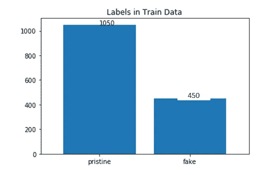

图 3:柱状图显示了数据中的类及其数量

在数据中，有 1050 个原始图像和 450 个伪图像，正如我们在下图中看到的，这 450 个伪图像将有其相应的遮罩。

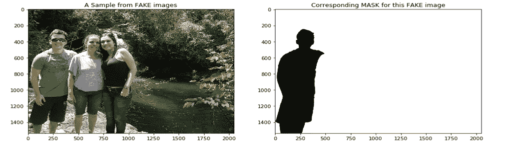

图 4:假图像及其灰度蒙版的样本。

图 5 和图 6 中的曲线分别显示了赝品和原始品的图像宽度和高度的分布。使用这个 PDF 图，我们可以快速掌握什么可能是典型的大小及其在未来发生的可能性。

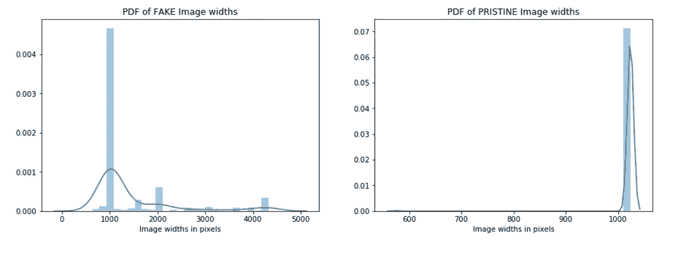

图 5:两个类中图像的宽度的 PDF

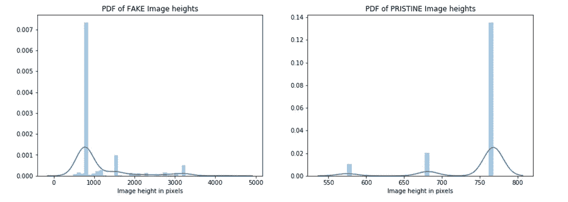

图 6:两个级别图像的**高度**的 PDF

正如我们在图 4 中看到的，蒙版图像看起来是灰度的，这意味着它只有一个颜色通道。然而，对于一些掩模图像，有 3 个通道，甚至 4 个通道，图 7 描述了具有 1 个通道、3 个通道、4 个通道的掩模图像数量的柱状图。

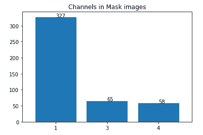

图 7:柱状图显示了屏蔽图像中通道的数量。

在第一个轴之后的多通道遮罩图像通道中，它只是增加了冗余，并没有增加任何进一步的信息，因此我只考虑了每个遮罩图像中的单个通道。对于一些面具，几乎没有噪音。为了减弱这一点，我添加了一个简单的高斯模糊来帮助平滑，最后我认为这是二进制蒙版。请看图 8

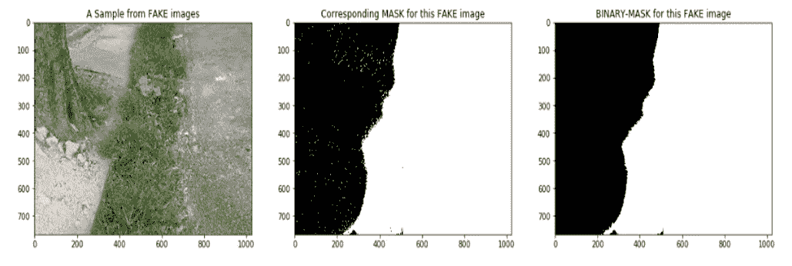

图 8:图像显示了给定蒙版和平滑二进制蒙版之间的差异

在这 450 个伪图像和它们的 450 个对应的掩模中，可能存在有缺陷的掩模，有缺陷的意思是，如果伪图像和它的对应掩模的尺寸不相同，那么就不会使用伪图像和它的掩模，因此避免了这样的图像和它的掩模。在检查上述条件时，我们只得到 8 个有缺陷的蒙版，因此删除了这些蒙版及其相应的图像。

## **对数据执行 EDA 后，快速得出的结论是:**

–我们的数据量非常少，只有 1050 个原始图像和 442 个伪图像(经过数据清理)，原始图像和伪图像之间的数据不平衡。我们需要扩大数据规模以获得更好的结果。

–从我们观察到的 pdf 图来看，假类的图像大小范围略高于原始类

–一些掩码具有多通道信息。意识到这一点，我们只考虑了第一通道，并将每个掩码转换为二进制。

# 解决我们问题的一些现有方法

在考虑我们的基本模型之前，让我们了解一些现有的方法来实现我们的目标。有一些基于照片响应非均匀性(PRNU) [2][3]的方法，它对于每个相机都是非常独特的，这意味着特定相机拍摄的照片会受到相机内置图像传感器的固定噪声模式的影响。

如果我们考虑并计算 PRNU 作为预处理步骤，这无疑为模型增加了很大的优势，使得模型可以区分用两个不同的相机捕获的两个图像。利用这一特性，有许多好的方法来检测被操纵的区域，但是它需要相机的信息，并且它对于图像拼接类型的攻击相当有效，因为在图像拼接的大多数情况下，拼接的区域和目标图像来自用不同相机捕获的不同来源，但是我们不能保证在复制-移动类型中。因为我们的数据中没有任何关于相机的信息，所以我们不能利用 PRNU。

有一些定义明确的体系结构，如 BusterNet[4]，专门为图像伪造定位类任务而设计，总之 BusterNet 仅设计用于复制-移动类攻击，但在我们的数据中，总共有三种类型的攻击，并且在实时中可能不止这些，因此我们应该得到一个模型，该模型应该能够处理所有类型的攻击。

# UNET 作为基础模型

如前所述，我们期望的模型应该预测给定图像的遮罩，因此我们的模型应该包含编码器和解码器类型的架构，因为我们试图突出给定图像中的篡改区域，所以模型需要将图像分为两类，一类是篡改区域(深色)，另一类是未篡改区域(浅色)。

在这里，我考虑将**UNET**【5】**作为基础模型，因为它已经在类似的图像分割中取得了证明的结果，并且它也满足上述要求。第一次 UNET 是为生物医学图像分割开发的，该体系结构包含两条路径，一条是包含一些卷积堆栈、最大池层的编码器路径，另一条是与编码器路径对称的解码器路径。**

**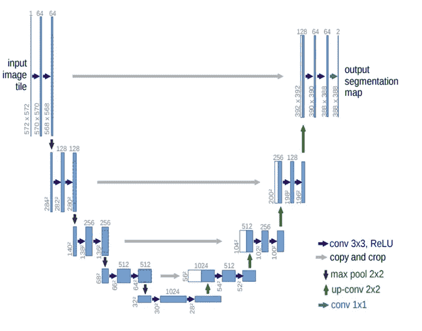**

**图 9: UNET 建筑([来源](https://arxiv.org/pdf/1505.04597.pdf))**

**从 EDA 中，我们意识到数据非常有限，因为我们知道深度学习模型非常渴望数据，用这种少量的数据我们无法建立一个合理的模型。为了增加数据的影响，我用另外一个叫做**albuminations**【6】的库来扩充数据。但为什么我使用一些特殊的库来增加数据，因为图像增加应该发生在图像和它的遮罩上，例如作为数据增加的一部分，如果我的图像旋转 90 度，那么它相应的遮罩也应该以同样的方式旋转，为此我发现这个库非常有用。**

**另外，请注意，作为预处理步骤的一部分，图像的大小被调整为 512 X 512，并且所有像素值都除以 255**

**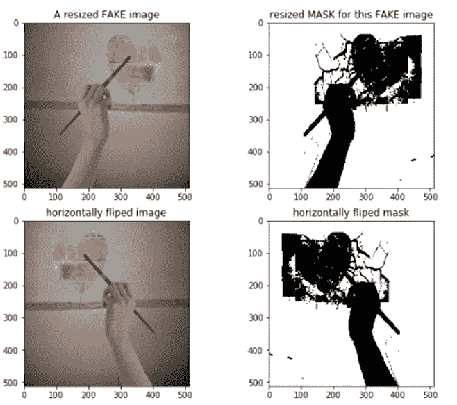**

**图 10:使用**白蛋白**库的数据扩充**

**为了避免数据泄露，我将数据分为训练集、验证集和测试集，分割后，我分别为这三个集增加了数据。注意，对于伪图像，我们有遮罩，但是对于原始图像，我们没有任何遮罩，因此对于所有原始图像，将**default.mask.png**视为默认遮罩，其中它仅包含白色像素，并且对于所有原始图像都是相同的。**

**在分割和扩充之后，该数据被训练用于使用 adam 对 UNET 架构进行优化，以减少二进制交叉熵和测量精度，在运行 10 个时期之后，我们获得了大约 96.17%的良好的数字精度，并且大大减少了对数损失，但是该模型可以做出适当的预测，并且预测的掩模图像远离地面真实掩模，您可以看到下面的图像。**

**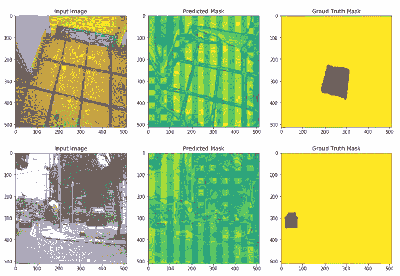**

**图 11:基础模型的预测掩码和地面真实掩码之间的比较**

## **让我们理解为什么会发生这种情况:**

**–众所周知，当我们有不平衡的数据时，准确性可能会有欺骗性，但我们在扩充时平衡了我们的数据，但请注意，我们平衡了原始类和伪类之间的数据。**

**–根据我们的目标，模型需要预测图像中的每个像素，无论它是真实的还是被操纵的，对于每个被操纵的像素，结果应该是 0，对于未被触摸的像素，结果应该是 1。**

**–如果我们需要平衡数据，我们应该在暗像素和亮像素之间进行平衡，其中暗像素表示被处理的区域，亮像素表示未被处理的区域。**

**–另一种说法是，与未受影响的区域相比，受影响区域的所有图像面积非常小，因为白色像素变得非常重要，因此这造成了不平衡的类别，我们的模型无法正确学习。**

**–因此，我们的基本模型显示出很高的精度，但没有我们预期的那么高效。**

**为了在学习区分暗像素和白像素的同时对模型产生相同的影响，数据应该是平衡的，但是在我们的情况下，要么我们不能增加被操纵的像素，要么不应该减少被操纵的像素，唯一的方法是减少或避免白像素。**

**为了向下采样白色像素，这一次我完全避免了原始的类图像，因为它只包含蒙版中的白色像素。**

## **只用假图像训练 UNET**

**在我们的下一个 UNET 模型中，我们只考虑假图像来训练，以避免所有原始图像，并且使用与我们对基本模型所做的相同的设置来训练。这一次，在 10 个时期后，我们获得了大约 93.34%的准确度，但是该模型再次不能如预期的那样做出正确的预测，然而这些预测比第一个模型稍微好一些。**

**因此，这说明即使我们避免了完整的原始类，但假图像中的白色像素仍然占主导地位。数据必须进一步平衡。**

## **用从假图像中提取的补丁训练 UNET**

**在进入下一个模型之前，由于我们的 is 数据受到不平衡类的影响，这次我将每个假图像分割成大小为 128×128 像素、步幅为 32 的小块，并考虑到这些小块仅包含至少 25%的操纵像素和未操纵像素，并忽略其余的小块。这样我们就不会得到完整的白色区域。**

**正如你在下面的图 11 中看到的是一个样本假图像和它的蒙版图像，现在在图 12 中是使用 stride 32 提取的 128X128 补丁。注意，我们为一幅图像得到了许多这样的补丁，但是由于空间的限制，我只展示了很少的几个。**

**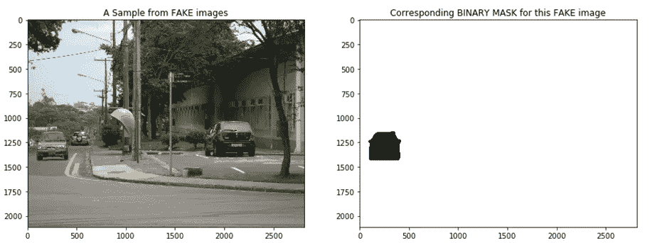**

**图 12:假图像及其灰度蒙版的样本。**

**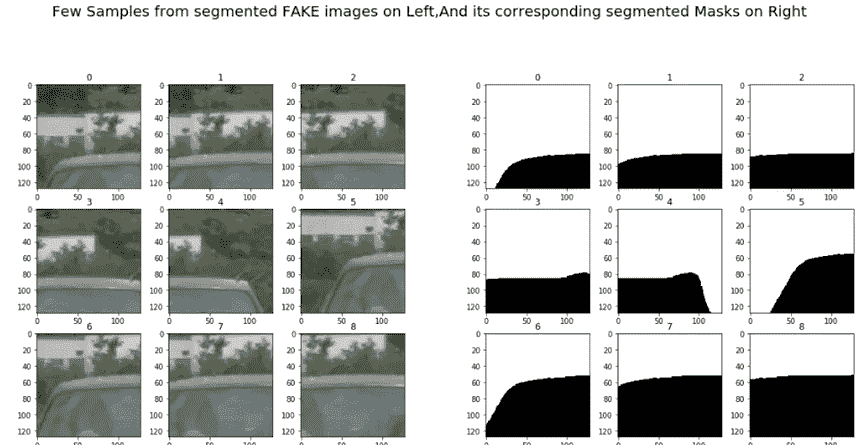**

**图 13:从图 11 所示的样本中提取的几个补丁 **(128X128)****

**经过 10 个时期的训练后，我获得了近 50%的准确性，现在我们获得了模型的原始行为，当然，我们可以使用修补后的数据进一步提高准确性，对不同的模型进行实验，但要获得最终结果，我们需要将所有预测的补丁合并为一个。**

****由于我们已经从图像中消除了大部分的补片，也就是说我们只考虑了具有被操纵和被认证的像素的补片，从这些预测的补片构建最终的掩模一点也不容易。****

## ****经过以上三种方法的实验，我们了解到:****

**–在我们的数据中，由于操纵区域的比例较小，我们的基础模型无法正确学习。**

**–在预测的遮罩(图 11)中，我们可以看到网格状的方框，这是因为没有一个模型能够检测到物体本身。**

**–即使我们提取了补丁以平衡类别，但仍然很难从预测的补丁中构建最终的遮罩，因此我们不会进一步使用这些补丁方法。**

**–由于我们几乎没有数据，如果我们有任何已经根据类似数据预先训练过的模型，这可能是有益的，这样我们就可以根据我们的数据微调权重，这可能会奏效**

## **VGG16+UNET**

**在理解以上所有要点的基础上，为了选择下一个模型，我们将考虑这样的想法，假设模型可以理解其中的不同对象，然后作为下一步，如果模型可以分割这些对象，无论它们是否被操纵。**

**为了采用这个想法，我们应该使用一个对象检测网络，并且对于下一个任务，我们可以附加一些 UNET，它将像分割网络一样工作。**

**现在，我将尝试使用 **VGG16** 作为主干，它在 imagenet 数据上进行预训练，并在将输入图像发送到分割网络之前对其进行编码。在我们的情况下，它是 UNET 架构，因此我们可以在组合架构上进行训练，以保持 vgg16 imagenet 权重不变。**

**在这里，我使用" **segmentation_models** "[7]包，以便它将为我们提供所需的实用程序，从这个包中，我们可以选择 vgg16 或类似的 imagenet 权重作为主干，并可以与 UNET 等细分模型相结合。利用这一优势，我在 VGG16(用 imagenet 权重固定)+UNET 上训练了数据，这一次，由于我们的数据不平衡，我正在测量 **f1 得分**，并用**亚当**进行优化，减少**二进制交叉熵**，并运行 10 个时期。**

**最后，它在测试数据上给出了一个非常好的 f1 值，大约为 0.9746，并且我们的最终模型很好地定位了伪造品。**

**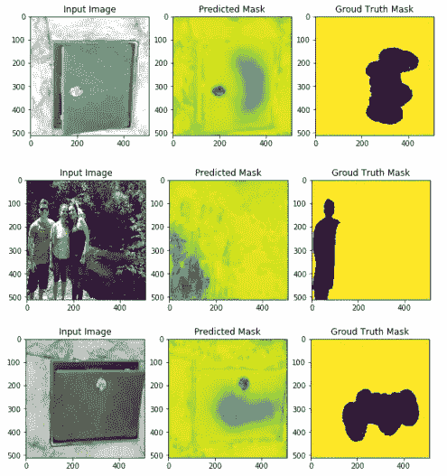**

**图 14:来自 **VGG16+UNET** 模型的预测掩码与地面真实掩码的比较**

**正如我们在图 14 中看到的，我们的最终模型，即 VGG16+UNET，比之前的两个模型更有效地定位了被操纵的区域。请注意，如果我们在数据语料库中有大量的虚假图像，那么将有更高的机会进行更好的学习。即使我们用很少的数据进行训练，这个模型确实在定位伪造品方面做得不错。**

# **未来范围**

**到目前为止，我们在数据中看到的经过处理的图像质量稍高，要检查低质量图像是否受到攻击，我们的方法可能效率不高。我们可以扩展这种方法，在将它发送到我们的最终模型之前，再包含一个被学习来将低质量转换为高质量的模型。**

**到目前为止，我们只看到了三种类型的攻击，但在未来，我们不确定是否会有大量的操纵技术可能由人类或使用人工智能本身进化而来。因此我们未来的模型应该对任何类型的攻击都是不可知的。**

**本博客中提到的所有步骤的代码(在 tensorflow+keras 中可用)都发布在我的 Github 个人资料中，请随意访问代码，如果您愿意，您可以使用/修改以供个人使用。**

** [## pothabattulasantosh/图像-伪造-本地化-IFL-使用-UNET-建筑

### 这是使用深度学习技术和架构实现的图像伪造定位的解决方案之一…

github.com](https://github.com/pothabattulasantosh/Image-forgery-localization-IFL-using-UNET-architecture) 

# 参考

[1][http://ifc.recod.ic.unicamp.br/fc.website/index.py?sec=5](http://ifc.recod.ic.unicamp.br/fc.website/index.py?sec=5)

[2][https://www . basler web . com/en/sales-support/知识库/常见问题/what-is-prnu/14988/](https://www.baslerweb.com/en/sales-support/knowledge-base/frequently-asked-questions/what-is-prnu/14988/)

[3][https://www . research gate . net/publication/231596743 _ PRNU _ detection _ of _ small _ size _ image _ forgeries](https://www.researchgate.net/publication/231596743_PRNU-based_detection_of_small_size_image_forgeries)

[4][http://open access . the CVF . com/content _ ECCV _ 2018/papers/Rex _ 岳 _ 吴 _ BusterNet _ Detecting _ Copy-Move _ ECCV _ 2018 _ paper . pdf](http://openaccess.thecvf.com/content_ECCV_2018/papers/Rex_Yue_Wu_BusterNet_Detecting_Copy-Move_ECCV_2018_paper.pdf)

[5]https://arxiv.org/pdf/1505.04597.pdf

[6][https://albumentations.readthedocs.io/en/latest/](https://albumentations.readthedocs.io/en/latest/)

[7][https://segmentation-models . readthedocs . io/en/latest/tutorial . html](https://segmentation-models.readthedocs.io/en/latest/tutorial.html)**