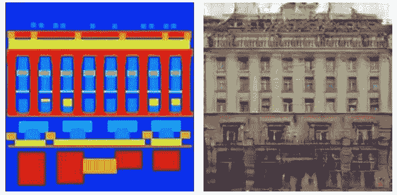
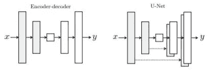
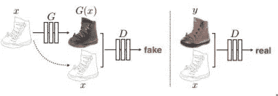
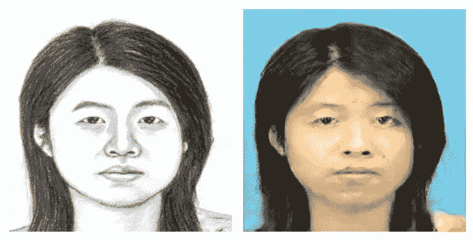
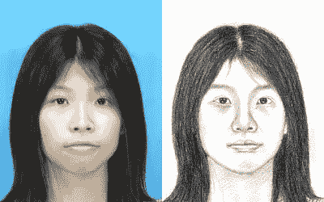

# 使用 pix 2 pix/条件 GANs 的图像-图像翻译

> 原文：<https://medium.com/analytics-vidhya/image-image-translation-using-pix2pix-conditional-gans-a23e0d78ac32?source=collection_archive---------28----------------------->

# 图像-图像翻译

图像-图像转换将图像转换为不同类型的图像，保持图像的所有基本细节相似。这是使用嵌入来完成的，因为来自较高维度图像的所有数据都被嵌入到仅包含图像的基本信息的较低维度空间中，之后，从该较低维度空间中重构图像，但是这一次，较高维度的基本事实发生了变化，从而产生了相似但不同风格的图像。



使用 pix2pix 架构的图像-图像转换示例，使用 facades 数据集

# Pix2Pix 的架构



常见的编码器-解码器结构与 Pix2Pix 中使用的结构，来源:[图像-图像翻译论文](https://arxiv.org/abs/1611.07004)

Pix2Pix 使用一个生成器和一个鉴别器，前者生成图像，后者识别图像是由生成器生成的还是实际数据集的一部分。鉴别器被用作发生器的损失函数，这让我们对我们的发生器有一个动态损失函数，关于 GANs 的更多信息，请参考[的原始论文](http://papers.nips.cc/paper/5423-generative-adversarial-nets.pdf)。



发生器和鉴别器如何工作，来源:[图像-图像翻译论文](https://arxiv.org/abs/1611.07004)

# 如何创建自己的图像-图像翻译

现在，我们对 Pix2Pix 网络中发生的事情有了一个狭隘的理解，让我们看看如何在短时间内创建我们自己的图像-图像翻译器。在这种情况下，我们将创建一个将人脸草图转换成照片的网络。



左图:人脸草图(来源: [CUHK 数据集](http://mmlab.ie.cuhk.edu.hk/archive/facesketch.html))，右图:从人脸生成的图像

创建您自己的图像翻译器的整个过程将分为三个阶段:

1.  收集数据集
2.  预处理数据集
3.  训练模型

# **收集数据集**

在这种情况下，我们将需要一个包含草图和与这些草图对应的照片的数据库。有一个预先存在的数据集，其中有草图和相应的人脸图像，称为 [CUHK 数据集](http://mmlab.ie.cuhk.edu.hk/archive/facesketch.html)。我们将使用这个数据集来训练我们的网络。

# **预处理数据集**

作者方便地提供的 [Pix2Pix](https://phillipi.github.io/pix2pix/) 模型以照片|草图的形式接收训练输入，如下图所示。



左:照片，右:草图，模型如何在 Pix2Pix 中获取输入。

由于 CUHK 数据集在单独的文件夹中包含图像和草图，我们将把它们组合起来以创建我们想要的训练数据。我们将使用 python 中的 PIL 库来完成这项工作。

```
#Sample preprocessing of images for the CUHK Dataset. 
import sys
from PIL import Image
for i in range(100,102):
 if (i<10):
 s=’0'+str(i)
 else:
 s=str(i)
 images = [Image.open(x) for x in [‘./photos1/m-’+s+’-01.jpg’, ‘./sketches1/m-’+s+’-01-sz1.jpg’]]
 widths, heights = zip(*(i.size for i in images))total_width = sum(widths)
 max_height = max(heights)new_im = Image.new(‘RGB’, (total_width, max_height))x_offset = 0
 for im in images:
 new_im.paste(im, (x_offset,0))
 x_offset += im.size[0]new_im.save(‘mfmm’+s+’.jpg’)
```

上面的代码根据训练 Pix2Pix 模型的需要对图像进行预处理，对于数据集中的每个图片和草图对，它将它们组合起来，并从中生成一个新图像。

# 训练模型

在 PyTorch 上运行的 [GitHub](https://github.com/junyanz/pytorch-CycleGAN-and-pix2pix) 上有一个模型的原始实现。通过使用 [Colab](https://colab.research.google.com/github/junyanz/pytorch-CycleGAN-and-pix2pix/blob/master/pix2pix.ipynb) 上的实现，使用你自己的数据集训练模型是非常容易的。在 Colab 上打开笔记本后，创建 datasets/sketch/train 文件夹，并将预处理后的数据上传到该文件夹中。最后，在代码的训练部分，引用文件夹，而不是 facades，你应该准备好了。

```
!python train.py — dataroot ./datasets/sketches — name sketches_pix2pix — model pix2pix — direction BtoA
```

现在您已经成功实现了模型，您可以使用该模型将自己的草图转换为栩栩如生的图像！干得好！

使用相同的方法，您可以为许多不同类型的图像-图像翻译训练模型。

# 参考

1.  基于条件对抗网络的图像-图像翻译。艾尔。
2.  [CUHK 数据集](http://mmlab.ie.cuhk.edu.hk/archive/facesketch.html)