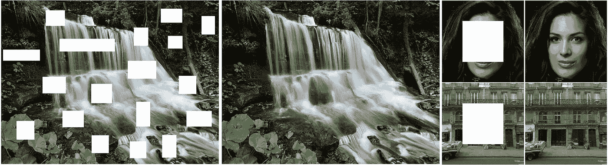

# 图像修复及其发展:浅谈…

> 原文：<https://medium.com/analytics-vidhya/image-inpainting-and-its-evolution-a-brief-discussion-ae1d42431308?source=collection_archive---------21----------------------->

修复的最终目的是合理地从给定的图片中移除熊猫:)

礼貌: [Unsplash](https://unsplash.com/s/photos/panda)

填补缺失数据是数据科学家必须面对的最大难题之一。当我们处理图像时，丢失数据的问题变得更加严重。**填充图像中缺失像素的过程被称为修复**。一大块丢失的像素通常被称为**洞**。这些孔洞可能是图像中的缺陷，也可能是用户自定义的。修补应用的范围很广，其中一些是:

*   为了从图像中删除特定的对象，用户可以在对象的位置创建洞，并用合理的内容填充。
*   修补可以用来去除图像中的水印。
*   仅使用该架构的**“完成网络”**部分就可以提高图像质量。

修复前后的图像

# 以前的方法

修复方法早在 2000 年就被引入，现在仍在发展中，因为最好的方法还没有到来。最初，有类似于**快速推进方法**和**纳维尔-斯托克斯方法**的方法，它们分别结合了**加权和表示**和**偏微分方程**的概念。OpenCV 中提供了这些方法的实现。

还引入了更经典的方法，如[带有结构传播的图像完成](https://webee.technion.ac.il/cgm/Computer-Graphics-Multimedia/Undergraduate-Projects/2009/ImageCompletion/ImageCompletion_SIGGRAPH05.pdf)和使用[平面结构引导](https://www.microsoft.com/en-us/research/wp-content/uploads/2017/01/structure_completion_small.pdf)。在 2009 年， [PatchMatch](https://gfx.cs.princeton.edu/pubs/Barnes_2009_PAR/patchmatch.pdf) 是一个革命性的突破，它迭代地在图像中搜索孔洞修补的最佳匹配。结果令人震惊和顺利，但图像中的语义仍然缺失。

# 基于深度学习的方法

礼貌:[论文](http://iizuka.cs.tsukuba.ac.jp/projects/completion/data/completion_sig2017.pdf)

随着深度学习时代的爆发，研究人员转向了基于神经网络的修复方法，从那时起，我们正在努力提高模型的学习能力，而不是依赖于图像的统计数据。通常，DL 模型包括一个由**编码器-解码器**组成的**‘完成网络’**。编码器将高维图像表示缩减为**潜在空间表示**，通过解码器部分再次对其进行上采样，以生成具有相同维度的完整图像。

具有像素强度值为‘0’和‘1’的二进制掩码**也与输入图像一起传递，以便通知模型关于孔洞区域和未被掩码的区域。**

礼貌:[饭冢论文](http://hi.cs.waseda.ac.jp/~iizuka/projects/completion/data/completion_sig2017.pdf)

一些模型，如 [Iizuka](http://hi.cs.waseda.ac.jp/~iizuka/projects/completion/data/completion_sig2017.pdf) 的模型，结合了**全局和局部鉴别器**模型的使用，以进一步优化结果。全局鉴别器获取完井网络的全局输出，并将其与地面实况进行比较，而局部鉴别器从井眼及其周围区域获取输出。

# 问题和缺点

基于深度学习的方法使用一些常量值初始化孔洞像素，如 Imagenet 的像素值的**平均值，然后图像通过卷积层。这种初始化导致最终图像包含一些不可避免的伪像，然后对这些伪像进行后处理以得到清晰的图像。这些后处理方法如**泊松混合**和**快速推进**计算量很大。**

在 c、d、e、f 中可以看到不想要的伪影；礼貌:[论文](https://arxiv.org/abs/1804.07723)

这些问题通过引入基于**部分卷积的修复**得以解决。它的结果不依赖于初始像素值，而是依赖于未屏蔽区域的像素值，并遵循**自动屏蔽更新设置**，分析起来非常有趣。

# 参考资料:

*   *你可以在我的* [*Github*](https://github.com/Bunnyyyyy/Awesome-Image-Inpainting) 上找到所有论文的词汇表。

*。*