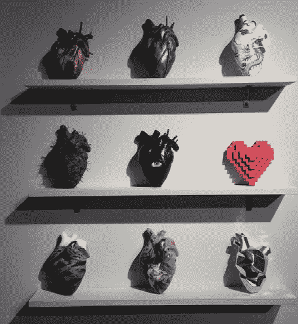
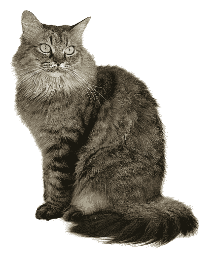
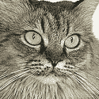
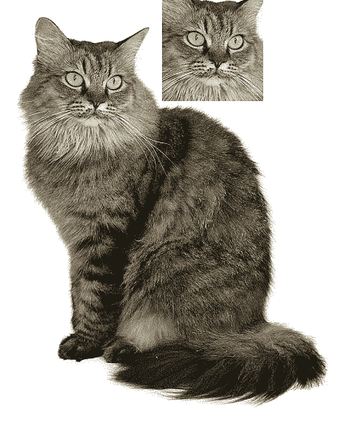
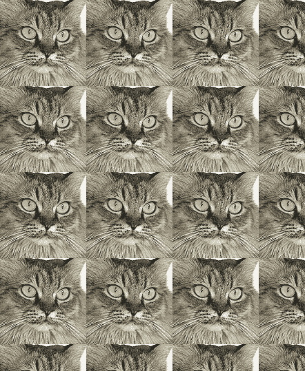
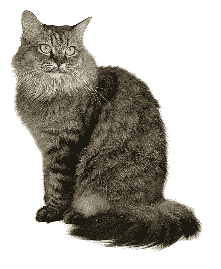
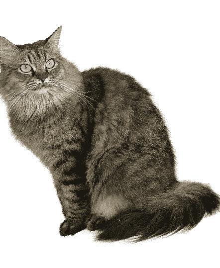
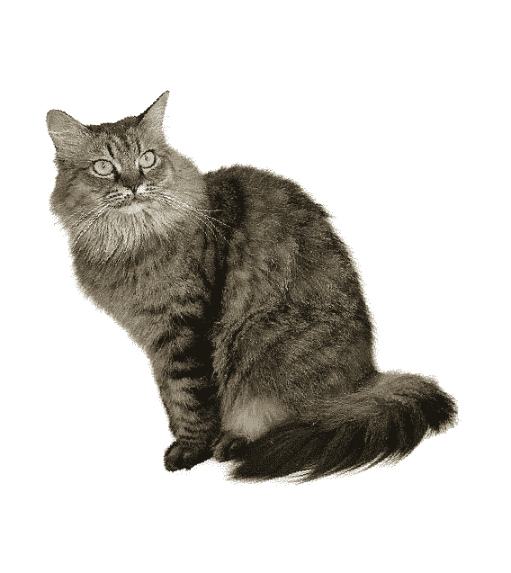
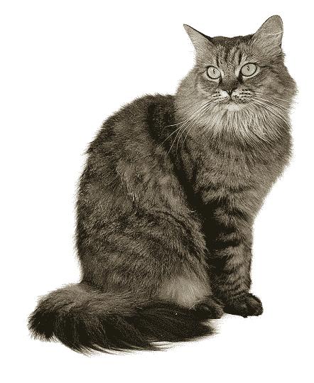

# 使用 Python 进行图像处理

> 原文：<https://medium.com/analytics-vidhya/image-manipulation-with-python-a689b83dd471?source=collection_archive---------10----------------------->



有些心…

如果你有一台不错的数码相机，或者喜欢把手机里的照片上传到 Instagram、脸书或任何你喜欢的社交媒体网站，那么你会一直遇到“数字图像文件”。你可能在 instagram、facebook、twitter 或其他地方有自己的个人或商业账户，虽然手工编辑几张图片没什么大不了的，但同时编辑 100 张或 1000 张图片很快就会成为一项令人生畏的任务。这就是 Python 的图像库的用武之地。

**Pillow** 是第三方 Python 模块，用于与图片文件交互。该模块有几个功能，可以轻松地裁剪、调整和编辑图像的内容。在我们从枕头(不是睡觉的那个)开始之前🙂)，使用 pip 安装模块，如下所示。

```
pip install Pillow
```

## **创建 RGB 图像**

让我们通过显式提供尺寸和 RGB(红绿蓝)颜色值来创建一些图像。运行下面的代码片段，创建一个尺寸为 200 x 200、颜色为绿色的新图像。图像将以文件名“greenImage.png”保存。

```
from PIL import Image
im = Image.new('RGBA', (200, 200), 'green')
im.save('greenImage.png')
```

下面是上面代码的输出。它将保存在您的工作目录中。


greenImage.png(使用 PIL 生成)

## 图像裁剪、复制和粘贴

因此，这里我们有一个美丽的猫的形象，我们想从这个形象的头部部分作物。



全猫形象

下面的代码片段将从上面的猫图像中裁剪头部。需要注意的是，裁剪参数中的前两个数字，即 50、50，是裁剪的起始位置(即从屏幕的左上部分开始向下和向右测量)。因此，50，50 将从屏幕左上角向下 50，从屏幕左上角向右 50。接下来的两个数字即 175、175 是新裁剪图像的宽度和高度。

```
from PIL import Image
catIm = Image.open('cat1.png')  #Open the cat image
croppedIm = catIm.crop((50,50,175,175))
croppedIm.save('croppedCat.png')
```

您将会看到下面的“croppedCat.png”图像出现在您的工作目录中。



短毛猫(仍然很漂亮..)

让我们复制并粘贴这个裁剪的图像到同一个图像上。下面的代码将把裁剪的部分复制并粘贴到原始图像上。

```
from PIL import Image
catIm = Image.open('cat1.png') #Open the cat image
croppedIm = catIm.crop((50,50,175,175))
catCopyIm = catIm.copy() #Make copy of original cat image
catCopyIm.paste(croppedIm, (200,0)) #Paste the cropped portion
catCopyIm.save('pasted.png')
```

你会得到下面的图片，猫的脸贴在原来的照片上。请注意，这个新图像是以一个新的文件名单独保存的，即“pasted.png”。这样做是为了保留原始文件。



粘贴了裁剪图像的原始照片

## 图像拼贴

我们可以使用裁剪后的图像，并以平铺的方式粘贴到原始图像的整个宽度和高度上。下面的片段将实现这个目标。

```
from PIL import Image
catIm = Image.open('cat1.png') #Open the cat image
croppedIm = catIm.crop((50,50,175,175))
catImWidth, catImHeight = catIm.size
croppedImWidth, croppedImHeight = croppedIm.size
catCopyTwo = catIm.copy()
for left in range(0, catImWidth, croppedImWidth):
    for top in range(0, catImHeight, croppedImHeight):
        catCopyTwo.paste(croppedIm, (left, top))
catCopyTwo.save('tiled.png')
```

上面的代码不言自明。For 循环用于在原始图像的高度和宽度限制内粘贴裁剪后的图像。下面将是输出图像。



平铺图像(“tiled.png”)

## 调整大小，旋转和翻转图像

在图像对象上调用 **resize()** 方法，并返回指定宽度和高度的新图像
对象。它接受两个整数的元组参数，表示返回图像的新宽度和高度。

下面的代码片段会将图像大小调整为原始大小的四分之一。请注意，我们将宽度减半，高度也减半。所以我们得到原始图像大小的 25%。

```
width, height = catIm.size
quarterSizeIm = catIm.resize((int(width / 2), int(height/2)))
quarterSizeIm.save('quarterSized.png')
```



猫缩小到原来的 25%

让我们把猫旋转 15 度。下面的线将图像逆时针旋转 15 度。生成的图像将保存在名为“rotated6.png”的新文件中。

```
catIm.rotate(15).save('rotated6.png')
```



逆时针旋转 15 度的图像

你应该已经注意到在上面的图像中(逆时针旋转 15 度后),图像的一部分被剪切了。如果我们保留图像的原始尺寸，这应该是显而易见的。为了得到旋转的图像而没有任何部分被裁剪，我们必须扩展尺寸以得到完整的旋转视图。这可以通过以下方式实现。

```
catIm.rotate(15, expand=True).save('rotated6_expanded.png')
```

得到的图像如下所示。



逆时针旋转 15 度并放大的图像

最后让我们**水平翻转**图像。

```
catIm.transpose(Image.FLIP_LEFT_RIGHT).save('horizontal_flip.png')
```

哇，我们的猫图像现在是水平翻转的。



图像水平翻转

对于垂直翻转，将直线更改如下。

```
catIm.transpose(Image.FLIP_TOP_BOTTOM).save('vertical_flip.png')
```

暂时就这样了。我希望您喜欢使用 Python 的图像处理库。通过一个简单的**循环**，上述所有编辑方法都可以应用于 100 或 1000 或任何数量的图像。

在下一部分，我将会写在一个目录中的所有图片上粘贴一个**标志**。

下次再见…

欢迎任何意见/建议。