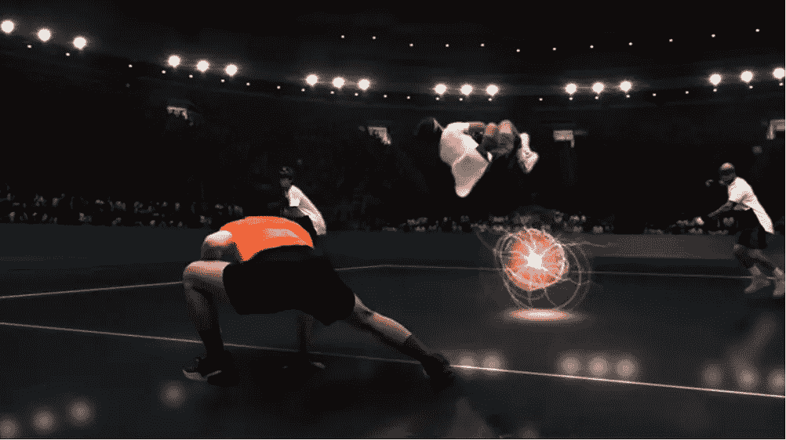
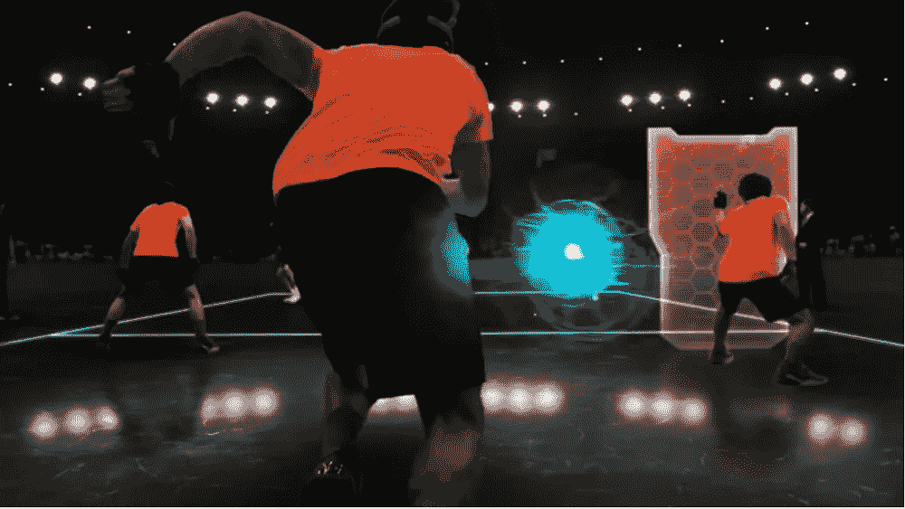

# 图像处理基础

> 原文：<https://medium.com/analytics-vidhya/image-processing-fundamentals-d33c96220072?source=collection_archive---------22----------------------->

图像处理的极限是无限的，从农业应用到与机器学习融合的宇宙，事情已经走了这么远。观看来自*凯蒂·布曼*的[视频](https://www.youtube.com/watch?v=BIvezCVcsYs)

哈多世界杯

是的，那些是真人在玩 AR，这是未来派的，不是吗？
*这里的*是上面运动 [*HADO*](https://www.youtube.com/watch?v=REBPXwx24kA) 的视频，