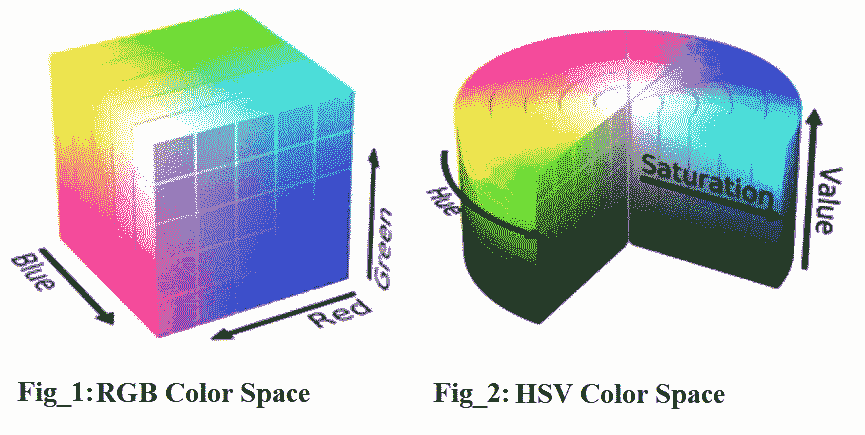

# 图像处理系列:第一部分→色彩空间🌈

> 原文：<https://medium.com/analytics-vidhya/image-processing-series-part1-colorspaces-836d2e3ca700?source=collection_archive---------22----------------------->

***注意:*** *这是我第一篇关于* ***图像处理*** *的博文。这是该系列的第一部分，在不久的将来还会有更多的内容，我将涵盖不同的子主题，如* ***形态学算子，图像的平滑和模糊，梯度，直方图，混合和张贴图像*** *等。以及如何使用 Python OpenCV 实现它们。*

**目录:**

*   什么是色彩空间？
*   色彩空间有哪些类型？
*   如何在 OpenCV 中实现它们？

## 什么是色彩空间？

> 颜色是一种连续的现象，它意味着有无限多种颜色。但是，人类的眼睛和感知是有限的。因此，为了识别这些颜色，我们需要一种媒介或这些颜色的表示，这种颜色的表示被称为颜色空间。在技术术语中，**颜色模型或颜色空间是 3d 坐标系统和该系统内的子空间的规范，其中每种颜色由单个点表示。**

## 色彩空间有哪些类型？

主要有五种主要的颜色模型。但是，我将只写一些常见的(RGB、HSV 和 HSL)。

1.  RGB(红绿蓝)
2.  色调饱和度亮度
3.  HSV(色调饱和度值)
4.  YUV(亮度，蓝色-亮度，红色-亮度)
5.  CMYK(青色、洋红色、黄色、黑色)

## RGB 颜色空间:

RGB 颜色空间是众所周知的颜色空间之一，由 3d 坐标系的红色、绿色和蓝色坐标表示。用更专业的术语来说， **RGB** 将一种颜色描述为一个由三种成分组成的元组。每个分量可以取 0 到 255 之间的值，其中元组(0，0，0)表示黑色,( 255，255，255)表示白色。元组的第零、第一和第二分量分别表示红色、绿色和蓝色的量。

资料来源:www.google.com

## RGB 色彩空间的 Python 实现:

在这里，我们正在导入必要的库。cv2 用于颜色空间转换，NumPy 用于数组操作，Matplotlib 用于显示图像，os 用于访问图像目录，tqdm 用于显示加载栏。

设置两个空列表 Z 和 X，分别存储各自图像的标签，然后指定图像大小和路径目录。之后，我定义了两个函数，分别用于返回花的类型( **assign_lable** )和访问每张图片，读取并调整大小( **make_train_data** )。

加载图像，然后将 BGR 颜色空间转换为 RGB 颜色空间，因为 OpenCV 以 BGR 格式读取图像，但 Maplotlib 使用 RGB 格式显示图像。这就是为什么我们需要在将图像读取为 RGB 之后转换颜色空间。

然后，我们制作固定图像的三个副本，并使每个副本的任何双色通道为零，以便分别访问红色、绿色和蓝色通道。就像如果你把第 0 个和第一个颜色通道都设为 0，那么你只会得到蓝色通道。

展示这些图像:

上面代码的输出

## HSL 颜色空间:

HSL 的一般含义是色调、饱和度和亮度。你可以把 HSL 想象成一个圆柱体，如图 2(a)所示。圆柱体周围会有不同的颜色，比如绿色、黄色、红色等。(我们正在寻找的实际色调)。饱和度是你最终拥有的色调数量，明度是颜色的明暗程度。正如你所看到的，圆柱体的顶部是白色的，底部是黑色的。

图 2 → HSL 颜色空间(来源:www.google.com)

## HSL 颜色空间的 Python 实现:

使用一个名为 **cvtColor()** 的内置 OpenCV 函数将 BGR 色彩空间转换为 HSL 色彩空间，我们需要将图像传递到这个函数中，以及我们需要将图像从哪个色彩空间转换到哪个色彩空间。然后再次复制并使每个复制图像的两个颜色通道为零，以分别显示每个颜色通道。

现在显示三种不同的颜色通道→

上面代码的输出

## HSV 颜色空间:

HSV 这个名称来自颜色模型的三个坐标，即色调、饱和度和值。它也是一个圆柱形颜色模型，其中圆柱的半径表示饱和度，垂直轴表示值，角度表示色调。从观察者的角度来看，色调是主要颜色，饱和度是与色调混合的白光的量，值是强度的色度概念，值越低，颜色越接近黑色，值越高，颜色越接近颜色本身。通过改变这些参数，我们可以产生不同的颜色。

图 3 → HSV 颜色空间(来源:www.google.com)

## HSV 颜色空间的 Python 实现；

使用 cvtColor()函数将颜色空间转换为 HSV 颜色空间。然后再次复制并使每个复制图像的两个颜色通道为零，以分别显示每个颜色通道。

显示每个单独的颜色通道→

上面代码的输出

## 参考资料:

我跟随这两个 Kaggle 笔记本来写博客，第一个是属于 Henrique Mello 的，第二个是属于 Sani Kamal 的。

1.  [https://www . ka ggle . com/HR Mello/intro-to-image-processing-color spaces](https://www.kaggle.com/hrmello/intro-to-image-processing-colorspaces)

2.[https://www . ka ggle . com/sanikamal/image-segmentation-using-color-spaces](https://www.kaggle.com/sanikamal/image-segmentation-using-color-spaces)

感谢您的阅读。如果有任何疑问，请让我知道。