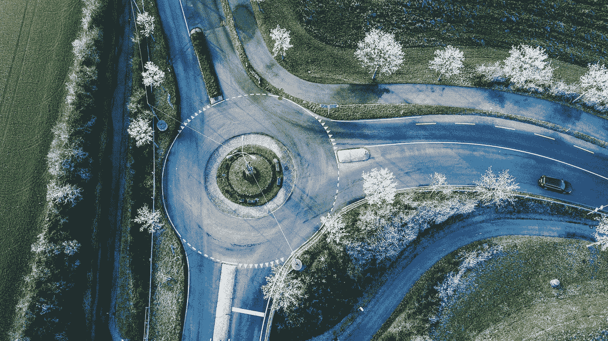
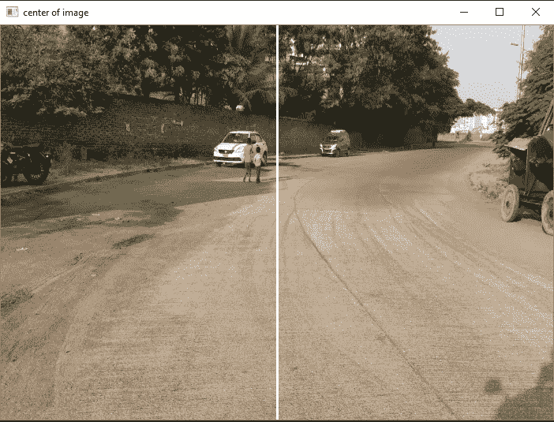
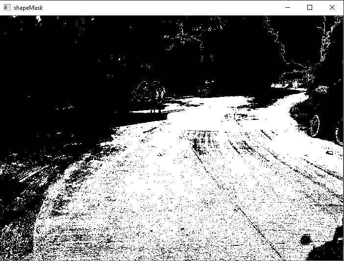
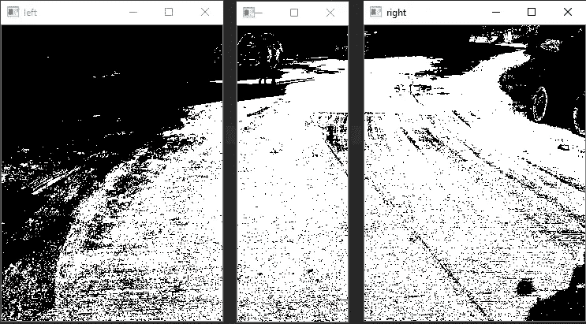
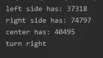
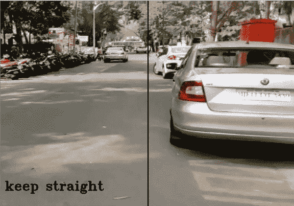

# 检测道路曲率的图像处理

> 原文：<https://medium.com/analytics-vidhya/image-processing-to-detect-curvature-of-road-f68014338778?source=collection_archive---------8----------------------->

## 不使用神经网络的曲率检测



由 [Raphael Schaller](https://unsplash.com/@raphaelphotoch?utm_source=medium&utm_medium=referral) 在 [Unsplash](https://unsplash.com?utm_source=medium&utm_medium=referral) 拍摄的照片

我们对自动驾驶汽车这个术语很熟悉。其中汽车使用包括“人工神经网络”的复杂管道，在没有人类帮助或干预的情况下，设法从一个地方导航到另一个地方。*然而，没有神经网络这可能吗？*

在导航我们的路线时，我们可能会面临不同类型的场景，如弯曲的道路，汽车需要根据其神经网络做出的决定来控制转向和刹车。在这篇文章中，我们将会看到图像处理如何有助于实时确定汽车是应该直行还是转弯。

我们将使用 python 中的 OpenCV 库进行实时图像处理。

```
import cv2
import numpy as np
```

从摄像机中获取视频帧。我正在使用录制的视频。

```
cap=cv2.VideoCapture('curved_road.mp4')
while cap.isOpened():
    ret, frame = cap.read()
    if ret == True:
```

接下来，我们将使用 cv2.resize()调整图像的大小。最初，我开始测试不同大小的不同图像，这成了一个问题，为了解决它，我固定了图像的大小，并计算了帧的中心。此外，如果图像尺寸相对较小，计算速度会更快。

```
height = 500
width = 700
image = cv2.resize(img, (width, height))
img = cv2.line(image, (round(width/2), 0), (round(width/2), height), (255, 255, 255), 2)
cv2.imshow("center of image", img
```

我们使用中心线作为参考，直观地监控曲线。



接下来，我们将使用一个在线应用程序来选择道路的颜色，该应用程序会为您提供图像中特定像素的 RGB 值。我用过 [**拾色器**](https://imagecolorpicker.com/) 。这种“形状遮罩”是一种从 RGB 图像中提取和分离颜色以进行进一步处理的方法。

```
lower = np.array([85, 90, 88])
upper = np.array([160, 177, 190])
shapeMask = cv2.inRange(image, lower, upper)
```



然后，我们将图像分成 3 个部分(即中心、左侧和右侧)。为了确保图像只考虑道路，我们也可以排除顶部。

```
#----------------------
#crop image from top DELTA = 25%
#----------------------top = round(height/4)
x = 0
h = height
w = round(height/2)+30
left = shapeMask[top:top + h, x:x + w]
n_white_pix1 = np.sum(left == 255)
w1 = round(n_white_pix1/2)b = round(width / 2) + 70
d = round(height / 2) + 30
right = shapeMask[top:top + h, b:b + d]
n_white_pix2 = np.sum(right == 255)
w2 = round(n_white_pix2/2)#----------------------
#crop the center where delta = 10%
#----------------------m = round(height / 2) + 30
o = round(width / 5)
center = shapeMask[top:top + h, m:m + o]
n_white_pix3 = np.sum(center == 255)
```



**计算像素数的逻辑**:中间的像素数总是较少，因为尺寸几乎是两边的一半。

```
if n_white_pix3 > w1 and n_white_pix3 > w2:
    img_1 = show_movment("keep straight")
elif n_white_pix1 > n_white_pix2:
    img_1 = show_movment("turn left")
else:
    img_1 = show_movment("turn right")
```



我们可以在终端上打印命令。然而，很难对每一帧进行监控，因此我们可以将结果打印在图像本身上。

```
def show_movment(text):
    return cv2.putText(image,text,(10,450),cv2.FONT_HERSHEY_TRIPLEX,1, (0, 0, 0), 2)
```

让我们看看结果——



这是运行中的算法—

> 我是一名电子工程师。我发现数据科学很迷人，这就是为什么我决定学习机器学习和大数据分析，最近开始作为人工智能工程师工作。希望能为这个不断成长的数据科学社会做点贡献。可以在 [**LinkedIn**](https://www.linkedin.com/in/anuja-ihare-a5b622b7) 上联系我。