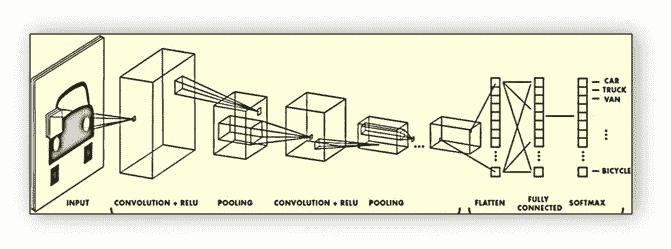
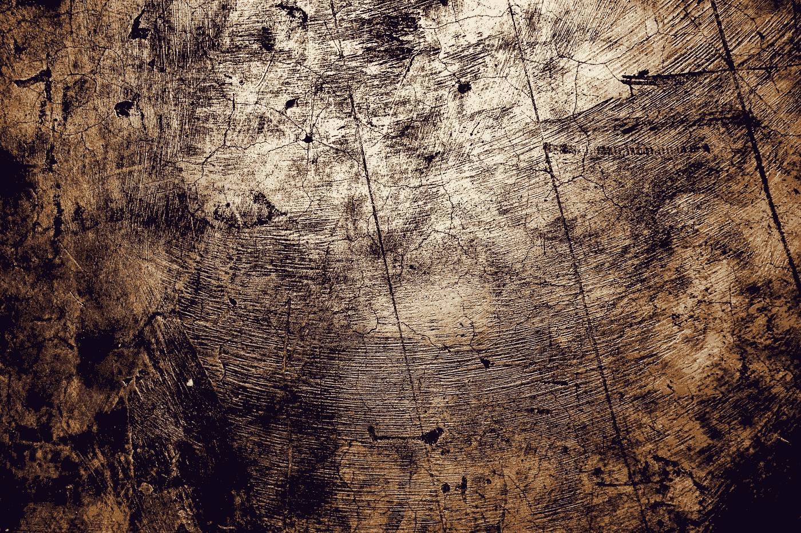

# 张量流支持的 OpenCV、CNN 和 Keras 图像处理

> 原文：<https://medium.com/analytics-vidhya/image-processing-using-opencv-cnn-and-keras-backed-by-tensor-flow-c9adf22bb271?source=collection_archive---------0----------------------->

# 介绍

以下是图像处理在计算机视觉中的各种应用。
图像处理包括处理数字图像以提取附加信息。在过去的十年中，我们已经看到了计算机硬件的许多发展，导致了更快的处理器和 GPU。这使我们能够利用图像处理解决新的和正在出现的问题。

它的应用范围从医学到娱乐，路过地质处理和遥感。多媒体系统是现代信息社会的支柱之一，它非常依赖于数字图像处理。

在本文中，我们将尝试使用图像处理解决一个更简单的问题。

# 问题陈述

我们将尝试解决一个经典的分类问题。让我们假设我们正在处理服装行业。每生产一件衣服后，我们需要确认这些衣服是否可以出售，这反过来又涉及到识别生产出来的衣服中的任何缺陷。

让我们试着识别衣服上的两种瑕疵:

1.  撕破的衣服
2.  脏衣服

在每次生产之后，这个想法是把生产出来的衣服的图像传递给一个系统，如果它包含一个提到的缺陷，这个系统将进行分类。

# 先决条件

基本了解，

1.  深度神经网络
2.  计算机编程语言
3.  任何 ML 库最好是张量流
4.  美国有线新闻网；卷积神经网络

# 概念

数字图像是不同值像素的二维矩阵。
所有图像都由像素组成，像素是图像的原始构建块。图像由网格中的像素组成。640 x 480 的图像有 640 列(宽度)和 480 行(高度)。具有这些尺寸的图像中有 640 * 480 = 307200 个像素。

本质上，图像处理包括以下基本步骤:

1.  使用图像采集工具导入图像。
2.  图像预处理/分析和处理图像。
3.  输出，你可以改变一个图像或作出一些分析。

我们将使用`OpenCV`库来完成所有的图像预处理任务。`OpenCV`从连续内存位置读取数据。为此，我们将使用`HDF5`格式来读写图像数据。

为了更好地理解，我们将简要地涉及所有需要的工具/库。

## HDF5(分层数据格式)

`HDF5`格式可以被认为是包含在一个文件中并在其中描述的文件系统。想想存储在计算机上的文件和文件夹。然而在一个`HDF5`文件中，我们在电脑上称之为“目录”或“文件夹”的叫做`groups`，而我们在电脑上称之为文件的叫做`datasets`。

对于我们的用例，我们将以 HDF5 格式存储所有图像，根据图像所属的类型和类别将它们组织到不同的文件夹中。

# OpenCV( **打开**源计算机视觉)库

它是一个开源的计算机视觉和机器学习软件库。OpenCV 旨在为计算机视觉应用提供一个公共基础设施，并加速机器感知在商业产品中的应用。

我们将使用`OpenCV`库来调整图像的大小并从中创建特征向量，这可以通过将图像数据转换为`numpy`数组来实现。

我们将使用名为`CNN`(卷积神经网络)的深度神经网络的扩展之一来训练模型。

"正是在我们最黑暗的时刻，我们必须集中精力才能看到光明."
― **亚里士多德**

## 卷积神经网络

使用机器学习解决任何问题的一个重要方面是从实体集提取特征。在图像处理的情况下，特征集实质上是构成图像的每个像素。

该功能集取决于图像的分辨率和大小。

一兆字节的像素数取决于图片的色彩模式。

*   在 8 位(256 色)图片中，1 兆字节有 1048576，或 1024 X 1024 个像素。
*   16 位(65536 色)图片，1 兆包含 524288 (1024 X 512)像素。
*   24 位 RGB(1670 万色)图片，1 兆字节大约有 349920 (486 X 720)个像素。
*   32 位 CYMK(1670 万色)图片，一兆有 262144 (512 X 512)像素。
*   48 位图片，一兆只有 174960 (486 X 360)像素。

> CNN 的工作有一个简单的假设，即不是所有的像素都需要从图像中识别一些特征。

对于分类问题，我们将识别图像中的边界/边缘，以将它们分类到上述类别之一。所以基本上我们要用 CNN 解决一个边缘检测问题。

卷积层是卷积神经网络中使用的主要构件。

卷积是将过滤器简单应用于输入，从而导致激活。对输入重复应用相同的滤波器会产生称为特征图的激活图，指示输入(如图像)中检测到的特征的位置和强度。

卷积神经网络的创新之处在于能够在特定预测建模问题(如图像分类)的约束下，针对一个训练数据集并行自动学习大量滤波器。其结果是可以在输入图像的任何地方检测到高度特定的特征。

为了理解，我们需要理解卷积是如何工作的。让我们将一幅图像表示为一个 5x5 的值矩阵，每个单元代表一个像素。然后你可以拿一个 3x3 的矩阵，在图像周围滑动一个 3x3 的窗口。在每个位置，图像上的 3×3 矩阵访问我们将它与当前图像位置的值相乘。

简而言之，卷积的工作原理如下。

图片来源[[https://hacker noon . com/visualizing-parts-of-convolutionary-neural-networks-using-keras-and-cats-5c c01 b 214 e 59](https://hackernoon.com/visualizing-parts-of-convolutional-neural-networks-using-keras-and-cats-5cc01b214e59)

移动的窗口叫做**内核。** 窗口每次移动的距离称为**步距**。

卷积层的目标是**滤波。**当我们在图像上移动时，我们会有效地检查图像中该部分的模式。这是因为**滤波器和**表示为向量的权重堆栈，它们与卷积输出的值相乘。

CNN 的典型架构包括以下组件。

图片来源[[https://intelli paat . com/blog/tutorial/machine-learning-tutorial/neural-network-tutorial/](https://intellipaat.com/blog/tutorial/machine-learning-tutorial/neural-network-tutorial/)]

**池化**的工作方式类似于卷积，区别在于应用于内核的函数和图像窗口不是线性的。

最常见的池功能是**最大池**和**平均池**。最大池取窗口中的最大值，而平均池取窗口中所有值的平均值。

**RELU** 是一个激活函数，将值压缩到一个范围内，通常是[0，1]或[-1，1]。

**Softmax** 是一个概率函数，允许我们将输入表示为离散概率分布。

# 履行

实施将包括以下步骤:

1.  收集训练数据。
2.  标记数据并以 HDF5 文件格式存储。
3.  使用 CNN 训练模型。

## 收集培训数据

我们将使用谷歌图片搜索找到我们正在寻找的图片。让我们写一个`javasript`函数来收集搜索结果的链接。

在 Google 图片搜索中搜索图片，然后在浏览器的 javascript 控制台中运行以下脚本。这将把所有图片的链接存储在一个名为`urls.txt`的文本文件中。

执行以下 python 脚本，将所有图像保存到本地驱动器，其链接在`urls.txt`中收集。我们将使用 python 的`request`模块将图像存储在一个目录中。

使用以下 CMD 行选项运行脚本。`—-urls=<PATH_TO_URL_FILE>` `—-output=<PATH_TO_OUTPUT_DIRECTORY>`。

一旦我们收集了训练数据，下一步就是预处理它。

活着是世界上最珍贵的东西。大多数人存在，仅此而已。
― **奥斯卡·王尔德**

## 标记数据并以 HDF5 文件格式存储

预处理步骤包括，

1.  标记数据-假设同一类别的图像存储在同一文件夹中。我们可以有两个文件夹，比如`hole`和`dirt`。在`hole=0`和`dirt=1`中标记图像。
2.  从数据集创建`train_set`、`test_set`、`cross_validation_set`。
3.  使用`OpenCV`和`HDF5`将数据压缩、混洗并存储到一个批处理文件中。
4.  计算训练平均值，将其从每幅图像中减去，并创建一次性编码

以下脚本将执行步骤 1 至 3。因此，将从训练数据中创建一个`hdf5`文件。

## 使用 CNN 训练模型

到目前为止，我们已经生成了训练数据，并将其转换为可以输入训练模型的格式。

最后，让我们使用`CNN`训练数据以生成模型。

参考 [Github 链接](https://github.com/chetan-mehta707/Machine-Learning-Projects/tree/master/Computer%20Vision%20Problem)了解完整实现。

# 谢谢你

我希望这篇文章对你有所帮助。感谢您抽出时间阅读它。
快乐编码！！