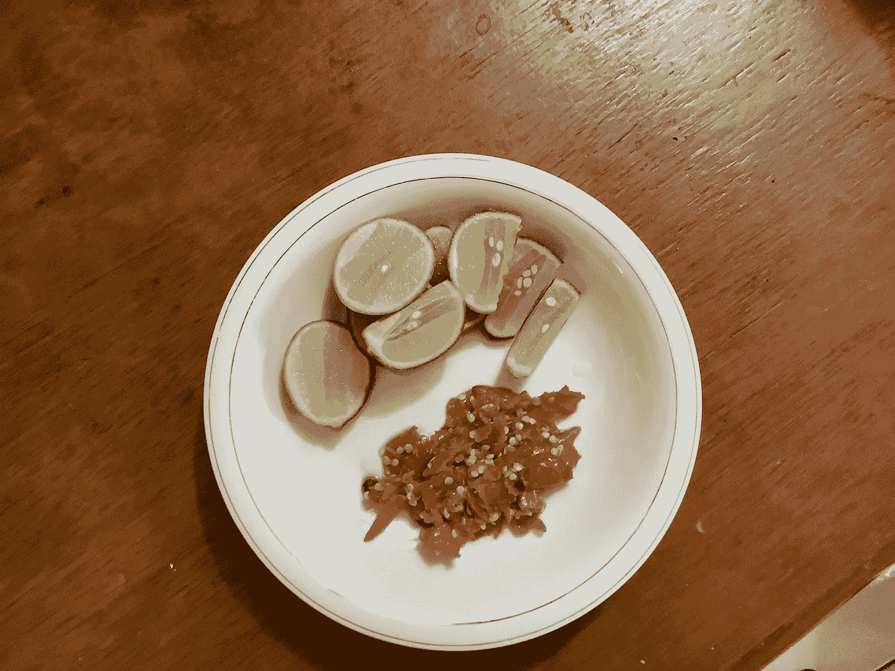
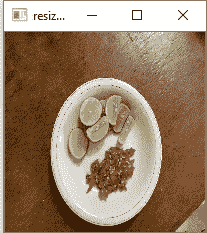
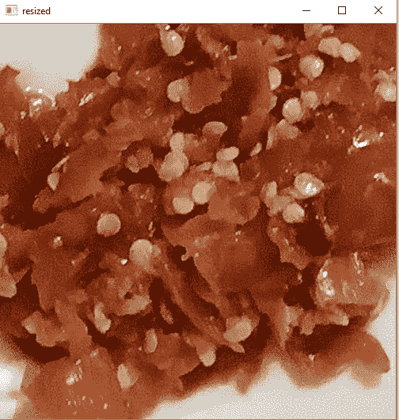
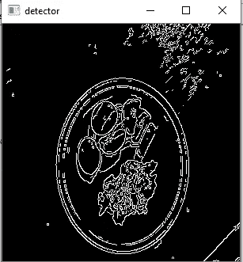
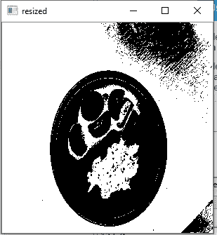
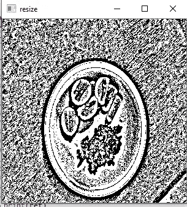

# 用 OpenCV 进行图像处理

> 原文：<https://medium.com/analytics-vidhya/image-processing-with-opencv-238a3105c692?source=collection_archive---------24----------------------->

在本文中，我将讨论使用 Python OpenCV 进行图像处理。**图像处理用于获得增强的图像，从图像中提取有用的信息，去除图像中不必要的属性，例如:噪声**。在本文中，我们将学习如下一些处理技术:

*   图像大小调整
*   获得投资回报
*   边缘检测
*   图像阈值处理

## 图像大小调整

由于某些原因，图像尺寸调整是最重要的基本图像处理之一。图像大小调整用于使图像适合屏幕，并用于使图像处理更快，因为像素数更少。让我们尝试将下面的原始图像调整为 200 x 200 像素。

运行上面的代码后，调整后的图像将会是:

上面的代码将使用 cv2.resize 方法调整原始图像的大小。resize 方法将接受这样的参数:原始图像变量和所需图像的大小。所有图像的大小都是以像素为单位的。

## 获得 ROI(感兴趣区域)

感兴趣区域用于提取图像中需要进一步处理的部分。例如，如果我们想制作一个可以检测你家里的人的人脸识别模型，然后训练人脸识别模型，我们需要从所有的数据集中分割出人脸。可以使用面部检测模型来实现面部切片。人脸检测模型将从特定图像中返回人脸的坐标。在本文中，我们将尝试从原始图像中手动分割出酱料图像。让我们开始吧:

注意:

img[1500:2000，1500:2000]列表中的第一个元素是高度，第二个元素是宽度。

上面的代码将导致:

## 边缘检测

边缘检测用于找到图像中物体之间的边界。它用于图像分割。基本上，通过使用图像梯度或高通滤波器(HPF)来确定边缘检测。最好的边缘检测器之一是 Canny 边缘检测器，它是由 John F Canny 于 1986 年首先提出的。检测器是多阶段算法，具有以下阶段:

*   使用高斯滤波器实现降噪。
*   使用 Sobel 滤波器寻找图像的亮度梯度
*   非最大抑制
*   滞后阈值处理→该阶段将决定哪些边缘是真正的边缘，哪些不是。强度大于 *maxval* 的边缘将被视为边缘，强度小于 *minval* 的边缘将被视为非边缘。基于连通性，位于这些点之间的强度梯度将被视为边缘。

让我们开始吧:

用 cv2 实现了 Canny 边缘检测器。精明的方法。在进行边缘检测之前，必须首先将图像转换为灰度。该方法将接受原始图像变量， *img，*，而值 100 和 200 分别显示 *minval* 和 *maxval* 。

上面的代码将导致:

## 图像阈值处理

图像阈值处理可用于去除图像中较亮或较暗的部分。它也可以用来删除图像的某些轮廓。OpenCV 通过 **cv2.threshold** 和 **cv2.adaptiveThreshold** 提供简单阈值和自适应阈值，以实现阈值概念。

*   简单阈值处理

简单的阈值处理非常简单。如果像素值大于阈值值，那么像素将被赋予一定的值(可以是黑色或白色)。为了实现简单的阈值处理，我们使用 cv2.threshold。该方法将接受四个参数:第一个参数是应该是灰度的图像的源，第二个参数是阈值，第三个参数是 maxval，它表示给某些像素的值，如果该像素值大于阈值，第四个参数是阈值处理方式。款式可以是:cv2。THRESH_BINARY，cv2。THRESH_BINARY_INV，cv2。TRUNC，cv2。THRESH_TOZERO，cv2。THRESH_TOZERO_INV。

让我们开始编码:

处理后，原始图像将返回下图:

*   自适应阈值

简单的阈值处理有时在某些情况下效果不佳，例如:光照问题。为了解决这个问题，我们实现了自适应阈值处理。自适应阈值处理可以在图像中给出不同的阈值，因为该算法为图像中的小区域值计算阈值。此过程将为照明过程提供更好的结果。

让我们开始编码:

谢谢你