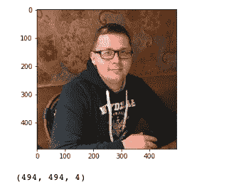
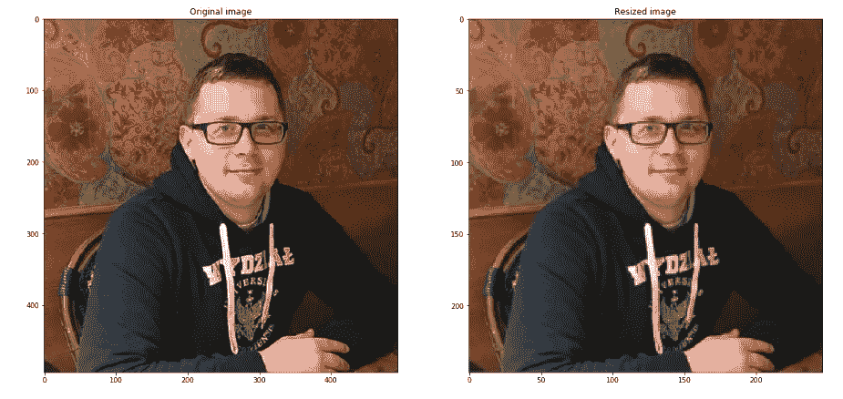
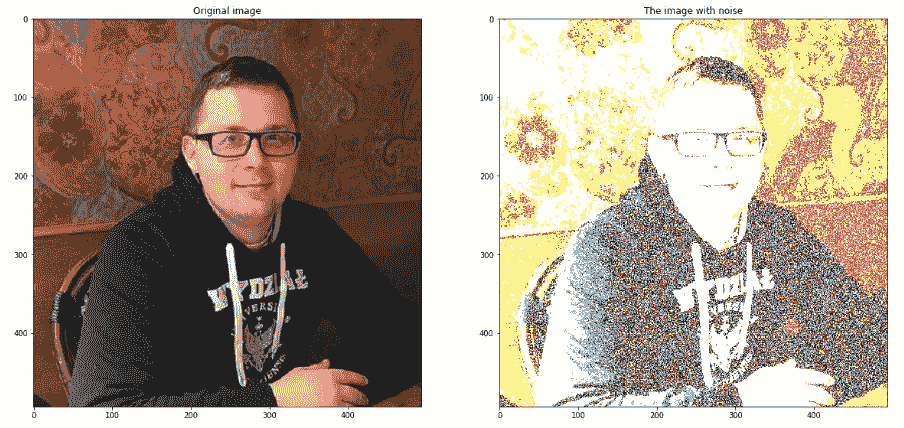
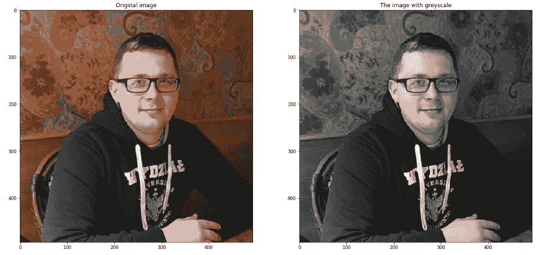
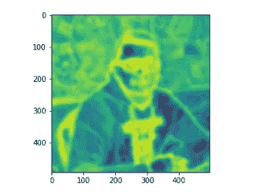

# 使用 Python 进行图像处理(scikit-image)

> 原文：<https://medium.com/analytics-vidhya/image-processing-with-python-scikit-image-de3969533701?source=collection_archive---------3----------------------->

Scikit-image 是一个很好的图像处理库。这篇文章是从图像处理开始的一些技术和技巧的演练。

# 阅读并绘制图像

```
import matplotlib.pyplot as plt
from skimage import io
img = io.imread("image.png") #path to the imageplt.imshow(img)
plt.show()print(img.shape) # show dimension of image
dim1, dim2 = img.shape[0], img.shape[1]
num_channels = img.shape[2]
```



读取图像是一个 numpy 数组，这个图像有 494 个形状和 4 个通道。检查发生了什么，当你改变:

```
plt.imshow(img) --> plt.imshow(img[:,:,0])
```

# 图像尺寸的改变

```
from skimage.transform import rescale, resizedef resized_img(img, scale=2):
    image_resized = resize(img, (img.shape[0] / scale, img.shape[1] / scale),anti_aliasing=True)
    return image_resized
```

# 显示调整大小的图像

```
img = io.imread("image.png")
image_resized = resized_img(img, 2) # I choosed 2, but you could all integersdef plot_compared_img(img1, img2, title1="Original image", title2="New one image"):
    fig, axes = plt.subplots(nrows=1, ncols=2, figsize=(20, 10))
    ax = axes.ravel()
    ax[0].imshow(img1)
    ax[0].set_title(title1)
    ax[1].imshow(img2, cmap='gray')
    ax[1].set_title(title2)
    plt.show()

plot_compared_img(img, image_resized,"Original image", "Resized image")
```



请注意比例已经改变。

# 给图像添加噪波

```
import numpy as np
k = 0.2 # you could set any any real number
noise = np.ones_like(img) * k * (img.max() - img.min())
noise[np.random.random(size=noise.shape) > 0.5] *= -1img_noise = img + noise # new image with noiseplot_compared_img(img, img_noise, "Original image", "The image with noise")
```



# 使用 ssim 比较图像

```
from skimage.measure import compare_ssim as ssim
ssim_noise = ssim(img, img_noise,
                  data_range=img_noise.max() - img_noise.min(), multichannel=True)print(ssim_noise) #0.10910931410753069
```

结构相似性指数(ssim)表示图像的相似性。

*   ssim 值等于零表示图像之间没有相似性。
*   值 ssim 等于 1 表示照片是相同的。

以上我是比较原始图像(img)与带有噪声的 img(img _ noise)。

# 将图像转换为灰度

```
from skimage.color import rgb2graygrayscale = rgb2gray(img)
plot_compared_img(img, grayscale,"Original image", "The image with greyscale") 
```



# 图像的熵

在信息论中，信息熵是一条消息的可能结果数量的以 2 为底的对数。对于一幅图像，局部熵与邻域包含的复杂度有关。更多关于熵(香农熵)的链接

[https://en.wiktionary.org/wiki/Shannon_entropy](https://en.wiktionary.org/wiki/Shannon_entropy)

```
from skimage.measure.entropy import shannon_entropy
print(shannon_entropy(img[:,:,0])) #7.5777861360050265#plot entropyfrom skimage.filters.rank import entropy
from skimage.morphology import diskentr_img = entropy(img[:,:,0], disk(10))
plt.imshow(entr_img, cmap='viridis')
plt.show() 
```



# **收尾**

当然，这只是从图像中操作或提取特征的最基本的技术。我鼓励从底部阅读链接。jupyter-notebook 中包含的所有代码:

【https://github.com/fuwiak/medium_scikit-image 

来源:

*   [https://scikit-image.org/](https://scikit-image.org/)
*   [https://en.wiktionary.org/wiki/Shannon_entropy](https://en.wiktionary.org/wiki/Shannon_entropy)
*   [https://github.com/scikit-image](https://github.com/scikit-image)