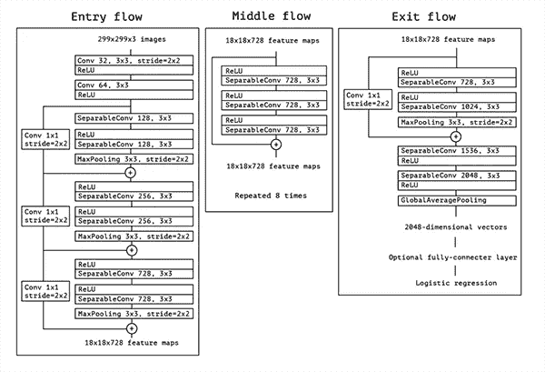
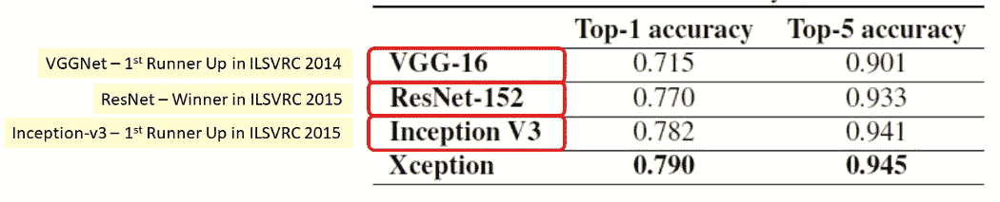
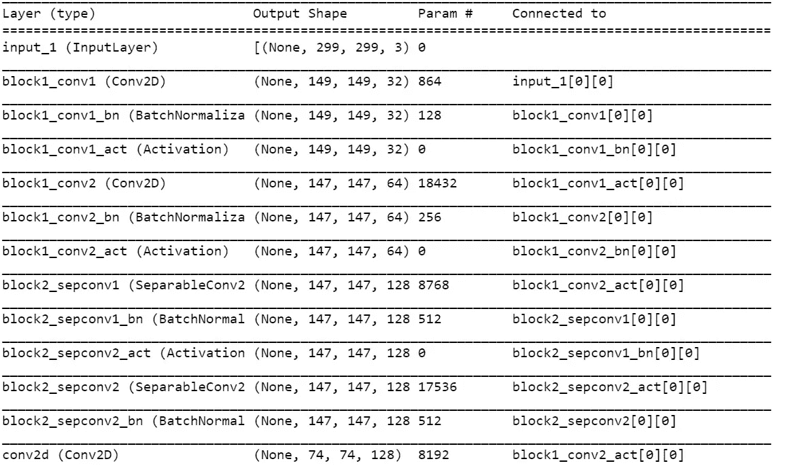
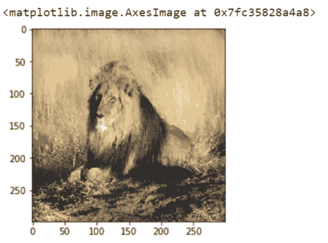
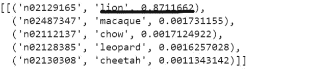

# 使用预训练的异常模型分 5 步进行图像识别

> 原文：<https://medium.com/analytics-vidhya/image-recognition-using-pre-trained-xception-model-in-5-steps-96ac858f4206?source=collection_archive---------1----------------------->

读者们好，

在本文中，我们将带你用 python 和 Keras 深度学习库在 ImageNet 数据库上预训练的卷积神经网络(具体使用 **Xception Model** )来预测图像。

**什么是 ImageNet？**

ImageNet 是一个旨在手动标记和分类图像的项目。在深度学习和卷积神经网络领域，我们将 ImageNet 简称为“ImageNet 大规模视觉识别挑战”。

ImageNet 项目的主要目标是训练一个模型，该模型可以将输入图像分类为 1000 个独立的对象类别。

类别包括狗、猫、鱼的种类，车辆类型包括车辆部件如车轮、方向盘等了解更多类别[参考](https://gist.github.com/yrevar/942d3a0ac09ec9e5eb3a)

这些模型在大约 120 万张图像和另外 5 万张用于验证的图像以及 10 万张用于测试的图像上进行训练。

对于图像识别，我们可以使用 Keras 核心库中可用的预训练模型。像 **VCG16、VCG19、Resnet50、Inception V3、Xception** 等型号

在本文中，我们选择了预先训练的异常模型进行图像分类

# 例外模型

例外模式是由弗朗索瓦·乔莱提出的。Xception 是 inception 架构的扩展，它用深度方向可分离的卷积代替了标准的 Inception 模块。



例外的架构(入口流>中间流>出口流)

## ImageNet:exception 模型与其他模型的比较



ImageNet: Xception 具有最高的准确性

现在让我们使用异常模型编写一个用于图像识别的 python 脚本

**步骤 1:安装所需的依赖关系**

对于图像识别，我们依赖于库 Numpy、Matplotlib(用于可视化)、tf-explain(用于导入预训练的模型)、Tensorflow 和 Keras 作为后端

打开命令提示符(cmd)>在下面运行命令

```
pip install tf-explain
```

**第二步:导入包**

```
#import librariesimport numpy as np
import tensorflow as tf
import matplotlib.pyplot as plt
from tf_explain.core.activations import ExtractActivations
from tensorflow.keras.applications.xception import decode_predictions
%matplotlib inline
```

**步骤 3:加载预训练模型**

```
#load pre trained Xception modelmodel=tf.keras.applications.xception.Xception(weights='imagenet',include_top=True)#Summary of Xception Model
print(model.summary)
```



模型摘要

**步骤 4:加载并预处理样本输入图像**

```
#loading and preprocessing cat imageIMAGE_PATH='./lion.jpg'
img=tf.keras.preprocessing.image.load_img(IMAGE_PATH,target_size=(299,299))
img=tf.keras.preprocessing.image.img_to_array(img)#view the image
plt.imshow(img/255.)
```



输入图像

## 步骤 5:预测图像中的对象

现在，让我们使用在 IDE 中成功加载的异常模型，对输入图像进行前 5 个预测。

```
import requests#fetching labels from Imagenet  
response=requests.get('[https://storage.googleapis.com/download.tensorflow.org/data/imagenet_class_index.json'](https://storage.googleapis.com/download.tensorflow.org/data/imagenet_class_index.json'))
imgnet_map=response.json()imgnet_map={v[1]:k for k, v in imgnet_map.items()}#make model predictionsimg=tf.keras.applications.xception.preprocess_input(img)
predictions=model.predict(np.array([img]))
decode_predictions(predictions,top=5)
```

**结果**

从下面的片段中我们发现，Xception 模型预测图像由概率为 0.87(87%)的**狮子**和概率为 0.001(小于 1%)的其他动物组成。



参考

1.  例外:深度可分卷积深度学习([https://arxiv.org/abs/1610.02357](https://arxiv.org/abs/1610.02357)
2.  ImageNet([http://www.image-net.org/](http://www.image-net.org/))