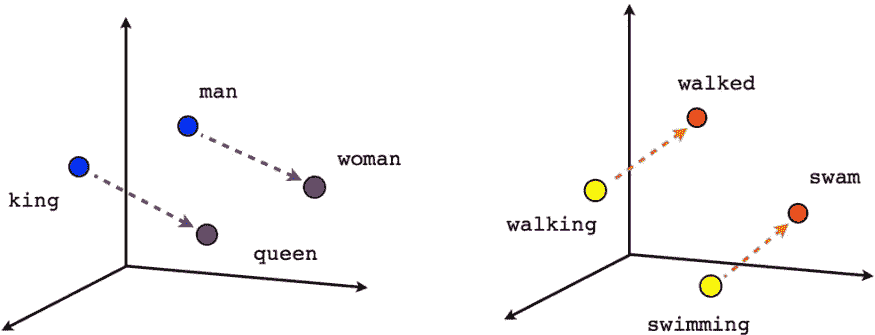
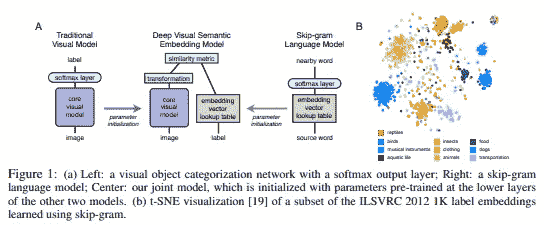

# 使用 ResNet & S-BERT 进行图像搜索

> 原文：<https://medium.com/analytics-vidhya/image-search-using-resnet-s-bert-48bc9da6509c?source=collection_archive---------8----------------------->

您可能已经使用 auto-encoder 通过图像编码来查找相似的图像，其中您基本上可以找到两个编码向量之间的相似性。自动编码器实际上从图像中学习表示。编码器功能将图像数据映射到潜在空间，然后用于寻找矢量之间的距离。

自动编码器

当我们将文本或图像描述作为输入时，我们的图像搜索方法发生了全新的转变。这是深度学习者真正兴奋的地方。

> [**设计:深度视觉语义嵌入模型**](https://papers.nips.cc/paper/5204-devise-a-deep-visual-semantic-embedding-model)

谷歌研究团队于 2013 年在 NeurIPS 发表的论文基本上向我们展示了，对于图像分类器，如果我们用预训练的单词嵌入来替换图像目标标签，并根据固定边单词表示作为目标变量来训练分类器，那么我们将能够在图像表示上关联或映射文本表示。现在，由于在单词嵌入中，我们可以基于其各自的表示向量之间的相似性，使许多单词在上下文上与给定单词相似，因此我们可以使用许多同义单词作为输入来提取相同的图像。

向量降维后的相似性

鉴于上述知识，本文提出的方法如下:

> 我们的目标是利用在文本领域学到的语义知识，并将其转移到为视觉对象识别而训练的模型中。我们首先对一个简单的神经语言模型进行预训练，该模型非常适合学习语义上有意义的词的密集向量表示[13]。同时，我们预训练了一个用于视觉对象识别的最先进的深度神经网络[11]，并配有一个传统的 SoftMax 输出层。然后，我们通过采用预训练的视觉对象识别网络的较低层并重新训练它们来构建深度视觉语义模型，以预测由语言模型学习的图像标签文本的矢量表示。这三个培训阶段详述如下。

# **我的实现**

本文的局限性在于嵌入这个词本身。如果用户以描述的方式输入一个句子，那么我们必须将句子分解成名词和动词，然后提取单词的嵌入，平均它们，然后使用结果向量在搜索空间内进行语义相似性。
根据各种现有技术的发现，考虑到句子相似性基准，平均单词向量来表示句子不会给我们带来有价值的结果。
因此，我决定使用与论文中相同的方法，但只是用预先训练的句子嵌入替换单词嵌入。
有几个最先进的句子嵌入模型

[**ULMFiT**](https://arxiv.org/abs/1801.06146)[**通用语句编码器**](https://arxiv.org/abs/1803.11175)

其中我们使用了经过微调的 [**伯特**](https://arxiv.org/abs/1810.04805) 模型来进行句子的表述。这种模型被称为 [**句子-伯特:使用连体伯特网络**](https://arxiv.org/abs/1908.10084) 的句子嵌入

根据作者

> 伯特/罗伯塔/XLM-罗伯塔生产出开箱即用的相当糟糕的句子嵌入。这个存储库用一个连体或三元组网络结构微调 BERT/RoBERTa/distil BERT/ALBERT/XL net，以产生语义上有意义的句子嵌入，这些句子嵌入可用于无监督的场景:通过余弦相似性、聚类、语义搜索的语义文本相似性。

例如，拍摄一张图片，其中包含一个放在桌子上的*瓶子和玻璃杯，然后我们的 S-BERT 模型将为我们返回这个特定句子的表示，其方式是构成对象和对象之间关系的信息。在训练过程中，您会看到该模型倾向于一般化而不是过度拟合目标嵌入，原因是即使特定图像被标记了其各自的表示，但由于图片中还有其他对象，因此，它也试图学习那些特征，这作为结果基本上是一件好事，因为它有助于将图片的描述映射到句子表示，而不是仅仅单个单词标记的表示。*

我使用预训练的 Resnet-34 模型，外层是标签的句子编码。在训练模型之后，我通过模型传递图像，并将嵌入内容存储在 [**和**索引](https://github.com/spotify/annoy)中。由于时间和资源的限制，我只提取了验证图像的嵌入。图像越多，结果的可能性就越大。

以下是项目文件、GitHub 库以及 Google Drive 的链接:
[**Training —图片搜索. ipynb**](https://github.com/arsalan993/AI-based-Image-search-/blob/master/Training_Image_search.ipynb)[**预测—图片搜索. ipynb**](https://github.com/arsalan993/AI-based-Image-search-/blob/master/Prediction_Image_Search.ipynb)[**项目 Google Drive**](https://drive.google.com/drive/folders/19OfHNYdsmhv4VCfkyr9MZKZESMdUfbsM?usp=sharing)[**GitHub**](https://github.com/arsalan993/AI-based-Image-search-)

代码在笔记本上有很好的解释，我需要任何改进的反馈。

现在我将分享一些结果，然后是我关于如何改进当前结果的结论。

在上面的结果中，你可以在一些复杂的查询中找到一些语义关系，例如“最大的哺乳动物”会返回大象、犀牛和海象。在“面包和奶酪”节目中，我们当然有比萨饼。有很多很多的查询都没有找到语义关系。
由于广义余弦角永远不会为零，但肯定会有一些信息损失。此外，由于谷歌协作 12 小时的限制和谷歌驱动同步问题，我只能训练它 2 个时代，因此我不能减少太多的损失。

> **这里有一些你可以用来改进方法和模型的建议:**

1.尝试不同的语句编码语言模型，如 ULMFIT、USE 或 other。

2.玩超参数调谐和训练它更多的历元和观察损失值。

3.尝试解冻模型的最后一层，并添加一个隐藏层，以获得更好的效果。这肯定会在很大程度上提高成绩。

4.使用高分辨率图像至少 256 dim，微小的 ImageNet 构成的 64x64 的图像

## 感谢您抽出时间，请仔细阅读笔记本。希望得到积极的反馈。