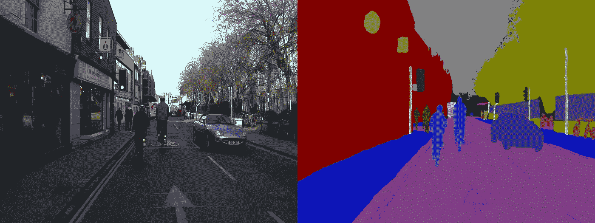
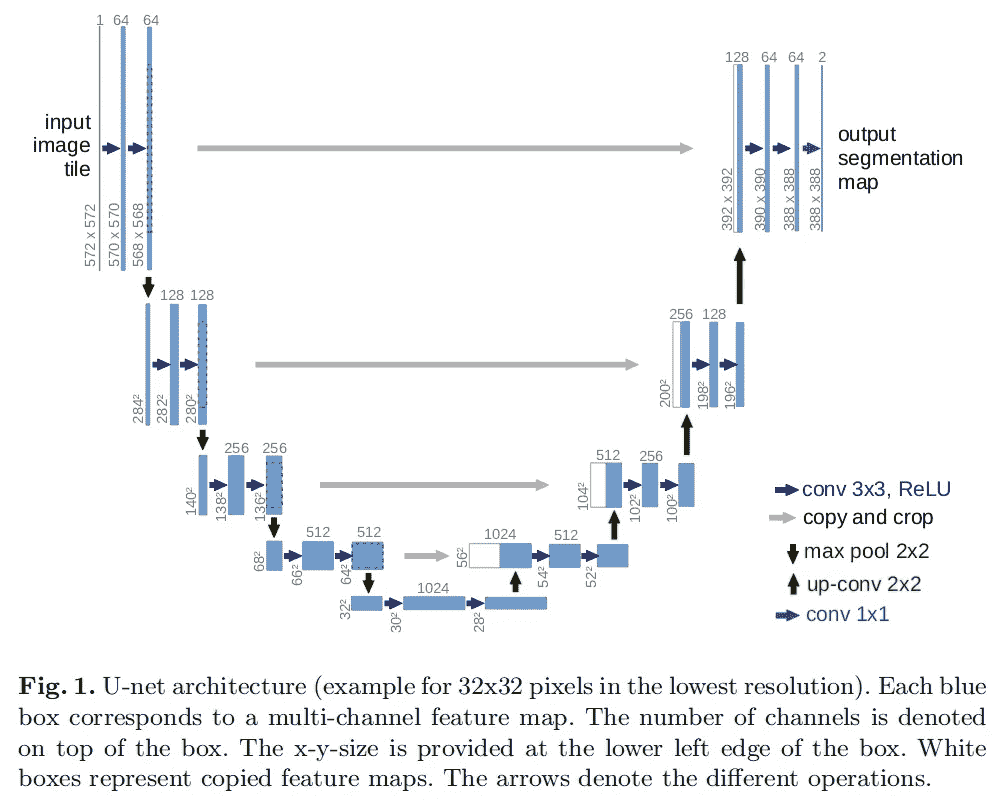
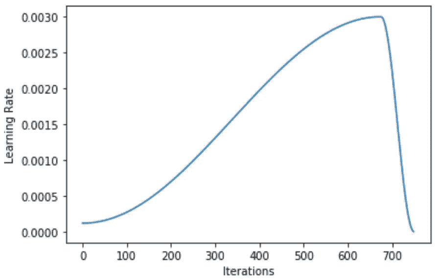
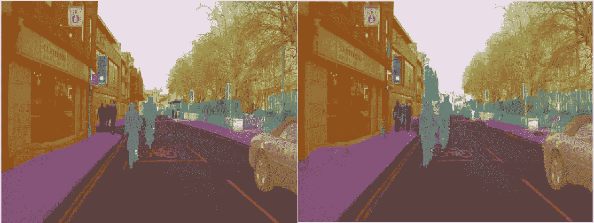
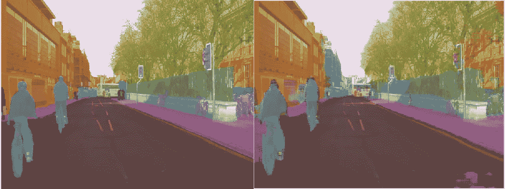

# 使用 Fastai v1.0 的图像分割任务

> 原文：<https://medium.com/analytics-vidhya/image-segmentation-task-using-fastai-d8fbf9b5b75a?source=collection_archive---------20----------------------->

图像分割是将图像的每个像素分类到一个类别中的任务。例如，给定一个骑自行车的人的图像，组成骑自行车的人的每个像素应该被分类到骑自行车的人类别中(下图中的青色)。



Fastai(一个在线机器学习课程)通过用这个[笔记本](https://github.com/fastai/course-v3/blob/master/nbs/dl1/lesson3-camvid.ipynb)中的 [CamVid 数据集](http://mi.eng.cam.ac.uk/research/projects/VideoRec/CamVid/)训练一个 [U-Net](https://arxiv.org/abs/1505.04597) 来研究图像分割任务。

一个已经训练好的 U-Net 也可以在这个 [colab 笔记本](https://colab.research.google.com/gist/feiwu77777/5c87836e5f319f71a3150018c042fdf8/image_segmentation.ipynb#scrollTo=J_xaleEeS-6f)上测试。

## 数据

图像分割数据被组织成成对的图像和遮罩。图像由形状张量(h，w，c)表示，其中 *h* 、 *w* 和 *c* 是图像的高度、宽度和通道号。掩模由形状张量(h，w，N)表示。如果总共有 *N* 个类(类别)要分类，则遮罩的每个像素是长度为 *N* 的向量，其中 0 在各处，1 在索引 *i* 处(对应类的标签)。

将加载和预处理图像及其各自的用于训练和验证步骤的掩码的加载器由以下代码行定义:

```
src = (SegmentationItemList.from_folder(path_of_dataset)
       .split_by_fname_file('../valid.txt')
       .label_from_func(get_y_fn, classes=codes))data = (src.transform(get_transforms(), size=size, tfm_y=True)
        .databunch(bs=bs)
        .normalize(imagenet_stats))
```

## 模型

用于将图像映射到其相应遮罩的模型是一个 [U-Net](https://arxiv.org/abs/1505.04597) 。



[U-Net](https://arxiv.org/abs/1505.04597) (下采样路径)的第一部分是一个标准的卷积网络(fastai 的[笔记本](https://github.com/fastai/course-v3/blob/master/nbs/dl1/lesson3-camvid.ipynb)中的 resnet)，它逐渐减小图像的大小，增加其通道数。

[U-Net 的第二部分](https://arxiv.org/abs/1505.04597)(上采样路径)相反，逐渐增加图像张量的大小并减少其通道数。每次对图像张量进行上采样时，它都与下采样路径中相应的图像张量连接(灰色箭头)。通过这样做，该模型可以更好地定位输入图像的特定区域中最深层的信息。

带有特定数据集的 U-Net 可以用一行创建。

```
learn = unet_learner(data, models.resnet34, metrics=metrics, wd=wd)
```

## 培养

为了训练 U-Net，fastai 使用具有默认参数的 Adam 优化器，权重衰减为 1e-2，并选择以下每次迭代的学习速率(1 个时期具有大约 70 次迭代/批次)。



学习率的这种形状可以训练更一般化的模型，因为学习率的稳定提升可以允许优化过程逃脱局部最小值。

损失函数是 softmax 损失的平均值(nn。PyTorch 中的 CrossEntropyLoss)应用于每个像素。U-Net 的下采样路径是用 ImageNet 预训练的。它首先被冻结，并且在开始时只训练上采样路径。然后通过解冻下采样路径来训练整个 U-Net。

```
learn.fit_one_cycle(10, slice(lr), pct_start=0.9)
learn.unfreeze()
learn.fit_one_cycle(10, slice(lr/400,lr/4), pct_start=0.8)
```

Fastai 然后建议增加输入图像的大小，以进一步训练模型。其目的是减少过拟合，并作为迁移学习步骤。该模型用较小版本的图像进行“预训练”,然后用较大版本的图像进行训练。

```
learn.destroy()
data = (src.transform(get_transforms(), size=size*2, tfm_y=True)
        .databunch(bs=bs)
        .normalize(imagenet_stats))
learn = unet_learner(data, models.resnet34, metrics=metrics, wd=wd)learn.fit_one_cycle(10, slice(lr), pct_start=0.8)
learn.unfreeze()
learn.fit_one_cycle(10, lrs)
```

## 结果

经过 40 代的训练，这里是一些图像分割结果的例子。



基本事实/预测



基本事实/预测